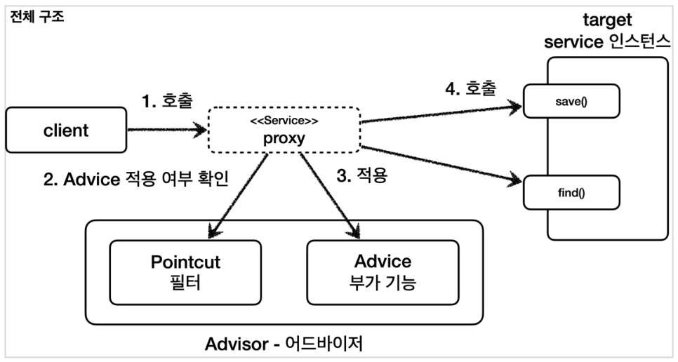
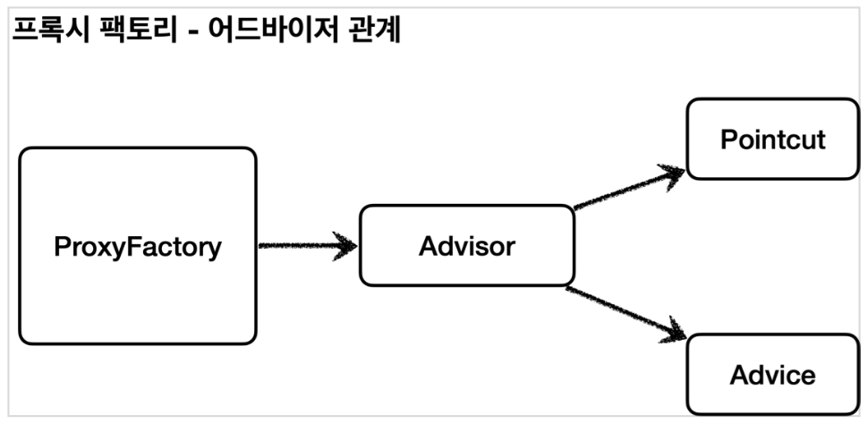

[이전 장(링크)]() 에서는 프록시 팩토리에 대해서 알아보았다.  
이번 장에서는 어드바이저(Advisor)에 대해서 알아보도록 한다.  
모든 코드는 [깃허브(링크)](https://github.com/roy-zz/spring) 에 올려두었다.
---

### 포인트컷, 어드바이스, 어드바이저 요약

- **포인트컷(Pointcut)**: 어디에 부가 기능을 적용하고 어디에 부가 기능을 적용하지 않을지 판단을 위한 필터링 역할을 한다.
주로 클래스와 메서드 이름으로 필터링한다. 이름과 같이 **어떤 포인트(Point)** 에 기능의 **적용 여부를 잘라서(cut)** 구분하는 것이다.
- **어드바이스(Advice)**: 프록시가 호출하는 부가 기능이다. 단순하게 프록시 로직이라고 생각하면 된다.
- **어드바이저(Advisor)**: 하나의 포인트컷과 하나의 어드바이스를 가지고 있는 것을 의미한다. **포인트컷 1 + 어드바이스 1** 로 볼 수 있다.
  
한 마디로 정리하면 부가 기능 로직을 적용할 때, **포인트컷**을 사용해 어디에 적용할지를 선택하고, **어드바이스**를 통해 어떤 로직을 결정할지를 선택한다.  
어디에 무엇을 적용할지 모두를 알고 있는 것이 **어드바이저**다.

- 조언(Advice)을 어디(Pointcut)에 할 것인가.
- 조언자(Advisor)는 어디(Pointcut)에 조언(Advice)을 해야할지 알고 있다.

#### 역할과 책임

아래와 같이 구분한 것은 각 구성 요소의 책임과 역할을 명확하게 분리한 것이다.
- 포인트컷은 대상 여부를 확인하는 필터 역할만 담당한다.
- 어드바이스는 부가 기능 로직만 담당한다.
- 둘을 합치면 어드바이저가 되고 스프링의 어드바이저는 하나의 포인트컷과 하나의 어드바이스로 구성되어 있다.



---

### 어드바이저(Advisor)

어드바이저는 하나의 포인트컷과 하나의 어드바이스를 가지고 있다.  
프록시 팩토리를 통해 프록시를 생성할 때 어드바이저를 제공하면 어디에 어떤 기능을 제공할 것인지 알 수 있다.

**AdvisorTest**
```java
@Slf4j
public class AdvisorTest {

    @Test
    @DisplayName("어드바이저 테스트")
    void advisorTestOne() {

        ServiceInterface target = new ServiceImpl();
        ProxyFactory proxyFactory = new ProxyFactory(target);
        DefaultPointcutAdvisor advisor = new DefaultPointcutAdvisor(Pointcut.TRUE, new TimeAdvice());
        proxyFactory.addAdvisor(advisor);
        ServiceInterface proxy = (ServiceInterface) proxyFactory.getProxy();

        proxy.save();
        proxy.find();
    }
}
```

- `new DefaultPointcutAdvisor()`: `Advisor` 인터페이스의 가장 일반적인 구현체다. 생성자를 통해 하나의 포인트컷과 하나의 어드바이스를 주입받는다.
- `Pointcut.TRUE`: 항상 `true`를 반환하는 포인트컷이다.
- `new TimeAdvice()`: 이전에 만들었던 클래스인 `TimeAdvice`의 인스턴스를 어드바이스로 제공한다.
- `proxyFactory.addAdvisor(advisor)`: 프록시 팩토리에 적용할 어드바이저를 지정한다. 어드바이저는 내부에 포인트컷과 어드바이스를 모두 가지고 있다.
어디에 어떤 부가 기능을 적용해야 할지 어드바이스 하나로 알 수 있으며, 프록시 팩토리를 사용할 때 어드바이저는 필수다.
- 프록시 팩토리에 대해서 알아볼 때 `proxyFactory.addAdvice(new TimeAdvice())`와 같이 어드바이스를 적용하였다. 
이는 편의를 위해서 사용한 방법이며 `DefaultPointcutAdvisor(Pointcut.TRUE, new TimeAdvice())`와 같은 동작을 한다. 
- 프록시 팩토리와 어드바이저의 관계는 아래와 같다.



- 테스트 코드를 실행한 출력 결과는 아래와 같으며, `save()`, `find()` 각각 모두 어드바이스가 적용된 것을 확인할 수 있다.

```shell
TimeProxy 실행
Call save()
TimeProxy 종료 resultTime = 0ms
TimeProxy 실행
Call find()
TimeProxy 종료 resultTime = 0ms
```

---

**참고한 자료**:

- https://www.inflearn.com/course/%EC%8A%A4%ED%94%84%EB%A7%81-%ED%95%B5%EC%8B%AC-%EC%9B%90%EB%A6%AC-%EA%B3%A0%EA%B8%89%ED%8E%B8
- https://www.inflearn.com/course/%EC%8A%A4%ED%94%84%EB%A7%81-%ED%95%B5%EC%8B%AC-%EC%9B%90%EB%A6%AC-%EA%B8%B0%EB%B3%B8%ED%8E%B8
- https://www.inflearn.com/course/%EC%8A%A4%ED%94%84%EB%A7%81-mvc-1
- https://www.inflearn.com/course/%EC%8A%A4%ED%94%84%EB%A7%81-mvc-2