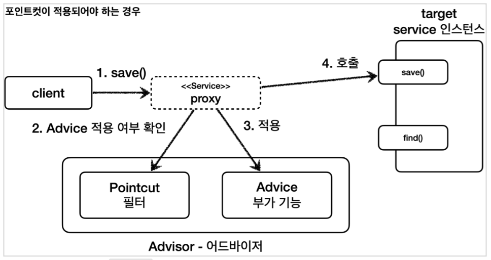
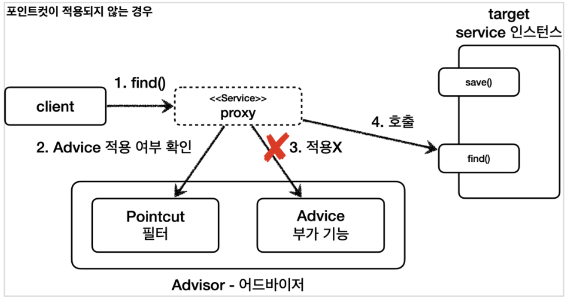

[이전 장(링크)](https://imprint.tistory.com/349) 에서는 어드바이저(Advisor)에 대해서 알아보았다.  
이번 장에서는 포인트컷(Pointcut)에 대해서 알아보도록 한다.  
모든 코드는 [깃허브(링크)](https://github.com/roy-zz/spring) 에 올려두었다.
---

### 포인트컷(Pointcut)

포인트컷을 통해서 원하는 메서드에만 어드바이스 로직을 적용하는 방법에 대해서 알아본다.  
어드바이스 코드에 분기처리를 통해서 필터링을 해도 되지만 이렇게 번거로운 작업을 편리하게 해주는 것이 **포인트컷**이다.
  
스프링에서 제공하는 `Pointcut`, `ClassFilter`, `MethodMatcher` 인터페이스의 코드를 확인해본다.

**Pointcut**
```java
public interface Pointcut {
    
	ClassFilter getClassFilter();
    
	MethodMatcher getMethodMatcher();
    
	Pointcut TRUE = TruePointcut.INSTANCE;

}
```

**ClassFilter**

```java
@FunctionalInterface
public interface ClassFilter {
    
	boolean matches(Class<?> clazz);
    
	ClassFilter TRUE = TrueClassFilter.INSTANCE;

}
```

**MethodMatcher**

```java
public interface MethodMatcher {
    
	boolean matches(Method method, Class<?> targetClass);
    
	boolean isRuntime();

	boolean matches(Method method, Class<?> targetClass, Object... args);
    
	MethodMatcher TRUE = TrueMethodMatcher.INSTANCE;

}
```

포인트컷은 크게 `ClassFilter`와 `MethodMatcher` 두 개의 인터페이스로 이루어져 있다.   
`ClassFilter`는 클래스가 맞는지 확인하고, `MethodMatcher`는 메서드가 맞는지 확인할 때 사용한다. 둘의 결과가 `true`여야 어드바이스를 적용할 수 있다.
  
일반적으로 스프링이 제공하는 구현체를 사용할 수 있지만 직접 인터페이스를 구현하여 사용할 수 있다.

**AdvisorTest**
```java
@Slf4j
public class AdvisorTest {
    // ...
    @Test
    @DisplayName("포인트컷 인터페이스 구현 테스트")
    void pointcutImplTest() {

        ServiceImpl target = new ServiceImpl();
        ProxyFactory proxyFactory = new ProxyFactory(target);
        DefaultPointcutAdvisor advisor = new DefaultPointcutAdvisor(new MyPointcut(), new TimeAdvice());
        proxyFactory.addAdvisor(advisor);
        ServiceInterface proxy = (ServiceInterface) proxyFactory.getProxy();

        proxy.save();
        proxy.find();
    }

    static class MyPointcut implements Pointcut {

        @Override
        public ClassFilter getClassFilter() {
            return ClassFilter.TRUE;
        }

        @Override
        public MethodMatcher getMethodMatcher() {
            return new MyMethodMatcher();
        }
    }

    static class MyMethodMatcher implements MethodMatcher {

        private static final String MATCH_NAME = "save";

        @Override
        public boolean matches(Method method, Class<?> targetClass) {

            boolean result = method.getName().equals(MATCH_NAME);
            log.info("포인트컷 호출 method = {} targetClass = {}", method.getName(), targetClass);
            log.info("포인트컷 결과 result = {}", result);
            return result;
        }

        @Override
        public boolean isRuntime() {

            return false;
        }

        @Override
        public boolean matches(Method method, Class<?> targetClass, Object... args) {

            throw new UnsupportedOperationException();
        }
    }
}
```

**MyPointcut**
- 직접 구현한 포인트컷이며, `Pointcut` 인터페이스를 구현한다.
- 현재 메서드 기준으로 로직을 적용하면 된다. 클래스 필터는 항상 `true`를 반환하도록 했고, 메서드 비교 기능은 `MyMethodMatcher`를 사용한다.

**MyMethodMatcher**
- 직접 구현한 `MethodMatcher`로, `MethodMatcher` 인터페이스를 구현하고 있다.
- `matches()`: 이 메서드의 매개변수로 `method`, `targetClass` 정보를 전달받고, 전달받은 정보로 어드바이스의 적용 여부를 판단할 수 있다.
- 예시에서는 메서드의 이름이 `save`인 경우에믄 `true`를 반환하도록 되어있다.
- `isRuntime()`, `matches(... args)`: `isRuntime()`의 값이 참이면 `matches(... args)` 메서드가 대신 호출된다. 
동적으로 넘어오는 매개변수를 판단 로직으로 사용할 수 있다.
    - `isRuntime()`이 `false`인 경우 클래스의 정적 정보만 사용하기 때문에 스프링이 내부에서 캐싱을 통해 성능 향상이 가능하지만, 
      `isRuntime()`이 `true`인 경우 매개변수가 동적으로 변경된다고 가정하기 때문에 캐싱하지 않는다.
    - 중요하게 사용되는 기능은 아니다.
- `new DefaultPointcutAdvisor(new MyPointcut(), new TimeAdvice())`: 어드바이저에 직접 구현한 포인트컷을 사용한다.
- 테스트 코드를 실행하여 출력된 결과는 아래와 같다.

```shell
포인트컷 호출 method = save targetClass = class com.roy.spring.myproxy.common.service.ServiceImpl
포인트컷 결과 result = true
TimeProxy 실행
Call save()
TimeProxy 종료 resultTime = 0ms
포인트컷 호출 method = find targetClass = class com.roy.spring.myproxy.common.service.ServiceImpl
포인트컷 결과 result = false
Call find()
```

- 우리가 의도한대로 `save()` 메서드를 호출할 때는 어드바이스가 적용되었지만 `find()`메서드를 호출할 때는 어드바이스가 적용되지 않은 것을 확인할 수 있다.

#### 포인트컷 적용 프로세스

**save() 호출**



1. 클라이언트가 프록시의 `save()` 메서드를 호출한다.
2. 포인트컷을 통해 `Service` 클래스에 위치한 `save()` 메서드를 호출할 때 어드바이스가 적용되는지 확인한다.
3. 포인트컷이 `true`를 반환하고 어드바이스를 호출하여 부가 기능을 적용한다.
4. 실제 인스턴스의 `save()`를 호출한다.

**find() 호출**



1. 클라이언트가 프록시의 `find()`를 호출한다.
2. 포인트컷을 통해 `Service` 클래스에 위치한 `find()` 메서드를 호출할 때 어드바이스가 적용되는지 확인한다.
3. 포인트컷이 `false`를 반환하고 어드바이스를 호출않으며 부가 기능 또한 적용하지 않는다.
4. 실제 인스턴스의 `find()`를 호출한다.

---

### 스프링이 제공하는 포인트컷

스프링은 우리가 필요로하는 포인트컷을 이미 대부분 제공하고 있다.  
스프링이 제공하는 `NameMatchMethodPoint`를 사용해보도록 한다.

**AdvisorTest**
```java
@Slf4j
public class AdvisorTest {
    // ...
    @Test
    @DisplayName("스프링이 제공하는 포인트컷 테스트")
    void suppliedPointcutTest() {

        ServiceInterface target = new ServiceImpl();
        ProxyFactory proxyFactory = new ProxyFactory(target);
        NameMatchMethodPointcut pointcut = new NameMatchMethodPointcut();
        pointcut.setMappedNames("save");
        DefaultPointcutAdvisor advisor = new DefaultPointcutAdvisor(pointcut, new TimeAdvice());
        proxyFactory.addAdvisor(advisor);
        ServiceInterface proxy = (ServiceInterface) proxyFactory.getProxy();

        proxy.save();
        proxy.find();
    }
}
```

출력된 결과를 확인해보면 우리의 의도처럼 `save()` 메서드를 호출할 때는 어드바이스가 적용되지만 `find()` 메서드를 호출할 때는 어드바이스가 적용되지 않는다.
```shell
TimeProxy 실행
Call save()
TimeProxy 종료 resultTime = 0ms
Call find()
```

#### 스프링이 제공하는 포인트컷 예시

스프링은 아래와 같이 수많은 포인트컷을 제공하고 있다.  
이번 장에서 모든 포인트컷을 다루지는 않고 대표적으로 사용되는 포인트컷에 대해서만 알아보도록 한다.

- `NameMatchMethodPointcut`: 메서드 이름을 기반으로 매칭한다. 내부에서는 `PatternMatchUtils`를 사용한다.
- `JdkRegexpMethodPointcut`: JDK 정규 표현식을 기반으로 포인트컷을 매칭한다.
- `TruePointcut`: 항상 `true`를 반환한다.
- `AnnotationMatchingPointcut`: 사용하고 있는 애너테이션으로 매칭한다.
- `AspectJExpressionPointcut`: aspectJ 표현식으로 매칭한다.
  
실제로 실무에서는 사용하기 편리하고 가장 많은 기능을 제공하는 `aspectJ` 표현식을 기반으로 사용하는 `AspectJExpressionPointcut`을 사용한다.  

---

**참고한 자료**:

- https://www.inflearn.com/course/%EC%8A%A4%ED%94%84%EB%A7%81-%ED%95%B5%EC%8B%AC-%EC%9B%90%EB%A6%AC-%EA%B3%A0%EA%B8%89%ED%8E%B8
- https://www.inflearn.com/course/%EC%8A%A4%ED%94%84%EB%A7%81-%ED%95%B5%EC%8B%AC-%EC%9B%90%EB%A6%AC-%EA%B8%B0%EB%B3%B8%ED%8E%B8
- https://www.inflearn.com/course/%EC%8A%A4%ED%94%84%EB%A7%81-mvc-1
- https://www.inflearn.com/course/%EC%8A%A4%ED%94%84%EB%A7%81-mvc-2