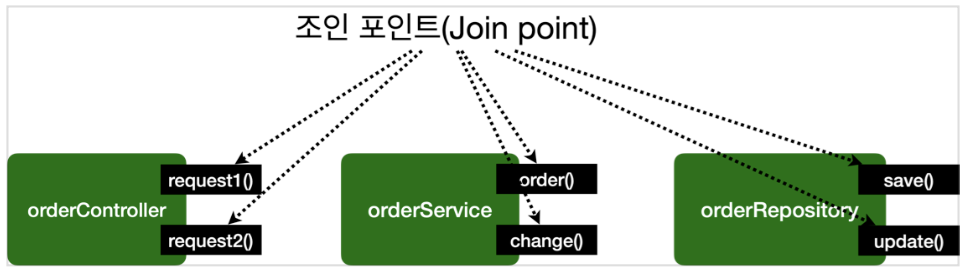

[이전 장(링크)](https://imprint.tistory.com/354) 에서는 `@Aspect`에 대해서 알아보았다.  
이번 장에서는 **스프링 AOP란 무엇인지 개념**에 대해서 알아보도록 한다.  
모든 코드는 [깃허브(링크)](https://github.com/roy-zz/spring) 에 올려두었다.
---

### APO 소개 - 핵심 기능과 부가 기능

애플리케이션 로직은 크게 **핵심 기능**과 **부가 기능**으로 나눌 수 있다.
- **핵심 기능**: 해당 객체가 제공하는 고유의 기능이다. 예를 들어, `OrderService`의 핵심 기능은 주문 로직이다.
- **부가 기능**: 핵심 기능을 보조하기 위해 제공되는 기능이며, 대표적으로 "로그 추적 로직", "트랜잭션"과 같은 기능이 있다.
  이런 부가 기능은 단독으로 사용되지 않고, 핵심 기능과 함께 사용된다. 예를 들어, 로그 추적 기능은 어떤 핵심 기능이 호출되었는지 기록을 남기기 위해 사용된다.

  
주문 로직을 실행하기 직전에 로그 추적 기능을 사용해야 하면, 핵심 기능인 주문 로직과 부가 기능인 로그 추적 로직이 **하나의 객체 안에 섞여** 들어가게 된다. 
부가 기능이 필요한 경우 이렇게 둘을 합해서 하나의 로직을 완성하고, 주문 서비스를 실행하면 핵심 기능인 주문 로직과, 부가 기능인 로그 추적 로직이 함께 실행된다.
  

일반적으로 부가 기능들은 여러 클래스에 걸쳐서 사용된다. 예를 들어, 모든 애플리케이션 호출을 로깅해야 하는 요구사항을 생각해본다. 이러한 부가 기능은 횡단 관심사(cross-cutting concerns)가 된다. 
쉽게 이야기하면 하나의 부가 기능이 여러 곳에 동일하게 사용된다는 의미이다.

#### 부가 기능 적용 문제

이런 부가 기능을 여러 곳에 적용하려면 수동으로 작업해야 하는 부분들이 많다. 예를 들어, 부가 기능을 적용해야 하는 클래스가 100개라면 100개 모두 동일한 코드를 추가해야 한다.  
부가 기능을 별도의 유틸리티 클래스로 만든다고 하더라도, 해당 유틸리티 글래스를 호출하는 코드가 결국 필요하다. 부가 기능이 단순한 호출이 아니라 트랜잭선 처리와 같이 `try-catch-finally` 같은 구조가 필요하다면 더욱 복잡해진다.  
추가보다 부가 기능에 수정이 필요한 경우가 더욱 큰 문제다. 100개의 클래스 모두를 하나씩 찾아가면서 수정해야 한다. 여기에 추가로 부가 기능이 적용되는 위치를 변경한다면 수많은 코드를 찾아서 수정해야 한다.
  
부가 기능 적용의 대표적인 문제를 정리하면 아래와 같다.
- 부가 기능을 적용할 때 아주 많은 반복이 필요하다.
- 부가 기능이 여러 곳에 퍼져서 중복 코드를 만들어낸다.
- 부가 기능을 변경할 때 중복 때문에 많은 수정이 필요하다.
- 부가 기능의 적용 대상을 변경할 때 많은 수정이 필요하다.
  
소프트웨어 개발에서 변경 지점은 하나가 될 수 있도록 잘 모듈화 되어야 한다. 그런데 부가 기능처럼 특정 로직을 애플리케이션 전반에 적용하는 문제는 일반적인 OOP 방식으로는 해결이 어렵다.

---

### AOP 소개 - 애스팩트

#### 핵심 기능과 부가 기능을 분리

부가 기능을 핵심 기능에서 분리하고 한 곳에서 관리하도록 한다. 그리고 해당 부가 기능을 어떻게 적용할지 선택하는 기능도 추가로 개발한다. 
이렇게 부가 기능들과 부가 기능을 어디에 적용할지 선택하는 기능을 합해서 **하나의 모듈로 만들면 이것을 우리는 애스펙트(aspect)** 라고 한다. 
애스펙트는 쉽게 이야기해서 부가 기능과, 해당 부가 기능을 어디에 적용할지 정의한 것이다. 
  
우리가 이전 장에서 알아본 `@Aspect`가 이러한 기능들을 한다. 그리고 스프링이 제공하는 어드바이저도 어드바이스(부가 기능)과 포인트컷(적용 대상)을 가지고 있기 때문에 개념상 하나의 애스펙트로 볼 수 있다.
  
애스펙트를 해석하면 관점이라는 뜻이며, 이름 그대로 애플리케이션을 바라보는 관점을 하나하나의 기능에서 횡단 관심사(cross-cutting concerns)관점으로 달리 보는 것이다.  
이렇게 **애스펙트를 사용한 프로그래밍 방식을 관점 지향 프로그래밍 AOP(Aspect-Oriented Programming)** 이라 한다.  
이러한 AOP는 OOP를 대체하기 위한 것이 아니라 **횡단 관심사를 깔끔하게 처리하기 어려운 OOP의 부족한 부분을 보조하는 목적으로 개발** 되었다.

#### AspectJ 프레임워크

AOP의 대표적인 구현으로 AspectJ 프레임워크가 있다. 스프링도 AOP를 지원하지만 대부분 AspectJ의 문법을 차용하고, AspectJ가 제공하는 기능 중 일부만 제공한다.  
AspectJ 프레임워크는 스스로를 아래와 같이 설명한다.
- 자바 프로그래밍 언어에 대한 완벽한 관점 지향 확장
- 횡단 관심사의 깔끔한 모듈화
  - 오류 검사 및 처리
  - 동기화
  - 성능 최적화(캐싱)
  - 모니터링 및 로깅

---

### AOP 적용 방식

AOP를 사용하면 핵심 기능과 부가 기능이 코드상 완전히 분리되어서 관리된다. 지금부터 어떻게 부가 기능 로직이 실제 로직에 추가되는지 알아보도록 한다. 방법은 크게 3가지가 있다.
- 컴파일 시점
- 클래스 로딩 시점
- 런타임 시점(프록시)

#### 컴파일 시점

`.java` 소스 코드를 컴파일하여 사용하여 `.class` 파일로 만드는 시점에 부가 기능 로직을 추가할 수 있다. 이때는 AspectJ가 제공하는 특별한 컴파일러를 사용해야 한다. 
컴파일 된 `.class`를 디컴파일 해보면 애스팩트 관련 호출 코드가 들어간다. 정리하면, 부가 기능 코드가 핵심 기능이 있는 컴파일된 코드에 추가된다고 볼 수 있다. 
AspectJ 컴파일러는 Aspect를 확인해서 해당 클래스가 적용 대상인지 먼저 확인하고, 적용 대상인 경우에 부가 기능 로직을 적용한다.  
  
- 위빙(Weaving): "옷감을 짜다.", "직조하다"라는 의미로 애스펙트와 실제 코드를 연결해서 붙이는 것을 의미한다.
  
- **컴파일 시점의 단점**: 컴파일 시점에 부가 기능을 적용하려면 특별한 컴파일러가 필요하며 과정도 복잡하다.

#### 클래스 로딩 시점

자바를 실행하면 자바 언어는 `.class` 파일을 JVM 내부의 클래스 로더에 보관한다. 이때 중간에서 `.class` 파일을 조작한 다음 JVM에 적재할 수 있다. 
자바 언어는 `.class`를 JVM에 저장하기 전에 조작할 수 있는 기능을 제공한다. `java Instrumentation` 키워드로 검색하면 많은 정보를 획득할 수 있다.  
수많은 모니터링 툴들이 이러한 방식을 사용하고 있으며, 이 시점에 애스펙트를 적용하는 것을 "로드 타임 위빙"이라 한다.
  
- **클래스 로딩 시점의 단점**: 로드 타임 위빙은 실행할 때 특별한 옵션(`java -javaagent`)을 통해 클래스 로더 조작기를 지정해야 하는데, 실제 운영환경에서는 번거로운 작업니다.

#### 런타임 시점

런타임 시점은 컴파일도 다 끝나고, 클래스 로더에 클래스도 다 올라가서 이미 자바가 실행되고 난 다음을 의미하며 자바의 메인(`main`) 메서드가 이미 실행된 다음이다. 
따라서 자바 언어가 제공하는 범위 안에서 부가 기능을 적용해야 한다. 스프링과 같은 컨테이너의 도움을 받고 프록시와 DI, 빈 포스트 프로세서 같은 개념들을 총 동원해야 한다. 
이렇게 하면 최족적으로 프록시를 통해 스프링 빈에 부가 기능을 적용할 수 있으며, 이것이 우리가 지금까지 다뤄온 **프록시 방식의 AOP**다.
  
프록시를 사용하기 때문에 AOP 기능에 일부 제약이 있다. 하지만 특별한 컴파일러나, 자바를 실행할 때 복잡한 옵션과 클래스 로더 조작기를 설정하지 않아도 된다. 
스프링만 있으면 얼마든지 AOP를 적용할 수 있다.
  
**3가지 방식에서 부가 기능이 적용되는 차이**를 확인해보면 아래와 같다.
- **컴파일 시점**: 실제 대상 코드에 애스펙트를 통한 부가 기능 호출 코드가 포함된다. AspectJ를 직접 사용해야 한다.
- **클래스 로딩 시점**: 실제 대상 코드에 애스펙트를 통한 부가 기능 호출 코드가 포함된다. AspectJ를 직접 사용해야 한다.
- **런타임 시점**: 실제 대상 코드는 그대로 유지된다. 대신에 프록시를 통해 부가 기능이 적용된다. 따라서 항상 프록시를 통해야 부가 기능을 사용할 수 있으며 스프링 AOP는 이 방식을 사용한다.

#### AOP 적용 위치

AOP는 지금까지 학습한 메서드 실행 위치 뿐만 아니라 다양한 위치에 적용할 수 있다.
- 적용 가능한 지점(조인 포인트): 생성자, 필드 값 접근, static 메서드 접근, 메서드 실행
- AspectJ를 사용해서 컴파일 시점과 클래스 로딩 시점에 적용하는 AOP는 바이트코드를 실제로 조작하기 때문에 해당 기능을 모든 지점에 적용할 수 있다.
- 프록시 방식을 사용하는 스프링 AOP는 메서드 실행 시점에만 AOP를 적용할 수 있다.
  - 프록시는 메서드 오버라이딩 개념으로 동작하기 때문에 생성자, static 메서드, 필드 값 접근에는 프록시 개념이 적용될 수 없다.
  - 프록시를 사용하는 **스프링 AOP의 조인 포인트는 메서드 실행으로 제한**된다.
- 프록시 방식을 사용하는 스프링 AOP는 스크링 컨테이너가 관리할 수 있는 **스프링 빈에만 AOP를 적용**할 수 있다.
- 스프링은 AspectJ의 문법을 차용하고 프록시 방식의 AOP를 적용하며, AspectJ를 직접 사용하는 것은 아니다.
- 거듭 되풀이하지만, 중요한 점은 **스프링이 제공하는 AOP는 프록시를 사용**한다는 점이다.
  - 프록시를 통해 메서드를 실행하는 시점에만 AOP가 적용된다.
  - AspectJ를 사용하면 더 복잡하고 다양한 기능을 사용할 수 있다.
  - AspectJ를 직접 사용하는 것은 진입 장벽이 높기 때문에 공부할 내용도 많고, 자바 관련 설정도 복잡하다.
  - 반면, 스프링 AOP는 별도의 추가 자바 설정 없이 스프링만 있으면 편리하게 AOP를 사용할 수 있다.
  - 실무에서는 스프링이 제공하는 AOP 기능만으로도 충분히 대부분의 문제를 해결할 수 있다.

---

### AOP 용어 정리

- **조인 포인트(Join Point)**
  - 어드바이스가 적용될 수 있는 위치, 메소드 실행, 생성자 호출, 필드 값 접근, static 메서드 접근과 같은 프로그램 실행 중 지점이다.
  - 조인 포인트는 추상적 개념이지만, AOP를 적용할 수 있는 모든 지점이라 생각하면 된다.
  - 스프링 AOP는 프록시 방식을 사용하므로 조인 포인트는 항상 메소드 실행 시점으로 제한된다.
- **포인트컷(Pointcut)**
  - 조인 포인트 중에서 어드바이스가 적용될 위치를 선별하는 기능이다.
  - 주로 AspectJ 표현식을 사용해서 지정한다.
  - 프록시를 사용하는 스프링 AOP는 메서드 실행 지점만 포인트컷으로 선별 가능하다.
- **타겟(Target)**
  - 어드바이스를 받는 객체로 포인트컷에 의해 결정된다.
- **어드바이스(Advice)**
  - 부가 기능
  - 특정 조인 포인트에서 Aspect에 의해 취해지는 조치이다.
  - Around(주변), Before(전), After(후)와 같은 다양한 종류의 어드바이스가 있다.
- **애스펙트(Aspect)**
  - 어드바이스와 포인트컷을 하나로 합쳐서 모듈화한 것이다.
  - `@Aspect`를 생각하면 된다.
  - 여러 어드바이스와 포인트 컷이 함께 존재한다.
- **어드바이저(Advisor)**
  - 하나의 어드바이스와 하나의 포인트컷으로 구성된다.
  - 스프링 AOP에서만 사용되는 특별한 용어이다.
- **위빙(Weaving)**
  - 포인트컷으로 결정한 타겟의 조인 포인트에 어드바이스를 적용하는 것이다.
  - 위빙을 통해 핵심 기능 코드에 영항을 주지 않고 부가 기능을 추가할 수 있다.
  - AOP 적용을 위해 애스펙트를 객체에 연결한 상태이다.
    - 컴파일 타임(AspectJ compiler)
    - 로드 타임
    - 런타임
- AOP 프록시
  - AOP 기능을 구현하기 위해 만든 프록시 객체로 스프링에서 AOP 프록시는 JDK 동적 프록시 또는 CGLIB 프록시이다.

---

**참고한 자료**:

- https://www.inflearn.com/course/%EC%8A%A4%ED%94%84%EB%A7%81-%ED%95%B5%EC%8B%AC-%EC%9B%90%EB%A6%AC-%EA%B3%A0%EA%B8%89%ED%8E%B8
- https://www.inflearn.com/course/%EC%8A%A4%ED%94%84%EB%A7%81-%ED%95%B5%EC%8B%AC-%EC%9B%90%EB%A6%AC-%EA%B8%B0%EB%B3%B8%ED%8E%B8
- https://www.inflearn.com/course/%EC%8A%A4%ED%94%84%EB%A7%81-mvc-1
- https://www.inflearn.com/course/%EC%8A%A4%ED%94%84%EB%A7%81-mvc-2

