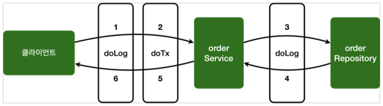

[이전 장(링크)]() 에서는 `스프링 AOP를 적용하는 기본적인 방법`에 대해서 알아보았다.  
이번 장에서는 **복잡한 상황에서 스프링 AOP를 적용하는 방법을**알아보도록 한다.  
모든 코드는 [깃허브(링크)](https://github.com/roy-zz/spring) 에 올려두었다.
---

### 어드바이스 추가

마치 트랜잭션 기능이 추가되는 것과 같이 로그를 출력해보도록 한다.  
트랜잭션 기능은 일반적으로 아래와 같은 기능을 제공해야 한다.
- 핵심 로직 실행 직전에 트랜잭션을 시작
- 핵심 로직 실행에 문제가 없으면 커밋
- 핵심 로직 실행에 예외가 발생하면 롤백

```java
@Slf4j
@Aspect
public class AspectVersion3 {

    @Pointcut("execution(* com.roy.spring.myaop.order..*(..))")
    private void allOrder() {
    }

    @Pointcut("execution(* *..*Service.*(..))")
    private void allService() {
    }

    @Around("allOrder()")
    public Object doLog(ProceedingJoinPoint joinPoint) throws Throwable {

        log.info("[log] {}", joinPoint.getSignature());
        return joinPoint.proceed();
    }

    @Around("allOrder() && allService()")
    public Object doTransaction(ProceedingJoinPoint joinPoint) throws Throwable {

        try {
            log.info("[Transaction Start] {}", joinPoint.getSignature());
            Object result = joinPoint.proceed();
            log.info("[Transaction Commit] {}", joinPoint.getSignature());
            return result;
        } catch (Exception exception) {
            log.info("[Transaction Rollback] {}", joinPoint.getSignature());
            throw exception;
        } finally {
            log.info("[Resource Release] {}", joinPoint.getSignature());
        }
    }
}
```

- `allOrder()` 포인트컷은 `com.roy.spring.myaop.order`패키지와 하위 패키지를 대상으로 한다.
- `allService()` 포인트컷은 타입 이름 패턴이 `*Service*`를 대상으로 하는데 쉽게 이야기해서 `XxxService`처럼 `Service`로 끝나는 것을 대상으로 한다. `*Service`와 같은 패턴도 가능하다.
  "타입 이름 패턴" 이라고 표현한 이유는 클래스, 인터페이스에 모두 적용이 되기 때문이다.
- `@Around("allOrder() && allService()")`와 같이 포인트컷을 조합할 수 있다. `&&`, `!!`, `!` 3가지 조합이 가능하다.
- `com.roy.spring.myaop.order` 패키지와 하위 패키지이고 타입 이름 패턴이 `*Service`인 것을 대상으로 한다.
- 결과적으로 `doTransaction()` 어드바이스는 `OrderService`에만 적용된다.
- `doLog()` 어드바이스는 `OrderService`, `OrderRepository`에 모두 적용된다.
  
테스트 코드를 수정하여 `AspectVersion4`가 빈으로 등록될 수 있도록 한다.

```java
@Slf4j
@SpringBootTest
// @Import(AspectVersion1.class)
// @Import(AspectVersion2.class)
@Import(AspectVersion3.class)
public class AopTest {
    // ...
}
```

`successTest()` 테스트를 실행하면 우리가 예상한대로 프록시가 적용되어 있으며 트랜잭션 관련 로그가 출력되는 것을 확인할 수 있다.
```shell
[log] void com.roy.spring.myaop.order.OrderService.orderItem(String)
[Transaction Start] void com.roy.spring.myaop.order.OrderService.orderItem(String)
[orderService] 실행
[log] String com.roy.spring.myaop.order.OrderRepository.save(String)
[orderRepository] 실행
[Transaction Commit] void com.roy.spring.myaop.order.OrderService.orderItem(String)
[Resource Release] void com.roy.spring.myaop.order.OrderService.orderItem(String)
```



**AOP 적용 전 Process**: `클라이언트` -> `orderService.orderItem()` -> `orderRepository.save()`
**AOP 적용 후 Process**: `클라이언트` -> [`doLog()` -> `doTransaction()`] -> `orderService.orderItem()` -> [`doLog()`] -> `orderRepository.save()`
  
`orderService`에는 `doLog()`, `doTransaction()` 두 가지 어드바이스가 적용되어 있고, `orderRepository`에는 `doLog()` 하나의 어드바이스만 적용된 것을 확인할 수 있다.  
트랜잭션 처리 확인을 위해 `exceptionTest()` 테스트를 실행시키고 출력을 확인해본다.

```shell
[log] void com.roy.spring.myaop.order.OrderService.orderItem(String)
[Transaction Start] void com.roy.spring.myaop.order.OrderService.orderItem(String)
[orderService] 실행
[log] String com.roy.spring.myaop.order.OrderRepository.save(String)
[orderRepository] 실행
[Transaction Rollback] void com.roy.spring.myaop.order.OrderService.orderItem(String)
[Resource Release] void com.roy.spring.myaop.order.OrderService.orderItem(String)
```

예외 상황에서는 "트랜잭션 커밋"이 아니라 "트랜잭션 롤백"이 호출되는 것을 확인할 수 있다.
  
---

### 포인트컷 참조

포인트컷을 공용으로 사용하기 위해 아래와 같이 접근 제어를 `public`으로 하고 하나의 클래스로 모아두는 것이 가능하다.

**Pointcuts**
```java
public class Pointcuts {

    @Pointcut("execution(* com.roy.spring.myaop..*(..))")
    public void allOrder() {}

    @Pointcut("execution(* *..*Service.*(..))")
    public void allService() {}

    @Pointcut("allOrder() && allService()")
    public void orderAndService() {}
}
```

**AspectVersion4Pointcut**
```java
@Slf4j
@Aspect
public class AspectVersion4Pointcut {

    @Around("com.roy.spring.myaop.order.aop.Pointcuts.allOrder()")
    public Object doLog(ProceedingJoinPoint joinPoint) throws Throwable {

        log.info("[log] {}", joinPoint.getSignature());
        return joinPoint.proceed();
    }

    @Around("com.roy.spring.myaop.order.aop.Pointcuts.orderAndService()")
    public Object doTransaction(ProceedingJoinPoint joinPoint) throws Throwable {

        try {
            log.info("[Transaction Start] {}", joinPoint.getSignature());
            Object result = joinPoint.proceed();
            log.info("[Transaction Commit] {}", joinPoint.getSignature());
            return result;
        } catch (Exception exception) {
            log.info("[Transaction Rollback] {}", joinPoint.getSignature());
            throw exception;
        } finally {
            log.info("[Resource Release] {}", joinPoint.getSignature());
        }
    }
}
```

`orderAndService()`: `allOrder()` 포인트컷과 `allService()` 포인트컷을 조합해서 새로운 포인트컷을 만들었다.  
이러한 방식의 사용방법은 패키지명을 포함한 클래스 이름과 포인트컷 시그니처를 모두 지정하면 된다.  
포인트컷을 여러 어드바이스에서 함께 사용할 때 이러한 방식을 사용하여 재사용하면 효율적으로 사용할 수 있다.
  
테스트 코드를 수정하여 `AspectVersion4Pointcut`이 스프링 빈으로 등록될 수 있게 한다.

```java
@Slf4j
@SpringBootTest
// @Import(AspectVersion1.class)
// @Import(AspectVersion2.class)
// @Import(AspectVersion3.class)
@Import(AspectVersion4Pointcut.class)
public class AopTest {
    // ...
}
```

테스트 코드의 결과는 기존과 같다.

---

### 어드바이스 적용 순서 제어

어드바이스는 기본적으로 순서를 보장하지 않는다. 적용되는 순서를 지정하고 싶다면 `@Aspect` 적용단위로 `org.springframework.core.annotation.@Order` 애너테이션을 적용해야 한다. 
문제는 `@Order` 애너테이션을 어드바이스 단위에는 적용할 수 없고 클래스 단위로 적용해야 한다는 점이다. 지금까지 우리가 사용한 방식인 하나의 애스펙트에 여러 어드바이스가 있으면 순서를 보장 받을 수 없다. 
따라서 우리는 **애스펙트 별도의 클래스로 분리**해야 한다.
  
현재 로그를 남기는 순서는 [`doLog()` -> `doTransaction()`]이며 매번 실행마다 순서가 변경될 수 있다. 이러한 순서 변경은 JVM이나 실행 환경에 따라 달라질 수 있다.
  
로그를 남기는 순서를 바꿔서 [`doTransaction()` -> `doLog()` ]로 변경한다. 트랜잭션이 먼저 처리되고, 이후에 로그가 남도록 변경해본다.

**AspectVersion5Order**
```java
@Slf4j
public class AspectVersion5Order {

    @Aspect
    @Order(2)
    public static class LogAspect {

        @Around("com.roy.spring.myaop.order.aop.Pointcuts.allOrder()")
        public Object doLog(ProceedingJoinPoint joinPoint) throws Throwable {

            log.info("[log] {}", joinPoint.getSignature());
            return joinPoint.proceed();
        }
    }

    @Aspect
    @Order(1)
    public static class TxAspect {

        @Around("com.roy.spring.myaop.order.aop.Pointcuts.orderAndService()")
        public Object doTransaction(ProceedingJoinPoint joinPoint) throws Throwable {

            try {
                log.info("[Transaction Start] {}", joinPoint.getSignature());
                Object result = joinPoint.proceed();
                log.info("[Transaction Commit] {}", joinPoint.getSignature());
                return result;
            } catch (Exception exception) {
                log.info("[Transaction Rollback] {}", joinPoint.getSignature());
                throw exception;
            } finally {
                log.info("[Resource Release] {}", joinPoint.getSignature());
            }
        }
    }
}
```

하나의 애스펙트 안에 있던 어드바이스를 `LogAspect`, `TxAspect` 애스펙트로 각각 분리했다. 그리고 애스펙트에 `@Order` 애너테이션을 통해 실행 순서를 적용했다.  
테스트 코드를 수정하여 `AspectVersion5Order`가 스프링 빈으로 등록될 수 있도록 한다.

**AopTest**
```java
@Slf4j
@SpringBootTest
// @Import(AspectVersion1.class)
// @Import(AspectVersion2.class)
// @Import(AspectVersion3.class)
// @Import(AspectVersion4Pointcut.class)
@Import({ AspectVersion5Order.LogAspect.class, AspectVersion5Order.TxAspect.class })
public class AopTest {
    // ...
}
```

테스트 코드를 실행시켜 출력을 살펴보면 트랜잭션 어드바이스가 먼서 실행되는 것을 확인할 수 있다.

```shell
[Transaction Start] void com.roy.spring.myaop.order.OrderService.orderItem(String)
[log] void com.roy.spring.myaop.order.OrderService.orderItem(String)
[orderService] 실행
[log] String com.roy.spring.myaop.order.OrderRepository.save(String)
[orderRepository] 실행
[Transaction Commit] void com.roy.spring.myaop.order.OrderService.orderItem(String)
[Resource Release] void com.roy.spring.myaop.order.OrderService.orderItem(String)
```


---

### 어드바이스 종류

어드바이스는 앞서 살펴본 `@Around`외에도 여러가지 종류가 있다.

- `@Around`: 메서드 호출 전후에 수행, 가장 강력한 어드바이스로 조인 포인트 실행 여부 선택, 반환 값 변환, 예외 변환 등이 가능하다.
- `@Before`: 조인 포인트 실행 이전에 실행된다.
- `@After`: 조인 포인트가 정상 또는 예외에 관계없이 실행된다.(`finally`와 유사하다.)

**AspectVersion6Advice**
```java
@Slf4j
@Aspect
public class AspectVersion6Advice {

    @Around("com.roy.spring.myaop.order.aop.Pointcuts.orderAndService()")
    public Object doTransaction(ProceedingJoinPoint joinPoint) throws Throwable {

        try {
            // @Before
            log.info("[Transaction Start] {}", joinPoint.getSignature());
            Object result = joinPoint.proceed();
            // @AfterReturning
            log.info("[Transaction Commit] {}", joinPoint.getSignature());
            return result;
        } catch (Exception exception) {
            // @AfterThrowing
            log.info("[Transaction Rollback] {}", joinPoint.getSignature());
            throw exception;
        } finally {
            // @After
            log.info("[Resource Release] {}", joinPoint.getSignature());
        }
    }

    @Before("com.roy.spring.myaop.order.aop.Pointcuts.orderAndService()")
    public void doBefore(JoinPoint joinPoint) {
        log.info("[before] {}", joinPoint.getSignature());
    }

    @AfterReturning(value = "com.roy.spring.myaop.order.aop.Pointcuts.orderAndService()", returning = "result")
    public void doAfterReturn(JoinPoint joinPoint, Object result) {
        log.info("[return] {} return = {}", joinPoint.getSignature(), result);
    }

    @AfterThrowing(value = "com.roy.spring.myaop.order.aop.Pointcuts.orderAndService()", throwing = "exception")
    public void doAfterThrowing(JoinPoint joinPoint, Exception exception) {
        log.info("[exception] {}, message = {}", exception, exception.getMessage());
    }

    @After("com.roy.spring.myaop.order.aop.Pointcuts.orderAndService()")
    public void doAfter(JoinPoint joinPoint) {
        log.info("[after] {}", joinPoint.getSignature());
    }
}
```

`@Around`를 어떻게 구성하느냐에 따라 다른 어드바이스를 사용하지 않고 원하는 시점에 원하는 작업을 할 수 있다.  
즉, `@Around`만 사용하더라도 다른 어드바이스는 사용하지 않아도 좋다.  
개인적은 생각이지만 `@Around`를 제외한 어드바이스들은 실행시점이 직관적이기 때문에 코드를 작성한 의도가 정확하게 전달하기 쉬울 것으로 생각된다.

#### 참고 정보 획득

모든 어드바이스는 `org.aspectj.lang.JoinPoint`를 첫번째 파라미터에 사용할 수 있으며 생략해도 좋다.  
단, `@Around`는 `ProceedingJoinPoint`를 사용해야 한다.  
참고로 `ProceedingJoinPoint`는 `org.aspectj.lang.JoinPoint`의 하위 타입이다.
  
**JoinPoint 인터페이스의 주요 기능**
  
- `getArgs()`: 메서드 인수를 반환한다.
- `getThis()`: 프록시 객체를 반환한다.
- `getTarget()`: 대상 객체를 반환한다.
- `getSignature()`: 조언되는 메서드에 대한 설명을 반환한다.
- `toString()`: 조언되는 방법에 대한 유용한 설명을 출력한다.
  
**ProceedingJoinPoint 인터페이스의 주요 기능**

- `proceed()`: 다음 어드바이스나 타겟을 호출한다.

#### 어드바이스 종류

**`@Before`**: 조인 포인트 실행 전
```java
@Before("com.roy.spring.myaop.order.aop.Pointcuts.orderAndService()")
public void doBefore(JoinPoint joinPoint) {
    log.info("[before] {}", joinPoint.getSignature());
}
```

`@Around`와 다르게 작업 흐름을 변경할 수는 없다.  
`@Around`는 `ProceedingJoinPoint.proceed()`를 호출해야 다음 대상이 호출된다. 만약 호출하지 않으면 다음 대상이 호출되지 않는다.  
반면, `@Before`는 `ProceedingJoinPoint.proceed()` 자체를 사용하지 않는다. 메서드 종료시 자동으로 다음 타겟이 호출된다. 물론 예외가 발생하면 다음 코드가 호출되지 않는다.

---

**`@AfterReturning**: 메서드 실행이 정상적으로 반환될 때 실행
```java
@AfterReturning(value = "com.roy.spring.myaop.order.aop.Pointcuts.orderAndService()", returning = "result")
public void doAfterReturn(JoinPoint joinPoint, Object result) {
    log.info("[return] {} return = {}", joinPoint.getSignature(), result);
}
```
  
- `returning` 속성에 사용된 이름은 어드바이스 메서드의 매개변수 이름과 일치해야 한다.
- `returning` 절에 지정된 타입의 값을 반환하는 메서드만 대상으로 실행된다. 부모 타입을 지정하면 모든 자식 타입 또한 인정된다.
- `@Around`와 다르게 반환되는 객체를 변경할 수는 없다. 객체를 변경하려면 `@Around`를 사용해야하고, 반환 객체를 조작하는 것은 가능하다.

---

**@AfterThrowing**: 메서드 실행이 예외를 던져서 종료될 때 실행
```java
@AfterThrowing(value = "com.roy.spring.myaop.order.aop.Pointcuts.orderAndService()", throwing = "exception")
public void doAfterThrowing(JoinPoint joinPoint, Exception exception) {
    log.info("[exception] {}, message = {}", exception, exception.getMessage());
}
```
- `throwing` 속성에 사용된 이름은 어드바이스 메서드의 매개변수 이름과 일치해야 한다.
- `throwing` 절에 지정된 타입과 맞은 예외를 대상으로 실행한다. 부모 타입을 지정하면 모든 자식 타입 또한 인정된다.

---

**@After**

- 메서드 실행이 종료되면 실행된다. `finally`와 유사하다
- 정상 및 예외 반환 조건을 모두 처리한다.
- 일반적으로 리소스를 해제하는 데 사용한다.

---

**@Around**

- 메서드의 실행의 주변에서 실행된다. 메서드 실행 전후에 작업을 수행한다.
- 가장 강력한 어드바이스다.
  - 조인 포인트 실행 여부를 선택한다. `joinPoint.proceed()`
  - 전달 값 변환: `joinPoint.proceed(args[])`
  - 반환 값 변환
  - 예외 변환
  - 트랜잭션 처럼 `try ~ catch ~ finall` 구문 처리 가능
- 어드바이스의 첫 번째 파라미터는 `ProceedingJoinPoint`를 사용해야 한다.
- `proceed()`를 통해 대상을 실행한다.
- `proceed()`를 여러 번 실행할 수도 있다.(재시도 등)

---

테스트 코드를 수정하여 `AspectVersion6Advice`가 스프링 빈으로 등록될 수 있도록 수정한다.

**AopTest**
```java
@Slf4j
@SpringBootTest
// @Import(AspectVersion1.class)
// @Import(AspectVersion2.class)
// @Import(AspectVersion3.class)
// @Import(AspectVersion4Pointcut.class)
// @Import({ AspectVersion5Order.LogAspect.class, AspectVersion5Order.TxAspect.class })
@Import(AspectVersion6Advice.class)
public class AopTest {
    // ...
}
```

출력되는 결과는 아래와 같다.

```shell
[Transaction Start] void com.roy.spring.myaop.order.OrderService.orderItem(String)
[before] void com.roy.spring.myaop.order.OrderService.orderItem(String)
[orderService] 실행
[orderRepository] 실행
[return] void com.roy.spring.myaop.order.OrderService.orderItem(String) return = null
[after] void com.roy.spring.myaop.order.OrderService.orderItem(String)
[Transaction Commit] void com.roy.spring.myaop.order.OrderService.orderItem(String)
[Resource Release] void com.roy.spring.myaop.order.OrderService.orderItem(String)
```


실행되는 순서는 아래와 같다.

- 스프링 5.2.7 버전부터 동일한 `@Aspect`안에서 동일한 조인 포인트의 우선순위를 정했다.
- 실행 순서: `@Around` -> `@Before` -> `@After` -> `@AfterReturning` -> `@AfterThrowing`
- 어드바이스가 적용되는 순서는 이렇게 적용되지만, 호출 순서와 응답 순서는 반대이다.
- `@Aspect`안에 동일한 종류의 어드바이스가 2개 있으면 순서가 보장되지 않는다. 이러한 경우 `@Aspect`를 분리하고 `@Order`를 적용해야 한다.

**@Around 외에 다른 어드바이스가 존재하는 이유**  
`@Around` 하나만 있어도 모든 기능을 수행할 수 있다. 여러 종류의 어드바이스가 존재하는 이유를 알아보도록 한다.

```java
@Around("com.roy.spring.myaop.order.aop.Pointcuts.orderAndService()")
public void doBefore(JoinPoint joinPoint) {
    log.info("[before] {}", joinPoint.getSignature());
}
```

위의 코드는 타겟을 호출하지 않는 문제가 있다. 코드의 의도는 타겟 실행 전에 로그를 출력하는 것이다. 
`@Around`는 항상 `joinPoint.proceed()`를 호출해야 하기 때문에 만약 실수로 호출하지 않으면 타켓이 호출되지 않는 치명적인 버그가 발생한다.

```java
@Before("com.roy.spring.myaop.order.aop.Pointcuts.orderAndService()")
public void doBefore(JoinPoint joinPoint) {
    log.info("[before] {}", joinPoint.getSignature());
}
```

반면 `@Before`는 `joinPoint.proceed()`를 호출하지 않아도 된다.
  
`@Around`가 가장 넓은 기능을 제공하는 것이 많지만 제약이 적어서 실수할 가능성이 있다. 반먄 `@Before`, `@After` 같은 어드바이스는 기능은 적지만 실수할 가능성이 낮고 코드도 단순하다. 
그리고 코드의 **의도가 명확하게 들어난다**는 장점이 있다. 

**좋은 설계는 제약이 있는 것이다.**  
  
좋은 설계는 제약이 있는 것이다. `@Around`만 있으면 되지만 `@After`, `@Before`를 사용했을 때의 제약 사항을 활용하면 실수를 방지할 수 있다. 
기존에 개발된 코드에 `@Around`가 사용되었다고 가정할 때 새로운 개발자가 해당 코드를 수정해서 타겟을 호출하지 않도록 코드를 작성하게 되면 큰 장애가 발생하게 된다. 
하지만 처음부터 `@Before`로 개발되었다면 이러한 장애는 발생하지 않는다.
  
**제약 덕분에 역할이 명확해진다**. 내가 작성한 코드를 다른 개발자들이 보았을 때 고민해야 하는 범위가 줄어들고 코드의 의도도 파악하기 쉬워진다.

---

**참고한 자료**:

- https://www.inflearn.com/course/%EC%8A%A4%ED%94%84%EB%A7%81-%ED%95%B5%EC%8B%AC-%EC%9B%90%EB%A6%AC-%EA%B3%A0%EA%B8%89%ED%8E%B8
- https://www.inflearn.com/course/%EC%8A%A4%ED%94%84%EB%A7%81-%ED%95%B5%EC%8B%AC-%EC%9B%90%EB%A6%AC-%EA%B8%B0%EB%B3%B8%ED%8E%B8
- https://www.inflearn.com/course/%EC%8A%A4%ED%94%84%EB%A7%81-mvc-1
- https://www.inflearn.com/course/%EC%8A%A4%ED%94%84%EB%A7%81-mvc-2