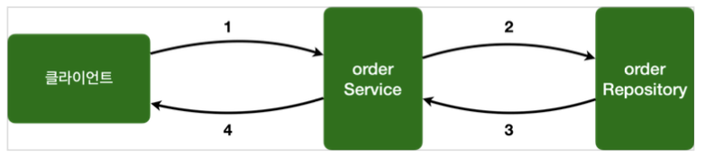
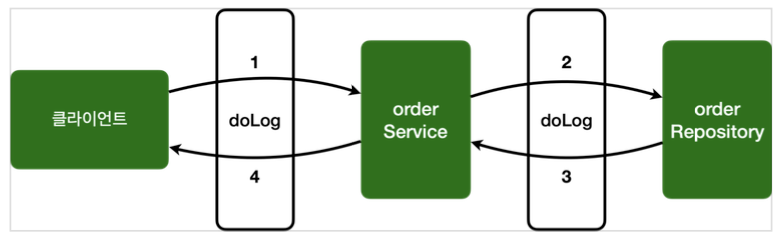

[이전 장(링크)]() 에서는 `스프링 AOP의 개념`에 대해서 알아보았다.  
이번 장에서는 **스프링 AOP를 적용하는 기본적인 방법에 대해서**알아보도록 한다.  
모든 코드는 [깃허브(링크)](https://github.com/roy-zz/spring) 에 올려두었다.
---

### 예제 프로젝트

스프링 AOP를 구현하기 위해 예제 프로젝트를 만들어본다.

**OrderRepository**
```java
@Slf4j
@Repository
public class OrderRepository {

    public String save(String itemId) {

        log.info("[orderRepository] 실행");
        if (itemId.equals("exception")) {
            throw new IllegalStateException("예외 발생!");
        }
        return "ok";
    }
}
```

**OrderService**
```java
@Slf4j
@Service
@RequiredArgsConstructor
public class OrderService {

    private final OrderRepository orderRepository;

    public void orderItem(String itemId) {

        log.info("[orderService] 실행");
        orderRepository.save(itemId);
    }
}
```

우리가 작성한 `OrderService`, `OrderRepository`가 정상적으로 작동하는지 테스트 코드를 작성해본다.

```java
@Slf4j
@SpringBootTest
public class AopTest {

    @Autowired
    private OrderService orderService;

    @Autowired
    private OrderRepository orderRepository;

    @Test
    void aopInfo() {

        log.info("isAopProxy, orderService = {}", AopUtils.isAopProxy(orderService));
        log.info("isAopProxy, orderRepository = {}", AopUtils.isAopProxy(orderRepository));
    }

    @Test
    void successTest() {

        orderService.orderItem("itemRoy");
    }

    @Test
    void exceptionTest() {
        Assertions.assertThatThrownBy(() -> orderService.orderItem("exception"))
                .isInstanceOf(IllegalStateException.class);
    }
}
```

`aopInfo` 메서드에서 출력되는 결과를 확인해보면 둘 다 `false`로 아직 AOP 프록시가 적용되지 않은 것을 확인할 수 있다.
```text
isAopProxy, orderService = false
isAopProxy, orderRepository = false
```



---

### @Aspect를 사용한 AOP 구현

스프링 AOP를 구현하는 일반적인 방법은 `@Aspect`를 사용하는 것이다.  
이번에는 `@Aspect`를 사용해서 가장 단순한 AOP를 구현해본다.

```java
@Slf4j
@Aspect
public class AspectVersion1 {

    @Around("execution(* com.roy.spring.myaop.order..*(..))")
    public Object doLog(ProceedingJoinPoint joinPoint) throws Throwable {

        log.info("[log] {}", joinPoint.getSignature());
        return joinPoint.proceed();
    }
}
```

- `@Around` 애너테이션의 값인 `execution(* com.roy.spring.myaop.order..*(..))`은 포인트컷이 된다.
- `@Around` 애너테이션의 메서드인 `doLog`는 어드바이스(`Advice`)가 된다.
- `execution(* com.roy.spring.myaop.order..*(..))`는 `com.roy.spring.myaop.order`패키지와 그 하위 패키지(`..`)를 지정하는 AspectJ 포인트컷 표현식이다.
- `OrderService`, `OrderRepository`의 모든 메서드는 AOP 적용의 대상이 된다. 참고로 스프링은 프록시 방식의 AOP를 사용하기 때문에 프록시를 통하는 메서드만 적용 대상이 된다.

**참고 사항**
- 스프링 AOP는 AspectJ의 문법을 차용하고, 프록시 방식의 AOP를 제공한다. AspectJ를 직접 사용하는 것은 아니다.
- 스프링 AOP를 사용할 때는 `@Aspect` 애너테이션을 주로 사용하는데, 이 애너테이션도 AspectJ가 제공하는 애너테이션이다.
- `@AspectJ`를 포함한 `org.aspectj` 패키지 관련 기능은 `aspectjweaver.jar` 라이브러리가 제공하는 기능이다.
  앞서 `build.gradle`에 `spring-boot-starter-aop`를 포함했는데, 이렇게 하면 스프링의 AOP 관련 기능과 함께 `aspectjweaver.jar`도 함께 사용할 수 있게 의존관계에 포함된다.
- 스프링에서는 AspectJ가 제공하는 애너테이션이나 관련 인터페이스만 사용하는 것이고, 실제 AspectJ가 제공하는 컴파일, 로드타임 위버 등을 사용하는 것은 아니다.
  스프링은 지금까지 우리가 학습한 것 처럼 프록시 방식의 AOP를 사용한다.

테스트 코드를 수정하여 `AspectVersion1`를 참조하도록 한다.

```java
@Slf4j
@SpringBootTest
@Import(AspectVersion1.class) // 추가
public class AopTest {
    // ...
}
```

`@Aspect`는 애스펙트라는 표식이지만 컴포넌트 스캔이 되는 것은 아니다. 따라서 `AspectVersion1`를 AOP로 사용하려면 스프링 빈으로 등록해야 한다.
스프링 빈으로 등록하는 아래와 같은 방법이 있다.
- `@Bean`을 사용해서 직접 등록
- `@Component` 컴포넌트 스캔을 사용해서 자동 등록
- `@Import` 주로 설정 파일을 추가할 때 사용(`@Configuration`)

`@Import`는 주로 설정 파일을 추가할 때 사용하지만, 이 기능으로 스프링 빈도 등록할 수 있다.  
우리의 테스트 코드인 `AopTest` 클래스에는 `@Import(AspectVersion1.class)`과 같은 방식으로 스프링 빈을 추가했다.
  
이전 테스트와는 다르게 `@Aspect` 애너테이션을 통해 프록시가 적용되었기 때문에 `AopUtils.isAopProxy(orderService))`의 결과가 `true`인 것을 확인할 수 있다.

```shell
[log] void com.roy.spring.myaop.order.OrderService.orderItem(String)
[orderService] 실행
[log] String com.roy.spring.myaop.order.OrderRepository.save(String)
[orderRepository] 실행
isAopProxy, orderService = true
isAopProxy, orderRepository = true
[log] void com.roy.spring.myaop.order.OrderService.orderItem(String)
[orderService] 실행
[log] String com.roy.spring.myaop.order.OrderRepository.save(String)
[orderRepository] 실행
```



---

### 포인트컷 분리

`@Around`에 포인트컷을 직접 추가할 수도 있지만, `@Pointcut` 애너테이션을 사용해서 별도로 분리할 수 있다.

```java
@Slf4j
@Aspect
public class AspectVersion2 {

    @Pointcut("execution(* com.roy.spring.myaop.order..*(..))")
    private void allOrder() {

    }

    @Around("allOrder()")
    public Object doLog(ProceedingJoinPoint joinPoint) throws Throwable {

        log.info("[log] {}", joinPoint.getSignature());
        return joinPoint.proceed();
    }
}
```

#### @Pointcut

- `@Pointcut`에 포인트컷 표현식을 사용한다.
- 메서드 이름과 파라미터를 합쳐서 "포인트컷 시그니처(signature)"라 한다.
- 메서드의 반환 타입은 `void`이며 코드의 내용은 비워두어야 한다.
- 포인트컷 시그니처는 `allOrder()`이다. 이름 그대로 주문과 관련된 모든 기능을 대상으로 하는 포인트컷이다.
- `@Around` 어드바이스에서는 포인트컷을 직접 지정해도 되지만, 포인트컷 시그니처를 사용해도 된다. 다른 애스펙트에서 참고하려면 `public`을 사용해야 한다.

`AspectVersion2`를 빈으로 등록하면 `AspectVersion1`과 동일하게 작동하는 것을 확인할 수 있다.  
테스트 코드를 수정하여 `AspectVersion2`가 빈으로 등록되도록 한다.

```java
@Slf4j
@SpringBootTest
// @Import(AspectVersion1.class)
@Import(AspectVersion2.class)
public class AopTest {
    // ...
}
```

출력된 결과를 확인해보면 `AopUtils.isAopProxy()`의 결과가 우리가 예상한대로 `true`인 것을 확인할 수 있다.

```shell
[log] void com.roy.spring.myaop.order.OrderService.orderItem(String)
[orderService] 실행
[log] String com.roy.spring.myaop.order.OrderRepository.save(String)
[orderRepository] 실행
isAopProxy, orderService = true
isAopProxy, orderRepository = true
[log] void com.roy.spring.myaop.order.OrderService.orderItem(String)
[orderService] 실행
[log] String com.roy.spring.myaop.order.OrderRepository.save(String)
[orderRepository] 실행
```

---

지금까지 `@Aspect` 애너테이션을 통해 프록시를 적용하고 `@Pointcut`을 분리하는 방법에 대해서 알아보았다.
다음 장에서는 어드바이스를 추가하고 순서를 제어하는 것과 같이 심화된 기능들에 대해서 알아본다.

---

**참고한 자료**:

- https://www.inflearn.com/course/%EC%8A%A4%ED%94%84%EB%A7%81-%ED%95%B5%EC%8B%AC-%EC%9B%90%EB%A6%AC-%EA%B3%A0%EA%B8%89%ED%8E%B8
- https://www.inflearn.com/course/%EC%8A%A4%ED%94%84%EB%A7%81-%ED%95%B5%EC%8B%AC-%EC%9B%90%EB%A6%AC-%EA%B8%B0%EB%B3%B8%ED%8E%B8
- https://www.inflearn.com/course/%EC%8A%A4%ED%94%84%EB%A7%81-mvc-1
- https://www.inflearn.com/course/%EC%8A%A4%ED%94%84%EB%A7%81-mvc-2