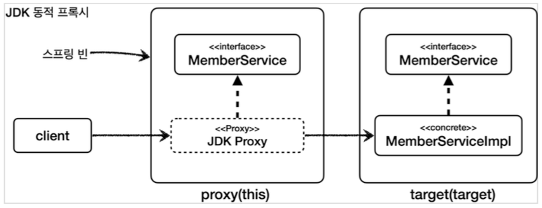
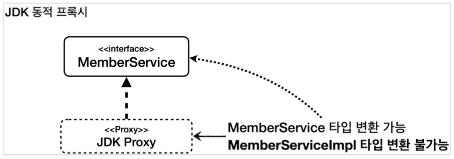
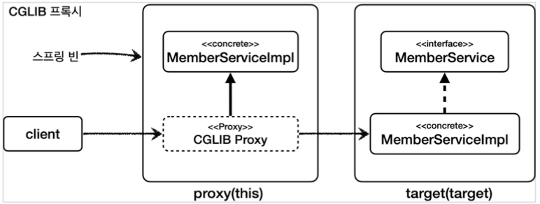
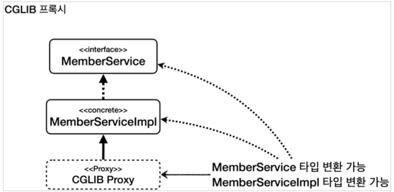
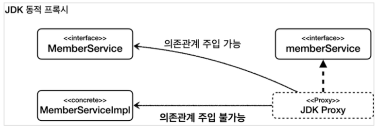
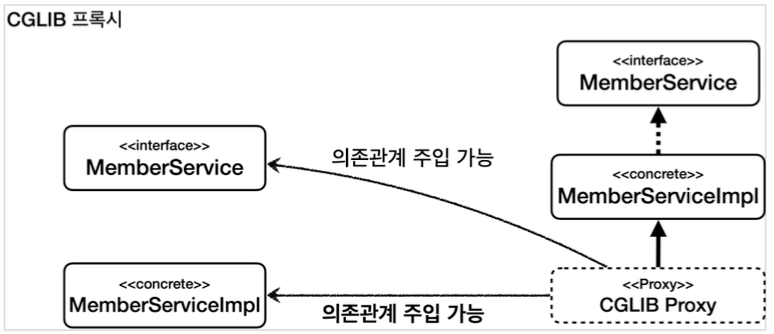
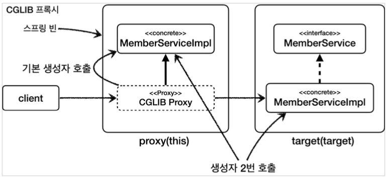

[이전 장(링크)](https://imprint.tistory.com/361)까지 `스프링 AOP를 사용할 때 발생할 수 있는 문제`에 대해서 알아보았다.  
이번 장에서는 **프록시 기술과 한계**에 대해서 알아보도록 한다.  
모든 코드는 [깃허브(링크)](https://github.com/roy-zz/spring) 에 올려두었다.
---

## 프록시 기술과 한계 - 타입 캐스팅

JDK 동적 프록시와 CGLIB를 사용해서 AOP 프록시를 만드는 방법에는 각각 장단점이 존재한다.  
JDK 동적 프록시는 인터페이스가 필수이고, 인터페이스를 기반으로 프록시를 생성한다.  
반면 CGLIB는 구체 클래스를 기반으로 프록시를 생성한다.
  
인터페이스가 없고 구체 클래스만 있는 경우에는 CGLIB를 사용해야 한다. 
하지만 인터페이스가 있는 경우에는 JDK 동적 프록시나 CGLIB 둘중에 하나를 선택할 수 있다.
  
스프링이 프록시를 만들 때 제공하는 `ProxyFactory`에 `proxyTargetClass` 옵션에 따라 둘 중 하나를 선택해서 프록시를 만들 수 있다.
  
- `proxyTargetClass = false`: JDK 동적 프록시를 사용해서 인터페이스 기반 프록시를 생성한다.
- `proxyTargetClass = true`: CGLIB를 사용해서 구체 클래스 기반 프록시를 생성한다.
- 참고로 옵션과 무관하게 인터페이스가 없으면 JDK 동적 프록시를 적용할 수 없으므로 CGLIB를 사용한다.

### JDK 동적 프록시 한계

#### JDK 동적 프록시

인터페이스 기반으로 프록시를 생성하는 JDK 동적 프록시는 **구체 클래스로 타입 캐스팅이 불가능**한 한계가 있다. 

**ProxyCastingTest**
```java
@Slf4j
public class ProxyCastingTest {

    @Test
    void jdkProxy() {
        MemberServiceImpl target = new MemberServiceImpl();
        ProxyFactory proxyFactory = new ProxyFactory(target);
        proxyFactory.setProxyTargetClass(false);

        // 프록시를 인터페이스로 캐스팅 성공
        MemberService memberServiceProxy = (MemberService) proxyFactory.getProxy();

        // JDK 동적 프록시를 구현 클래스로 캐스팅 하는 경우에 ClassCastException 예외 발생
        Assertions.assertThrows(ClassCastException.class, () -> {
            MemberServiceImpl castingMemberService = (MemberServiceImpl) memberServiceProxy;
        });
    }
}
```



**jdkProxy() 테스트**  
여기서는 `MemberServiceImpl` 타입을 기반으로 JDK 동적 프록시를 생성했다. 
`MemberServiceImpl` 타입은 `MemberService` 인터페이스를 구현한다. 따라서 JDK 동적 프록시는 `MemberService` 인터페이스를 기반으로 프록시(이하 `JDK 프록시`)를 생성한다. 
`memberServiceProxy`가 바로 `JDK 프록시`다
  
**JDK 동적 프록시 캐스팅**  



여기서 `JDK 프록시`를 대상 클래스인 `MemberServiceImpl` 타입으로 캐스팅하려고 하면 예외가 발생한다.  
이유는 JDK 동적 프록시는 인터페이스를 기반으로 프록시를 생성하기 때문이다. `JDK 프록시`는 `MemberService` 인터페이스를 기반으로 생성된 프록시이기 때문에 `MemberService`로 캐스팅은 가능하지만 `MemberServiceImpl`에 대해서는 전혀 알지 못한다.  
따라서 `MemberServiceImpl` 타입으로는 캐스팅이 불가능하며 캐스팅하려는 경우 `ClassCastException` 예외가 발생한다.

#### CGLIB

```java
@Slf4j
public class ProxyCastingTest {
    // ...
    @Test
    void cglibProxy() {
        MemberServiceImpl target = new MemberServiceImpl();
        ProxyFactory proxyFactory = new ProxyFactory(target);
        proxyFactory.setProxyTargetClass(true);

        // 프록시를 인터페이스로 캐스팅 성공
        MemberService memberServiceProxy = (MemberService) proxyFactory.getProxy();

        log.info("proxy class = {}", memberServiceProxy.getClass());

        // CGLIB 프록시를 구현 클래스로 캐스팅 시도 성공
        MemberServiceImpl castingMemberService = (MemberServiceImpl) memberServiceProxy;
    }
}
```



**cglibProxy() 테스트**
`MemberServiceImpl`타입을 기반으로 CGLIB 프록시를 생성했다. `MemberServiceImpl`타입은 `MemberService`인터페이스를 구현했다. 
CGLIB는 구체 클래스를 기반으로 프록시를 생성한다. 따라서 CGLIB는 `MemberServiceImpl` 구체 클래스를 기반으로 프록시(이하 `CGLIB 프록시`)를 생성한다.
여기서 `memberServiceProxy`가 바로 `CGLIB 프록시`다
  
**CGLIB 프록시 캐스팅**



여기에서 `CGLIB 프록시`를 대상 클래스인 `MemberServiceImpl` 타입으로 캐스팅하면 성공한다.  
CGLIB는 구체 클래스를 기반으로 프록시를 생성하기 때문이다. `CGLIB 프록시`는 `MemberServiceImpl` 구체 클래스를 기반으로 생성된 프록시다. 
따라서 CGLIB 프록시는 `MemberServiceImpl`은 물론이고, `MemberServiceImpl`이 구현한 인터페이스인 `MemberService`로도 캐스팅할 수 있다.
  
#### 정리

JDK 동적 프록시는 대상 객체인 `MemberServiceImpl`로 캐스팅할 수 없다.  
CGLIB 프록시는 대상 객체인 `MemberServiceImpl`로 캐스팅할 수 있다.

---

## 프록시 기술과 한계 - 의존관계 주입

JDK 동적 프록시를 사용하면서 의존관계 주입을 할 때 어떤 문제가 발생하는지 알아본다.

**ProxyDIAspect**
```java
@Slf4j
@Aspect
public class ProxyDIAspect {

    @Before("execution(* com.roy.spring.myaop..*.*(..))")
    public void doTrace(JoinPoint joinPoint) {
        log.info("[proxyDIAdvice] {}", joinPoint.getSignature());
    }
}
```

AOP 프록시 생성을 위해 간단한 애스펙트를 생성했다.

**ProxyDITest**
```java
@Slf4j
@Import(ProxyDIAspect.class)
// @SpringBootTest
@SpringBootTest(properties = { "spring.aop.proxy-target-class=false" }) // JDK 동적 프록시
// @SpringBootTest(properties = { "spring.aop.proxy-target-class=true" }) // CGLIB 프록시
public class ProxyDITest {

    @Autowired
    private MemberService memberService;

    @Autowired
    private MemberServiceImpl memberServiceImpl;

    @Test
    void go() {
        log.info("memberService class = {}", memberService.getClass());
        log.info("memberServiceImpl class = {}", memberServiceImpl.getClass());
        memberServiceImpl.hello("helloRoy");
    }
}
```

- `@SpringBootTest`: 내부에 컴포넌트 스캔을 포함하고 있다. `MemberServiceImpl`에 `@Component`가 붙어있으므로 스프링 빈 등록 대상이 된다.
- `proerties = {"spring.aop.proxy-target-class=false"}`: `application.preperties`에 설정하는 대신에 해당 테스트에서만 설정을 임시로 적용한다. 
  이렇게 하면 각 테스트마다 다른 설정을 손쉽게 적용할 수 있다.
- `spring.aop.proxy-target-class=false`: 스프링이 AOP 프록시를 생성할 때 JDK 동적 프록시를 우선 생성한다. 물론 인터페이스가 없다면 CGLIB를 사용한다.
- `@Import(ProxyDIAspect.class)`: 앞서 만든 Aspect를 스프링 빈으로 등록한다.

#### JDK 동적 프록시에 구체 클래스 타입 주입

JDK 동적 프록시에 구체 클래스 타입을 주입할 때 어떤 문제가 발생하는지 확인해본다.

**실행**  
먼저 `spring.aop.proxy-target-class=false` 설정을 사용해서 스프링 AOP가 JDK 동적 프록시를 사용하면 아래와 같은 오류가 발생한다.
  
**실행 결과 - 오류 내용**
```shell
Bean named 'memberServiceImpl' is expected to be of type 'com.roy.spring.myaop.member.MemberServiceImpl' but was actually of type 'com.sun.proxy.$Proxy61'
```

타입과 관련된 예외가 발생한다. 내용을 보면 `memberServiceImpl`에 주입되길 기대하는 타입은 `com.roy.spring.myaop.member.MemberServiceImpl`이지만 실제로 넘어온 타입은 `com.sum.proxy.$Proxy61`이기 때문에 예외가 발생한다고 출력된다.



- `@Autowired MemberService memberService`: 이 부분은 문제가 되지 않는다. JDK 프록시는 `MemberService` 인터페이스를 기반으로 만들어진다.
  따라서 해당 타입으로는 캐스팅할 수 있다. (`MemberService = JDK 프록시`가 성립한다.)
- `@Autowired MemberServiceImpl memberServiceImpl`: 여기서 문제가 발생한다. JDK 프록시는 `MemberService` 인터페이스를 기반으로 만들어진다. 
  따라서 `MemberServiceImpl` 타입이 무엇인지 전혀 알 수가 없기 때문에 주입이 불가능하다.(`MemberServiceImpl = JDK 프록시`가 성립하지 않는다.)

#### CGLIB 프록시에 구체 클래스 타입 주입

테스트 코드의 애너테이션을 수정하여 CGLIB 프록시가 사용되도록 한다.

```java
@Slf4j
@Import(ProxyDIAspect.class)
// @SpringBootTest
// @SpringBootTest(properties = { "spring.aop.proxy-target-class=false" }) // JDK 동적 프록시
@SpringBootTest(properties = { "spring.aop.proxy-target-class=true" }) // CGLIB 프록시
public class ProxyDITest {
    // ...
}
```

테스트를 실행시켜보면 이번에는 예외없이 정상적으로 실행되는 것을 확인할 수 있다.



- `@Autowired MemberService memberService`: `CGLIB 프록시`는 `MemberServiceImpl` 구체 클래스를 기반으로 만들어진다. 
  `MemberServiceImpl`은 `MemberService` 인터페이스를 구현했기 때문에 해당 타입으로 캐스팅할 수 있다. (`MemberService = CGLIB 프록시`가 성립한다.)
- `@Autowired MemberServiceImpl memberServiceImpl`: `CGLIB 프록시`는 `memberServiceImpl` 구체 클래스를 기반으로 만들어진다. 
  따라서 해당 타입으로 캐스팅할 수 있다. (`MemberServiceImpl = CGLIB 프록시`가 성립한다.)

#### 정리

JDK 동적 프록시는 대상 객체인 `MemberServiceImpl` 타입에 의존관계를 주입할 수 없다.  
CGLIB 프록시는 대상 객체인 `MemberServiceImpl` 타입에 의존관계를 주입할 수 있다.
  
지금까지 JDK 동적 프록시가 가지는 한계점을 알아보았다. 실제로 개발할 때는 인터페이스가 있으면 인터페이스를 기반으로 의존관계 주입을 받는 것이 맞다.  
DI의 장점은 DI 받는 클라이언트 코드의 변경없이 구현 클래스를 변경할 수 있는 겻이다. 이렇게 하려면 인터페이스를 기반으로 의존관계를 주입 받아야 한다. 
`MemberServiceImpl` 타입으로 의존관계 주입을 받는 것 처럼 구현 클래스에 의존관계를 주입하면 향후 구현 클래스를 변경할 때 의존관계 주입을 받는 클라이언트의 코드도 함께 변경해야 한다.  
정상적으로 잘 설계된 애플리케이션은 이러한 문제가 발새앟지 않는다.  
하지만 테스트와 같은 여러가지 이유로 AOP 프록시가 적용된 구체 클래스를 직접 의존관계 주입받아야 하는 경우가 있을 수 있다. 
이러한 경우 CGLIB를 통해 구체 클래스 기반으로 AOP 프록시를 적용하면 된다.

---

## 프록시 기술과 한계 = CGLIB

스프링에서 CGLIB는 구체 클래스를 상속받아서 AOP 프록시를 생성할 때 사용한다.  
CGLIB는 구체 클래스를 상속받기 때문에 여러 문제가 발생할 수 있다.
- 대상 클래스에 기본 생성자가 필요하다.
- 생성자가 2번 호출된다.
- final 키워드 클래스, 메서드는 사용이 불가능하다.

### 대상 클래스에 기본 생성자 필수

CGLIB는 구체 클래스를 상속받는다. 자바 언어에서 상속을 받으면 자식 클래스의 생성자를 호출할 때 자식 클래스의 생성자에서 부모 클래스의 생성자도 호출해야 한다. 
만약 이러한 부분이 생략되어 있다면 자식 클래스의 생성자 첫줄에 부모 클래스의 기본 생성자를 호출하는 `super()`가 자동으로 포함되며 이것은 기본 자바 문법이다.  
CGLIB를 사용할 때 CGLIB가 만드는 프록시의 생성자는 우리가 호출하는 것이 아니며 CGLIB 프록시는 대상 클래스를 상속받고, 생성자에서 대상 클래스의 기본 생성자를 호출한다. 
따라서 대상 클래스에 기본 생성자를 만들어야 한다. 기본 생성자는 파라미터가 하나도 없는 생성자를 의미하며, 생성자가 하나도 없으면 자동으로 만들어진다.

### 생성자 2번 호출

CGLIB는 구체 클래스를 상속받는다. 자바 언어에서 상속을 받으면 자식 클래스의 생성자를 호출할 때 부모 클래스의 생성자도 호출해야 한다.  
생성자가 2번 호출되는 순서는 아래와 같다.
1. 실제 target의 객체를 생성할 때
2. 프록시 객체를 생성할 때 부모 클래스의 생성자 호출



### final 키워드 클래스, 메서드 사용 불가

final 키워드가 클래스에 있으면 상속이 불가능하고, 메서드에 있으면 오버라이딩이 불가능하다. CGLIB는 상속을 기반으로 하기 때문에 두 경우 프록시가 생성되지 않거나 정상 동작하지 않는다.
  
프레임워크 같은 개발이 아니라 일반적인 웹 애플리케이션을 개발할 때는 `final`키워드를 잘 사용하지 않는다. 따라서 이 부분이 특별히 문제가 되지는 않는다.

---

## 프록시 기술과 한계 - 스프링의 해결책

스프링은 AOP 프록시 생성을 편리하게 제공하기 위해 오랜 시간 문제를 해결해왔다.

### 스프링 3.2, CGLIB를 스프링 내부에 함께 패키징

CGLIB를 사용하려면 CGLIB 라이브러리가 별도로 필요했다. 
스프링은 이러한 불편함을 해겨랗기 위해 CGLIB 라이브러리를 스프링 내부에 함께 패키징하여 별도의 라이브러리 추가 없이 사용할 수 있게 하였다. (`CGLIB spring-core org.spring.framework`)

### CGLIB 기본 생성자 필수 문제 해결

스프링 4.0부터는 CGLIB의 기본 생성자 필수인 문제가 해결되었다.  
`objenesis`라는 특별한 라이브러리를 사용해서 기본 생성자 없이 객체 생성이 가능하다.  
이 라이브러리는 생성자 호출 없이 객체를 생성할 수 있게 해준다.

### 생성자 2번 호출 문제

스프링 4.0부터는 CGLIB의 생성자 2번 호출 문제가 해결되었다.  
이것 또한 `objenesis`라는 라이브러리를 통해 문제를 해결하였고 생성자는 1번만 호출된다.

### 스프링 부트 2.0 - CGLIB 기본 사용

스프링 부트 2.0 버전부터 CGLIB를 기본으로 사용하도록 변경하여, 구체 클래스 타입으로 의존관계를 주입하는 문제를 해결하였다.  
스프링 부트는 별도의 설정이 없다면 AOP를 적용할 때 기본적으로 `proxyTargetClass=true`로 설정해서 사용한다.  
따라서 인터페이스가 있어도 JDK 동적 프록시를 사용하는 것이 아니라 항상 CGLIB를 사용해서 구체클래스를 기반으로 프록시를 생성한다.  

### 정리

스프링은 최종적으로 스프링 부트 2.0에서 CGLIB를 기본으로 사용하도록 결정하였다. CGLIB를 사용하면 JDK 동적 프록시에서 동작하지 않는 구체 클래스 주입이 가능하다. 
여기에 추가로 CGLIB의 단점들이 많이 해결되었다. 하지만 아직 `final` 클래스나 `final` 메서드라는 문제가 남아있는데, AOP를 적용할 때 대상에는 `final` 클래스나 `final` 메소드를 자주 사용하지 않으므로 크게 문제가 되지는 않는다.
  
개발자 입장에서 보면 사실 어떤 프록시 기술을 사용하든 큰 상관이 없다. JDK 동적 프록시든 CGLIB든 또는 어떠한 프록시 기술을 사용해도 된다. 
심지어 클라이언트 입장에서 어떤 프록시 기술을 사용하는지 모르고 잘 동작하는 것이 가장 좋다.
  
마지막으로 아무런 설정도 하지 않았을 때 CGLIB 프록시가 기본으로 사용되는 것을 확인해본다. `ProxyDITest`의 애너테이션을 아래와 같이 수정해본다.
**ProxyDITest**
```java
@Slf4j
@Import(ProxyDIAspect.class)
@SpringBootTest
// @SpringBootTest(properties = { "spring.aop.proxy-target-class=false" }) // JDK 동적 프록시
// @SpringBootTest(properties = { "spring.aop.proxy-target-class=true" }) // CGLIB 프록시
public class ProxyDITest {
    // ...
}
```

출력되는 결과를 확인해보면 CGLIB 프록시가 적용되어 있는 것을 확인할 수 있다.

```shell
memberService class = class com.roy.spring.myaop.member.MemberServiceImpl$$EnhancerBySpringCGLIB$$cda8e7e6
memberServiceImpl class = class com.roy.spring.myaop.member.MemberServiceImpl$$EnhancerBySpringCGLIB$$cda8e7e6
```

---

**참고한 자료**:

- https://www.inflearn.com/course/%EC%8A%A4%ED%94%84%EB%A7%81-%ED%95%B5%EC%8B%AC-%EC%9B%90%EB%A6%AC-%EA%B3%A0%EA%B8%89%ED%8E%B8
- https://www.inflearn.com/course/%EC%8A%A4%ED%94%84%EB%A7%81-%ED%95%B5%EC%8B%AC-%EC%9B%90%EB%A6%AC-%EA%B8%B0%EB%B3%B8%ED%8E%B8
- https://www.inflearn.com/course/%EC%8A%A4%ED%94%84%EB%A7%81-mvc-1
- https://www.inflearn.com/course/%EC%8A%A4%ED%94%84%EB%A7%81-mvc-2