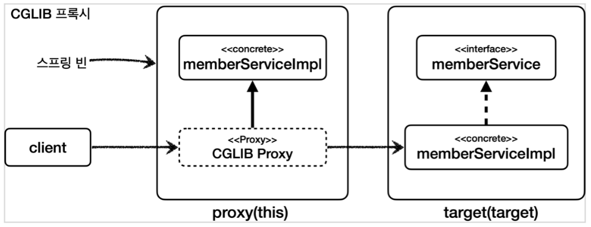

[이전 장(링크)](https://imprint.tistory.com/359) 에서는 `within, args, @target, @within, @annotation, @args 지시자`에 대해서 알아보았다.  
이번 장에서는 **bean, this, target 지시자**에 대해서 알아보도록 한다.  
모든 코드는 [깃허브(링크)](https://github.com/roy-zz/spring) 에 올려두었다.
---

## bean

- 스프링 전용 포인트컷 지시자로 빈의 이름으로 지정한다.  
- 스프링 빈의 이름으로 AOP 적용 여부를 지정한다. 스프링에서만 사용할 수 있는 특별한 지시자다.
- `bean(orderService) || bean(*Repository)`와 같은 문법으로 사용된다.
- `*`와 같은 패턴을 사용할 수 있다.

**BeanTest**

```java
@Slf4j
@SpringBootTest
@Import(BeanTest.BeanAspect.class)
public class BeanTest {

    @Autowired
    private OrderService orderService;

    @Test
    void success() {
        orderService.orderItem("itemRoy");
    }

    @Aspect
    static class BeanAspect {

        @Around("bean(orderService) || bean(*Repository)")
        public Object doLog(ProceedingJoinPoint joinPoint) throws Throwable {
            log.info("[bean] {}", joinPoint.getSignature());
            return joinPoint.proceed();
        }
    }
}
```

`OrderService`, `*Repository(OrderRepository)`의 메서드에 AOP가 적용된다.  
출력된 결과는 아래와 같다.

```shell
[bean] void com.roy.spring.myaop.order.OrderService.orderItem(String)
[orderService] 실행
[bean] String com.roy.spring.myaop.order.OrderRepository.save(String)
[orderRepository] 실행
```

---

## 매개변수 전달

아래의 포인트컷 표현식을 사용하면 어드바이스에 매개변수를 전달할 수 있다.
`this`, `target`, `args`, `@target`, `@within`, `@annotation`, `@args`  
  
사용법은 아래와 같다.
```java
@Before("allMember() && args(arg,..")
public void logArgs3(Strign arg) {
    log.info("[logArgs3] arg = {}", arg);
}
```

- 포인트컷의 이름과 매개변수의 이름을 맞추어야 한다. 여기서는 `arg`로 맞춰져있다.
- 추가로 타입이 메서드에 지정한 타입으로 제한된다. 여기에서 메서드의 타입이 `String`으로 되어 있기 때문에 아래와 같이 정의된 것으로 이해하면 된다.
  - `args(arg,..)` -> `args(String,..)`

**ParameterTest**
```java
@Slf4j
@SpringBootTest
@Import(ParameterTest.ParameterAspect.class)
public class ParameterTest {

    @Autowired
    private MemberService memberService;

    @Test
    void success() {
        log.info("memberService Proxy = {}", memberService.getClass());
        memberService.hello("helloRoy");
    }

    @Slf4j
    @Aspect
    static class ParameterAspect {

        @Pointcut("execution(* com.roy.spring.myaop.member..*.*(..))")
        private void allMember() {}

        @Around("allMember()")
        public Object logArgs1(ProceedingJoinPoint joinPoint) throws Throwable {
            Object arg1 = joinPoint.getArgs()[0];
            log.info("[logArgs1] {}, arg = {}", joinPoint.getSignature(), arg1);
            return joinPoint.proceed();
        }

        @Around("allMember() && args(arg,..)")
        public Object logArgs2(ProceedingJoinPoint joinPoint, Object arg) throws Throwable {
            log.info("[logArgs2] {}, arg = {}", joinPoint.getSignature(), arg);
            return joinPoint.proceed();
        }

        @Before("allMember() && args(arg,..)")
        public void logArgs3(String arg) {
            log.info("[logArgs3] arg = {}", arg);
        }

        @Before("allMember() && this(obj)")
        public void thisArgs(JoinPoint joinPoint, MemberService obj) {
            log.info("[this] {}, obj = {}", joinPoint.getSignature(), obj.getClass());
        }

        @Before("allMember() && target(obj)")
        public void targetArgs(JoinPoint joinPoint, MemberService obj) {
            log.info("[target] {}, obj = {}", joinPoint.getSignature(), obj.getClass());
        }

        @Before("allMember() && @target(annotation)")
        public void atTarget(JoinPoint joinPoint, ClassAop annotation) {
            log.info("[@target] {}, obj = {}", joinPoint.getSignature(), annotation);
        }

        @Before("allMember() && @within(annotation)")
        public void atWithin(JoinPoint joinPoint, ClassAop annotation) {
            log.info("[@within] {}, obj = {}", joinPoint.getSignature(), annotation);
        }

        @Before("allMember() && @annotation(annotation)")
        public void atAnnotation(JoinPoint joinPoint, MethodAop annotation) {
            log.info("[@annotation] {}, annotationValue = {}", joinPoint.getSignature(), annotation.value());
        }
    }
}
```

- `logArgs1`: `joinPoint.getArgs()[0]`와 같이 매개변수를 전달 받는다.
- `logArgs2`: `args(arg,..)`와 같이 매개변수를 전달 받는다.
- `logArgs3`: `@Before`를 사용한 축약 버전이다. 추가로 타입을 `String`으로 제한했다.
- `this`: 프록시 객체를 전달 받는다.
- `target`: 실제 대상 객체를 전달 받는다.
- `@target`, `@within`: 타입의 애너테이션을 전달 받는다.
- `@annotation`: 메소드의 애너테이션을 전달받는다. 여기서는 `annotation.value()`로 해당 애너테이션의 값을 출력하였다.
  
출력된 결과는 아래와 같다.

```shell
memberService Proxy = class com.roy.spring.myaop.member.MemberServiceImpl$$EnhancerBySpringCGLIB$$6dcb441c
[logArgs1] String com.roy.spring.myaop.member.MemberServiceImpl.hello(String), arg = helloRoy
[logArgs2] String com.roy.spring.myaop.member.MemberServiceImpl.hello(String), arg = helloRoy
[logArgs3] arg = helloRoy
[this] String com.roy.spring.myaop.member.MemberServiceImpl.hello(String), obj = class com.roy.spring.myaop.member.MemberServiceImpl$$EnhancerBySpringCGLIB$$6dcb441c
[target] String com.roy.spring.myaop.member.MemberServiceImpl.hello(String), obj = class com.roy.spring.myaop.member.MemberServiceImpl
[@target] String com.roy.spring.myaop.member.MemberServiceImpl.hello(String), obj = @com.roy.spring.myaop.member.annotation.ClassAop()
[@within] String com.roy.spring.myaop.member.MemberServiceImpl.hello(String), obj = @com.roy.spring.myaop.member.annotation.ClassAop()
[@annotation] String com.roy.spring.myaop.member.MemberServiceImpl.hello(String), annotationValue = test value
```

---

## this, target

### 정의

- `this`: 스프링 빈 객체(스프링 AOP 프록시)를 대상으로 하는 조인 포인트
- `target`: Target 객체(스프링 AOP 프록시가 가르키는 실제 대상)를 대상으로 하는 조인 포인트

### 설명

- `this`, `target`은 아래와 같이 적용 타입 하나를 정확하게 지정해야 한다.

```java
this(com.roy.spring.myaop.member.MemberService)
target(com.roy.spring.myaop.member.MemberService)
```

- `*` 같은 패턴을 사용할 수 없다.
- 부모 타입을 허용한다.

### this vs target

`this`와 `target`은 단순히 타입 하나를 정하지만 둘은 차이가 있다.  
스프링에서 AOP를 적용하면 실제 `target` 객체 대신에 프록시 객체가 스프링 빈으로 등록된다.
- `this`는 스프링 빈으로 등록되어 있는 **프록시 객체**를 대상으로 포인트컷을 매칭한다.
- `target`은 실제 **target 객체**를 대상으로 포인트컷을 매칭한다.

#### 프록시 생성 방식에 따른 차이

스프링은 프록시를 생성할 때 JDK 동적 프록시와 CGLIB를 선택할 수 있다. 둘의 프록시를 생성하는 방식이 다르기 때문에 차이가 발생한다.
- JDK 동적 프록시: 인터페이스가 필수이고, 인터페이스를 구현한 프록시 객체를 생성한다.
- CGLIB: 인터페이스가 있어도 구체 클래스를 상속 받아서 프록시 객체를 생성한다.

#### JDK 동적 프록시


  
**MemberService 인터페이스 지정**  
- `this(com.roy.spring.myaop.member.MemberService)`: 프록시 객체를 보고 판단한다. `this`는 부모 타입을 허용하기 때문에 AOP가 적용된다.
- `target(com.roy.spring.myaop.member.MemberService)`: target 객체를 보고 판단한다. `target`은 부모 타입을 허용하기 때문에 AOP가 적용된다.
  
**MemberServiceImpl 구체 클래스 지정**
- `this(com.roy.spring.myaop.member.MemberServiceImpl)`: 프록시 객체를 보고 판단한다. JDK 동적 프록시로 만들어진 프록시 객체는 `MemberService` 인터페이스를 기반으로 구현된 새로운 클래스다. 
  따라서 `MemberServiceImpl`를 전혀 알지 못하기 때문에 **AOP 적용 대상이 아니다.**
- `target(com.roy.spring.myaop.member.MemberServiceImpl)`: target 객체를 보고 판단한다. target 객체가 `MemberServiceImpl` 타입이므로 AOP 적용 대상이다.

#### CGLIB 프록시



**MemberService 인터페이스 지정**
- `this(com.roy.spring.myaop.member.MemberService)`: 프록시 객체를 보고 판단한다. `this`는 부모 타입을 허용하기 때문에 AOP가 적용된다.
- `target(com.roy.spring.myaop.member.MemberService)`: target 객체를 보고 판단한다. `target`은 부모 타입을 허용하기 때문에 AOP가 적용된다.
  
**MemberServiceImpl 구체 클래스 지정**
- `this(com.roy.spring.myaop.member.MemberServiceImpl)`: 프록시 객체를 보고 판단한다. CGLIB로 만들어진 프록시 객체는 `MemberServiceImpl`를 상속 받아서 만들었기 때문에 AOP가 적용된다. 
  `this`가 부모 타입을 허용하기 때문에 포인트컷의 대상이 된다.
- `target(com.roy.spring.myaop.member.MemberServiceImpl)`: target 객체를 보고 판단한다. target 객체가 `MemberServiceImpl` 타입이므로 AOP 적용 대상이다.

**정리**  
프록시를 대상으로 하는 `this`의 경우 구체 클래스를 지정하면 프록시 생성 전략에 따라서 다른 결과가 나올 수 있다.

**ThisTargetTest**
```java
@Slf4j
@Import(ThisTargetTest.ThisTargetAspect.class)
@SpringBootTest(properties = "spring.aop.proxy-target-class=false") // JDK 동적 프록시
// @SpringBootTest(properties = "spring.aop.proxy-target-class=true") // CGLIB
public class ThisTargetTest {

    @Autowired
    private MemberService memberService;

    @Test
    void success() {
        log.info("memberService Proxy = {}", memberService.getClass());
        memberService.hello("helloRoy");
    }

    @Slf4j
    @Aspect
    static class ThisTargetAspect {

        // 부모 타입 허용
        @Around("this(com.roy.spring.myaop.member.MemberService)")
        public Object doThisInterface(ProceedingJoinPoint joinPoint) throws Throwable {
            log.info("[this-interface] {}", joinPoint.getSignature());
            return joinPoint.proceed();
        }

        // 부모 타입 허용
        @Around("target(com.roy.spring.myaop.member.MemberService)")
        public Object doTargetInterface(ProceedingJoinPoint joinPoint) throws Throwable {
            log.info("[this-interface] {}", joinPoint.getSignature());
            return joinPoint.proceed();
        }

        @Around("this(com.roy.spring.myaop.member.MemberServiceImpl)")
        public Object doThis(ProceedingJoinPoint joinPoint) throws Throwable {
            log.info("[this-impl] {}", joinPoint.getSignature());
            return joinPoint.proceed();
        }

        @Around("this(com.roy.spring.myaop.member.MemberServiceImpl)")
        public Object doTarget(ProceedingJoinPoint joinPoint) throws Throwable {
            log.info("[this-impl] {}", joinPoint.getSignature());
            return joinPoint.proceed();
        }
    }
}
```

- `this`, `target`은 실제 객체를 만들어야 테스트할 수 있다.
- `properties = {"spring.aop.proxy-target-class=false}`: `application.properties`에 설정하는 대신에 해당 테스트에서만 설정을 임시로 적용한다. 
  이렇게 하면 각 테스트마다 다른 설정을 손쉽게 적용할 수 있다.
- `spring.aop.proxy-target-class=false`: 스프링이 AOP 프록시를 생성할 때 JDK 동적 프록시를 우선 생각한다. 물론 인터페이스가 없다면 CGLIB를 사용한다.
- `spring.aop.proxy-target-class=true`: 스프링이 AOP 프록시를 생성할 때 CGLIB 프록시를 생성한다. 참고로 이 설정을 생략하면 스프링 부트에서 기본으로 CGLIB를 사용한다.
  
**JDK 동적 프록시(spring.aop.proxy-target-class=false) 출력**
```shell
memberService Proxy = class com.sun.proxy.$Proxy58
[this-impl] String com.roy.spring.myaop.member.MemberService.hello(String)
[this-interface] String com.roy.spring.myaop.member.MemberService.hello(String)
[this-interface] String com.roy.spring.myaop.member.MemberService.hello(String)
```

- JDK 동적 프록시를 사용하면 `this(com.roy.spring.myaop.member.MemberServiceImpl)`로 지정한 `[this-impl]` 부분이 출력되지 않는 것을 확인할 수 있다. 
  
**CGLIB(spring.aop.proxy-target-class=true 또는 스프링 부트 기본 옵션이므로 생략) 출력**
```shell
memberService Proxy = class com.roy.spring.myaop.member.MemberServiceImpl$$EnhancerBySpringCGLIB$$881e5e68
[this-impl] String com.roy.spring.myaop.member.MemberServiceImpl.hello(String)
[this-interface] String com.roy.spring.myaop.member.MemberServiceImpl.hello(String)
[this-impl] String com.roy.spring.myaop.member.MemberServiceImpl.hello(String)
[this-interface] String com.roy.spring.myaop.member.MemberServiceImpl.hello(String)
```

- CGLIB의 경우 모든 경우에 AOP가 적용되어 출력되는 것을 확인할 수 있다.
- `this`, `target` 지시자는 단독으로 사용되지 보다는 파라미터 바인딩에 주로 사용된다.

---

**참고한 자료**:

- https://www.inflearn.com/course/%EC%8A%A4%ED%94%84%EB%A7%81-%ED%95%B5%EC%8B%AC-%EC%9B%90%EB%A6%AC-%EA%B3%A0%EA%B8%89%ED%8E%B8
- https://www.inflearn.com/course/%EC%8A%A4%ED%94%84%EB%A7%81-%ED%95%B5%EC%8B%AC-%EC%9B%90%EB%A6%AC-%EA%B8%B0%EB%B3%B8%ED%8E%B8
- https://www.inflearn.com/course/%EC%8A%A4%ED%94%84%EB%A7%81-mvc-1
- https://www.inflearn.com/course/%EC%8A%A4%ED%94%84%EB%A7%81-mvc-2