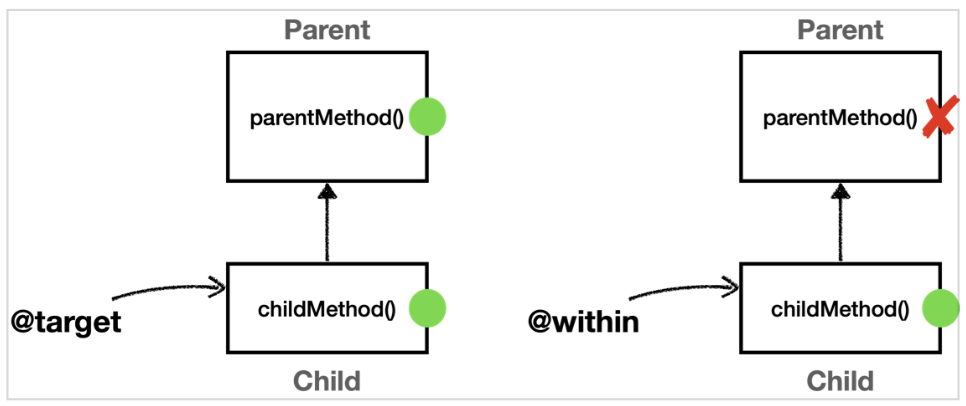

[이전 장(링크)](https://imprint.tistory.com/358) 에서는 `스프링 AOP의 포인트컷과 execution 지시자`에 대해서 알아보았다.  
이번 장에서는 **within, args, @target, @within, @annotation, @args 지시자**에 대해서 알아보도록 한다.  
모든 코드는 [깃허브(링크)](https://github.com/roy-zz/spring) 에 올려두었다.
---

## within

within 지시자는 특정 타입 내의 조인 포인트에 대한 매칭을 제시한다. 해당 타입이 매칭되면 그 안의 메서드(조인 포인트)들이 자동으로 매칭된다.  
문법이 단순하며 `execution`에서 타입 부분만 사용한다고 보면 된다.

```java
public class WithinTest {

    AspectJExpressionPointcut pointcut = new AspectJExpressionPointcut();

    Method helloMethod;

    @BeforeEach
    public void init() throws NoSuchMethodException {
        helloMethod = MemberServiceImpl.class.getMethod("hello", String.class);
    }

    @Test
    void withinExact() {
        pointcut.setExpression("within(com.roy.spring.myaop.member.MemberServiceImpl)");
        assertThat(pointcut.matches(helloMethod, MemberServiceImpl.class)).isTrue();
    }

    @Test
    void withinStar() {
        pointcut.setExpression("within(com.roy.spring.myaop.member.*Service*)");
        assertThat(pointcut.matches(helloMethod, MemberServiceImpl.class)).isTrue();
    }

    @Test
    void withinSubPackage() {
        pointcut.setExpression("within(com.roy..*)");
        assertThat(pointcut.matches(helloMethod, MemberServiceImpl.class)).isTrue();
    }
}
```

- 표현식에 부모 타입을 지정하면 안되며 정확하게 타입이 일치해야 한다.
- `execution`과 차이가 있기 때문에 주의해야 한다.

### within vs execution

```java
public class WithinTest {
    // ...
    @Test
    @DisplayName("타켓의 타입에만 직접 적용, 인터페이스를 선정하면 안된다.")
    void withinSuperTypeFalse() {
        pointcut.setExpression("within(hello.aop.member.MemberService)");
        assertThat(pointcut.matches(helloMethod, MemberServiceImpl.class)).isFalse();
    }

    @Test
    @DisplayName("execution은 타입 기반, 인터페이스 선정 가능")
    void executionSuperTypeTrue() {
        pointcut.setExpression("execution(* hello.aop.member.MemberService.*(..))");
        assertThat(pointcut.matches(helloMethod, MemberServiceImpl.class)).isTrue();
    }
}
```

부모 타입(`MemberService` 인터페이스) 지정시 `within`은 실패하고, `execution`은 성공하는 것을 확인할 수 있다. 

---

## args

- `args`: 인자가 주어진 타입의 인스턴스인 조인 포인트로 매칭한다.
- 기본 문법은 `execution`의 `args` 부분과 동일하다.

### execution vs args 차이점
- `execution`은 파라미터 타입이 정확하게 매칭되어야 한다. `execution`은 클래스에 선언된 정보를 기반으로 판단한다.
- `args`는 부모 타입을 허용한다. `args`는 실제로 넘어온 파라미터 객체 인스턴스를 보고 판단한다.

**ArgsTest**
```java
public class ArgsTest {

    Method helloMethod;

    @BeforeEach
    public void init() throws NoSuchMethodException {
        helloMethod = MemberServiceImpl.class.getMethod("hello", String.class);
    }

    private AspectJExpressionPointcut pointcut(String expression) {
        AspectJExpressionPointcut pointcut = new AspectJExpressionPointcut();
        pointcut.setExpression(expression);
        return pointcut;
    }

    @Test
    void args() {
        assertThat(pointcut("args(String)").matches(helloMethod, MemberServiceImpl.class)).isTrue();
        assertThat(pointcut("args(Object)").matches(helloMethod, MemberServiceImpl.class)).isTrue();
        assertThat(pointcut("args()").matches(helloMethod, MemberServiceImpl.class)).isFalse();
        assertThat(pointcut("args(..)").matches(helloMethod, MemberServiceImpl.class)).isTrue();
        assertThat(pointcut("args(*)").matches(helloMethod, MemberServiceImpl.class)).isTrue();
        assertThat(pointcut("args(String,..)").matches(helloMethod, MemberServiceImpl.class)).isTrue();
    }

    @Test
    void argsVsExecution() {
        // args - 런타임에 전달된 인수로 판단 (동적)
        assertThat(pointcut("args(String)").matches(helloMethod, MemberServiceImpl.class)).isTrue();
        assertThat(pointcut("args(java.io.Serializable)").matches(helloMethod, MemberServiceImpl.class)).isTrue();
        assertThat(pointcut("args(Object)").matches(helloMethod, MemberServiceImpl.class)).isTrue();

        // execution - 메서드의 시그니처로 판단 (정적)
        assertThat(pointcut("execution(* *(String))").matches(helloMethod, MemberServiceImpl.class)).isTrue();
        assertThat(pointcut("execution(* *(java.io.Serializable))").matches(helloMethod, MemberServiceImpl.class)).isFalse();
        assertThat(pointcut("execution(* *(Object))").matches(helloMethod, MemberServiceImpl.class)).isFalse();
    }
}
```

- `pointcut()`: `AspectJExpressionPointcut`에 포인트컷은 한 번만 지정할 수 있다. 이번 테스트 코드에서는 테스트를 편리하게 진행하기 위해 포인트컷을 여러번 지정할 수 있도록 메서드를 생성하였다.
- 자바가 기본적으로 제공하는 `String`은 `Object`의 하위 타입이며, `java.io.Serializable`을 구현하고 있다.
- 정적으로 클래스에 선언도니 정보만 보고 판단하는 `execution(* *(Object))`는 매칭에 실패한다.
- 동적으로 실제 파라미터로 넘어온 객체 인스턴스로 판단하는 `args(Object)`는 부모 타입을 허용하기 때문에 성공한다.
- 참고로 `args` 지시자는 단독으로 사용되기 보다는 파라미터 바인딩에 주로 사용된다.

---

## @target, @within

- `@target`: 실행 객체의 클래스에 주어진 타입의 애너테이션이 있는 조인 포인트
- `@within`: 주어진 애너테이션이 있는 타입 내 조인 포인트
- `@target`, `@within`은 아래와 같이 타입이 있는 애너테이션으로 AOP 적용 여부를 판단한다.
  - `@target(com.roy.spring.myaop.member.annotation.ClassAop)`
  - `@within(com.roy.spring.myaop.member.annotation.ClassAop)`

```java
@ClassAop
class Target{}
```

### @target vs @within
- `@target`은 인스턴스의 모든 메소드를 조인 포인트로 적용한다.
- `@within`은 해당 타입 내에 있는 메소드만 조인 포인트로 적용한다.
- 정리하면, `@target`은 부모 클래스의 메서드까지 어드바이스를 다 적용하고, `@within`은 자기 자신의 클래스에 정의된 메소드에만 어드바이스를 적용한다.



**AtTargetAtWithinTest**
```java
@Slf4j
@SpringBootTest
@Import({AtTargetAtWithinTest.Config.class})
public class AtTargetAtWithinTest {

    @Autowired
    private Child child;

    @Test
    void success() {
        log.info("child Proxy = {}", child.getClass());
        child.childMethod();
        child.parentMethod();
    }
    
    static class Config {

        @Bean
        public Parent parent() {
            return new Parent();
        }

        @Bean
        public Child child() {
            return new Child();
        }

        @Bean
        public AtTargetAtWithinAspect atTargetAtWithinAspect() {
            return new AtTargetAtWithinAspect();
        }
    }

    static class Parent {
        public void parentMethod() {}
    }

    @ClassAop
    static class Child extends Parent {
        public void childMethod() {}
    }

    @Slf4j
    @Aspect
    static class AtTargetAtWithinAspect {

        // @target: 인스턴스 기준으로 모든 메서드의 조인 포인트를 선정하고, 부모 타입의 메서드도 적용된다.
        @Around("execution(* com.roy.spring.myaop..*(..)) && @target(com.roy.spring.myaop.member.annotation.ClassAop)")
        public Object atTarget(ProceedingJoinPoint joinPoint) throws Throwable {
            log.info("[@target] {}", joinPoint.getSignature());
            return joinPoint.proceed();
        }

        // @within: 선택된 클래스 내부에 있는 메서드만 조인 포인트로 선정하고, 부모 타입의 메서드는 적용되지 않는다.
        @Around("execution(* com.roy.spring.myaop..*(..)) && @within(com.roy.spring.myaop.member.annotation.ClassAop)")
        public Object atWithin(ProceedingJoinPoint joinPoint) throws Throwable {
            log.info("[@within] {}", joinPoint.getSignature());
            return joinPoint.proceed();
        }
    }
}
```

출력된 결과는 아래와 같다.

```shell
[@target] void com.roy.spring.myaop.pointcut.AtTargetAtWithinTest$Child.childMethod()
[@within] void com.roy.spring.myaop.pointcut.AtTargetAtWithinTest$Child.childMethod()
[@target] void com.roy.spring.myaop.pointcut.AtTargetAtWithinTest$Parent.parentMethod()
```

- `parentMethod()`는 `Parent` 클래스에만 정의되어 있고, `Child` 클래스에 정의되어 있지 않기 때문에 `@within`에서 AOP 적용 대상이 되지 않는다.  
- 출력 결과를 확인해보면 `child.parentMethod()`를 호출 했을 때, `[@within]`이 호출되지 않은 것을 확인할 수 있다.
- 참고로 `@target`, `@within` 지시자는 뒤에서 설명할 파라미터 바인딩에서 함께 사용된다.

#### 주의

`args`, `@args`, `@target` 지시자는 **단독으로 사용해서는 안된다**.
  
예제를 보면 `execution(* com.roy.spring.aop..*(..))`를 통해 적용 대상을 줄여준 것을 확인할 수 있다. 
`args`, `@args`, `@target`은 실제 객체 인스턴스가 **생성되고 실행될 때 어드바이스 적용 여부를 확인**할 수 있다.
  
실행 시점에 일어나는 포인트컷 적용 여부도 결국 **프록시가 있어야 실행 시점에 판단**할 수 있다. 프록시가 없다면 판단 자체가 불가능하다. 
하지만 스프링 컨테이너가 프록시를 생성하는 시점은 스프링 컨테이너가 만들어지는 **애플리케이션 로딩시점에 적용할 수** 있다. 
따라서 `args`, `@args`, `@target` 같은 포인트컷 지시자가 있으면 스프링은 모든 스프링 빈에 AOP를 적용하려고 시도한다. 프록시가 없으면 실행 시점에 판단 자체가 불가능하다.
  
문제는 이렇게 모든 스프링 빈에 AOP 프록시를 적용하려고 하면 스프링이 내부에서 사용하는 빈 중에는 `final`로 지정된 빈들도 있기 때문에 오류가 발생할 수 있다.
  
따라서 이러한 표현식은 **최대한 프록시 적용 대상을 축소하는 표현식과 함께 사용**해야 한다.

---

### @annotation, @args

#### @annotation

`@annotation`: 메서드가 주어진 애너테이션을 가지고 조인 포인트를 매칭한다.  
아래와 같이 메서드(조인 포인트)에 애너테이션이 있으면 매칭한다.

```java
public class MemberServiceImpl {
    @MethodAop("test value")
    public String hello(String param) {
        return "ok";
    }
}
```

**AtAnnotationTest**
```java
@Slf4j
@SpringBootTest
@Import(AtAnnotationTest.AtAnnotationAspect.class)
public class AtAnnotationTest {

    @Autowired
    private MemberService memberService;

    @Test
    void success() {
        log.info("memberService Proxy = {}", memberService.getClass());
        memberService.hello("helloRoy");
    }

    @Slf4j
    @Aspect
    static class AtAnnotationAspect {

        public Object doAtAnnotation(ProceedingJoinPoint joinPoint) throws Throwable {
            log.info("[@annotation] {}", joinPoint.getSignature());
            return joinPoint.proceed();
        }
    }
}
```

출력된 결과는 아래와 같다.

```shell
memberService Proxy = class com.roy.spring.myaop.member.MemberServiceImpl
```

#### @args

`@args`: 전달된 실제 인수의 런타임 타입이 주어진 타입의 애너테이션을 갖는 조인 포인트
  
전달된 인수의 런타임 타입에 `@Check` 애너테이션이 있는 경우에 매칭한다. `args(test.Check)`

---

**참고한 자료**:

- https://www.inflearn.com/course/%EC%8A%A4%ED%94%84%EB%A7%81-%ED%95%B5%EC%8B%AC-%EC%9B%90%EB%A6%AC-%EA%B3%A0%EA%B8%89%ED%8E%B8
- https://www.inflearn.com/course/%EC%8A%A4%ED%94%84%EB%A7%81-%ED%95%B5%EC%8B%AC-%EC%9B%90%EB%A6%AC-%EA%B8%B0%EB%B3%B8%ED%8E%B8
- https://www.inflearn.com/course/%EC%8A%A4%ED%94%84%EB%A7%81-mvc-1
- https://www.inflearn.com/course/%EC%8A%A4%ED%94%84%EB%A7%81-mvc-2