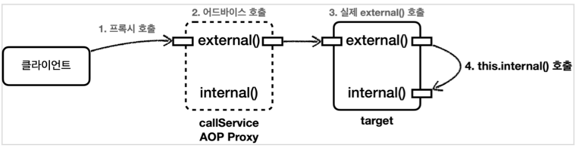
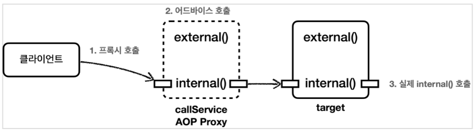
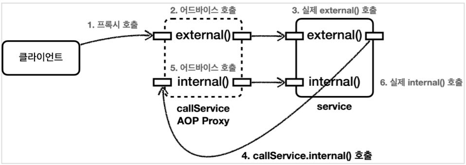
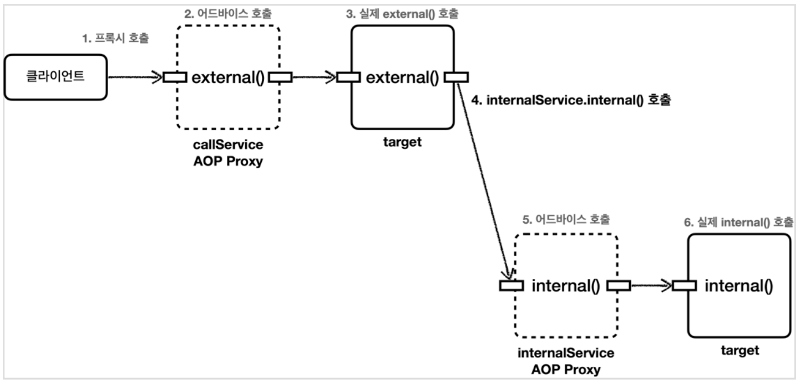

[이전 장(링크)](https://imprint.tistory.com/360)까지 `스프링 AOP를 실제 실무에 적용`시키는 방법에 대해서 알아보았다.  
이번 장에서는 **AOP 내부 호출 문제**에 대해서 알아보도록 한다.  
모든 코드는 [깃허브(링크)](https://github.com/roy-zz/spring) 에 올려두었다.
---

## 프록시와 내부 호출 문제

스프링은 프록시 방식의 AOP를 사용하기 때문에 AOP를 적용하려면 항상 **프록시를 통해서 대상 객체(Target)을 호출**해야 한다.  
이런 방식으로 해야 프록시에서 먼저 어드바이스를 호출하고, 이후에 대상 객체를 호출한다.  
만약 프록시를 거치지 않고 대상 객체를 직접 호출하게 되면 AOP가 적용되지 않고, 어드바이스도 호출되지 않는다.
  
AOP를 적용하면 스프링은 **대상 객체 대신에 프록시를 스프링 빈으로 등록**한다. 따라서 스프링은 의존관계 주입시에 항상 프록시 객체를 주입한다. 
프록시 객체가 주입되기 때문에 대상 객체를 직접 호출하는 문제는 일반적으로 발생하지 않는다. 하지만 대상 객체의 내부에서 메서드 호출이 발생하면 프록시를 거치지 않고 대상 객체를 직접 호출하는 문제가 발생한다. 
실무에서 반드시 한번은 만나는 문제이기 때문에 반드시 이해하고 넘어가야 한다.
  
내부 호출이 발생할 때 어떤 문제가 발생하는지 알아보기 위해 내부 호출이 발생하는 예제를 만들어보도록 한다.

**CallServiceVersion0**
```java
@Slf4j
@Component
public class CallServiceVersion0 {

    public void external() {
        log.info("call external");
        internal();
    }

    public void internal() {
        log.info("call internal");
    }
}
```

`CallServiceVersion0.external()`을 호출하면 내부에서 `internal()`이라는 자기 자신의 메서드를 호출한다.

**CallLogAspect**
```java
@Slf4j
@Aspect
public class CallLogAspect {
    
    @Before("execution(* com.roy.spring.myaop.internalcall..*.*(..))")
    public void doLog(JoinPoint joinPoint) {
        log.info("aop = {}", joinPoint.getSignature());
    }
}
```

`CallServiceVersion0`에 AOP를 적용하기 위해 애스펙트를 하나 만든다.

**CallServiceVersion0Test**
```java
@SpringBootTest
@Import(CallLogAspect.class)
public class CallServiceVersion0Test {

    @Autowired
    private CallServiceVersion0 callServiceVersion0;

    @Test
    void external() {
        callServiceVersion0.external();
    }

    @Test
    void internal() {
        callServiceVersion0.internal();
    }
}
```

`CallServiceVersion0`을 실행할 수 있는 테스트 코드를 만들었다.
- `@Import(CallLogAspect.class)`: 앞서 만든 `CallLogAspect` 애스펙트를 스프링 빈으로 등록한다. 이 과정을 통해서 `CallServiceVersion0`에 AOP 프록시를 적용한다.
- `@SpringBootTest`: 내부에 컴포넌트 스캔을 포함하고 있다. `CallServiceVersion0`에 `@Component`가 붙어있으므로 스프링 빈 등록 대상이 된다.
  
`callServiceVersion0.external()`을 실행해서 출력된 결과를 살펴본다.

```shell
aop = void com.roy.spring.myaop.internalcall.CallServiceVersion0.external()
call external
call internal
```


  
실행 결과를 보면 `callServiceVersion0.external()`을 실행할 때는 프록시를 호출한다. 따라서 `CallLogAspect` 어드바이스가 호출된 것을 확인할 수 있다.  
AOP 프록시는 `target.external()`을 호출한다. 문제는 `callServiceVersion0.external()`안에서 `internal()`을 호출할 때 발생한다.  
`CallLogAspect` 어드바이스가 호출되지 않는다.
  
자바 언어에서 메서드 앞에 별도의 참조가 없으면 `this`라는 뜻으로 자기 자신의 인스턴스를 가리킨다.  
결과적으로 자기 자신의 내부 메소드를 호출하는 `this.internal()`이 되는데, 여기서 `this`는 실제 대상 객체(target)의 인스턴스를 뜻한다.  
결과적으로 이러한 내부 호출은 프록시를 거치지 않고 **어드바이스도 적용할 수 없다.**
  
외부에서 `internal()`을 호출하는 테스트를 실행해본다.

```shell
aop = void com.roy.spring.myaop.internalcall.CallServiceVersion0.internal()
call internal
```



외부에서 호출하는 경우는 프록시를 거치기 때문에 `internal()`도 `CallLogAspect` 어드바이스가 적용된 것을 확인할 수 있다.

### 프록시 방식의 AOP 한계

스프링은 프록시 방식의 AOP를 사용한다. 프록시 방식의 AOP는 위에서 살펴본 것처럼 메서드 내부 호출에 프록시를 적용할 수 없다.  
실제 코드에 AOP를 직접 적용하는 AspectJ를 사용하면 이런 문제가 발생하지 않는다. 프록시를 통하는 것이 아니라 해당 코드에 직접 AOP 적용 코드가 붙어있기 때문에 내부 호출과 무관하게 AOP를 적용할 수 있다.  
하지만 로드 타임 위빙등을 사용해야 하는데, 설정이 복잡하고 JVM 옵션을 변경해야 한다는 부담이 있다.  
이렇게 복잡한 방법을 사용하지 않고 프록시 방식의 AOP에서 내부 호출에 대응할 수 있는 방법들을 알아본다.
  
AspectJ는 이런 대안들이 있고 진입 장벽이 높기때문에 일반적으로 실무에서 사용되지 않는다. 

---

## 프록시 내부 호출 문제 대안 1 - 자기 자신 주입

내부 호출을 해결하는 가장 간단한 방법은 자기 자신을 의존관계 주입 받는 것이다.

**CallServiceVersion1**
```java
@Slf4j
@Component
public class CallServiceVersion1 {

    private CallServiceVersion1 callServiceVersion1;

    @Autowired
    public void setCallServiceVersion1(@Lazy CallServiceVersion1 callServiceVersion1) {
        this.callServiceVersion1 = callServiceVersion1;
    }

    public void external() {
        log.info("call external");
        callServiceVersion1.internal();
    }

    public void internal() {
        log.info("call internal");
    }
}
```

`callServiceVersion1`를 수정자를 통해서 주입받는 것을 확인할 수 있다. 스프링에서 AOP가 적용된 대상을 의존관계에서 주입 받으면 주입 받은 대상은 실제 자신이 아니라 프록시 객체다.  
`external()`을 호출하면 `callServiceVersion1.internal()`를 호출하게 된다. 주입받은 `callServiceVersion1`은 프록시이다.  
따라서 프록시를 통해서 AOP를 적용할 수 있다.
  
참고로 생성자 주입을 사용하면 순환 사이클이 발생하면서 오류가 발생한다. 이러한 오류를 방지하기 위해 수정자 수입을 사용하였다.

```shell
aop = void com.roy.spring.myaop.internalcall.CallServiceVersion1.external()
call external
aop = void com.roy.spring.myaop.internalcall.CallServiceVersion1.internal()
call internal
```



실행 결과를 보면 `internal()`을 호출할 때 자기 자신의 인스턴스를 호출하는 것이 아니라 프록시 인스턴스를 통해서 호출하기 때문에 AOP가 잘 적용된다.

---

## 프록시 내부 호출 문제 대안 2 - 지연 조회

자기 자신을 주입하는 해결법 이외에 지연 조회를 통해서 내부 호출 문제를 해결할 수 있다.  
스프링 빈을 지연해서 조회하면 되는데, `ObjectProvider(Provider)`, `ApplicationCOntext`를 사용하면 된다.

**CallServiceVersion2**
```java
@Slf4j
@Component
@RequiredArgsConstructor
public class CallServiceVersion2 {
    
    private final ObjectProvider<CallServiceVersion2> callServiceProvider;
    
    public void external() {
        log.info("call external");
        CallServiceVersion2 callServiceVersion2 = callServiceProvider.getObject();
        callServiceVersion2.internal();
    }
    
    public void internal() {
        log.info("call internal");
    }
}
```

`ObjectProvider`는 객체를 스프링 컨테이너에서 조회하는 것을 스프링 빈 생성 시점이 아니라 실제 객체를 사용하는 시점으로 지연할 수 있다.  
`callServiceProvider.getObject()`를 호출하는 시점에 스프링 컨테이너에서 빈을 조회한다.  
여기서는 자기 자신을 주입 받는 것이 아니기 때문에 순환 사이클이 발생하지 않는다.

**CallServiceVersion2Test**
```java
@Slf4j
@SpringBootTest
@Import(CallLogAspect.class)
public class CallServiceVersion2Test {

    @Autowired
    private CallServiceVersion2 callServiceVersion2;

    @Test
    void external() {
        callServiceVersion2.external();
    }
}
```

출력된 결과는 아래와 같다.

```shell
aop = void com.roy.spring.myaop.internalcall.CallServiceVersion2.external()
call external
aop = void com.roy.spring.myaop.internalcall.CallServiceVersion2.internal()
call internal
```

---

## 프록시 내부 호출 문제 대안 3 - 구조 변경

대안 1, 2는 자기 자신을 주입하거나 `Provider`를 사용하기 때문에 일반적인 클래스의 구조와는 다르다.  
그렇기 때문에 가장 좋은 대안은 문제가 발생하였을 때 해결하는 것이 아니라 처음부터 내부 호출이 발생하지 않도록 구조를 잡는 것이다.  
이번에는 실제로 내부 호출이 발생하지 않도록 구조를 변경해본다.

**CallServiceVersion3**
```java
@Slf4j
@Component
@RequiredArgsConstructor
public class CallServiceVersion3 {

    private final InternalService internalService;

    public void external() {
        log.info("call external");
        internalService.internal();
    }
}
```

내부 호출을 해야하는 부분을 별도의 클래스인 `InternalService`로 분리하였다.

**InternalService**
```java
@Slf4j
@Component
public class InternalService {

    public void internal() {
        log.info("call internal");
    }

}
```

**CallServiceVersion3Test**
```java
@Slf4j
@SpringBootTest
@Import(CallLogAspect.class)
public class CallServiceVersion3Test {

    @Autowired
    private CallServiceVersion3 callServiceVersion3;

    @Test
    void external() {
        callServiceVersion3.external();
    }
}
```

출력되는 결과를 확인해보면 아래와 같다.

```shell
aop = void com.roy.spring.myaop.internalcall.CallServiceVersion3.external()
call external
aop = void com.roy.spring.myaop.internalcall.InternalService.internal()
call internal
```



내부 호출 자체가 사라지고, `callService` -> `internalService`를 호출하는 구조로 변경되었다. 덕분에 자연스럽게 AOP가 적용되었다.  
이러한 구조 변경은 여러 방법으로 변경이 가능하다. 예를 들어, `external()`메서드가 `internal()` 메서드를 호출하는 것이 아니라 `클라이언트`가 `external()`과 `internal()`을 순차적으로 호출하도록 변경할 수도 있다.
  
#### 참고

AOP는 주로 트랜잭션 적용이나 주요 컴포넌트의 로그 출력 기능에 사용된다. 쉽게 말하면 인터페이스에 메서드가 나올 정도의 규모에 AOP를 적용하는 것이 적당하다.  
즉, AOP는 `public` 메서드에만 적용한다. `private` 메서드처럼 작은 단위에는 AOP를 적용하지 않는다.  
AOP 적용을 위해 `private` 메서드를 외부 클래스로 변경하고 `public`으로 변경하는 일은 거의 없다.  
그러나 우리가 만든 예제와 같이 `public` 메서드에서 `public` 메서드를 내부 호출하는 경우에는 문제가 발생한다.  
  
**AOP가 잘 적용되지 않는다면 내부 호출을 먼저 의심해봐야 한다.**

---

**참고한 자료**:

- https://www.inflearn.com/course/%EC%8A%A4%ED%94%84%EB%A7%81-%ED%95%B5%EC%8B%AC-%EC%9B%90%EB%A6%AC-%EA%B3%A0%EA%B8%89%ED%8E%B8
- https://www.inflearn.com/course/%EC%8A%A4%ED%94%84%EB%A7%81-%ED%95%B5%EC%8B%AC-%EC%9B%90%EB%A6%AC-%EA%B8%B0%EB%B3%B8%ED%8E%B8
- https://www.inflearn.com/course/%EC%8A%A4%ED%94%84%EB%A7%81-mvc-1
- https://www.inflearn.com/course/%EC%8A%A4%ED%94%84%EB%A7%81-mvc-2