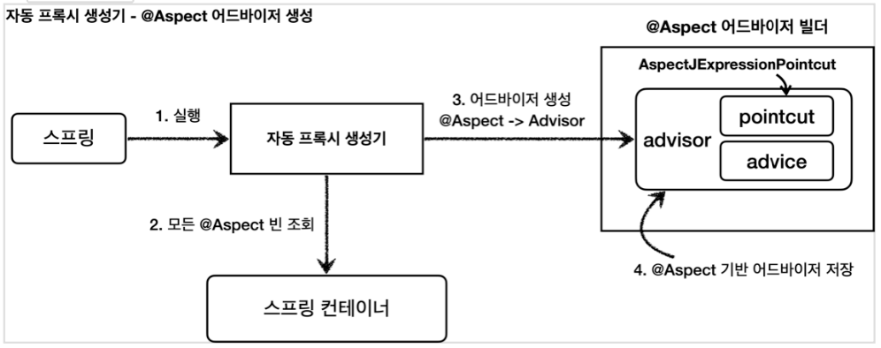
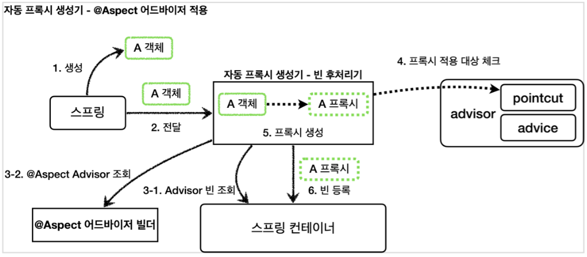
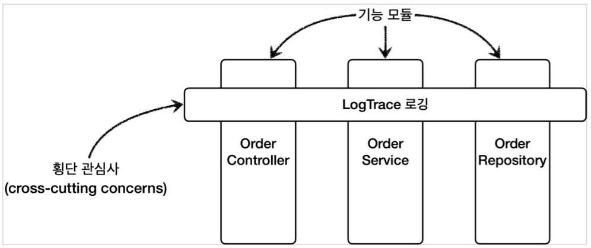

[이전 장(링크)](https://imprint.tistory.com/353) 에서는 스프링이 제공하는 빈 후처리기에 대해서 알아보았다.  
이번 장에서는 **@Aspect AOP**에 대해서 알아보도록 한다.
모든 코드는 [깃허브(링크)](https://github.com/roy-zz/spring) 에 올려두었다.
---

### @Aspect 프록시 - 적용
  
스프링 애플리케이션에 프록시를 적용하려면 포인트컷과 어드바이스로 구성되어 있는 어드바이저(`Advisor`)를 만들어서 스프링 빈으로 등록하면 된다. 
그러면 나머지는 자동 프록시 생성기가 모두 자동으로 처리해준다. 자동 프록시 생성기는 스프링 빈으로 등록된 어드바이저들을 찾고, 스프링 빈들에 자동으로 프록시를 적용해준다.
  
스프링은 `@Aspect` 애너테이션으로 매우 편리하게 포인트컷과 어드바이스로 구성되어 있는 어드바이저 생성 기능을 지원한다.  
`@Aspect`는 관점 지향 프로그래밍(AOP)을 가능하게 하는 AspectJ 프로젝트에서 제공하는 애너테이션이다. 스프링은 이것을 차용하여 프록시를 통한 AOP를 가능하게 한다.
  
지금까지 어드바이저를 직접 만들었던 부분을 `@Aspect` 애너테이션을 사용해서 만들어보도록 한다.
  
**LogTraceAspect**
```java
@Slf4j
@Aspect
public class LogTraceAspect {

    private final LogTrace logTrace;

    public LogTraceAspect(LogTrace logTrace) {

        this.logTrace = logTrace;
    }

    @Around("execution(* com.roy.spring.myproxy..*(..))")
    public Object execute(ProceedingJoinPoint joinPoint) throws Throwable {

        TraceStatus status = null;
        try {
            String message = joinPoint.getSignature().toShortString();
            status = logTrace.begin(message);

            Object result = joinPoint.proceed();

            logTrace.end(status);
            return result;
        } catch (Exception exception) {
            logTrace.exception(status, exception);
            throw exception;
        }
    }
}
```
- `@Aspect`: 애너테이션 기반 프록시를 적용할 때 필요하다.
- `@Around("execution(* com.roy.spring.myproxy..*(..))")`
  - `@Around`의 값에 포인트컷 표현식을 넣는다. 표현식은 AspectJ 표현식을 사용한다.
  - `@Around`의 메서드는 어드바이스(`Advice`)가 된다.
- `ProceedingJointPoint joinPoint`: 어드바이스에서 살펴본 `MethodInvocation invocation`과 유사한 기능이다. 내부에 실제 호출 대상, 전달 인자, 어떤 객체와 어떤 메서드가 호출되었는지 정보가 포함되어 있다.
- `joinPoint.proceed()`: 실제 호출 대상(`target`)을 호출한다.
  
**AopConfig**
```java
@Configuration
@Import({ApplicationVersion1Config.class, ApplicationVersion2Config.class})
public class AopConfig {

    @Bean
    public LogTraceAspect logTraceAspect(LogTrace logTrace) {

        return new LogTraceAspect(logTrace);
    }
}
```
  
- `@Import({ApplicationVersion1Config.class, ApplicationVErsion2Config.class})`: `Version 1`, `Version 2` 애플리케이션은 수동으로 빈으로 등록해야 한다.
- `@Bean logTraceAspect()`: `@Aspect`가 있어도 스프링 빈으로 등록을 해주어야 한다. 물론 `LogTraceAspect`에 `@Component` 애너테이션을 붙여서 컴포넌트 스캔을 사용하여 빈으로 등록해도 된다.
  
**MyProxyApplication**  
```java
@Import(AopConfig.class)
@SpringBootApplication(scanBasePackages = "com.roy.spring.myproxy")
public class MyProxyApplication {

    public static void main(String[] args) {
        SpringApplication.run(MyProxyApplication.class, args);
    }

    @Bean
    public LogTrace logTrace() {
        return new ThreadLocalLogTrace();
    }
}
```
  
메인 메서드에 `AopConfig`를 등록하고 실행하면 정상적으로 프록시가 적용되는 것을 확인할 수 있다.

---

### @Aspect 프록시 - 개념

자동 프록시 생성기에 대해서 알아볼 때, 자동 프록시 생성기(`AnnotationAwareAspectJAutoProxyCreator`)는 `Advisor`를 자동으로 찾아와서 필요한 곳에 프록시를 생성하고 적용해주는 학습하였다. 
자동 프록시 생성기는 여기에 추가로 하나의 역할을 더 하는데, 바로 `@Aspect`를 찾아서 이것을 `Advisor`로 만들어준다. 쉽게 이야기해서 지금까지 학습한 기능에 `@Aspect`를 `Advisor`로 변환해서 저장하는 기능도 한다. 
이러한 이유로 이름 앞에 `AnnotationAware`(해석하면, 애너테이션을 인식하는)가 붙어 있는 것이다.
  
다시 한번 코드를 보면서 확인해본다.
```java
@Aspect
public class LogTraceAspect {
    
    @Around("execution( *com.roy.spring.myproxy..*(..))") 
    public Object execute(ProceedingJoinPoint joinPoint) {
        // ...
    }
}
```

위의 코드는 하나의 어드바이저이다. `@Around(...` 부분은 포인트컷 역할을 하며 `execute` 메서드는 어드바이스 역할을 한다.  
자동 프록시 생성기는 2가지 일을 한다.
1. **`@Aspect`를 보고 어드바이저(`Advisor`)로 변환해서 저장한다.**



- **1. 실행**: 스프링 애플리케이션 로딩 시점에 자동 프록시 생성기를 호출한다.
- **2. 모든 @Aspect 빈 조회**: 자동 프록시 생성기는 스프링 컨테이너에서 `@Aspect` 애너테이션이 붙어있는 스프링 빈을 모두 조회한다.
- **3. 어드바이저 생성**: `@Aspect` 어드바이저 빌더를 통해 `@Aspect` 어드바이저 빌더 내부에 저장한다.
- **4. @Aspect 기반 어드바이저 저장**: 생성한 어드바이저를 `@Aspect` 어드바이저 빌더 내부에 저장한다.
  
- **@Aspect 어드바이저 빌더**: `BeanFactoryAspectJAdvisorsBuilder` 클래스이다. `@Aspect`의 정보를 기반으로 포인트컷, 어드바이스, 어드바이저를 생성하고 보관하는 것을 담당한다. 
  `@Aspect`의 정보를 기반으로 어드바이저를 만들고, `@Aspect` 어드바이저 빌더 내부 저장소에 캐싱한다. 캐시에 어드바이저가 이미 만들어져 있는 경우 캐시에 저장된 어드바이저를 반환한다.
  
2. **어드바이저를 기반으로 프록시 생성**



- **1. 생성**: 스프링 빈의 대상이 되는 객체를 생성한다. (`@Bean`, 컴포넌트 스캔 모두 포함된다.)
- **2. 전달**: 생성된 객체를 빈 저장소에 등록하기 직전에 빈 후처리기에 전달한다.
- **3-1. Advisor 빈 조회**: 스프링 컨테이너에서 `Advisor` 빈을 모두 조회한다.
- **3-2. @Aspect Advisor 조회**: `@Aspect` 어드바이저 빌더 내부에 저장된 `Advisor`를 모두 조회한다.
- **4. 프록시 적용 대상 확인**: 3-1, 3-2 단계에서 조회한 `Advisor`에 포함되어 있는 포인트컷을 사용해서 해당 객체가 프록시를 적용할 대상인지 판단한다.
  이때 객체의 클래스 정보와 해당 객체의 메서드를 포인트컷에 모두 매칭해본다. 그 결과 하나라도 만족한다면 프록시 적용의 대상이 된다.
  예를 들어, 메서드 하나만 포인트컷 조건에 만족해도 프록시 적용 대상이 된다.
- **5. 프록시 생성**: 프록시 적용 대상이면 프록시를 생성하고 프록시를 반환한다. 그래서 프록시를 스프링 빈으로 등록한다. 
  만약 프록시 적용 대상이 아니라면 원본 객체를 반환해서 원본 객체를 스프링 빈으로 등록한다.
- **6. 빈 등록**: 반환된 객체는 스프링 빈으로 등록된다.

---

#### 정리

`@Aspect`를 사용해서 애너테이션 기반 프록시를 매우 편리하게 적용해 보았다. 실무에서 프록시를 적용할 때는 대부분 이러한 방식을 사용한다.
  
지금까지 우리가 만든 애플리케이션 전반에 로그를 남기는 기능은 특정 기능하나에 관심이 있는 기능이 아니라 애플리케이션 여러 기능들 사이에 걸쳐서 들어가는 관심사이다. 
이러한 관심사를 바로 **횡단 관심사(cross-cutting concern)** 라고 한다. 우리가 지금까지 진행한 방법이 애플리케이션 전반에 걸쳐 있는 횡단 관심사의 문제를 해결하는 방법이었다.



지금까지 프록시를 사용해서 이러한 횡단 관심사를 어떻게 해결하는지 점진적으로 깊이있게 학습하였다.

---

**참고한 자료**:

- https://www.inflearn.com/course/%EC%8A%A4%ED%94%84%EB%A7%81-%ED%95%B5%EC%8B%AC-%EC%9B%90%EB%A6%AC-%EA%B3%A0%EA%B8%89%ED%8E%B8
- https://www.inflearn.com/course/%EC%8A%A4%ED%94%84%EB%A7%81-%ED%95%B5%EC%8B%AC-%EC%9B%90%EB%A6%AC-%EA%B8%B0%EB%B3%B8%ED%8E%B8
- https://www.inflearn.com/course/%EC%8A%A4%ED%94%84%EB%A7%81-mvc-1
- https://www.inflearn.com/course/%EC%8A%A4%ED%94%84%EB%A7%81-mvc-2