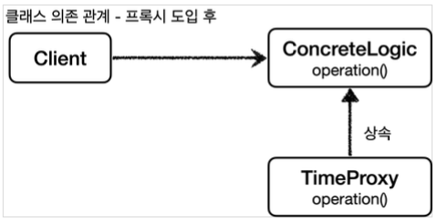

[이전 장(링크)](https://imprint.tistory.com/288) 에서는 인터페이스 기반의 프록시에 대해서 알아보았다.  
이번 장에서는 인터페이스가 없는 구체 클래스에 프록시를 적용시키는 방법에 대해서 알아본다.  
모든 코드는 [깃허브(링크)](https://github.com/roy-zz/spring) 에 올려두었다.

---

### 프록시 적용 전 & 적용 후 비교

이전 장에서는 인터페이스를 기반으로 프록시를 도입하였다. 다시 프록시가 도입되기 전의 클래스와 객체의 관계를 확인해본다.


자바의 다형성은 인터페이스 뿐만 아니라 상속을 통해서도 가능하다.  
즉, 인터페이스가 없더라도 클래스를 기반으로 상속을 통해서 프록시를 도입할 수 있다는 의미가 된다.  
  
구체 클래스를 상속받아서 생성된 프록시를 적용하면 아래와 같은 클래스 의존 관계가 만들어진다.
클라이언트는 구체 클래스에 의존하고 프록시 클래스는 구체 클래스를 상속받고 있다.


  
런타임 시점의 객체 의존 관계는 아래와 같다.  
클라이언트는 구체 클래스의 객체가 아니라 프록시 객체를 의존하고 있으며 프록시 객체가 구체 클래스의 메서드를 호출하고 있다.


---

### 적용

컨트롤러, 서비스, 리포지토리 프록시의 코드는 형태와 동작 원리가 유사하다.  
  
```java
public class OrderControllerConcreteProxy extends OrderControllerVersion2 {
    private final OrderControllerVersion2 target;
    private final LogTrace logTrace;
    public OrderControllerConcreteProxy(OrderControllerVersion2 target, LogTrace logTrace) {
        super(null);
        this.target = target;
        this.logTrace = logTrace;
    }
    @Override
    public String request(String itemId) {
        TraceStatus status = null;
        try {
            status = logTrace.begin("Call OrderControllerConcreteProxy.request()");
            String result = target.request(itemId);
            logTrace.end(status);
            return result;
        } catch (Exception exception) {
            logTrace.exception(status, exception);
            throw exception;
        }
    }
}
```

```java
public class OrderServiceConcreteProxy extends OrderServiceVersion2 {
    private final OrderServiceVersion2 target;
    private final LogTrace logTrace;
    public OrderServiceConcreteProxy(OrderServiceVersion2 target, LogTrace logTrace) {
        super(null);
        this.target = target;
        this.logTrace = logTrace;
    }
    @Override
    public void orderItem(String itemId) {
        TraceStatus status = null;
        try {
            status = logTrace.begin("Call OrderServiceConcreteProxy.orderItem()");
            target.orderItem(itemId);
            logTrace.end(status);
        } catch (Exception exception) {
            logTrace.exception(status, exception);
            throw exception;
        }
    }
}
```

```java
@RequiredArgsConstructor
public class OrderRepositoryConcreteProxy extends OrderRepositoryVersion2 {
    private final OrderRepositoryVersion2 target;
    private final LogTrace logTrace;
    @Override
    public void save(String itemId) {
        TraceStatus status = null;
        try {
            status = logTrace.begin("Call OrderRepositoryConcreteProxy.save()");
            target.save(itemId);
            logTrace.end(status);
        } catch (Exception exception) {
            logTrace.exception(status, exception);
            throw exception;
        }
    }
}
```

인터페이스가 아니라 구체 클래스를 상속받아서 프록시 클래스를 만들고 있다.  
실제 구체 클래스의 메서드를 호출해야 하기 때문에 생성 시점에 구체 클래스를 주입받아서 생성된다.  
단, 자바에서 하위 클래스가 생성될 때 상위 클래스의 생성자를 호출해야 하기 때문에 불필요하게 `null`을 대입하는 것을 확인할 수 있다. 인터페이스 기반의 프록시보다 부자연스러운 것을 확인할 수 있다.  
다른 부분은 인터페이스 기반의 프록시와 동일하다.
  
아래는 위에서 작성한 컨트롤러, 서비스, 리포지토리를 빈으로 등록하는 구성 정보를 담고 있는 클래스 파일이다.

```java
@Configuration
public class ConcreteBasedProxyConfig {
    @Bean
    public OrderControllerVersion2 orderController(LogTrace logTrace) {
        OrderControllerVersion2 controllerImpl = new OrderControllerVersion2(orderService(logTrace));
        return new OrderControllerConcreteProxy(controllerImpl, logTrace);
    }
    @Bean
    public OrderServiceVersion2 orderService(LogTrace logTrace) {
        OrderServiceVersion2 serviceImpl = new OrderServiceVersion2(orderRepository(logTrace));
        return new OrderServiceConcreteProxy(serviceImpl, logTrace);
    }
    @Bean
    public OrderRepositoryVersion2 orderRepository(LogTrace logTrace) {
        OrderRepositoryVersion2 repositoryImpl = new OrderRepositoryVersion2();
        return new OrderRepositoryConcreteProxy(repositoryImpl, logTrace);
    }
    @Bean
    public LogTrace logTrace() {
        return new ThreadLocalLogTrace();
    }
}
```

프록시를 생성할 때 실제 구현체와 로그를 출력하는 객체가 주입되는 것을 확인할 수 있다. 
  
구성 정보를 담고 있는 클래스 파일을 기반으로 스프링 빈이 등록될 수 있도록 메인 클래스에 `@Import` 애노테이션을 추가해서 위에서 생성한 구성 정보 클래스를 지정해야 한다.

```java
@Import(ConcreteBasedProxyConfig.class)
@SpringBootApplication(scanBasePackages = "com.roy.spring.myproxy.application")
public class MyProxyApplication {
    public static void main(String[] args) {
        SpringApplication.run(MyProxyApplication.class, args);
    }
}
```
  
이제 서비스를 재실행시켜서 로그를 확인해보면 우리가 원하는 결과가 출력되는 것을 확인할 수 있다.

---

### 인터페이스 기반 프록시 vs 클래스 기반 프록시

우리는 이전 장부터 인터페이스 기반 프록시와 클래스 기반 프록시에 대해서 알아보았다.  
프록시를 사용하여 주로직을 담고 있는 기존 클래스 파일을 수정하지 않고 부가적인 기능을 추가할 수 있었다.  
  
이번 장을 다시 한번 생각해보면 인터페이스가 없더라도 클래스의 상속을 통해서 프록시를 생성할 수 있었다.  
하지만 클래스 기반의 프록시는 상속받은 클래스에만 적용이 가능하다는 단점이 있다. 인터페이스 기반의 프록시는 해당 인터페이스를 구현한 모든 구현 클래스에 적용이 가능하다.  
또한 클래스 기반의 프록시는 상속을 사용하기 때문에 프록시가 생성될 때 부모 클래스의 생성자를 호출해야 하고 클래스와 메서드 레벨에 `final` 키워드를 사용할 수 없다.  
  
인터페이스 기반의 프록시는 상속의 제약으로부터 자유롭기 때문에 인터페이스 기반의 프록시가 구현체 기반의 프록시보다 훨씬 자유롭게 사용되며 역할과 구현을 명확히 나누기에도 좋다.  
하지만 모든 클래스에 인터페이스가 적용되지 않는다. 이 말은 인터페이스를 사용하지 않는 클래스에 인터페이스 기반의 프록시를 생성하기 위해서는 인터페이스를 생성해야 한다는 의미가 된다.
  
인터페이스의 경우 구현체가 변경될 가능성이 높은 경우에 효과적으로 사용할 수 있다. 하지만 실제로 개발을 하다보면 구현체가 거의 변경되지 않는 경우도 많이 있다.  
인터페이스 기반의 프록시를 적용시키기 위해서 모든 클래스의 인터페이스를 생성하는 것은 실용적이지 못한 선택이다. 구현체가 자주 변경되어 인터페이스가 있는 경우에는 인터페이스 기반의 프록시를 적용하고 구현체가 변경되지 않아서 인터페이스가 없는 클래스는 클래스 기반의 프록시를 적용하는 방법이 좋다.
  
마지막으로 인터페이스 기반의 프록시와 구체 클래스를 상속받아서 만들어지는 프록시 모두의 단점이 있다.  
바로 프록시가 필요할 때마다 **모든 프록시 클래스를 만들어야 한다는 점**이다.  
이렇게 되면 중복 코드가 많아지고 추후 프록시에 공통적인 변경사항이 발생하였을 때 변화에 빠르게 반응할 수 없게 된다.
  
이러한 단점을 해결하기 위해 다음 장부터는 동적 프록시 기술에 대해서 알아보도록 한다.

---

**참고한 자료**:

- https://www.inflearn.com/course/%EC%8A%A4%ED%94%84%EB%A7%81-%ED%95%B5%EC%8B%AC-%EC%9B%90%EB%A6%AC-%EA%B3%A0%EA%B8%89%ED%8E%B8
- https://www.inflearn.com/course/%EC%8A%A4%ED%94%84%EB%A7%81-%ED%95%B5%EC%8B%AC-%EC%9B%90%EB%A6%AC-%EA%B8%B0%EB%B3%B8%ED%8E%B8
- https://www.inflearn.com/course/%EC%8A%A4%ED%94%84%EB%A7%81-mvc-1
- https://www.inflearn.com/course/%EC%8A%A4%ED%94%84%EB%A7%81-mvc-2