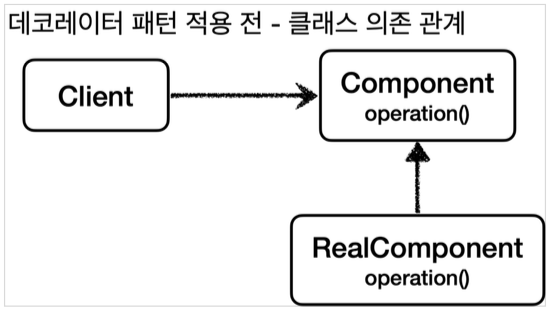
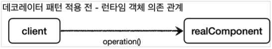
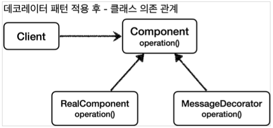
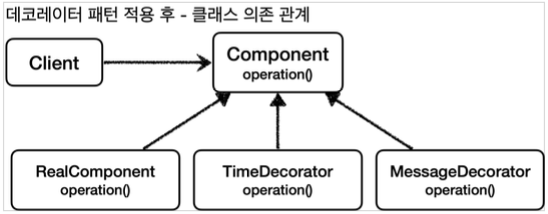
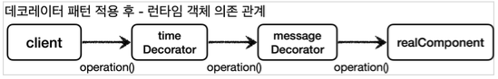
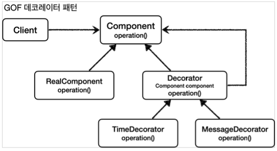

이번 장에서는 [이전 장(링크)](https://imprint.tistory.com/284) 에 알아본 `프록시 패턴`에 이어 **데코레이터 패턴** 에 대해서 알아본다.  
모든 코드는 [깃허브(링크)](https://github.com/roy-zz/spring) 에 올려두었다.

---

### 데코레이터 패턴

**데코레이터 패턴** 의 경우 프록시 패턴과 형태가 동일하다. 하지만 둘은 사용하는 의도(Intent)가 다르다는 차이가 있다.  
데코레이터 패턴은 런타임 환경에서 객체에 추가 책임을 동적으로 추가하고 싶은 경우에 사용하게 된다.  
  
데코레이터 패턴을 적용하기 전의 클래스 의존 관계를 보면 아래와 같다.  
`Client`는 인터페이스인 `Component`를 의존하고 있고 `RealComponent`는 `Component`를 구현하고 있다.  


  
런타임 환경에서는 `Client` 객체가 구현체인 `RealComponent`의 객체를 의존하게 된다.



---

### 데코레이터 패턴 적용 전

데코레이터 패턴이 적용하기 위해 패턴이 적용되지 않은 코드를 먼저 작성해본다.  
전체적인 흐름은 위에서 살펴본 그림과 동일하다.

```java
public interface Component {
    String operation();
}
```

```java
@Slf4j
public class RealComponent implements Component {
    @Override
    public String operation() {
        log.info("RealComponent operation 호출");
        return "Data";
    }
}
```

```java
@Slf4j
@RequiredArgsConstructor
public class DecoratorPatternClient {
    private final Component component;
    public void execute() {
        String result = component.operation();
        log.info("result = {}", result);
    }
}
```

`DecoratorPatternClient`는 자신이 생성될 때 자신이 사용하게 될 `Component`의 구현체를 주입받게 된다.

```java
@Slf4j
public class DecoratorPatternTest {
    @Test
    void notAppliedDecoratorTest() {
        Component realComponent = new RealComponent();
        DecoratorPatternClient client = new DecoratorPatternClient(realComponent);
        client.execute();
    }
}
```

테스트 코드에서는 `DecoratorPatternClient`에 단순히 `Component`의 구현체인 `RealComponent`의 객체를 주입하여 `execute` 메서드를 호출한다.  
출력되는 결과는 아래와 같다.

```
RealComponent operation 호출
result = Data
```

---

### 메시지 데코레이터 추가

프록시는 크게 접근 제어와 부가 기능을 추가하는 2가지 기능을 한다. 이전 장에서 살펴본 프록시 패턴은 캐싱을 통해서 진짜 객체에 대한 접근을 제어하였다.  
이번에는 데코레이터 패턴을 적용하여 기능을 추가하는 프록시를 만들어 보도록 한다.
  
메시지를 꾸며주는 데코레이터를 추가하게 되면 아래와 같은 클래스 관계도가 만들어진다.  
`MessageDecorator`는 진짜 객체가 구현하는 `Component` 인터페이스를 같이 구현하게 된다.


  
런타임 환경에서 객체의 의존 관계를 확인해보면 `Component`를 사용하는 `Client`는 진짜 객체인 `realComponent`를 직접적으로 참조하는 것이 아니라 `messageDecorator`를 통해서 참조하고 있는 것을 확인할 수 있다.
  

추가된 `MessageDocorator` 코드를 살펴보면 `Component`의 구현체를 필드에 가지고 있으며 자신이 생성되는 시점에 주입받게 된다.  
자신에게 주입된 `Component`의 결과물을 `operation` 메서드를 호출하여 가져오고 가져온 결과물을 꾸며주는 역할을 한다.

```java
@Slf4j
@RequiredArgsConstructor
public class MessageDecorator implements Component {
    private final Component component;
    @Override
    public String operation() {
        log.info("MessageDecorator operation 호출");
        String result = component.operation();
        String decoratedResult = "Decorated Result = " + result + "!!!";
        log.info("MessageDecorator 꾸미기 적용 전 = {}, 적용 후 = {}", result, decoratedResult);
        return decoratedResult;
    }
}
```

`MessageDecorator`를 사용하는 코드는 아래와 같다.  
진짜 구현체인 `realComponent`를 생성하고 데코레이터 구현체인 `messageDecorator`를 생성할 때 주입해준다.  
생성된 `messageDecorator` 객체를 이를 사용하는 클라이언트를 생성할 때 주입해준다.

```java
@Slf4j
public class DecoratorPatternTest {
    @Test
    void messageDecoratorApplyTest() {
        Component realComponent = new RealComponent();
        Component messageDecorator = new MessageDecorator(realComponent);
        DecoratorPatternClient client = new DecoratorPatternClient(messageDecorator);
        client.execute();
    }
}
```

출력된 결과는 아래와 같으며 중간에서 `messageDecorator`가 메시지를 변경한 것을 확인할 수 있다.

```
MessageDecorator - MessageDecorator operation 호출
RealComponent - RealComponent operation 호출
MessageDecorator - MessageDecorator 꾸미기 적용 전 = Data, 적용 후 = Decorated Result = Data!!!
DecoratorPatternClient - result = Decorated Result = Data!!!
```

---

### 실행 시간 측정 데코레이터 추가

이번에는 메시지를 변경해주는 데코레이터와 함께 메서드가 실행된 시간을 출력해주는 데코레이터를 추가해본다.
  
새로 추가하는 `TimeDecorator` 클래스 또한 진짜 클래스가 구현하고 있는 `Component` 인터페이스를 구현하고 있다.


  
런타임 시점에 클라이언트는 `TimeDecorator` 객체를 통해서 `MessageDecorator`와 `RealComponent`에 접근하게 된다.  


  
추가된 `TimeDecorator`는 생성되는 시점에 `Component`의 구현체를 주입받는다.  
`operation` 메서드가 호출되면 자신에게 주입된 `Component` 구현체의 `operation` 메서드를 호출하고 처리에 소요된 시간을 출력한다.

```java
@Slf4j
@RequiredArgsConstructor
public class TimeDecorator implements Component {
    private final Component component;
    @Override
    public String operation() {
        log.info("TimeDecorator operation 호출");
        long startTime = System.currentTimeMillis();

        String result = component.operation();

        long endTime = System.currentTimeMillis();
        log.info("TimeDecorator operation 종료");
        log.info("소요 시간 = {}ms", endTime - startTime);
        return result;
    }
}
```

이를 사용하는 클라이언트 코드를 살펴보면 아래와 같다.  

```java
@Slf4j
public class DecoratorPatternTest {
    @Test
    void timeDecoratorApplyTest() {
        Component realComponent = new RealComponent();
        Component messageDecorator = new MessageDecorator(realComponent);
        Component timeDecorator = new TimeDecorator(messageDecorator);
        DecoratorPatternClient client = new DecoratorPatternClient(timeDecorator);
        client.execute();
    }
}
```

출력되는 결과는 아래와 같으며 소요된 시간이 출력되는 것을 확인할 수 있다.

```
TimeDecorator - TimeDecorator operation 호출
MessageDecorator - MessageDecorator operation 호출
RealComponent - RealComponent operation 호출
MessageDecorator - MessageDecorator 꾸미기 적용 전 = Data, 적용 후 = Decorated Result = Data!!!
TimeDecorator - TimeDecorator operation 종료
TimeDecorator - 소요 시간 = 9ms
DecoratorPatternClient - result = Decorated Result = Data!!!
```

---

### 정리

지금까지 살펴본 프록시 패턴과 데코레이터 패턴을 정리해 본다.
`GoF` 패턴에서는 데코레이터 패턴을 아래와 같은 그림으로 나타내고 있다.



`Decorator`는 혼자서는 존재할 수 없으며 자신이 꾸며주어야 하는 실제 객체가 필요하다.  
실제 객체의 결과를 꾸미기 위해서 실제 객체가 구현한 `operation()` 메서드를 직접 호출하여 결과물을 가져온 후에 꾸미는 작업을 진행하게 된다.  
모든 `Decorator`들이 `Component`를 주입받는 코드가 중복되기 때문에 위의 그림에서 `Decorator`를 인터페이스가 아니라 추상 클래스로 구현하여 코드의 중복을 줄일 수 있다.  
  
지금까지 프록시 패턴과 데코레이터 패턴을 살펴보았는데 사실 두개의 패턴은 동일한 형태를 하고 있다.  
그렇기 때문에 우리는 두개의 패턴을 사용할 때 구현되는 형태를 보고 결정하는 것이 아니라 **어떠한 의도(Intent)로 사용**할 것인지 결정하고 선택해야 한다.  
디자인 패턴은 구현하는 개발자에 따라서 모습은 변경될 수 있지만 해당 패턴이 탄생한 의도(Intent)는 변경되지 않는다.  
예를 들어 우리가 `Redis`를 사용할 때 사용하는 개발자에 따라 `Key-Value`의 형태가 변경될 수는 있지만 `Redis`의 탄생 의도인 `캐싱`이라는 목적은 변경되지 않는다.  

프록시 패턴은 진짜 객체에 대한 **접근을 제어**하기 위해 사용되고 데코레이터 패턴은 진짜 객체에 **책임을 추가**하기 위해 사용된다.  
각각의 상황에 맞게 필요한 패턴을 선택하여 사용하면 된다.

---

**참고한 자료**:

- https://www.inflearn.com/course/%EC%8A%A4%ED%94%84%EB%A7%81-%ED%95%B5%EC%8B%AC-%EC%9B%90%EB%A6%AC-%EA%B3%A0%EA%B8%89%ED%8E%B8
- https://www.inflearn.com/course/%EC%8A%A4%ED%94%84%EB%A7%81-%ED%95%B5%EC%8B%AC-%EC%9B%90%EB%A6%AC-%EA%B8%B0%EB%B3%B8%ED%8E%B8
- https://www.inflearn.com/course/%EC%8A%A4%ED%94%84%EB%A7%81-mvc-1
- https://www.inflearn.com/course/%EC%8A%A4%ED%94%84%EB%A7%81-mvc-2