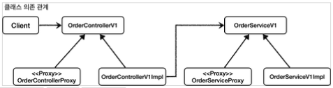
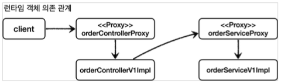
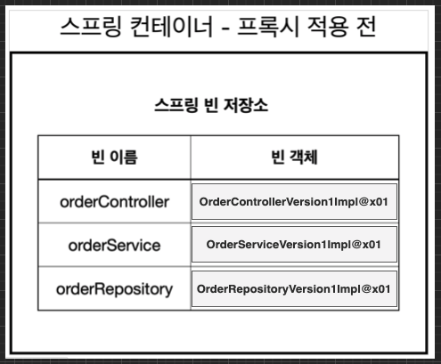
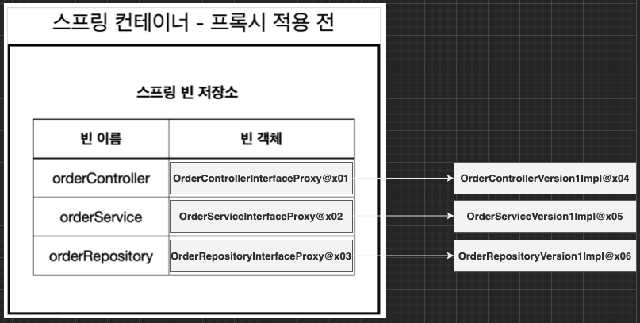

이번 장에서는 인터페이스 기반의 프록시를 생성하는 방법에 대해서 알아본다.
모든 코드는 [깃허브(링크)](https://github.com/roy-zz/spring) 에 올려두었다.

---

### 프록시 적용 전 & 적용 후 비교

프록시를 적용하기 전의 클래스 의존 관계를 살펴보면 아래와 같다.  


  
클라이언트는 컨트롤러 인터페이스인 `OrderControllerV1`을 의존하고 있다.  
컨트롤러 구현체인 `OrderControllerV1Imple`은 서비스 인터페이스인 `OrderServiceV1`을 의존하고 있다.
  
런타임 시점에 객체들 간 의존 관계는 아래와 같다.


---

컨트롤러와 서비스에 인터페이스 기반의 프록시를 적용하면 아래와 같은 클래스 의존 관계가 형성된다.



컨트롤러 인터페이스를 구현하는 클래스가 기존 구현 클래스 한 개에서 프록시 구현체가 추가되었다. 서비스 인터페이스 또한 동일하다.  
클라이언트는 여전히 주문 컨트롤러 인터페이스인 `OrderControllerV1`을 의존하고 있다.
  
런타임 시점에 객체들 간의 의존 관계를 살펴보면 아래와 같다.
  

  
클라이언트는 주문 컨트롤러의 구현체가 아니라 프록시 객체인 `orderControllerProxy`를 의존하고 있고 `orderControllerProxy`가 실제 구현체인 `orderControllerV1Impl`을 의존하고 있다.  
`orderControllerV1Impl` 또한 서비스 구현체가 아닌 프록시 객체인 `orderServiceProxy`를 의존하고 있고 `orderServiceProxy`가 실제 구현체인 `orderServiceV1Impl`을 의존하고 있따.

---

### 적용

전체적인 그림을 살펴보았으니 이제 우리의 코드에 인터페이스 기반의 프록시를 적용시켜 본다.

컨트롤러, 서비스, 리포지토리 프록시의 코드는 형태와 동작 원리가 유사하다.  

```java
@RequiredArgsConstructor
public class OrderControllerInterfaceProxy implements OrderControllerVersion1 {
    private final OrderControllerVersion1 target;
    private final LogTrace logTrace;
    @Override
    public String request(String itemId) {
        TraceStatus status = null;
        try {
            status = logTrace.begin("Call OrderController.request()");
            String result = target.request(itemId);
            logTrace.end(status);
            return result;
        } catch (Exception exception) {
            logTrace.exception(status, exception);
            throw exception;
        }
    }
    @Override
    public String noLog() {
        return target.noLog();
    }
}
```

```java
@RequiredArgsConstructor
public class OrderServiceInterfaceProxy implements OrderServiceVersion1 {
    private final OrderServiceVersion1 target;
    private final LogTrace logTrace;
    @Override
    public void orderItem(String itemId) {
        TraceStatus status = null;
        try {
            status = logTrace.begin("Call OrderService.orderItem()");
            target.orderItem(itemId);
            logTrace.end(status);
        } catch (Exception exception) {
            logTrace.exception(status, exception);
            throw exception;
        }
    }
}
```

```java
@RequiredArgsConstructor
public class OrderRepositoryInterfaceProxy implements OrderRepositoryVersion1 {
    private final OrderRepositoryVersion1 target;
    private final LogTrace logTrace;
    @Override
    public void save(String itemId) {
        TraceStatus status = null;
        try {
            status = logTrace.begin("Call OrderRepository.save()");
            target.save(itemId);
            logTrace.end(status);
        } catch (Exception exception) {
            logTrace.exception(status, exception);
            throw exception;
        }
    }
}
```

더 이상 구현체에 로그를 출력하는 코드가 들어가지 않아도 된다.  
로그를 출력하기 위해 필요한 기능은 프록시 객체에서 대신 처리하고 실제 로직이 있는 구현체의 메서드를 호출한다.  
로그 출력과 구현체의 메서드를 호출하기 위해 생성 시점에 둘을 주입받아야 한다.
  
위에서 작성한 컨트롤러, 서비스, 리포지토리를 빈으로 등록하는 구성 정보를 담고 있는 클래스 파일이다.  
`LogTrace`의 객체도 빈으로 등록되어야 하기 때문에 추가로 등록하는 것을 확인할 수 있다.

```java
@Configuration
public class InterfaceBasedProxyConfig {
    @Bean
    public OrderControllerVersion1 orderController(LogTrace logTrace) {
        OrderControllerVersion1Impl controllerImpl = new OrderControllerVersion1Impl(orderService(logTrace));
        return new OrderControllerInterfaceProxy(controllerImpl, logTrace);
    }
    @Bean
    public OrderServiceVersion1 orderService(LogTrace logTrace) {
        OrderServiceVersion1Impl serviceImpl = new OrderServiceVersion1Impl(orderRepository(logTrace));
        return new OrderServiceInterfaceProxy(serviceImpl, logTrace);
    }
    @Bean
    public OrderRepositoryVersion1 orderRepository(LogTrace logTrace) {
        OrderRepositoryVersion1Impl repositoryImpl = new OrderRepositoryVersion1Impl();
        return new OrderRepositoryInterfaceProxy(repositoryImpl, logTrace);
    }
    @Bean
    public LogTrace logTrace() {
        return new ThreadLocalLogTrace();
    }
}
```

코드를 살펴보면 빈으로 등록되는 것은 실제 구현체가 아닌 실제 구현체와 로그를 출력하는 객체를 의존하고 있는 프록시 객체라는 것을 알 수 있다.  
  
구성 정보를 담고 있는 클래스 파일을 기반으로 빈이 등록될 수 있도록 메인 클래스에 `@Import` 애노테이션을 추가해야 한다.

```java
@Import(InterfaceBasedProxyConfig.class)
@SpringBootApplication(scanBasePackages = "com.roy.spring.myproxy.application")
public class MyProxyApplication {
    public static void main(String[] args) {
        SpringApplication.run(MyProxyApplication.class, args);
    }
}
```

이제 서비스를 재실행시켜서 로그를 확인해보면 우리가 원하는 결과가 출력되는 것을 확인할 수 있다.

---

### 스프링 컨테이너 상태

우리는 예제 코드를 작성하면서 스프링 빈으로 구현체가 아니라 프록시 객체를 등록하였다.  
스프링 컨테이너에 어떠한 형태로 저장되어 있는지 알아보도록 한다.

#### 프록시 적용 전

프록시를 적용하기 전에는 `orderController`라는 빈의 이름으로 `OrderControllerVersion1Impl` 구현체의 객체가 저장되어 클라이언트가 빈 객체를 요청하면 실제 구현체의 객체가 반환된다.



#### 프록시 적용 후

인터페이스 기반의 프록시가 적용되면 스프링 빈으로 구현체 대신 프록시 객체가 대신 등록되어 사용된다.  
예를 들어 클라이언트가 `orderController`를 요청하면 구현체가 아니라 `OrderControllerInterfaceProxy`의 객체가 반환되어 사용되고 프록시에 의해 실제 구현체의 메서드가 호출된다.  
여기서 중요한 점은 프록시 객체는 스프링 컨테이너에 의해 관리되지만 실제 구현체는 빈으로 등록되지 않았기 때문에 스프링 컨테이너에 의해 관리되지 않는다는 점이다.  
물론 프록시 객체가 생성되는 시점에 하나의 인스턴스만 생성되어 주입되기 때문에 요청시마다 새로운 객체가 생성되지는 않는다.



---

인터페이스 기반의 프록시와 `Dependency Injection`을 통해서 기존 구현 클래스의 코드를 수정하지 않고 로그를 출력하는 기능을 사용할 수 있게 되었다.  
다음 장에서는 인터페이스를 사용하지 않는 구현 클래스에 프록시를 적용하는 방법에 대해서 알아본다. 

---

**참고한 자료**:

- https://www.inflearn.com/course/%EC%8A%A4%ED%94%84%EB%A7%81-%ED%95%B5%EC%8B%AC-%EC%9B%90%EB%A6%AC-%EA%B3%A0%EA%B8%89%ED%8E%B8
- https://www.inflearn.com/course/%EC%8A%A4%ED%94%84%EB%A7%81-%ED%95%B5%EC%8B%AC-%EC%9B%90%EB%A6%AC-%EA%B8%B0%EB%B3%B8%ED%8E%B8
- https://www.inflearn.com/course/%EC%8A%A4%ED%94%84%EB%A7%81-mvc-1
- https://www.inflearn.com/course/%EC%8A%A4%ED%94%84%EB%A7%81-mvc-2