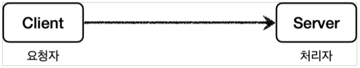

이번 장에서는 스프링의 프록시와 프록시 패턴에 대해서 알아본다.
모든 코드는 [깃허브(링크)](https://github.com/roy-zz/spring) 에 올려두었다.

---

### 프록시

우리는 지금까지 주로직과 부로직을 분리하기 위해 `템플릿 메서드 패턴`, `전략 패턴`, `템플릿 콜백 패턴`을 사용하였다.  
이런 디자인 패턴들을 적용하여도 부로직을 적용하기 위해서 주로직이 변경되어야 한다는 문제점은 해결하지 못하였다.  
결국 주로직이 있는 원본 코드를 전혀 수정하지 않고 부로직을 적용시키기 위해서는 **프록시(Proxy)** 라는 기술을 적용해야 한다.
  
클라이언트(Client)와 서버(Server)는 일반적으로 PC와 서버로 구분되지만 실제로는 더 넓게 사용되고 있다.  
우리가 잘알고 있는 게임을 예로 들면 게임을 작동시키는 PC가 클라이언트가 되고 게임을 중개하는 서버가 서버가 된다.  
개발자 입장에서 살펴보면 우리팀에서 만든 API를 다른 팀의 서버에서 사용한다면 우리팀의 서버가 클라이언트-서버 관계에서 서버가 되고 다른 팀의 서버는 클라이언트가 된다.  
결국 클라이언트-서버 관계는 요청자(Client)-처리자(Server) 관계로 볼 수 있다.



클라이언트-서버 구조에서 클라이언트는 원하는 결과를 위해서 서버를 호출해서 원하는 결과를 받는다.  
직접 요청하는 것이 아니라 중간에 대신 요청해주는 **프록시(Proxy)** 를 두어 대신 요청하도록 할 수 있다.
  

  
객체 세상에서 프록시 개념을 사용하기 위해서는 클라이언트를 속여야 한다.  
이말은 클라이언트가 자기 자신이 프록시 객체에 요청을 하는 것인지 실제 객체에게 요청하는지 몰라야 한다는 것이다.  
즉, 클라이언트는 실제 객체를 참조하여 개발을 진행하고 중간에 객체가 프록시 객체로 변경되어도 문제가 발생하지 않아야 한다는 것이다.


  
프록시를 도입하지 않는다면 런타임 시점의 객체의 의존 관계는 아래와 같다.
  

  
`클라이언트-서버` 관계 중간에 프록시 객체를 두어 `클라이언트-프록시-서버` 관계로 객체 의존관계를 변경하면 객체 의존 관계는 아래와 같다.
다시 강조하지만 중요한 점은 중간에 프록시 객체가 주입되더라도 클라이언트 코드는 변경되지 않아야 하며 이러한 사실 조차 몰라야 한다.
  
중간에 프록시가 추가되면 아래와 같은 기능들을 추가할 수 있다.

- 접근 제어
  - 권한에 따른 접근 차단
  - 캐싱
  - 지연 로딩
- 부가 기능 추가
  - 기존의 서버가 제공하지 않는 부가 기능을 추가할 수 있다.
  - 요청, 응답 데이터를 중간에서 변경할 수 있다.
  - 중간에서 요청 로그를 남길 수 있다.

#### 프록시 패턴

`GoF 디자인 패턴`에 의하면 `프록시 패턴`과 `데코레이터 패턴`은 둘 다 프록시를 사용하는 패턴이지만 둘의 의도(Intent)에 따라서 구분된다고 한다.  
**프록시 패턴은 원본 객체에 대한 접근 제어**가 목적이며 **데코레이터 패턴은 원본 객체에 새로운 기능을 추가**하는 목적을 가지고 있다.  
  
사실 객체 관계도를 보면 모습이 유사한 디자인 패턴들이 많이 존재한다.  
유사한 모습을 하고 있지만 패턴마다 의도(Intent)가 다르기 때문에 어떤 의도로 탄생된 패턴인지 파악할 필요가 있다.

---

### 프록시 패턴 예제

프록시 패턴을 서비스에 적용하기 이전에 간단하게 구현하는 방법에 대해서 알아본다.  
`GoF 디자인 패턴`과 맞추어 클래스의 이름은 아래와 같이 정한다.

- Client: 클라이언트 클래스
- Subject: `Proxy`, `RealSubject` 클래스가 구현하고 있는 인터페이스
- Proxy: `RealSubject`의 프록시 클래스
- RealSubject: 원본 클래스

#### Subject

`RealSubject` 클래스와 `Proxy` 클래스가 구현해야 하는 인터페이스를 정의한다.

```java
public interface Subject {
    String operation();
}
```

#### RealSubject

프록시 객체가 적용될 실제 객체를 위한 클래스를 정의한다.  
단순히 "Data"라는 문자열을 반환하며 작업을 완료하는데 1초가 소요된다.

```java
@Slf4j
public class RealSubject implements Subject {
    @Override
    public String operation() {
        log.info("실제 객체 호출");
        sleep(1000);
        return "Data";
    }
    private void sleep(int millis) {
        try {
            Thread.sleep(millis);
        } catch (InterruptedException exception) {
            exception.printStackTrace();
        }
    }
}
```

#### ProxyPatternClient

`Subject` 객체를 사용하는 클라이언트로 필드값으로 `Subject` 객체를 가지고 있으며 `execute`가 호출되면 `subject`객체의 `operation()` 메서드를 호출한다.

```java
@AllArgsConstructor
public class ProxyPatternClient {
    private Subject subject;
    public void execute() {
        subject.operation();
    }
}
```

#### 테스트 코드

위에서 작성한 `RealSubject`, `Subject`, `ProxyPatternClient`를 적용한 테스트 코드는 아래와 같으며 아직 프록시 객체가 적용되지 않았기 때문에 실제 객체가 사용되는 것을 확인할 수 있다.

```java
public class ProxyPatternTest {
    @Test
    void noProxyTest() {
        RealSubject realSubject = new RealSubject();
        ProxyPatternClient client = new ProxyPatternClient(realSubject);
        client.execute();
        client.execute();
        client.execute();
    }
}
```

프록시 패턴이 적용되기 전의 `클래스 의존 관계`와 `런타임 환경에서의 객체 의존 관계`는 아래와 같다.


---

지금부터 프록시 객체를 추가하여 아래의 그림과 같은 의존 관계를 만들어본다. 중요한 점은 기존의 코드를 전혀 수정하지 않는다는 점이다.


#### CacheProxy

캐시 역할을 하며 캐싱된 데이터가 있는 경우 원본 객체에게 요청하지 않고 자신이 캐싱하고 있는 데이터를 반환하는 객체를 생성하는 클래스를 생성한다.

```java
@Slf4j
@RequiredArgsConstructor
public class CacheProxy implements Subject {
    private final Subject target;
    private String cachedValue;
    @Override
    public String operation() {
        log.info("프록시 객체 호출");
        if (Objects.isNull(cachedValue)) {
            cachedValue = target.operation();
        }
        return cachedValue;
    }
}
```

중간에 프록시를 주입하는 코드는 아래와 같다.  
주입하는 부분의 코드는 변경되었지만 중요한 점은 클라이언트인 `ProxyPatternClient`의 코드가 변경되지 않았다는 점이다.

```java
public class ProxyPatternTest {
    @Test
    void proxyTest() {
        Subject realSubject = new RealSubject();
        Subject cacheProxy = new CacheProxy(realSubject);
        ProxyPatternClient client = new ProxyPatternClient(cacheProxy);
        client.execute();
        client.execute();
        client.execute();
    }
}
```

출력되는 결과는 아래와 같다.

```
15:35:31.098 [main] INFO com.roy.spring.myproxy.proxy.code.CacheProxy - 프록시 객체 호출
15:35:31.100 [main] INFO com.roy.spring.myproxy.proxy.code.RealSubject - 실제 객체 호출
15:35:32.100 [main] INFO com.roy.spring.myproxy.proxy.code.CacheProxy - 프록시 객체 호출
15:35:32.100 [main] INFO com.roy.spring.myproxy.proxy.code.CacheProxy - 프록시 객체 호출
```

중간에 결과를 캐싱하는 프록시 객체가 있기 때문에 최초에만 실제 객체에게 요청을 하고 이후부터는 프록시 객체에 캐싱한 데이터를 반환한다.  
그 결과 기존에 3초 이상 걸리던 요청이 1초대에 처리된 것을 확인할 수 있다.  
처리 시간이 줄어든 것보다 프록시 객체가 도입되면서 실제 객체에 접근하는 것을 프록시 객체가 관리한다는 점이 중요한 부분이다.  
그리고 이러한 사실을 클라이언트인 `ProxyPatternClient`는 알지 못한다.

---

### 참고 

- `@Controller` 또는 `@RequestMapping` 애노테이션이 있으면 스프링이 핸들러(컨트롤러)로 인식한다.  
  핸들러로 인식되어야 URL이 매핑되며 해당 애노테이션들은 인터페이스에 사용해도 정상 작동한다.
  
- `@RequestParam`를 클래스에서 사용하는 경우 변수명을 생략해도 정상 작동하지만 인터페이스에서 사용하는 경우 자바 버전에 따라서 인식자히 못할 수도 있다.

---

**참고한 자료**:

- https://www.inflearn.com/course/%EC%8A%A4%ED%94%84%EB%A7%81-%ED%95%B5%EC%8B%AC-%EC%9B%90%EB%A6%AC-%EA%B3%A0%EA%B8%89%ED%8E%B8
- https://www.inflearn.com/course/%EC%8A%A4%ED%94%84%EB%A7%81-%ED%95%B5%EC%8B%AC-%EC%9B%90%EB%A6%AC-%EA%B8%B0%EB%B3%B8%ED%8E%B8
- https://www.inflearn.com/course/%EC%8A%A4%ED%94%84%EB%A7%81-mvc-1
- https://www.inflearn.com/course/%EC%8A%A4%ED%94%84%EB%A7%81-mvc-2