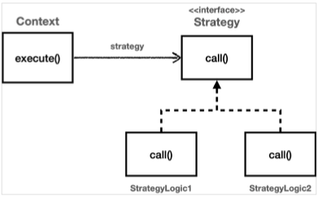
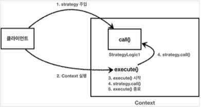

[이전 장(링크)](https://imprint.tistory.com/281) 에서 살펴본 `템플릿 메서드 패턴`에 이어 `전략 패턴`에 대해서 알아본다.
모든 코드는 [깃허브(링크)](https://github.com/roy-zz/spring) 에 올려두었다.

---

### 전략 패턴(Strategy Pattern)

템플릿 메서드 패턴에서는 상위 클래스에 변화지 않는 기능(템플릿)을 만들고 자주 변하는 부로직은 하위 클래스에 만들고 상속을 사용하였다.  
상속을 활용한 패턴이기 때문에 상속이 가지고 있는 단점을 그대로 가지게 되었다.  
전략 패턴은 변하지 않는 부분을 `Context`라는 곳에 두고, 변하는 부분을 `Strategy`라는 인터페이스를 만들고 이를 구현한 구현체에게 위임하는 방식이다.  
`Context`는 자주 변하지 않는 주로직(템플릿) 역할을 하고, `Strategy`는 자주 변하는 주로직(서비스 로직) 역할을 한다.
  
> 알고리즘 제품군을 정의하고 각각을 캡슐화하여 상호 교환 가능하게 만든다.  
> 전략을 사용하면 알고리즘을 사용하는 클라이언와 독립적으로 알고리즘을 변경할 수 있다.
  


---

### 전략 패턴 예제

예제를 통해서 전략 패턴이 어떠한 방식으로 구현되는지 알아보도록 한다.

#### StrategyLogic

자주 변하는 주로직(서비스 로직)을 담을 인터페이스와 이를 구현한 클래스를 생성한다.

**StrategyLogic**

```java
public interface StrategyLogic {
    void call();
}
```

**StrategyLogic1, StrategyLogic2**

```java
@Slf4j
public class StrategyLogic1 implements StrategyLogic {
    @Override
    public void call() {
        log.info("==== 서비스 로직 1 시작");
        log.info("==== 서비스 로직 1 작업");
        log.info("==== 서비스 로직 1 종료");
    }
}
@Slf4j
public class StrategyLogic2 implements StrategyLogic {
    @Override
    public void call() {
        log.info("==== 서비스 로직 2 시작");
        log.info("==== 서비스 로직 2 작업");
        log.info("==== 서비스 로직 2 종료");
    }
}
```

#### Context

자주 변하지 않는 부로직을 가지고 있으며 템플릿 역할을 하는 `Context` 클래스를 생성한다.  
전략 패턴은 이러한 역할을 Context(문맥)라고 한다. 변경이 드문 `Context`에서 `Strategy`를 통해 일부 전략이 변경되는 구조다.  
  
```java
@Slf4j
@AllArgsConstructor
public class ContextVersion1 {
    private StrategyLogic strategyLogic;

    public void execute() {
        long startTime = System.currentTimeMillis();
        strategyLogic.call();
        long endTime = System.currentTimeMillis();
        log.info("spent = {}", endTime - startTime);
    }
}
```

`Context` 내부에는 위에서 생성한 `StrategyLogic` 인터페이스를 필드값으로 가지고 있다.  
인터페이스를 의존하고 있기 때문에 구현체가 변경되어도 `Context` 클래스는 변경될 필요가 없으며 **스프링의 의존성 주입에서 사용되는 방식 또한 전략 패턴**이다. 

#### 전략 패턴 사용

전략 패턴으로 클래스 구조를 잡았다면 아래와 같은 방식으로 사용하면 된다.  
의존관계 주입을 통해서 `Context`에 `StrategyLogic`의 구현체인 `strategyLogic1`을 주입하였다.  
`Context`는 자신에게 주입된 구현체의 `execute()` 호출해서 `context`를 실행한다.

```java
public class ContextVersion1Test {
    @Test
    void strategyVersion1Test() {
        StrategyLogic strategyLogic1 = new StrategyLogic1();
        ContextVersion1 context1 = new ContextVersion1(strategyLogic1);
        context1.execute();
        StrategyLogic strategyLogic2 = new StrategyLogic2();
        ContextVersion1 context2 = new ContextVersion1(strategyLogic2);
        context2.execute();
    }
}
```



---


---

**참고한 자료**:

- https://www.inflearn.com/course/%EC%8A%A4%ED%94%84%EB%A7%81-%ED%95%B5%EC%8B%AC-%EC%9B%90%EB%A6%AC-%EA%B3%A0%EA%B8%89%ED%8E%B8
- https://www.inflearn.com/course/%EC%8A%A4%ED%94%84%EB%A7%81-%ED%95%B5%EC%8B%AC-%EC%9B%90%EB%A6%AC-%EA%B8%B0%EB%B3%B8%ED%8E%B8
- https://www.inflearn.com/course/%EC%8A%A4%ED%94%84%EB%A7%81-mvc-1
- https://www.inflearn.com/course/%EC%8A%A4%ED%94%84%EB%A7%81-mvc-2