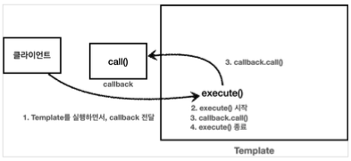

[이전 장(링크)]() 에서는 `전략 패턴`에 대해서 알아보았다.  
이번 장에서는 **템플릿 콜백 패턴**에 대해서 알아본다.  
모든 코드는 [깃허브(링크)](https://github.com/roy-zz/spring) 에 올려두었다.

---

### 콜백

이전 장에서 전략 패턴을 살펴보면서 마지막 부분에서 전략인 `Strategy`를 `Context`의 파라미터로 전달하여 실행되도록 하였다.  
이렇게 다른 코드의 파라미터로 넘기는 실행 가능한 코드를 콜백(callback)이라고 한다.
  
> 콜백 정의
> 프로그래밍에서 콜백(callback) 또는 콜애프터 함수(call-after function)는 다른 코드의 인수로서 넘겨주는 실행 가능한 코드를 말한다.  
> 콜백을 넘겨받는 코드는 이 콜백을 필요에 따라 즉시 실행할 수도 있고, 아니면 나중에 실행할 수도 있다.
<center>위키백과</center>
  
자바에서 실행 가능한 코드를 파라미터로 전달하려면 객체가 필요하다.  
하지만 자바8부터는 메소드를 하나만 가지고 있는 인터페이스의 경우 익명 내부 클래스나 람다 표현식을 사용하여 구현할 수 있다.

---

### 템플릿 콜백 패턴

전략 패턴에서 컴파일 시점에 조립되는 방식이 아니라 런타입 환경에서 동적으로 실행되야 하는 코드가 파라미터로 넘어가는 방식을 `템플릿 콜백 패턴`이라 한다.  
여기서 `Context`가 템플릿 역할을 하고 `Strategy`가 콜백 형태로 파라미터로 전달된다.  
`템플릿 콜백 패턴`은 GoF의 23가지 패턴에는 포함되지 않지만 스프링에서 자주 사용하는 방식이기 때문에 스프링에서는 `템플릿 콜백 패턴`으로 불린다. GoF 패턴이 친숙하지 않다면 필자가 정리한 [글](https://imprint.tistory.com/78) 을 참고하도록 한다.  
스프링에서 제공하는 `JdbcTemplate`, `RestTemplate`등은 이름에서 알 수 있듯이 템플릿 콜백 패턴이 사용된 객체들이다.
  
템플릿 콜백 패턴의 경우 아래와 같은 흐름으로 요청을 처리한다.


  
#### 템플릿 콜백 패턴 예시

템플릿 콜백 패턴의 사용법을 익히기 위해 간단하게 테스트 코드를 사용하여 템플릿 콜백 패턴을 사용해본다.

**Callback 인터페이스**

콜백 역할의 MyCallback 인터페이스를 생성한다.

```java
public interface MyCallback {
    void call();
}
```

**TimeLogTemplate**

시간 출력을 위한 템플릿 클래스를 생성한다.

```java
@Slf4j
public class TimeLogTemplate {
    public void execute(MyCallback callback) {
        long startTime = System.currentTimeMillis();
        callback.call();
        long endTime = System.currentTimeMillis();
        log.info("spent = {}ms", endTime - startTime);
    }
}
```

템플릿 콜백 패턴을 사용하는 방법은 아래와 같다.

```java
@Slf4j
public class TemplateCallbackTest {
    @Test
    void callbackAnonymousClazz() {
        TimeLogTemplate template = new TimeLogTemplate();
        template.execute(new MyCallback() {
            @Override
            public void call() {
                log.info("==== 서비스 로직 1 시작");
                log.info("==== 서비스 로직 1 작업");
                log.info("==== 서비스 로직 1 종료");
            }
        });
        template.execute(new MyCallback() {
            @Override
            public void call() {
                log.info("==== 서비스 로직 2 시작");
                log.info("==== 서비스 로직 2 작업");
                log.info("==== 서비스 로직 2 종료");
            }
        });
    }
    @Test
    void callbackLambdaExpression() {
        TimeLogTemplate template = new TimeLogTemplate();
        template.execute(() -> {
            log.info("==== 서비스 로직 1 시작");
            log.info("==== 서비스 로직 1 작업");
            log.info("==== 서비스 로직 1 종료");
        });
        template.execute(() -> {
            log.info("==== 서비스 로직 2 시작");
            log.info("==== 서비스 로직 2 작업");
            log.info("==== 서비스 로직 2 종료");
        });
    }
}
```

---

#### 템플릿 콜백 패턴 적용

템플릿 콜백 패턴을 우리가 만든 코드에 직접 적용해본다.

**Controller**
  
```java
@RestController
public class OrderController {
    private final OrderService orderService;
    private final TraceTemplate template;
    public OrderController(OrderService orderService, LogTrace trace) {
        this.orderService = orderService;
        this.template = new TraceTemplate(trace);
    }
    @GetMapping("/v5/request")
    public String request(String itemId) {
        return template.execute("OrderController.request()", () -> {
            orderService.orderItem(itemId);
            return "OK";
        });
    }
}
```
  
**Service**
  
```java
@Service
public class OrderService {
    private final OrderRepository orderRepository;
    private final TraceTemplate template;
    public OrderService(OrderRepository orderRepository, LogTrace trace) {
        this.orderRepository = orderRepository;
        this.template = new TraceTemplate(trace);
    }
    public void orderItem(String itemId) {
        template.execute("OrderService.request()", () -> {
            orderRepository.save(itemId);
            return null;
        });
    }
}
```
  
**Repository**
  
```java
@Repository
public class OrderRepository {
    private final TraceTemplate template;
    public OrderRepository(LogTrace trace) {
        this.template = new TraceTemplate(trace);
    }
    public void save(String itemId) {
        template.execute("OrderRepository.save()", () -> {
           if (itemId.equals("exception")) {
               throw new IllegalStateException("예외 발생");
           }
           sleep(1000);
           return null;
        });
    }
    private void sleep(int millis) {
        try {
            Thread.sleep(millis);
        } catch (InterruptedException exception) {
            exception.printStackTrace();
        }
    }
}
```

---

지금까지 `템플릿 메서드 패턴`, `전략 패턴`, `템플릿 콜백 패턴`을 적용하면서 주로직과 부로직을 분리하기 위해서 노력하였다.  
하지만 아직도 로그 출력과 같은 부로직을 적용하기 위해서 주로직이 수정되어야 하는 문제가 있다.  
다음 장부터는 이러한 문제를 해결하기 위해 **프록시**에 대해서 알아본다.

---

**참고한 자료**:

- https://www.inflearn.com/course/%EC%8A%A4%ED%94%84%EB%A7%81-%ED%95%B5%EC%8B%AC-%EC%9B%90%EB%A6%AC-%EA%B3%A0%EA%B8%89%ED%8E%B8
- https://www.inflearn.com/course/%EC%8A%A4%ED%94%84%EB%A7%81-%ED%95%B5%EC%8B%AC-%EC%9B%90%EB%A6%AC-%EA%B8%B0%EB%B3%B8%ED%8E%B8
- https://www.inflearn.com/course/%EC%8A%A4%ED%94%84%EB%A7%81-mvc-1
- https://www.inflearn.com/course/%EC%8A%A4%ED%94%84%EB%A7%81-mvc-2