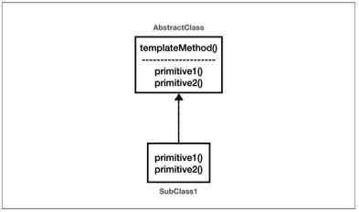
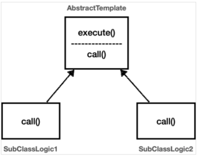
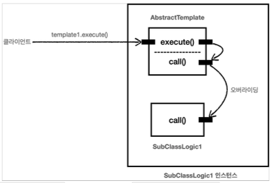

이번 장부터는 `템플릿 메서드 패턴`을 시작으로 스프링이 많이 사용하거나 스프링을 사용하면서 많이 사용하게 되는 디자인 패턴에 대해서 알아본다.  
모든 코드는 [깃허브(링크)](https://github.com/roy-zz/spring) 에 올려두었다.

---

### 정의

> 템플릿 메서드 패턴의 목적은 다음과 같다.
> 작업에서 알고리즘의 골격을 정의하고 일부 단계를 하위 클래스로 연기한다. 템플릿 메서드를 사용하면 하위 클래스가 알고리즘의 구조를 변경하지 않고도 알고리즘의 특정 단계를 재정의할 수 있다.



상위 클래스에서 자주 변경되지 않는 `템플릿`을 정의하고 자주 변경되는 로직은 하위 클래스에서 정의하는 것이다.  
이러한 방식으로 설계하면 하위 클래스가 전체 구조를 변경하지 않고, 필요한 특정 부분만 재정의할 수 있다.  
상속과 오버라이딩을 통한 다형성을 활용한 디자인 패턴이다.
  
#### 좋은 설계

일반적으로 좋은 설계를 위해서는 `주로직(서비스로직, 자주 변경되는 것)`과 `부로직(공통로직, 자주 변경되지 않는 것)`을 분리해야 한다.  
여기서 **주로직**은 `주문 서비스`라면 주문을 위한 서비스 로직을 말하고 `주문 리포지토리`라면 주문 정보를 저장 및 조회하는 기능을 의미한다.  
이러한 주로직 이외에 로그를 남기는 기능과 요청 처리 시간을 기록하는 기능등 서비스 로직을 보조하는 기능들을 **부로직**이라고 한다.  
이전에 만들었던 코드를 살펴보면 아래와 같이 주로직과 부로직이 분리되지않고 하나로 합쳐져있는 것을 확인할 수 있다.

```java
TraceStatus status = null;
try {
    status = trace.begin("message"); 
    // 주로직
    trace.end(status);
} catch (Exception e) {
    trace.exception(status, e);
    throw e; 
}
``` 
  
하나로 합쳐져있는 주로직과 부로직을 분리하여 모듈화하는 패턴이 **템플릿 메서드(Template Method Pattern)** 이다.

---

### 연습

이전에 작성한 코드를 수정하기 전에 템플릿 메서드 패턴을 연습하는 시간을 가져본다.  
아래의 코드를 살펴보면 시간을 측정하는 부로직과 주로직으로 분리되어 있고 `serviceLogic1`과 `serviceLogic2`는 소요 시간을 출력하는 부로직이 중복되어 있다.
시간을 측정하는 부분은 추후에 변경될 가능성이 낮은 부분이며 서비스 로직은 추후에 변경될 가능성이 높은 부분이다.
  
```java
@Slf4j
public class TemplateMethodTest {
    @Test
    void templateMethod() {
        serviceLogic1();
        serviceLogic2();
    }
    private void serviceLogic1() {
        long startTime = System.currentTimeMillis();
        log.info("==== 서비스 로직 1 시작");
        log.info("==== 서비스 로직 1 작업");
        log.info("==== 서비스 로직 1 종료");
        long endTime = System.currentTimeMillis();
        log.info("spent = {}", endTime - startTime);
    }
    private void serviceLogic2() {
        long startTime = System.currentTimeMillis();
        log.info("==== 서비스 로직 2 시작");
        log.info("==== 서비스 로직 2 작업");
        log.info("==== 서비스 로직 2 종료");
        long endTime = System.currentTimeMillis();
        log.info("spent = {}", endTime - startTime);
    }
}
``` 

#### 연습 코드에 템플릿 메서드 패턴 적용



템플릿 메서드 패턴은 추상 클래스의 `call()`이라는 추상 메서드가 있고 하위 클래스에서 구현하도록 되어 있다.  
이후 `execute()` 메서드가 호출되는 경우 하위 클래스가 구현한 `call()`메서드를 호출하는 구조로 되어있다.  
  
위에서 살펴본 예제에 적용해보면 `execute()` 메서드에 변경되지 않는 소요시간을 측정하는 로직이 들어가게 되고 하위 클래스가 재정의하는 `call()` 메서드에 자주 변경되는 주로직이 포함된다.  
예제 코드에 템플릿 메서드 패턴을 적용하여 주로직과 부로직을 분리해본다.

**AbstractTemplate**

자주 변경되지 않는 부로직을 템플릿 형태로 구현하고 있는 `AbstractTemplate` 클래스를 생성한다.

```java
@Slf4j
public abstract class AbstractTemplate {
    public void execute() {
        long startTime = System.currentTimeMillis();
        call();
        long endTime = System.currentTimeMillis();
        log.info("spent = {}", endTime - startTime);
    }
    protected abstract void call();
}
```

**SubClassLogic1, SubClassLogic2**

`AbstractTemplate`클래스를 상속받고 있으며 자주 변하는 주로직을 구현하는 `SubClassLogic1`, `SubClassLogic2` 클래스를 생성한다.  
템플릿의 호출대상이 되는 메서드인 `call()`에 주로직을 구현하고 있다.

```java
@Slf4j
public class SubClassLogic1 extends AbstractTemplate {
    @Override
    protected void call() {
        log.info("==== 서비스 로직 1 시작");
        log.info("==== 서비스 로직 1 작업");
        log.info("==== 서비스 로직 1 종료");
    }
}
@Slf4j
public class SubClassLogic2 extends AbstractTemplate {
    @Override
    protected void call() {
        log.info("==== 서비스 로직 2 시작");
        log.info("==== 서비스 로직 2 작업");
        log.info("==== 서비스 로직 2 종료");
    }
}
```

**템플릿 메서드 패턴 사용**

템플릿 메서드 패턴이 적용되면 아래와 같이 구현체를 선택하여 원하는 주로직을 선택해서 실행시킬 수 있다.

```java
@Test
void applyTemplateMethodExampleTest() {
    AbstractTemplate template1 = new SubClassLogic1();
    template1.execute();
    AbstractTemplate template2 = new SubClassLogic2();
    template2.execute();
}
```

출력되는 결과는 아래와 같다.

```
[main] - ==== 서비스 로직 1 시작
[main] - ==== 서비스 로직 1 작업
[main] - ==== 서비스 로직 1 종료
[main] - spent = 3
[main] - ==== 서비스 로직 2 시작
[main] - ==== 서비스 로직 2 작업
[main] - ==== 서비스 로직 2 종료
[main] - spent = 0
```



#### 템플릿 메서드 패턴과 익명 클래스

바로 위에서 템플릿 메서드 패턴을 구현한 방식을 살펴보면 주로직 하나당 클래스가 하나씩 생성되어야 한다는 불편함이 있다.  
만약 재사용되어야 하는 코드가 아니라면 익명 클래스를 통해서 별도의 클래스 파일 생성없이 적용이 가능하다.
  
사용법은 아래와 같다.

```java
@Test
void templateMethodWithAnonymousClazzTest() {
    AbstractTemplate template1 = new AbstractTemplate() {
        @Override
        protected void call() {
            log.info("==== 서비스 로직 1 시작");
            log.info("==== 서비스 로직 1 작업");
            log.info("==== 서비스 로직 1 종료");
        }
    };
    AbstractTemplate template2 = new AbstractTemplate() {
        @Override
        protected void call() {
            log.info("==== 서비스 로직 2 시작");
            log.info("==== 서비스 로직 2 작업");
            log.info("==== 서비스 로직 2 종료");
        }
    };
    template1.execute();
    template2.execute();
}
```

---

### 템플릿 메서드 패턴 적용

이전에 만들었던 로그를 출력하는 기능에 템플릿 메서드 패턴을 적용해본다.

#### OrderController

```java
@RestController
@RequiredArgsConstructor
public class OrderController {
    private final OrderService orderService;
    private final LogTrace trace;
    @GetMapping("/v4/request")
    public String request(String itemId) {
        AbstractTemplate<String> template = new AbstractTemplate<>(trace) {
            @Override
            protected String call() {
                orderService.orderItem(itemId);
                return "OK";
            }
        };
        return template.execute("OrderController.request()");
    }
}
```

#### OrderService

```java
@Service
@RequiredArgsConstructor
public class OrderService {
    private final OrderRepository orderRepository;
    private final LogTrace trace;
    public void orderItem(String itemId) {
        AbstractTemplate<Void> template = new AbstractTemplate<>(trace) {
            @Override
            protected Void call() {
                orderRepository.save(itemId);
                return null;
            }
        };
        template.execute("OrderService.orderItem()");
    }
}
```

#### OrderRepository

```java
@Repository
@RequiredArgsConstructor
public class OrderRepository {
    private final LogTrace trace;
    public void save(String itemId) {
        AbstractTemplate<Void> template = new AbstractTemplate<>(trace) {
            @Override
            protected Void call() {
                if (itemId.equals("exception")) {
                    throw new IllegalStateException("예외 발생");
                }
                sleep(1000);
                return null;
            }
        };
        template.execute("OrderRepository.save()");
    }
    private void sleep(int millis) {
        try {
            Thread.sleep(millis);
        } catch (InterruptedException exception) {
            exception.printStackTrace();
        }
    }
}
```

좋은 설계는 코드의 **변경**이 일어날 때 자연스럽게 드러난다.  
위에서 수정한 것처럼 주로직을 하나의 모듈로 모듈화하고 비즈니스 로직도 하나의 모듈로 모듈화 하였다.  
이렇게 분리할 수 있는 부분을 분리하여 추후 수정이 필요한 경우 최소한의 변경으로 수정이 가능하도록 구현이 가능하다.

---

### 템플릿 메서드 패턴 단점

지금까지 템플릿 메서드 패턴을 적용하면서 상속을 통해서 구현된다는 사실을 알게 되었다.  
이 말은 템플릿 메서드 패턴의 경우 상속의 단점을 그대로 가져간다는 의미가 된다. 특히 상위 클래스와 하위 클래스가 강하게 결합되어 서로를 의존하게 된다.  
하지만 하위 클래스 입장에서는 필요한 메서드를 정의 하였을 뿐 상위 클래스의 기능을 사용하지 않았지만 패턴 적용을 위해서 상속을 받는 구조가 되었다.  
이렇게 상속으로 강하게 결합되어 있는 경우 상위 클래스가 변경되면 하위 클래스도 변경되어야 할 수도 있다.  
  
다음 장에서는 템플릿 메서드 패턴의 단점을 보완하는 전략 패턴(Strategy Pattern)에 대해서 알아본다.

---

**참고한 자료**:

- https://www.inflearn.com/course/%EC%8A%A4%ED%94%84%EB%A7%81-%ED%95%B5%EC%8B%AC-%EC%9B%90%EB%A6%AC-%EA%B3%A0%EA%B8%89%ED%8E%B8
- https://www.inflearn.com/course/%EC%8A%A4%ED%94%84%EB%A7%81-%ED%95%B5%EC%8B%AC-%EC%9B%90%EB%A6%AC-%EA%B8%B0%EB%B3%B8%ED%8E%B8
- https://www.inflearn.com/course/%EC%8A%A4%ED%94%84%EB%A7%81-mvc-1
- https://www.inflearn.com/course/%EC%8A%A4%ED%94%84%EB%A7%81-mvc-2