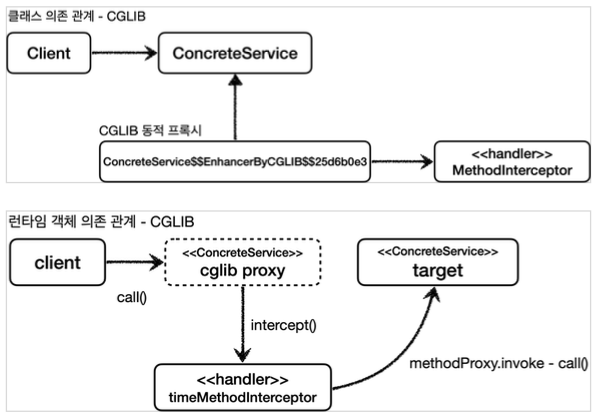

[이전 장(링크)](https://imprint.tistory.com/292) 에서는 JDK 동적 프록시를 우리의 서비스에 적용하는 방법에 대해서 알아보았다.  
이번 장에서는 인터페이스가 없는 경우에도 동적으로 프록시를 적용할 수 있는 **CGLIB**에 대해서 알아본다.  
모든 코드는 [깃허브(링크)](https://github.com/roy-zz/spring) 에 올려두었다.

---

### CGLIB (Code Generator Library)

`CGLIB`는 이름에서 알 수 있듯이 `JVM`에 적재되어 있는 바이트코드를 조작하여 동적으로 클래스를 생성하는 라이브러리다.  
`JDK 동적 프록시`와는 다르게 인터페이스가 없어도 구체 클래스만 가지고 동적 프록시를 만들어낼 수 있다.  
`CGLIB`의 경우 오픈소스 라이브러리이지만 스프링 내부에 포함되어 있기 때문에 스프링을 사용한다면 따로 의존성을 주입할 필요없이 사용할 수 있다.

---

### CGLIB 적용 전

`CGLIB`를 통해 동적 프록시가 적용되기 전 코드를 살펴본다.

```java
public interface ServiceInterface {
    void save();
    void find();
}

@Slf4j
public class ServiceImpl implements ServiceInterface {
    @Override
    public void save() {
        log.info("Call save()");
    }
    @Override
    public void find() {
        log.info("Call find()");
    }
}

@Slf4j
public class ConcreteService {
    public void call() {
        log.info("Call ConcreteService");
    }
}
```

`ConcreteService`는 인터페이스가 없는 구체 클래스다.  
`ServiceImpl`은 `ServiceInterface`라는 인터페이스를 구현한 클래스다.  
  
우리는 `ConcreteService`에 `CGLIB`를 통해 동적 프록시를 적용할 것이다.

---

### CGLIB 적용

JDK 동적 프록시는 로직을 작성하기 위해 `InvocationHandler` 인터페이스를 구현하는 클래스를 만들었었다.  
`CGLIB`는 `MethodInterceptor` 인터페이스의 구현체를 통해서 동적 프록시를 적용한다.

```java
public interface MethodInterceptor extends Callback {
    Object intercept(Object var1, Method var2, Object[] var3, MethodProxy var4) throws Throwable;
}
```

- `Object var1`: `CGLIB`가 적용된 객체를 의미한다.
- `Method var2`: 호출된 메서드를 의미한다.
- `Object[] var3`: 메서드를 호출하면서 전달된 파라미터를 의미한다.
- `MethodProxy var4`: 메서드를 호출하는 경우에 사용된다.

```java
@Slf4j
@RequiredArgsConstructor
public class TimeMethodInterceptor implements MethodInterceptor {
    private final Object target;
    @Override
    public Object intercept(Object o, Method method, Object[] args, MethodProxy methodProxy) throws Throwable {
        log.info("Call intercept()");
        long startTime = System.currentTimeMillis();

        Object result = methodProxy.invoke(target, args);

        long endTime = System.currentTimeMillis();
        log.info("End intercept(), spent time = {}", endTime - startTime);
        return result;
    }
}
```

`CGLIB`에서 지원하는 `MethodInterceptor`를 구현하여 동적으로 프록시를 생성하는 역할을 한다.  
생성될 때 주입받는 `Object`는 프록시 객체가 호출해야 하는 실제 객체이며 `invoke` 메서드를 통해 실제 대상을 동적으로 호출한다.  
파라미터에 `Method`, `MethodProxy`가 있으며 둘 다 사용이 가능하다. `CGLIB`에서는 성능상 이점을 위해서 `MethodProxy`를 사용할 것을 권장한다.
  
아래는 `CGLIB`를 통한 동적 프록시를 사용하는 테스트 코드다.

```java
@Slf4j
public class CglibTest {
    @Test
    void cglibTest() {
        ConcreteService target = new ConcreteService();
        Enhancer enhancer = new Enhancer();
        enhancer.setSuperclass(ConcreteService.class);
        enhancer.setCallback(new TimeMethodInterceptor(target));
        ConcreteService proxy = (ConcreteService) enhancer.create();
        log.info("target class = {}", target.getClass());
        log.info("proxy class = {}", proxy.getClass());
        proxy.call();
    }
}
```

위에서 작성한 `ConcreteService`는 인터페이스가 없는 구체 클래스다.  
`CGLIB`는 `Enhancer`를 사용해서 프록시를 생성하며 `setSuperclass(...)`를 통해서 구체 클래스를 상속받는 프록시 객체를 생성한다. 파라미터로는 상속받을 구체 클래스를 지정한다.  
`setCallback(...)` 메서드를 통해서 프록시에 적용할 로직을 지정하고 `create(...)` 메서드로 프록시 객체를 반환받는다.  
프록시 클래스는 `ConcreteService`의 하위 클래스이므로 `ConcreteService`로 다운캐스팅이 가능하다.
  
테스트 코드를 실행시키면 우리가 원하는 결과가 출력되는 것을 확인할 수 있다.

---

### 정리

`CGLIB`에 의해 생성된 프록시 객체를 살펴보면 아래와 같으며 `CGLIB` 객체인 것을 확인할 수 있다. 

```
com.roy.spring.myproxy.common.service.ConcreteService$$EnhancerByCGLIB$$bb27d159
```

`CGLIB`는 객체를 생성할 때 `대상클래스$$EnhancerByCGLIB$임의문자열`과 같은 규칙으로 생성한다.  
`CGLIB`를 통해 프록시 객체를 생성하는 경우에 클래스, 객체의 의존 관계는 아래의 그림과 같다.


  
하지만! `CGLIB`는 상속을 사용하기 때문에 상속의 단점을 전부 공유한다.  
부모 클래스의 생성자를 신경써야 하며 클래스와 메서드 레벨에 `final` 키워드를 사용할 수 있다.

---

이전 장에 이어 동적으로 프록시를 생성하는 기술인 `CGLIB`에 대해서 알아보았다.  
다음 장에서는 두 기술을 함께 사용할 수 있는 방법에 대해서 알아본다.

---

**참고한 자료**:

- https://www.inflearn.com/course/%EC%8A%A4%ED%94%84%EB%A7%81-%ED%95%B5%EC%8B%AC-%EC%9B%90%EB%A6%AC-%EA%B3%A0%EA%B8%89%ED%8E%B8
- https://www.inflearn.com/course/%EC%8A%A4%ED%94%84%EB%A7%81-%ED%95%B5%EC%8B%AC-%EC%9B%90%EB%A6%AC-%EA%B8%B0%EB%B3%B8%ED%8E%B8
- https://www.inflearn.com/course/%EC%8A%A4%ED%94%84%EB%A7%81-mvc-1
- https://www.inflearn.com/course/%EC%8A%A4%ED%94%84%EB%A7%81-mvc-2