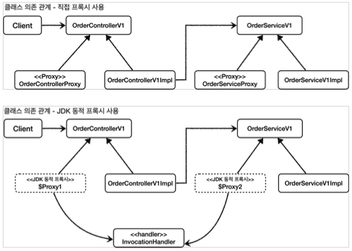
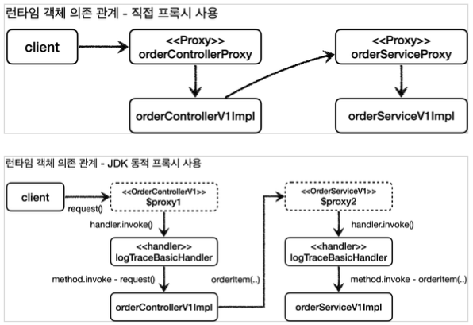

[이전 장(링크)](https://imprint.tistory.com/291) 에서는 테스트 코드로 JDK 동적 프록시를 적용하는 방법에 대해서 알아보았다.  
이번 장에서는 JDK 동적 프록시를 실제 서비스 코드에 적용하는 방법에 대해서 알아본다.  
모든 코드는 [깃허브(링크)](https://github.com/roy-zz/spring) 에 올려두었다.

---

### 서비스 코드 도입

`InvocationHandler` 인터페이스를 구현하고 있으며 `LogTrace`를 필드로 가지고 있는 `LogTraceBasicHandler` 클래스를 생성한다.  
해당 클래스는 `InvocationHandler`를 구현하였기 때문에 JDK 동적 프록시를 생성할 때 사용된다. 또 다른 필드인 `Object`는 프록시가 호출하는 대상 클래스다.  
`invoke(...)` 메서드에 파라미터로 전달되는 객체와 메서드가 동적으로 변하기 때문에 이를 출력하는 코드도 정적이지 않고 동적인 것을 확인할 수 있다.

```java
@RequiredArgsConstructor
public class LogTraceBasicHandler implements InvocationHandler {
    private final Object target;
    private final LogTrace logTrace;
    @Override
    public Object invoke(Object proxy, Method method, Object[] args) throws Throwable {
        TraceStatus status = null;
        try {
            String message = String.format("%s.%s()", method.getDeclaringClass().getSimpleName(), method.getName());
            status = logTrace.begin(message);

            Object result = method.invoke(target, args);

            logTrace.end(status);
            return result;
        } catch (Exception exception) {
            logTrace.exception(status, exception);
            throw exception;
        }
    }
}
```

JDK 동적 프록시를 빈으로 등록하는 구성 정보를 담고 있는 클래스를 생성한다.

```java
@Configuration
public class DynamicProxyBasicConfig {
    @Bean
    public OrderControllerVersion1 orderController(LogTrace logTrace) {
        OrderControllerVersion1 orderController = new OrderControllerVersion1Impl(orderService(logTrace));
        return (OrderControllerVersion1) Proxy.newProxyInstance(
                OrderControllerVersion1.class.getClassLoader(),
                new Class[]{OrderControllerVersion1.class},
                new LogTraceBasicHandler(orderController, logTrace));
    }
    @Bean
    public OrderServiceVersion1 orderService(LogTrace logTrace) {
        OrderServiceVersion1 orderService = new OrderServiceVersion1Impl(orderRepository(logTrace));
        return (OrderServiceVersion1) Proxy.newProxyInstance(
                OrderServiceVersion1.class.getClassLoader(),
                new Class[]{OrderServiceVersion1.class},
                new LogTraceBasicHandler(orderService, logTrace));
    }
    @Bean
    public OrderRepositoryVersion1 orderRepository(LogTrace logTrace) {
        OrderRepositoryVersion1 orderRepository = new OrderRepositoryVersion1Impl();
        return (OrderRepositoryVersion1) Proxy.newProxyInstance(
                OrderRepositoryVersion1.class.getClassLoader(),
                new Class[]{OrderRepositoryVersion1.class},
                new LogTraceBasicHandler(orderRepository, logTrace)
        );
    }
    @Bean
    public LogTrace logTrace() {
        return new ThreadLocalLogTrace();
    }
}
```

우리가 직접 프록시 클래스를 생성할 때와 코드의 양은 차이가 나지 않는다.  
하지만 프록시를 생성할 때 전달하는 파라미터만 변경되고 호출하는 메서드가 `newProxyInstnace(...)`로 동일하다는 큰 변화가 있다.  
또한 모든 프록시가 동일하게 `LogTraceBasicHandler`를 사용하고 있다.
  
우리가 위에서 생성한 구성 정보를 담은 클래스의 빈이 스프링 빈으로 등록되도록 메인 클래스에 `@Import` 애노테이션을 추가해야 한다.

```java
@Import(DynamicProxyBasicConfig.class)
@SpringBootApplication(scanBasePackages = "com.roy.spring.myproxy.application")
public class MyProxyApplication {
    public static void main(String[] args) {
        SpringApplication.run(MyProxyApplication.class, args);
    }
}
```

서버를 재실행시키고 출력되는 로그를 확인해보면 우리가 원하는 결과가 출력되는 것을 확인할 수 있다.
  
직접 프록시 클래스를 작성하여 사용할 때와 JDK 동적 프록시를 적용하였을 때의 클래스 의존 관계의 차이는 아래와 같다.


  
런타임의 객체 의존 관계도 아래와 같은 차이가 있다.



---

### 필터 적용

우리가 위에서 적용한 방식은 프록시가 적용된 컨트롤러, 서비스, 리포지토리의 모든 메서드에 적용된다.  
하지만 특정 메서드에만 적용하거나 특정 메서드는 적용하고 싶지 않을 수 있다. 이번에는 특정 기준으로 필터링하여 적용하는 방법에 대해서 알아본다.
  
`InvocationHandler`를 구현하고 있는 `LogTraceFilterHandler` 클래스를 생성한다.  
`LogTraceBasicHandler`와는 다르게 생성될 때 프록시가 적용될 패턴을 입력받는다.  
`invoke(..)` 메서드의 코드를 보면 필터를 통과하지 않으면 메시지를 출력하는 기능이 적용되지 않는 것을 확인할 수 있다.

```java
@RequiredArgsConstructor
public class LogTraceFilterHandler implements InvocationHandler {
    private final Object target;
    private final LogTrace logTrace;
    private final String[] patterns;

    @Override
    public Object invoke(Object proxy, Method method, Object[] args) throws Throwable {
        String methodName = method.getName();
        if (!PatternMatchUtils.simpleMatch(patterns, methodName)) {
            return method.invoke(target, args);
        }

        TraceStatus status = null;
        try {
            String message = String.format("%s.%s()", method.getDeclaringClass().getSimpleName(), method.getName());
            status = logTrace.begin(message);

            Object result = method.invoke(target, args);

            logTrace.end(status);
            return result;
        } catch (Exception exception) {
            logTrace.exception(status, exception);
            throw exception;
        }
    }
}
```

동적 프록시를 스프링 빈으로 등록하기 위한 `DynamicProxyFilterConfig` 클래스를 확인해보면 아래와 같다.  
다만 `LogTraceFilterHandler`를 사용할 때는 프록시가 적용될 메서드명의 규칙인 `PATTERNS`를 추가로 전달한다.

```java
@Configuration
public class DynamicProxyFilterConfig {
    public static final String[] PATTERNS = {"request*", "order*", "save*"};
    @Bean
    public OrderControllerVersion1 orderController(LogTrace logTrace) {
        OrderControllerVersion1 orderController = new OrderControllerVersion1Impl(orderService(logTrace));
        return (OrderControllerVersion1) Proxy.newProxyInstance(
                OrderControllerVersion1.class.getClassLoader(),
                new Class[]{OrderControllerVersion1.class},
                new LogTraceFilterHandler(orderController, logTrace, PATTERNS));
    }
    @Bean
    public OrderServiceVersion1 orderService(LogTrace logTrace) {
        OrderServiceVersion1 orderService = new OrderServiceVersion1Impl(orderRepository(logTrace));
        return (OrderServiceVersion1) Proxy.newProxyInstance(
                OrderServiceVersion1.class.getClassLoader(),
                new Class[]{OrderServiceVersion1.class},
                new LogTraceFilterHandler(orderService, logTrace, PATTERNS));
    }
    @Bean
    public OrderRepositoryVersion1 orderRepository(LogTrace logTrace) {
        OrderRepositoryVersion1 orderRepository = new OrderRepositoryVersion1Impl();
        return (OrderRepositoryVersion1) Proxy.newProxyInstance(
                OrderRepositoryVersion1.class.getClassLoader(),
                new Class[]{OrderRepositoryVersion1.class},
                new LogTraceFilterHandler(orderRepository, logTrace, PATTERNS));
    }
    @Bean
    public LogTrace logTrace() {
        return new ThreadLocalLogTrace();
    }
}
```

`LogTraceFilterHandler`가 스프링 빈으로 등록될 수 있도록 메인 클래스에 `@Import` 애노테이션을 추가해야 한다.

```java
@Import(DynamicProxyFilterConfig.class)
@SpringBootApplication(scanBasePackages = "com.roy.spring.myproxy.application")
public class MyProxyApplication {
    public static void main(String[] args) {
        SpringApplication.run(MyProxyApplication.class, args);
    }
}
```

애플리케이션을 재실행시키면 우리가 지정한 패턴이외의 메서드에는 로그가 출력되지 않는 것을 확인할 수 있다.

---

우리는 지금까지 애플리케이션에 **JDK 동적 프록시**를 적용시키는 방법에 대해서 알아보았다.  
다음 장에서는 인터페이스가 없는 경우에도 동적으로 프록시를 적용시키기 위한 기술인 **CGLIB**에 대해서 알아본다.

---

**참고한 자료**:

- https://www.inflearn.com/course/%EC%8A%A4%ED%94%84%EB%A7%81-%ED%95%B5%EC%8B%AC-%EC%9B%90%EB%A6%AC-%EA%B3%A0%EA%B8%89%ED%8E%B8
- https://www.inflearn.com/course/%EC%8A%A4%ED%94%84%EB%A7%81-%ED%95%B5%EC%8B%AC-%EC%9B%90%EB%A6%AC-%EA%B8%B0%EB%B3%B8%ED%8E%B8
- https://www.inflearn.com/course/%EC%8A%A4%ED%94%84%EB%A7%81-mvc-1
- https://www.inflearn.com/course/%EC%8A%A4%ED%94%84%EB%A7%81-mvc-2