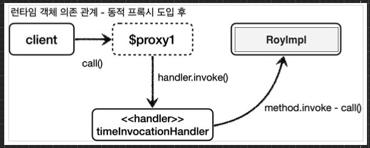
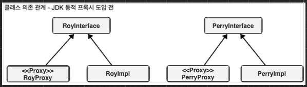
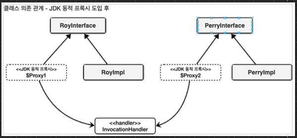

[이전 장(링크)](https://imprint.tistory.com/290) 에서는 JDK 동적 프록시를 이해하기 위한 선수 지식인 자바의 리플렉션에 대해서 알아보았다.  
이번 장에서는 JDK 동적 프록시는 무엇이며 어떻게 사용하는지에 대해서 알아보도록 한다.  
모든 코드는 [깃허브(링크)](https://github.com/roy-zz/spring) 에 올려두었다.

---

### 개요

우리는 직접 `인터페이스 기반 프록시`와 `구체 클래스 기반 프록시`를 생성하면서 중복되는 코드를 가지고 있는 수없이 많은 프록시 클래스를 작성해야 하는 불편함을 느껴봤다.  
동일한 역할을 하는 프록시지만 적용되는 대상이 다르기 때문에 새로운 클래스 파일을 생성해야 했다. 동일한 기능이지만 적용대상이 다르다는 이유로 새로운 클래스 파일을 생성하는 것은 상당히 비효율적이다.  
  
이러한 문제를 해결하는 것이 동적 프록시 기술이다.  
동적 프록시 기술을 사용하면 개발자가 직접 프록시 클래스를 만들지 않아도 런타임에 동적으로 프록시 객체를 만들어주며 동적으로 실행 로직을 지정할 수 있다.  
우리가 이번 장에서 알아보려는 **JDK 동적 프록시**는 인터페이스 기반의 프록시를 생성해주기 때문에 **인터페이스가 필수**로 필요하다. 

---

### 예제

실제 서비스 코드에 JDK 동적 프록시를 적용하기 전에 테스트 코드를 사용해서 어떤 방식으로 작동하는지 알아보도록 한다.

#### 인터페이스

```java
public interface RoyInterface {
    String call();
}

public interface PerryInterface {
    String call();
}
```

#### 구현체

```java
@Slf4j
public class RoyImpl implements RoyInterface {
    @Override
    public String call() {
        log.info("Call Roy");
        return "ROY";
    }
}

@Slf4j
public class PerryImpl implements PerryInterface {
    @Override
    public String call() {
        log.info("Call Perry");
        return "PERRY";
    }
}
```

#### InvocationHandler

자동으로 생성되는 JDK 동적 프록시에 적용할 로직은 `InvocationHandler` 인터페이스를 구현해서 `invoke` 메서드를 작성해야 한다.

```java
public interface InvocationHandler {
    Object invoke(Object proxy, Method method, Object[] args)
        throws Throwable;
}
```

`Object`는 프록시인 자기 자신을 의미하며, `Method`는 호출한 메서드를 의미한다.  
마지막에 위치하는 `Object` 배열인 `args`는 메서드를 호출할 때 전달한 인수다.

#### TimeInvocationHandler

메서드를 수행한 시간을 측정하고 `InvocationHandler`를 구현하고 있는 `TimeInvocationHandler` 클래스를 만든다. 

```java
@Slf4j
@RequiredArgsConstructor
public class TimeInvocationHandler implements InvocationHandler {
    private final Object target;

    @Override
    public Object invoke(Object proxy, Method method, Object[] args) throws Throwable {
        log.info("Call TimeProxy invoke()");
        long startTime = System.currentTimeMillis();

        Object result = method.invoke(target, args);

        long endTime = System.currentTimeMillis();
        log.info("End TimeProxy invoke() spent time = {}", endTime - startTime);
        return result;
    }
}
``` 

필드의 `Object`는 동적 프록시가 호출하게 되는 진짜 객체다.  
`invoke()` 메서드는 리플렉션을 사용해서 `target` 인스턴스의 메서드를 실행한다.

#### 클라이언트

JDK 동적 프록시를 사용하는 클라이언트 역할을 하는 테스트 코드는 아래와 같다.

```java
@Slf4j
public class JdkDynamicProxyTest {
    @Test
    void dynamicRoy() {
        RoyInterface target = new RoyImpl();
        TimeInvocationHandler handler = new TimeInvocationHandler(target);
        RoyInterface proxy = (RoyInterface) Proxy.newProxyInstance(
            RoyInterface.class.getClassLoader(), new Class[] {RoyInterface.class}, handler);
        proxy.call();
        log.info("Target class = {}", target.getClass());
        log.info("Proxy class = {}", proxy.getClass());
    }
    @Test
    void dynamicPerry() {
        PerryInterface target = new PerryImpl();
        TimeInvocationHandler handler = new TimeInvocationHandler(target);
        PerryInterface proxy = (PerryInterface) Proxy.newProxyInstance(
            PerryInterface.class.getClassLoader(), new Class[] {PerryInterface.class}, handler);
        proxy.call();
        log.info("Target class = {}", target.getClass());
        log.info("Proxy class = {}", proxy.getClass());
    }
}
```

`TimeInvocationHandler`를 생성할 때 우리가 프록시 객체가 생성되기를 바라는 실제 객체를 전달한다.  
자바 리플렉션 패키지의 `Proxy`클래스를 통해서 `RoyInterface`를 구현하는 프록시 객체를 반환받을 수 있다.  
반환된 프록시 객체의 `call()` 메서드를 호출하여 소요된 시간을 출력하는 결과가 추가된 로그를 확인할 수 있다.

테스트 코드를 실행시킨 결과는 아래와 같다.

```
TimeInvocationHandler - Call TimeProxy invoke()
RoyImpl - Call Roy
TimeInvocationHandler - End TimeProxy invoke() spent time = 0
JdkDynamicProxyTest - Target class = class com.roy.spring.myproxy.jdkdynamic.code.RoyImpl
JdkDynamicProxyTest - Proxy class = class com.sun.proxy.$Proxy9
TimeInvocationHandler - Call TimeProxy invoke()
PerryImpl - Call Perry
TimeInvocationHandler - End TimeProxy invoke() spent time = 0
JdkDynamicProxyTest - Target class = class com.roy.spring.myproxy.jdkdynamic.code.PerryImpl
JdkDynamicProxyTest - Proxy class = class com.sun.proxy.$Proxy10
```

---

### 정리

출력된 결과를 보면 타겟 클래스는 `RoyImpl`이고 프록시 클래스는 `com.sun.proxy.$Proxy9`인 것을 확인할 수 있다.  
실제로 사용되는 객체는 우리가 작성한 클래스의 객체가 아니라 동적으로 생성된 프록시이며 이름 또한 런타임에 동적으로 생성된 이름이다.  
이때 생성된 동적 프록시는 `TimeInvocationHandler` 클래스의 `invoke` 메서드 내부의 로직을 실행한다.
  
JDK 동적 프록시가 적용되고 나서 객체의 의존 관계는 아래와 같다.



클라이언트는 `Proxy.newProxyInstance(...)` 메서드로 생성된 동적 프록시의 `call(...)` 메서드를 호출한다.  
동적 프록시는 `TimeInvocationHandler`의 `invoke(...)`를 호출하여 개발자가 작성한 프록시 내부의 코드를 실행한다.  
프록시의 역할이 완료되면 프록시의 타겟이며 실제 객체인 `RoyImpl`의 `call(...)` 메서드를 호출한다.  
`RoyImpl.call(...)`의 작업이 완료되면 프록시는 수행된 시간을 측정하여 로그에 출력한다.
  
테스트 코드에서 출력된 결과를 보면 우리는 프록시 클래스를 만든 적이 없지만 동적으로 `$Proxy9`, `$Proxy10` 객체가 생성된 것을 확인할 수 있다.  
두 객체는 공통으로 `TimeInvocationHandler`를 사용했다. JDK 동적 프록시를 적용하면서 적용 대상 만큼 프록시 클래스를 생성하는 작업을 하지 않아도 되며 같은 기능을 하는 로직을 한번만 개발해서 필요한 곳에 공통으로 적용할 수 있게 되었다.  
  
#### JDK 동적 프록시 적용 전 vs 후

JDK 동적 프록시를 적용하기 전에는 우리가 직접 인터페이스를 구현하는 프록시 클래스를 생성해야 했다.



JDK 동적 프록시를 적용하고 나서는 더 이상 개발자가 직접 프록시 클래스를 작성하지 않아도 된다.


  
JDK 동적 프록시를 적용하기 전의 객체 의존 관계는 아래와 같으며 클라이언트는 우리가 만든 프록시 클래스의 객체를 호출한다.


  
JDK 동적 프록시가 적용된 후에는 클라이언트 객체가 동적으로 생성된 프록시 객체를 의존하게 된다.


---

이번 장에서는 `JDK 동적 프록시`를 테스트 코드로 작성해보았다.  
다음 장에서는 실제 서비스 코드에 `JDK 동적 프록시`를 적용하는 방법에 대해서 알아본다. 

---

**참고한 자료**:

- https://www.inflearn.com/course/%EC%8A%A4%ED%94%84%EB%A7%81-%ED%95%B5%EC%8B%AC-%EC%9B%90%EB%A6%AC-%EA%B3%A0%EA%B8%89%ED%8E%B8
- https://www.inflearn.com/course/%EC%8A%A4%ED%94%84%EB%A7%81-%ED%95%B5%EC%8B%AC-%EC%9B%90%EB%A6%AC-%EA%B8%B0%EB%B3%B8%ED%8E%B8
- https://www.inflearn.com/course/%EC%8A%A4%ED%94%84%EB%A7%81-mvc-1
- https://www.inflearn.com/course/%EC%8A%A4%ED%94%84%EB%A7%81-mvc-2