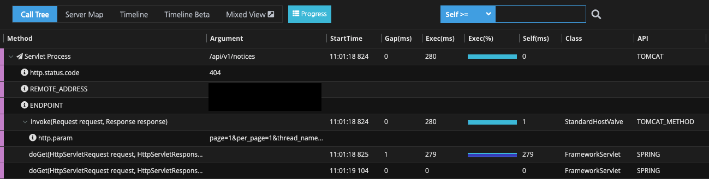
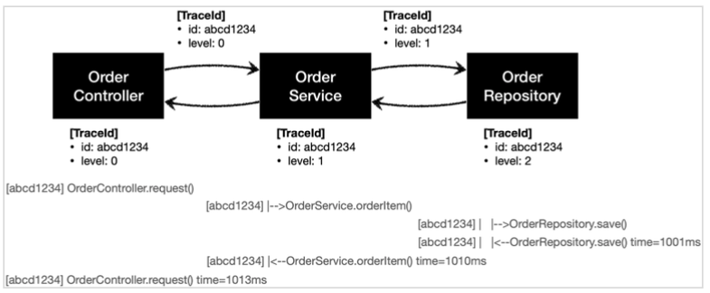

이번 장에서는 `APM` 툴의 힘을 빌리지 않고 직접 서비스 로그를 출력하는 기능을 구현하는 방법에 대해서 알아본다.
모든 코드는 [깃허브(링크)](https://github.com/roy-zz/spring) 에 올려두었다.

---

### 개요

시중에 많은 `APM` 툴을 사용하면 아래와 같이 하나의 요청(트랜잭션)이 들어오고 나가는 모든 과정을 기록해준다.


<center> 네이버 Pinpoint </center>

이번 장에서는 이러한 `APM` 툴의 도움없이 마치 툴이 만들어주는 것과 같은 기능을 만들어본다.  
우리가 기능을 구현하고 나면 아래와 같이 요청이 들어오고 나갈 때까지의 과정이 출력되어야 한다.

```
[2fa0a4b2]  OrderController.request()
[2fa0a4b2] |--> OrderService.orderItem()
[2fa0a4b2] |   |--> OrderRepository.save()
[2fa0a4b2] |   |<-- OrderRepository.save() time = 1001 ms
[2fa0a4b2] |<-- OrderService.orderItem() time = 1003 ms
[2fa0a4b2]  OrderController.request() time = 1003 ms
```

- 대괄호([])안의 문자는 고유 아이디인 `UUID`의 앞 8자리로 트랜잭션을 구분하는 용도록 사용된다.
- 해당 트랜잭션에서 몇번째로 호출된 메서드인지를 나타내기 위해 사용된다.
- `time`은 해당 요청이 처리되는 시간을 표시하는데 사용된다.

---

### 적용 전

로그를 출력하는 기능이 추가되기 전에 코드를 살펴본다.  
애플리케이션은 `controller` -> `service` -> `repository`와 같은 흐름으로 작동하며 `DB`와의 연동 작업은 하지 않는다.

#### OrderController

```java
@RestController
@RequiredArgsConstructor
public class OrderControllerVersion0 {
    private final OrderService orderService;
    @GetMapping("/v0/request")
    public String request(String itemId) {
        orderService.orderItem(itemId);
        return "OK";
    }
}
```

#### OrderService

```java
@Service
@RequiredArgsConstructor
public class OrderService {
    private final OrderRepository orderRepository;
    public void orderItem(String itemId) {
        orderRepository.save(itemId);
    }
}
```

#### OrderRepository

```java
@Repository
public class OrderRepository {
    public void save(String itemId) {
        if (itemId.equals("exception")) {
            throw new IllegalStateException("예외 발생");
        }
        sleep(1000);
    }
    private void sleep(int millis) {
        try {
            Thread.sleep(millis);
        } catch (InterruptedException exception) {
            exception.printStackTrace();
        }
    }
}
```

---

### 적용 후

#### TraceId

트랜잭션 ID(id)와 몇번째로 호출(level)되었는지를 필드값으로 가지고 있는 `TraceId` 클래스를 생성한다.  
고유한 값을 만들기 위해 위해 `UUID`를 생성하여 앞의 8자리를 트랜잭션의 ID로 사용하였다.  
`createNextId()`는 같은 호출(같은 트랜잭션 ID)를 사용하고 레벨이 1 증가한 `TraceId` 객체를 생성한다.

```java
@Getter
public class TraceId {
    private final String id;
    private final int level;
    public TraceId() {
        this.id = createId();
        this.level = 0;
    }
    private TraceId(String id, int level) {
        this.id = id;
        this.level = level;
    }
    private String createId() {
        return UUID.randomUUID().toString().substring(0, 8);
    }
    public TraceId createNextId() {
        return new TraceId(id, level + 1);
    }
}
```

#### TraceStatus

이전 단계에서 생성한 `TraceId` 객체를 필드로 가지고 있다.  
로그가 시작된 시간을 가지고 있기 때문에 로그가 종료되는 시점까지의 수행 시간을 구할 수 있다.  
호출별로 어떠한 작업을 진행했는지 남기기 위한 내용값을 가지는 `message` 필드를 가지고 있다.

```java
@Getter
@AllArgsConstructor
public class TraceStatus {
    private final TraceId traceId;
    private final Long startTimeMillis;
    private final String message;
}
```

#### MyTrace

우리가 작성한 코드들은 로그를 남기기 위해서 `TraceId`와 `TraceStatus` 객체를 직접 생성하지 않는다.  
`MyTrace`의 메서드를 통해서 상황에 맞는 객체를 생성하고 로그로 남기도록 구현한다.
최초에 로그가 시작되는 시점에 `begin` 메서드를 호출하여 로그의 시작임을 알린다.  
이후의 로그부터는 `beginSync`를 호출하여 `begin`을 호출한 시점에 사용한 트랜잭션 ID과 같은 아이디를 가지고 레벨이 다른 `TraceStatus` 객체를 생성한다.  
트랜잭션이 종료되는 시점에 예외가 발생하지 않았다면 `end`를 호출하여 트랜잭션이 종료됨을 알리고 중간에 예외가 발생하는 경우 `exception`을 호출하여 예외가 발생하여 트랜잭션이 종료됨을 알린다.

```java
@Slf4j
@Component
public class MyTrace {
    private static final String START_PREFIX = "-->";
    private static final String COMPLETE_PREFIX = "<--";
    private static final String EXCEPTION_PREFIX = "<X-";
    public TraceStatus begin(String message) {
        TraceId traceId = new TraceId();
        Long startTimeMillis = System.currentTimeMillis();
        log.info("[{}] {} {}", traceId.getId(), addSpace(START_PREFIX, traceId.getLevel()), message);
        return new TraceStatus(traceId, startTimeMillis, message);
    }
    public TraceStatus beginSync(TraceId beforeTraceId, String message) {
        TraceId nextId = beforeTraceId.createNextId();
        long startTimeMillis = System.currentTimeMillis();
        log.info("[{}] {} {}", nextId.getId(), addSpace(START_PREFIX, nextId.getLevel()), message);
        return new TraceStatus(nextId, startTimeMillis, message);
    }
    public void end(TraceStatus status) {
        complete(status, null);
    }
    public void exception(TraceStatus status, Exception exception) {
        complete(status, exception);
    }
    private void complete(TraceStatus status, Exception exception) {
        long stopTimeMillis = System.currentTimeMillis();
        long resultTimeMillis = stopTimeMillis - status.getStartTimeMillis();
        TraceId traceId = status.getTraceId();
        if (Objects.isNull(exception)) {
            log.info("[{}] {} {} time = {} ms", traceId.getId(), addSpace(COMPLETE_PREFIX, traceId.getLevel()), status.getMessage(), resultTimeMillis);
        } else {
            log.info("[{}] {} {} time = {} ms, exception = {}", traceId.getId(), addSpace(EXCEPTION_PREFIX, traceId.getLevel()), status.getMessage(), resultTimeMillis, exception.toString());
        }
    }
    private static String addSpace(String prefix, int level) {
        StringBuilder sb = new StringBuilder();
        for (int i = 0; i < level; i++) {
            sb.append( (i == level - 1) ? "|" + prefix : "|   ");
        }
        return sb.toString();
    }
}
```

---

지금부터 `적용 전`의 코드에 `TraceId`, `TraceStatus`, `MyTrace`를 적용하는 코드에 대해서 알아본다.  
적용한 후에는 아래의 이미지와 같은 흐름으로 요청이 전달되고 로그가 출력되어야 한다.



#### OrderController

```java
@RestController
@RequiredArgsConstructor
public class OrderController {
    private final OrderService orderService;
    private final MyTrace trace;
    @GetMapping("/v2/request")
    public String request(String itemId) {
        TraceStatus status = null;
        try {
            status = trace.begin("OrderController.request()");
            orderService.orderItem(status.getTraceId(), itemId);
            trace.end(status);
            return "OK";
        } catch (Exception exception) {
            trace.exception(status, exception);
            throw exception;
        }
    }
}
```

#### OrderService

```java
@Service
@RequiredArgsConstructor
public class OrderService {
    private final OrderRepository orderRepository;
    private final MyTrace trace;
    public void orderItem(TraceId traceId, String itemId) {
        TraceStatus status = null;
        try {
            status = trace.beginSync(traceId, "OrderService.orderItem()");
            orderRepository.save(status.getTraceId(), itemId);
            trace.end(status);
        } catch (Exception exception) {
            trace.exception(status, exception);
            throw exception;
        }
    }
}
```

#### OrderRepository

```java
@Repository
@RequiredArgsConstructor
public class OrderRepository {
    private final MyTrace trace;
    public void save(TraceId traceId, String itemId) {
        TraceStatus status = null;
        try {
            status = trace.beginSync(traceId, "OrderRepository.save()");
            if (itemId.equals("exception")) {
                throw new IllegalStateException("예외 발생");
            }
            sleep(1000);
            trace.end(status);
        } catch (Exception exception) {
            trace.exception(status, exception);
            throw exception;
        }
    }
    private void sleep(int millis) {
        try {
            Thread.sleep(millis);
        } catch (InterruptedException exception) {
            exception.printStackTrace();
        }
    }
}
```

---

지금까지 하나의 요청이 들어오고 나가는 과정을 로그로 출력하는 방법에 대해서 알아보았다.  
하지만 서비스 로직과 전혀 관련없는 트랜잭션 ID의 동기화를 위해서 파라미터로 `TraceId` 객체가 전달되어야 한다는 치명적인 단점이 발생하였다.  
다음 장에서는 `Thread Local`을 사용하여 이번 장에서 발생한 문제를 해결하는 방법에 대해서 알아본다.

---

**참고한 자료**:

- https://www.inflearn.com/course/%EC%8A%A4%ED%94%84%EB%A7%81-%ED%95%B5%EC%8B%AC-%EC%9B%90%EB%A6%AC-%EA%B3%A0%EA%B8%89%ED%8E%B8
- https://www.inflearn.com/course/%EC%8A%A4%ED%94%84%EB%A7%81-%ED%95%B5%EC%8B%AC-%EC%9B%90%EB%A6%AC-%EA%B8%B0%EB%B3%B8%ED%8E%B8
- https://www.inflearn.com/course/%EC%8A%A4%ED%94%84%EB%A7%81-mvc-1
- https://www.inflearn.com/course/%EC%8A%A4%ED%94%84%EB%A7%81-mvc-2