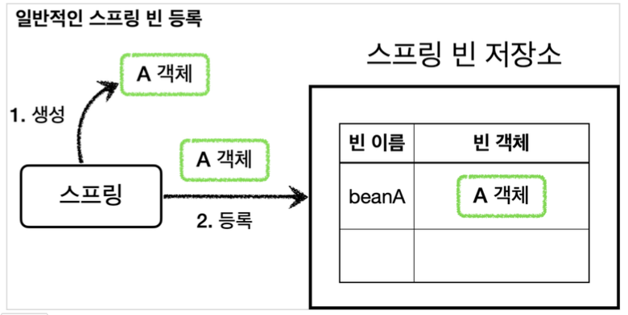
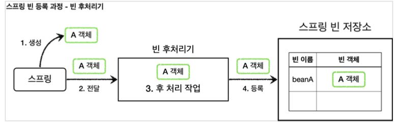
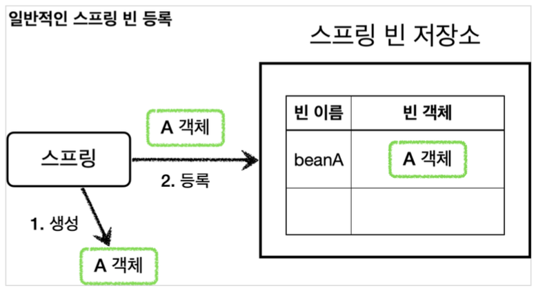
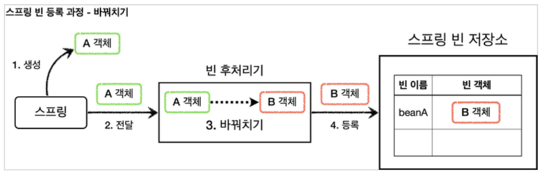

[이전 장(링크)]() 에서는 프록시 팩토리를 적용해보면서 `너무 많은 설정`과 `컴포넌트 스캔을 사용하는 경우 적용 불가`라는 단점을 알게되었다.  
이번 장에서는 이러한 단점을 해결할 수 있는 **빈 후처리기**에 대해서 알아보도록 한다.
모든 코드는 [깃허브(링크)](https://github.com/roy-zz/spring) 에 올려두었다.
---

### 빈 후처리기(BeanPostProcessor) - 소개

`@Bean`이나 `컴포넌트 스캔`으로 스프링 빈을 등록하면, 스프링은 대상 객체를 생성하고 스프링 컨테이너 내부의 빈 저장소에 등록한다.  
이후 스프링 컨테이너를 통해 등록한 스프링 빈을 조회해서 사용하면 된다.



스프링이 빈 저장소에 등록할 목적으로 생성한 객체를 빈 저장소에 "등록하기 직전"에 조작하고 싶다면 **빈 후처리기**를 사용하면 된다.  
`Bean Post Processor`를 번역하면 빈 후처리기이며, 이름처럼 빈을 "생성한 후에 무언가를 처리"하기 위한 용도로 사용된다.

#### 기능

빈 후처리기는 많은 기능을 제공하고 있으며, "객체를 조작"하는 것 뿐만 아니라 심지어 "완전히 다른 객체로 바꾸는 것도 가능"하다.  
빈 후처리기가 작동하는 과정은 아래와 같다.



빈이 등록되는 과정을 빈 후처리기와 함께 살펴보면 아래와 같다.
- **1. 생성**: 스프링 빈의 대상이 되는 객체를 생성한다. 여기에는 `@Bean`, 컴포넌트 스캔 모두 포함된다.
- **2. 전달**: 생성된 객체를 빈 저장소에 등록하기 직전에 빈 후처리기에 전달한다.
- **3. 후 처리 작업**: 빈 후처리기는 전달된 스프링 빈 객체를 조작하거나 다른 객체로 바꿔치기 할 수 있다.
- **4. 등록**: 빈 후처리기는 빈을 반환한다. 전달받은 빈을 그대로 반환할 수도 있고, 중간에 다른 객체로 변경하여 빈 저장소에 등록할 수도 있다.
  
빈 후처리기에 의해 다른 객체로 변경되어 등록되는 과정은 아래와 같다.


---

#### 빈 후처리기 사용 예시 - 1

빈 후처리기를 사용하기 이전에 일반적으로 스프링 빈을 등록하는 과정을 살펴본다. 과정은 아래의 이미지와 같다.



```java
public class BasicTest {

    @Test
    void basicConfig() {

        ApplicationContext context = new AnnotationConfigApplicationContext(BasicConfig.class);
        Roy roy = context.getBean("beanRoy", Roy.class);
        roy.helloRoy();

        Assertions.assertThrows(NoSuchBeanDefinitionException.class, () -> {
            context.getBean(Perry.class);
        });
    }

    @Slf4j
    @Configuration
    static class BasicConfig {

        @Bean(name = "beanRoy")
        public Roy roy() {

            return new Roy();
        }
    }

    @Slf4j
    static class Roy {

        public void helloRoy() {
            log.info("hello Roy");
        }
    }

    @Slf4j
    static class Perry {

        public void helloPerry() {
            log.info("hello Perry");
        }
    }
}
```

`new AnnotationConfigApplicationContext(BasicConfig.class)`를 보면 스프링 컨테이너를 생성하면서 `BasicConfig.class`를 매개변수로 전달하였다.  
이를 통해 `BasicConfig.class` 설정 파일은 스프링 빈으로 등록된다. 때문에 `beanRoy`라는 이름을 가지고 있는 빈은 컨테이너에 등록되고 `Perry` 클래스의 인스턴스는 빈으로 등록되지 않았다.  
우리의 예상대로 `Porry` 클래스를 통해 생성된 빈을 조회하면 `NoSuchBeanDefinitionException`이 발생한다.

---

#### 빈 후처리기 사용 예시 - 2

빈 후처리기를 사용하여 `Roy` 객체를 `Perry` 객체로 변경해본다.  
우리가 원하는 프로세스는 아래의 그림과 같다.
  

  
스프링에서 제공하는 `BeanPostProcessor` 인터페이스를 살펴본다.

```java
public interface BeanPostProcessor {
    
	@Nullable
	default Object postProcessBeforeInitialization(Object bean, String beanName) throws BeansException {
		return bean;
	}

	@Nullable
	default Object postProcessAfterInitialization(Object bean, String beanName) throws BeansException {
		return bean;
	}
}
```

- 빈 후처리기를 사용하려면 `BeanPostProcessor` 인터페이스를 구현하고, 스프링 빈으로 등록하면 된다.
- `postProcessBeforeInitialization`: 객체 생성 이후에 `@PostConstruct`와 같은 초기화가 발생하기 전에 호출되는 "포스트 프로세서"이다.
- `postProcessAfterInitialization`: 객체 생성 이후에 `@PostConstruct`와 같은 초기화가 발생한 다음에 호출되는 "포스트 프로세서"이다.


// TODO


---

**참고한 자료**:

- https://www.inflearn.com/course/%EC%8A%A4%ED%94%84%EB%A7%81-%ED%95%B5%EC%8B%AC-%EC%9B%90%EB%A6%AC-%EA%B3%A0%EA%B8%89%ED%8E%B8
- https://www.inflearn.com/course/%EC%8A%A4%ED%94%84%EB%A7%81-%ED%95%B5%EC%8B%AC-%EC%9B%90%EB%A6%AC-%EA%B8%B0%EB%B3%B8%ED%8E%B8
- https://www.inflearn.com/course/%EC%8A%A4%ED%94%84%EB%A7%81-mvc-1
- https://www.inflearn.com/course/%EC%8A%A4%ED%94%84%EB%A7%81-mvc-2