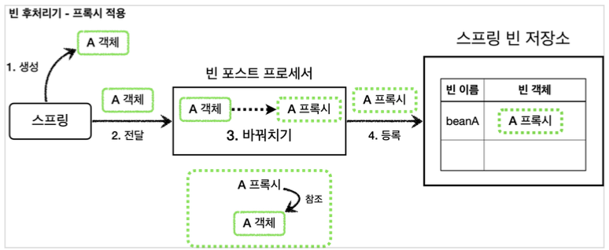

[이전 장(링크)]() 에서는 프록시 팩토리를 적용해보면서 `너무 많은 설정`과 `컴포넌트 스캔을 사용하는 경우 적용 불가`라는 단점을 알게되었다.  
이번 장에서는 이러한 단점을 해결할 수 있는 **빈 후처리기**에 대해서 알아보도록 한다.
모든 코드는 [깃허브(링크)](https://github.com/roy-zz/spring) 에 올려두었다.
---

### 빈 후처리기(BeanPostProcessor) - 소개

`@Bean`이나 `컴포넌트 스캔`으로 스프링 빈을 등록하면, 스프링은 대상 객체를 생성하고 스프링 컨테이너 내부의 빈 저장소에 등록한다.  
이후 스프링 컨테이너를 통해 등록한 스프링 빈을 조회해서 사용하면 된다.


스프링이 빈 저장소에 등록할 목적으로 생성한 객체를 빈 저장소에 "등록하기 직전"에 조작하고 싶다면 **빈 후처리기**를 사용하면 된다.  
`Bean Post Processor`를 번역하면 빈 후처리기이며, 이름처럼 빈을 "생성한 후에 무언가를 처리"하기 위한 용도로 사용된다.

#### 기능

빈 후처리기는 많은 기능을 제공하고 있으며, "객체를 조작"하는 것 뿐만 아니라 심지어 "완전히 다른 객체로 바꾸는 것도 가능"하다.  
빈 후처리기가 작동하는 과정은 아래와 같다.


빈이 등록되는 과정을 빈 후처리기와 함께 살펴보면 아래와 같다.
- **1. 생성**: 스프링 빈의 대상이 되는 객체를 생성한다. 여기에는 `@Bean`, 컴포넌트 스캔 모두 포함된다.
- **2. 전달**: 생성된 객체를 빈 저장소에 등록하기 직전에 빈 후처리기에 전달한다.
- **3. 후 처리 작업**: 빈 후처리기는 전달된 스프링 빈 객체를 조작하거나 다른 객체로 바꿔치기 할 수 있다.
- **4. 등록**: 빈 후처리기는 빈을 반환한다. 전달받은 빈을 그대로 반환할 수도 있고, 중간에 다른 객체로 변경하여 빈 저장소에 등록할 수도 있다.
  
빈 후처리기에 의해 다른 객체로 변경되어 등록되는 과정은 아래와 같다.


---

#### 빈 후처리기 사용 예시 - 1

빈 후처리기를 사용하기 이전에 일반적으로 스프링 빈을 등록하는 과정을 살펴본다. 과정은 아래의 이미지와 같다.


```java
public class BasicTest {

    @Test
    void basicConfig() {

        ApplicationContext context = new AnnotationConfigApplicationContext(BasicConfig.class);
        Roy roy = context.getBean("beanRoy", Roy.class);
        roy.helloRoy();

        Assertions.assertThrows(NoSuchBeanDefinitionException.class, () -> {
            context.getBean(Perry.class);
        });
    }

    @Slf4j
    @Configuration
    static class BasicConfig {

        @Bean(name = "beanRoy")
        public Roy roy() {

            return new Roy();
        }
    }

    @Slf4j
    static class Roy {

        public void helloRoy() {
            log.info("hello Roy");
        }
    }

    @Slf4j
    static class Perry {

        public void helloPerry() {
            log.info("hello Perry");
        }
    }
}
```

`new AnnotationConfigApplicationContext(BasicConfig.class)`를 보면 스프링 컨테이너를 생성하면서 `BasicConfig.class`를 매개변수로 전달하였다.  
이를 통해 `BasicConfig.class` 설정 파일은 스프링 빈으로 등록된다. 때문에 `beanRoy`라는 이름을 가지고 있는 빈은 컨테이너에 등록되고 `Perry` 클래스의 인스턴스는 빈으로 등록되지 않았다.  
우리의 예상대로 `Porry` 클래스를 통해 생성된 빈을 조회하면 `NoSuchBeanDefinitionException`이 발생한다.

---

#### 빈 후처리기 사용 예시 - 2

빈 후처리기를 사용하여 `Roy` 객체를 `Perry` 객체로 변경해본다.  
우리가 원하는 프로세스는 아래의 그림과 같다.
  

  
스프링에서 제공하는 `BeanPostProcessor` 인터페이스를 살펴본다.

```java
public interface BeanPostProcessor {
    
	@Nullable
	default Object postProcessBeforeInitialization(Object bean, String beanName) throws BeansException {
		return bean;
	}

	@Nullable
	default Object postProcessAfterInitialization(Object bean, String beanName) throws BeansException {
		return bean;
	}
}
```

- 빈 후처리기를 사용하려면 `BeanPostProcessor` 인터페이스를 구현하고, 스프링 빈으로 등록하면 된다.
- `postProcessBeforeInitialization`: 객체 생성 이후에 `@PostConstruct`와 같은 초기화가 발생하기 전에 호출되는 "포스트 프로세서"이다.
- `postProcessAfterInitialization`: 객체 생성 이후에 `@PostConstruct`와 같은 초기화가 발생한 다음에 호출되는 "포스트 프로세서"이다.

중간에서 다른 객체로 변경하는 빈 후처리기를 구현해본다.  
  
**BeanPostProcessorTest**
```java
public class BeanPostProcessorTest {

    @Test
    void basicConfig() {

        ApplicationContext context = new AnnotationConfigApplicationContext(BeanPostProcessorConfig.class);
        Perry perry = context.getBean("beanRoy", Perry.class);
        Assertions.assertThrows(NoSuchBeanDefinitionException.class, () -> {
            context.getBean(Roy.class);
        });
    }

    @Slf4j
    @Configuration
    static class BeanPostProcessorConfig {

        @Bean(name = "beanRoy")
        public Roy roy() {
            return new Roy();
        }

        @Bean
        public RoyToPerryPostProcessor helloPostProcessor() {
            return new RoyToPerryPostProcessor();
        }
    }

    @Slf4j
    static class Roy {
        public void helloRoy() {
            log.info("hello Roy");
        }
    }

    @Slf4j
    static class Perry {
        public void helloPerry() {
            log.info("hello Perry");
        }
    }

    @Slf4j
    static class RoyToPerryPostProcessor implements BeanPostProcessor {

        @Override
        public Object postProcessAfterInitialization(Object bean, String beanName) throws BeansException {

            log.info("beanName = {}, bean = {}", beanName, bean);
            if (bean instanceof Roy) {
                return new Perry();
            }
            return bean;
        }
    }
}
```

**RoyToPerryPostProcessor**  
- 이름에서 알 수 있듯이 `Roy` 인스턴스를 `Perry` 인스턴스로 교체하는 빈 후처리기다. `BeanPostProcessor`를 구현하고, 스프링 빈으로 등록하면 컨테이너가 빈 후처리기로 인식하고 동작한다.
- 이 빈 후처리기는 파라미터로 전달받은 빈 객체가 `Roy` 인스턴스이면 새로운 `Perry` 인스턴스를 생성해서 반환한다. 이러한 작업을 통해 `Roy` 대신 `Perry`가 스프링 빈으로 등록된다.
출력되는 결과를 확인해보면 `beanName = beanRoy`, `bean = Roy`객체의 인스턴스가 빈 후처리기에 넘어온 것을 확인할 수 있다.

```shell
Creating shared instance of singleton bean 'beanRoy'
beanName = beanRoy, bean = com.roy.spring.myproxy.postprocessor.BeanPostProcessorTest$Roy@4af0df05
hello Perry
```

- `beanName = beanRoy` 이지만 실제로 `Perry`의 인스턴스가 빈으로 등록된 것을 확인할 수 있다.
- 심지어 `Roy`의 인스턴스는 빈으로 등록조차 되지 않았다.
  
#### 정리
  
빈 후처리기는 빈을 조작하고 변경할 수 있는 후킹 포인트이며, 빈 객체를 조작하거나 변경까지도 가능할 만큼 많은 기능을 제공한다.  
조작을 통해 해당 객체의 특정 메서드를 호출하는 것 또한 가능하다.  
일반적으로 스프링 컨테이너가 등록하는, 컴포넌트 스캔의 대상이 되는 빈들은 중간에서 조작할 방법이 없는데, 빈 후처리기를 사용하면 개발자가 등록하는 모든 빈을 중간에서 조작할 수 있다.  
즉, 개발자가 **빈 객체를 프록시 객체로 교체**하는 것도 가능하다는 의미가 된다.
  
**@PostConstruct**
  
`@PostConstruct`는 스프링 빈 생성 이후에 빈을 초기화 하는 역할을 한다. 빈의 초기화라는 것이 단순히 `@PostConstruct` 애너테이션이 붙은 초기화 메서드를 한번 호출만 하면 된다.  
쉽게 생각하면 생성된 빈을 한번 조작하는 것이다. 따라서 빈을 조작하는 행위를 하는 적절한 빈 후처리기가 있으면 될 것으로 예상된다.  
스프링은 `CommonAnnotationBeanPostProcessor`라는 빈 후처리기를 자동으로 등록하는데 여기에서 `@PostConstruct` 애너테이션이 붙은 메서드를 호출한다.  
이런 점들을 보았을 때 스프링 스스로도 스프링 내부의 기능을 확장하기 위해 빈 후처리기를 사용한다는 것을 알 수 있다.

---

### 빈 후처리기 - 적용
  
이번에는 빈 후처리기를 사용해서 실제 객체 대신 프록시를 스프링 빈으로 등록해본다.  
이런 방식으로 수동 등록하는 빈은 물론이고, 컴포넌트 스캔을 사용하는 빈까지 모두 프록시를 적용할 수 있으며 설정 파일에 있는 수 많은 프록시 생성 코드도 한번에 제거할 수 있다.



**PackageLogTraceProxyPostProcessor**  
```java
@Slf4j
public class PackageLogTracePostProcessor implements BeanPostProcessor {

    private final String basePackage;

    private final Advisor advisor;

    public PackageLogTracePostProcessor(String basePackage, Advisor advisor) {
        this.basePackage = basePackage;
        this.advisor = advisor;
    }

    @Override
    public Object postProcessAfterInitialization(Object bean, String beanName) throws BeansException {
        log.info("param info: beanName = {}, bean = {}", beanName, bean.getClass());

        String packageName = bean.getClass().getPackageName();
        if (!packageName.startsWith(basePackage)) {
            return bean;
        }

        ProxyFactory proxyFactory = new ProxyFactory(bean);
        proxyFactory.addAdvisor(advisor);

        Object proxy = proxyFactory.getProxy();
        log.info("created proxy info: target = {} proxy = {}", bean.getClass(), proxy.getClass());
        return proxy;
    }
}
```
  
- `PackageLogTraceProxyPostProcessor`는 원본 객체를 프록시 객체로 변환하는 역할을 한다. 이때 프록시 팩토리를 사용하는데, 프록시 팩토리는 `advisor`가 필요하기 때문에 이 부분은 외부에서 주입받고 있다.
- 모든 스프링 빈들에 프록시를 적용할 필요는 없다. 여기서는 특정 패키지와 그 하위에 위치한 스프링 빈들만 프록시를 적용한다.
예제에서는 `com.roy.spring.myproxy`와 관련된 부분에만 적용하면 되도록 하였다. 다른 패키지의 객체들은 원본 객체를 그대로 반환한다.
- 프록시 적용 대상의 반환 값을 보면 원본 객체 대신에 프록시 객체를 반환한다. 따라서 스프링 컨테이너에 원본 객체 대신에 프록시 객체가 스프링 빈으로 등록되기 때문에 원본 객체는 빈으로 등록되지 않는다.
  
**BeanPostProcessorConfig**
  
```java
@Slf4j
@Configuration
@Import({ApplicationVersion1Config.class, ApplicationVersion2Config.class})
public class BeanPostProcessorConfig {

    @Bean
    public PackageLogTracePostProcessor logTracePostProcessor(LogTrace logTrace) {

        return new PackageLogTracePostProcessor("com.roy.spring.myproxy", getAdvisor(logTrace));
    }

    private Advisor getAdvisor(LogTrace logTrace) {

        NameMatchMethodPointcut pointcut = new NameMatchMethodPointcut();
        pointcut.setMappedNames("request*", "order*", "save*");
        LogTraceAdvice advice = new LogTraceAdvice(logTrace);

        return new DefaultPointcutAdvisor(pointcut, advice);
    }
}
```
  
- `@Import({ApplicationVersion1Config.class, ApplicationVersion2Config.class})`: `Version3`는 컴포넌트 스캔으로 자동으로 스프링 빈으로 등록되지만, `Version1, 2`는 수동으로 등록해야 동작한다.
- `@Bean logTraceProxyProcessor()`: 특정 패키지를 기준으로 프록시를 생성하는 빈 후처리기를 스프링 빈으로 등록한다. 빈 후처리기는 스프링 빈으로만 등록하면 자동으로 동작한다.
여기서 프록시를 적용할 패키지 정보(`com.roy.spring.myproxy`)와 어드바이저(`getAdvisor(logTrace)`)를 파라미터로 전달한다.
- **프록시를 생성하는 코드가 설정 파일에는 필요없다는 점**이 중요하며, 순수한 빈 등록만 고민하면 된다. 
프록시를 생성하고 빈으로 등록하는 과정은 빈 후처리기가 모두 처리해주기 때문이다.
  
**MyProxyApplication**  
```java
@Import(BeanPostProcessorConfig.class)
@SpringBootApplication(scanBasePackages = "com.roy.spring.myproxy.application")
public class MyProxyApplication {

    public static void main(String[] args) {
        SpringApplication.run(MyProxyApplication.class, args);
    }

    @Bean
    public LogTrace logTrace() {
        return new ThreadLocalLogTrace();
    }
}
```
  
- `Version 1` 인터페이스가 있으므로 JDK 동적 프록시가 적용된다.
- `Version 2` 구체 클래스만 있으므로 CGLIB 프록시가 적용된다.
- `Version 3` 구체 클래스만 있으므로 CGLIB 프록시가 적용된다.
- 빈 후처리기를 사용하였기 때문에 수동으로 등록한 빈 뿐만 아니라 컴포넌트 스캔을 통해 등록한 `Version 3`의 빈들도 프록시를 적용할 수 있다.
  
**프록시 대상 여부 체크**  
애플리케이션을 실행할 때 로그에서 확인할 수 있듯이 우리가 직접 등록한 빈을 제외하고도 스프링 부트가 기본으로 등록한느 수 많은 빈들이 빈 후처리기에 넘어온다.  
어떤 빈을 프록시로 만들 것인지 기준이 필요하다. 우리의 예제 코드는 `basePackage`로 범위를 한정하여 특정 패키지 범우에 있는 빈들만 프록시를 만들도록 하였다.  
스프링 부트가 기본으로 제공하는 빈 중에는 프록시 객체를 만들 수 없는 빈들도 있다. 때문에 모든 객체를 프록시로 만들 경우 오류가 발생한다.

---

### 빈 후처리기 - 정리
  
빈 후처리기를 통해서 어떤 문제들을 해결하였는지에 대해서 알아보도록 한다.

#### 문제1 - 너무 많은 설정

프록시를 직접 스프링 빈으로 등록하는 `ProxyFactoryConfigVersion1`, `ProxyFactoryConfigVersion2`와 같은 설정 파일은 프록시 관련 설정이 지나치게 많다는 문제가 있다. 
예를 들어, 애플리케이션에 스프링 빈이 100개가 있다면 여기에 프록시를 통해 부가 기능을 적용하려면 100개의 프록시 설정 코드가 필요하였다.
  
스프링 빈을 편리하게 등록하려고 컴포넌트 스캔까지 사용하는데, 직접 등록하는 것 뿐만 아니라 프록시를 적용하는 코드까지 빈 생성 코드에 넣어야 한다.

#### 문제2 - 컴포넌트 스캔

`Version 3` 애플리케이션처럼 컴포넌트 스캔을 사용하는 경우 지금까지 학습한 방법으로는 프록시 적용이 불가능하다. 
컴포넌트 스캔으로 이미 스프링 컨테이너에 실제 객체를 빈으로 등록한 상태이기 때문이다.  
지금까지 우리가 사용한 방식은 원본 객체를 빈으로 등록하는 것이 아니라 원본 객체가 등록되려할 때 프록시 객체를 대신 등록하는 방식이었다. 
컴포넌트 스캔의 경우 원본 객체를 스프링 빈으로 자동으로 등록하기 때문에 프록시 적용이 불가능하다.

#### 문제 해결

빈 후처리기 덕분에 프록시를 생성하는 부분을 **하나로 집중**할 수 있다. 그리고 컴포넌트 스캔처럼 스프링이 직접 대상을 빈으로 등록하는 경우에도 중간에 빈 등록 과정을 인터셉트하여 원본 대신에 프록시를 스프링 빈으로 등록할 수 있다.  
애플리케이션은 덕분에 수 많은 스프링 빈이 추가되어도 프록시와 관련된 코드는 전혀 변경되지 않아도 되고 컴포넌트 스캔을 사용해도 프록시가 모두 적용된다.

**중요한 부분**  
프록시의 적용 대상 여부를 설정할 때 우리의 예제 코드는 간단하게 패키지로 설정되었다. 하지만 이러한 부분들을 포인트컷으로 정리하면 더 깔끔하고 명확하게 정리할 수 있다.  
참고로 어드바이저는 포인트컷을 가지고 있기 때문에 어드바이저를 통해 포인트컷을 확인할 수 있다. 스프링 AOP는 포인트컷을 사용해서 프록시 적용 대상 여부를 확인한다.
  
결과적으로 포인트컷은 아래와 같은 곳에서 사용된다.
1. 프록시 적용 대상 여부를 확인해서 꼭 필요한 곳에만 프록시를 적용한다. (빈 후처리기 - 자동 프록시 생성)
2. 프록시의 어떤 메서드가 호출 되었을 때 어드바이스를 적용할 지 판단한다. (프록시 내부)

---

**참고한 자료**:

- https://www.inflearn.com/course/%EC%8A%A4%ED%94%84%EB%A7%81-%ED%95%B5%EC%8B%AC-%EC%9B%90%EB%A6%AC-%EA%B3%A0%EA%B8%89%ED%8E%B8
- https://www.inflearn.com/course/%EC%8A%A4%ED%94%84%EB%A7%81-%ED%95%B5%EC%8B%AC-%EC%9B%90%EB%A6%AC-%EA%B8%B0%EB%B3%B8%ED%8E%B8
- https://www.inflearn.com/course/%EC%8A%A4%ED%94%84%EB%A7%81-mvc-1
- https://www.inflearn.com/course/%EC%8A%A4%ED%94%84%EB%A7%81-mvc-2