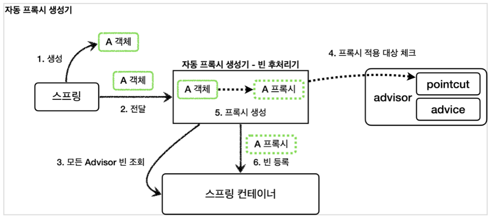
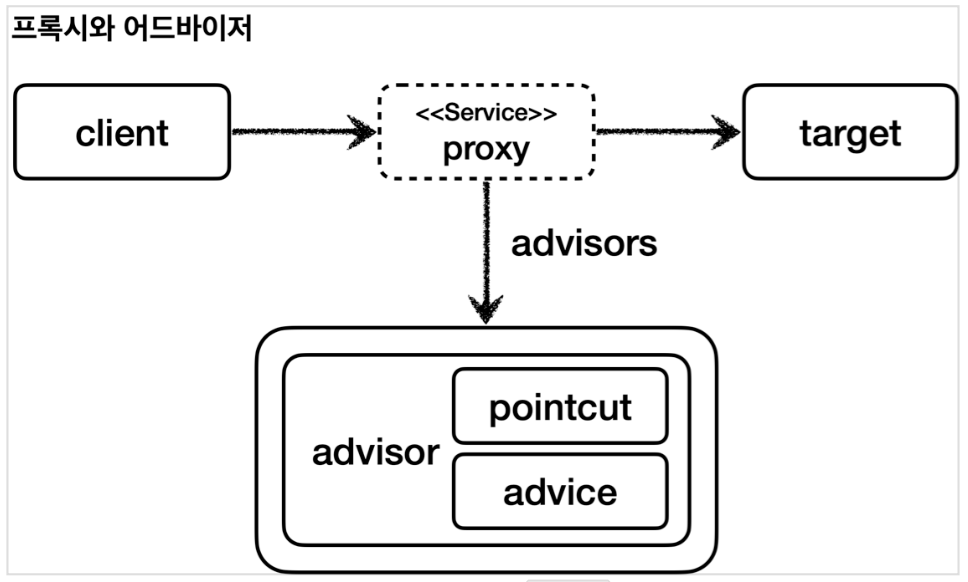
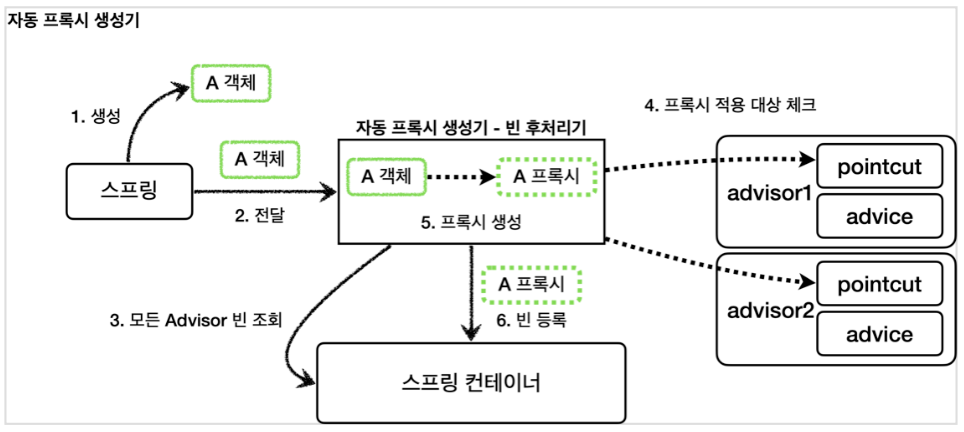
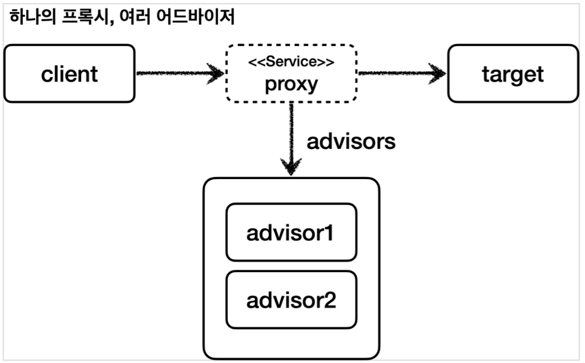

[이전 장(링크)](https://imprint.tistory.com/352) 에서는 **빈 후처리기**는 무엇이며 어떠한 문제를 해결할 수 있는지 알아보았다.
이번 장에서는 **스프링이 제공하는 빈 후처리기**에 대해서 알아보도록 한다.
모든 코드는 [깃허브(링크)](https://github.com/roy-zz/spring) 에 올려두었다.
---

### 스프링이 제공하는 빈 후처리기

스프링이 제공하는 빈 후처리기를 사용하기 위해서는 `aop` 의존성이 필요하다. 아래와 같이 `build.gradle` 파일에 의존성을 추가해준다.

```text
implementation 'org.springframework.boot:spring-boot-starter-aop'
```
  
의존성을 추가하면 `aspectjweaver`라는 `aspectJ`관련 라이브러리를 등록하고, 스프링 부트가 AOP 관련 클래스를 자동으로 스프링 빈으로 등록한다. 
스프링 부트를 사용하기 이전에는 `@EnableAspectJAutoProxy`를 직접 사용해야 했으나, 스프링 부트의 등장으로 자동화되었다. 
스프링 부트가 활성화하는 빈은 `AopAutoConfiguration`을 참고하면 된다.

#### 자동 프록시 생성기 - AutoProxyCreator

- 스프링 부트의 자동 설정으로 `AnnotationAwareAspectJAutoProxyCreator`라는 빈 후처리기가 스프링 빈에 자동으로 등록되며 자동으로 프록시를 생성해주는 빈 후처리기다.
- 이 빈 후처리기는 스프링 빈으로 등록된 `Advisor`들을 자동으로 찾아서 프록시가 필요한 곳에 자동으로 프록시를 적용해준다.
- `Advisor`안에는 `Pointcut`과 `Advice`가 모두 포함되어 있기 때문에 `Advisor`만 알고 있으면 그 안에 있는 `Pointcut`으로 어떤 스프링 빈에 프록시를 적용해야 하는지 알 수 있다. 
그리고 `Advice`로 부가 기능을 적용하면 된다.
- `AnnotationAwareAspectJAutoProxyCreator`는 `@AspectJ`와 관련된 AOP 기능도 자동으로 찾아서 처리해준다.
- `Advisor`는 물론이고, `@Aspect`도 자동으로 인식해서 프록시를 만들고 AOP를 적용해준다.
- 자동 프록시 생성기의 작동 과정은 아래와 같다.



**1. 생성**: 스프링이 스프링 빈 대상이 되는 객체를 생성한다. (`@Bean`, 컴포넌트 스캔 포함)  
**2. 전달**: 생성된 객체를 빈 저장소에 등록하기 직전에 빈 후처리기에 전달한다.  
**3. 모든 Advisor 빈 조회**: 자동 프록시 생성기 - 빈 후처리기는 스프링 컨테이너에서 모든 `Advisor`를 조회한다.  
**4. 프록시 적용 대상 체크**: 앞서 조회한 `Advisor`에 포함되어 있는 포인트컷을 사용해서 해당 객체가 프록시를 적용할 대상인지 아닌지 판단한다.   
이때 객체의 클래스 정보와 해당 객체의 모든 메서드를 포인트컷에 하나하나 모두 매칭해본다. 만약 조건이 하나라도 만족하면 프록시 적용 대상이 된다.  
예를 들어, 10개의 메서드 중에 하나만 포인트컷 조건에 만족해도 프록시 적용 대상이 된다.  
**5. 프록시 생성**: 프록시 적용 대상이면 프록시를 생성하고 반환해서 프록시를 스프링 빈으로 등록한다. 
만약 프록시 적용 대상이 아니라면 원본 객체를 반환해서 원본 객체를 스프링 빈으로 등록한다.  
**6. 빈 등록**: 반환된 객체는 스프링 빈으로 등록된다.
  
생성된 프록시는 아래와 같으며, 프록시는 내부에 어드바이저와 실제 호출해야할 대상 객체(`target`)을 알고 있다.



직접 코드를 작성하여 우리가 학습한 것과 같이 작동하는지 알아본다.
  
**AutoProxyConfig**
```java
@Configuration
@Import({ApplicationVersion1Config.class, ApplicationVersion2Config.class})
public class AutoProxyConfig {

    @Bean
    public Advisor advisorOne(LogTrace logTrace) {

        NameMatchMethodPointcut pointcut = new NameMatchMethodPointcut();
        pointcut.setMappedNames("request*", "order*", "save*");
        LogTraceAdvice advice = new LogTraceAdvice(logTrace);

        return new DefaultPointcutAdvisor(pointcut, advice);
    }
}
```
- `AutoProxyConfig` 코드를 보면 `advisorOne`이라는 어드바이저 하나만 등록했다.
- 빈 후처리기는 따로 등록하지 않아도 되며, 스프링은 자동 프록시 생성기라는 `AnnotationAwareAspectJAutoProxyCreator` 빈 후처리기를 자동으로 등록해준다.

**MyProxyApplication**
```java
@Import(AutoProxyConfig.class)
@SpringBootApplication(scanBasePackages = "com.roy.spring.myproxy")
public class MyProxyApplication {

    public static void main(String[] args) {
        SpringApplication.run(MyProxyApplication.class, args);
    }

    @Bean
    public LogTrace logTrace() {
        return new ThreadLocalLogTrace();
    }
}
```

- 위에서 생성한 `AutoProxyConfig`을 빈으로 등록한다.

#### 포인트컷 사용 이유

포인트컷은 2가지에 사용된다.
  
1. 프록시 적용 여부 판단 - 생성 단계
   - 자동 프록시 생성기는 포인트컷을 사용해서 해당 빈이 프록시를 생성할 필요가 있는지 없는지 확인한다.
   - 클래스 + 메서드 조건을 모두 비교한다. 이때 모든 메서드를 확인하는데, 포인트컷 조건에 하나하나 확인해본다. 만약 조건에 해당하는 것이 하나라도 있으면 프록시를 생성한다.
     - 예) `orderControllerVersion1`은 `request()`, `noLog()`가 있다. 여기서 `request()`가 조건에 만족하므로 프록시를 생성한다.
   - 만약 조건에 맞는 것이 하나도 없으면 프록시를 생성할 필요가 없으므로 프록시를 생성하지 않는다.
2. 어드바이스 적용여부 판단 - 사용 단계
   - 프록시가 호출되었을 때 부가 기능인 어드바이스를 적용할지 말지 포인트컷을 보고 판단한다.
   - 앞서 설명한 예에서 `orderControllerVersion1`은 이미 프록시가 적용되어 있다.
   - `orderControllerVersion1`의 `request()`는 현재 포인트컷 조건에 만족하므로 프록시는 어드바이스를 먼저 호출하고, `target`을 호출한다.
   - `orderControllerVersion1`의 `noLog()`는 현재 포인트컷 조건에 만족하지 않으므로 어드바이스를 호출하지 않고 바로 `target`만 호출한다.
  
- 프록시를 모든 곳에 생성하는 것은 비용 낭비이기 때문에 반드시 필요한 곳에만 적용해야 한다.
- 자동 프록시 생성기는 모든 스프링 빈에 프록시를 적용하는 것이 아니라 포인트컷으로 한번 필터링해서 어드바이스가 사용될 가능성이 있는 곳에만 프록시를 생성한다.

---

애플리케이션이 실행될 때 출력되는 로그를 확인해보면 아래와 같은 로그가 출력되는 것을 확인할 수 있다.

```shell 
EnableWebMvcConfiguration.requestMappingHandlerAdapter()
EnableWebMvcConfiguration.requestMappingHandlerAdapter() time=63ms
```
  
애플리케이션 서버를 실행해보면, 스프링이 초기화 되면서 기대하지 않은 로그가 출력된다. 이유는 지금 사용한 포인트컷이 단순히 메서드 이름에 `request*`, `order*`, `save*`만 포함되어 있으면 매칭된다고 판단하기 때문이다. 
결국 스프링이 내부에서 사용하는 빈에도 메서드 이름에 `request`라는 단어만 들어가 있으면 프록시가 만들어지고 어드바이스도 적용되는 것이다.  
이렇게 우리가 의도하지 않은 프록시를 생성하지 않기 위해서는 패키지에 메서드 이름까지 지정할 수 있는 **매우 정밀한 포인트컷**이 필요하다.

**AspectJExpressionPointcut**  
AspectJ라는 AOP에 특화된 포인트컷 표현식을 적용할 수 있다.  
  
**AutoProxyConfig**
```java
@Configuration
@Import({ApplicationVersion1Config.class, ApplicationVersion2Config.class})
public class AutoProxyConfig {
    // ..
    @Bean
    public Advisor advisorTwo(LogTrace logTrace) {

        AspectJExpressionPointcut pointcut = new AspectJExpressionPointcut();
        pointcut.setExpression("execution(* com.roy.spring.myproxy..*(..))");
        LogTraceAdvice advice = new LogTraceAdvice(logTrace);

        return new DefaultPointcutAdvisor(pointcut, advice);
    }
}
```

- `AspectJExpressionPointcut`: AspectJ 포인트컷 표현식을 적용할 수 있다.
- `execution(* com.roy.spring.myproxy..*(..))`: AspectJ가 제공하는 포인트컷 표현식이다.
  - `*`: 모든 반환 타입을 의미한다.
  - `com.roy.spring.myproxy..`: 해당 패키지와 그 하위 패키지를 의미한다.
  - `*(..)`: `*` 모든 메서드 이름, `(..)` 파라미터는 상관없음을 의미한다.
  - 한 마디로 `com.roy.spring.myproxy` 패키지와 그 하위 패키지의 모든 메서드는 포인트컷의 매칭 대상이 된다.
  
이번에는 `AspectJExpressionPointcut`을 사용해서 조금 더 복잡한 조건의 포인트컷을 만들어보도록 한다.

**AutoProxyConfig**  
```java
@Configuration
@Import({ApplicationVersion1Config.class, ApplicationVersion2Config.class})
public class AutoProxyConfig {
    // ...
    @Bean
    public Advisor advisorThree(LogTrace logTrace) {

        AspectJExpressionPointcut pointcut = new AspectJExpressionPointcut();
        pointcut.setExpression("execution(* com.roy.spring.myproxy..*(..)) && !execution(* com.roy.spring.myproxy..noLog(..))");
        LogTraceAdvice advice = new LogTraceAdvice(logTrace);

        return new DefaultPointcutAdvisor(pointcut, advice);
    }
}
```

- 이번 포인트컷은 `com.roy.spring.myproxy`패키지와 하위 패키지의 모든 메서드에 포인트컷을 매칭하지만, `noLog()` 메서드는 제외하라는 의미다.

---

### 하나의 프록시, 여러 Advisor 적용

어떤 스프링 빈이 `advisorOne`, `advisorTwo`가 제공하는 포인트컷의 조건을 모두 만족하면 프록시 자동 생성기는 프록시를 하나만 생성한다. 
이유는 프록시 팩토리가 생성하는 프록시는 내부에 여러 `advisor`들을 포함할 수 있기 때문이다. 따라서 프록시를 여러 개 생성해서 비용을 낭비할 이유가 없다.
  
프록시 자동 생성기는 상황별로 아래와 같이 작동한다.
- `advisorOne`의 포인트컷만 만족 -> 프록시 1개 생성, 프록시에 `advisorOne`만 포함
- `advisorOne`, `advisorTwo`의 포인트컷을 모두 만족 -> 프록시 1개 생성, 프록시에 `advisorOne`, `advisorTwo` 모두 포함
- `advisorOne`, `advisorTwo`의 포인트컷을 모두 만족하지 않음 -> 프록시가 생성되지 않음





정리해보면 자동 프록시 생성기인 `AnnotationAwareAspectJAutoProxyCreator` 덕분에 개발자는 매우 편리하게 프록시를 적용할 수 있으며 `Advisor`만 스프링 빈으로 등록하면 된다.

---

**참고한 자료**:

- https://www.inflearn.com/course/%EC%8A%A4%ED%94%84%EB%A7%81-%ED%95%B5%EC%8B%AC-%EC%9B%90%EB%A6%AC-%EA%B3%A0%EA%B8%89%ED%8E%B8
- https://www.inflearn.com/course/%EC%8A%A4%ED%94%84%EB%A7%81-%ED%95%B5%EC%8B%AC-%EC%9B%90%EB%A6%AC-%EA%B8%B0%EB%B3%B8%ED%8E%B8
- https://www.inflearn.com/course/%EC%8A%A4%ED%94%84%EB%A7%81-mvc-1
- https://www.inflearn.com/course/%EC%8A%A4%ED%94%84%EB%A7%81-mvc-2