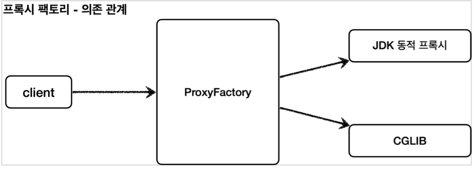
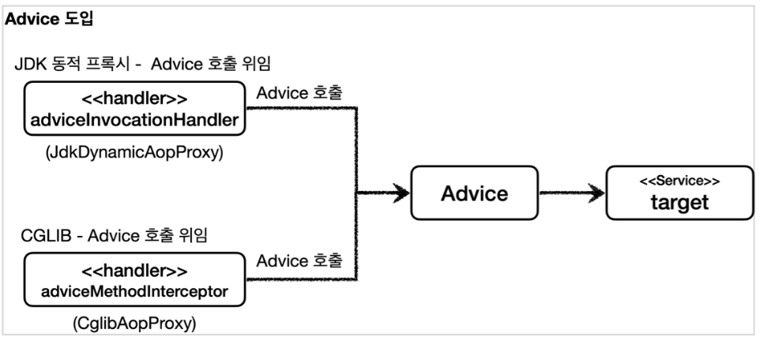

[이전 장(링크)](https://imprint.tistory.com/293) 에서는 CGLIB에 대해서 알아보았다.
이번 장에서는 **프록시 팩토리**에 대해서 알아보도록 한다.
모든 코드는 [깃허브(링크)](https://github.com/roy-zz/spring) 에 올려두었다.
---

### Proxy Factory

동적 프록시를 사용하는 경우 아래와 같은 의문이 생길 수 있다.

#### Q. 인터페이스가 있는 경우에는 JDK 동적 프록시를 적용하고, 그렇지 않은 경우에는 CGLIB를 적용하려면 어떻게 해야하는가.

스프링은 유사한 구체적인 기술들이 있을 때, 그것들을 통합해서 일관성 있게 접근할 수 있고, 더욱 편리하게 사용할 수 있도록 추상화된 기술을 제공한다.
스프링은 동적 프록시를 통합해서 편리하게 만들어주는 프록시 팩토리(`ProxyFactory`)라는 기능을 제공한다.
이전에는 상황에 따라서 JDK 동적 프록시를 사용하거나 CGLIB를 사용해야 했지만, 프록시 팩토리를 사용하면 하나의 팩토리로 원하는 동적 프록시를 생성할 수 있다.
프록시 팩토리는 인터페이스가 있으면 JDK 동적 프록시를 사용하고, 구체 클래스만 있으면 CGLIB를 사용하며, 설정을 통해서 변경할 수도 있다.




#### Q. 두 기술을 함께 사용할 때 부가 기능을 제공하기 위해 JDK 동적 프록시가 제공하는 `InvocationHandler`와 CGLIB가 제공하는 `MethodInterceptor`를 각각 중복으로 만들어서 관리해야 하는가.

스프링은 이 문제를 해결하기 위해 부가 기능을 적용할 때 `Advice`라는 새로운 개념을 도입했다.
개발자는 `InvocationHandler`나 `MethodInterceptor`를 신경쓰지 않고, `Advice`만 만들면 된다.
결과적으로, `InovcationHandler`나 `MethodInterceptor`는 `Advice`를 호출하게 된다.
프록시 팩토리를 사용하면 `Advice`를 호출하는 전용 `InvocationHandler`, `MethodInterceptor`를 내부에서 사용한다.




#### Q. 특정 조건에 맞을 때 프록시 로직을 적용하는 기능도 공통으로 제공되기를 원한다면 어떻게 해야하는가.

앞서 특정 메서드 이름의 조건에 맞을 때만 프록시 부가 기능이 적용되는 코드를 직접 만들었다.
스프링은 `Pointcut`이라는 개념을 도입해서 이 문제를 일관성 있게 해결한다.

---

### Proxy Factory 예제 - 1

#### Advice 만들기

`Advice`는 프록시에 적용하는 부가 기능 로직이며, JDK 동적 프록시가 제공하는 `InvocationHandler`와 CGLIB가 제공하는 `MethodInterceptor`의 개념과 유사하다.
둘을 개념적으로 추상화 한 것이다. 프록시 팩토리를 사용하면 둘 대신에 `Advice`를 사용하면 된다.
`Advice`를 만드는 방법은 여러가지가 있지만, 기본적인 방법은 다음 인터페이스를 구현하면 된다.

**MethodInterceptor - 스프링이 제공하는 코드**
```java
package org.aopalliance.intercept;
  
public interface MethodInterceptor extends Interceptor {
      Object invoke(MethodInvocation invocation) throws Throwable;
}
```

- `MethodInvocation invocation`: 내부에는 다음 메서드를 호출하는 방법, 현재 프록시 객체 인스턴스, `args`, 메서드 정보등이 포함되어 있다. 
  기존에 파라미터로 제공되는 부분들이 여기 안에 모두 포함되어 있다고 생각하면 된다.
- CGLIB의 `MethodInterceptor`와 이름이 같으므로 패키지 이름에 주의한다. 여기서 사용하는 `org.aopalliance.intercept` 패키지는 스프링 AOP 모듈(`spring-top`)안에 들어있다.
- `MethodInterceptor`는 `Interceptor`를 상속하고 `Interceptor`는 `Advice` 인터페이스를 상속한다.

**TimeAdvice**
```java
@Slf4j
public class TimeAdvice implements MethodInterceptor {

    @Override
    public Object invoke(MethodInvocation invocation) throws Throwable {
        log.info("TimeProxy 실행");
        long startTime = System.currentTimeMillis();
        Object result = invocation.proceed();

        long endTime = System.currentTimeMillis();
        long resultTime = endTime - startTime;
        log.info("TimeProxy 종료 resultTime = {}ms", resultTime);
        return result;
    }
}
```

- `TimeAdvice`는 앞서 설명한 `MethodInterceptor` 인터페이스를 구현한다. 패키지 이름에 주의해야 한다.
- `Object reuslt = invocation.proceed()`
  - `invocation.proceed()`를 호출하면 `target` 클래스를 호출하고 그 결과를 받는다.
  - 기존에 보았던 코드들과 다르게 `target` 클래스의 정보가 보이지 않는다. `target` 클래스의 정보는 `MethodInvocation invocation` 안에 모두 포함되어 있다..
  - 이유는 프록시 팩토리로 프록시를 생성하는 단계에서 이미 `target` 정보를 파라미터로 전달받기 때문이다.

**ProxyFactoryTest**


---

**참고한 자료**:

- https://www.inflearn.com/course/%EC%8A%A4%ED%94%84%EB%A7%81-%ED%95%B5%EC%8B%AC-%EC%9B%90%EB%A6%AC-%EA%B3%A0%EA%B8%89%ED%8E%B8
- https://www.inflearn.com/course/%EC%8A%A4%ED%94%84%EB%A7%81-%ED%95%B5%EC%8B%AC-%EC%9B%90%EB%A6%AC-%EA%B8%B0%EB%B3%B8%ED%8E%B8
- https://www.inflearn.com/course/%EC%8A%A4%ED%94%84%EB%A7%81-mvc-1
- https://www.inflearn.com/course/%EC%8A%A4%ED%94%84%EB%A7%81-mvc-2
