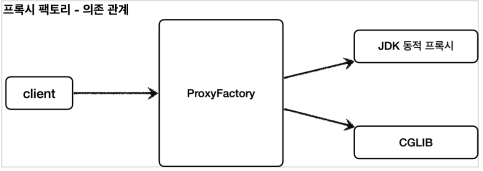
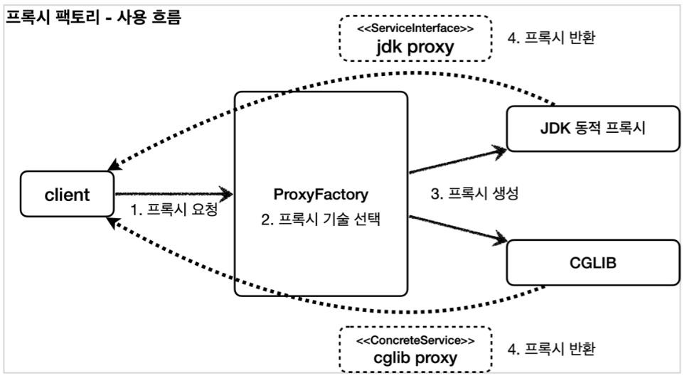
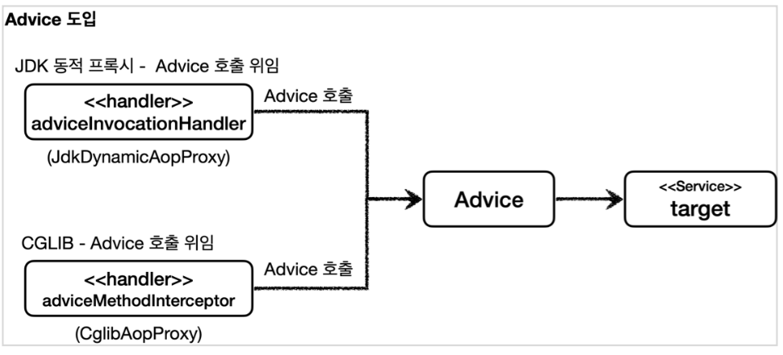
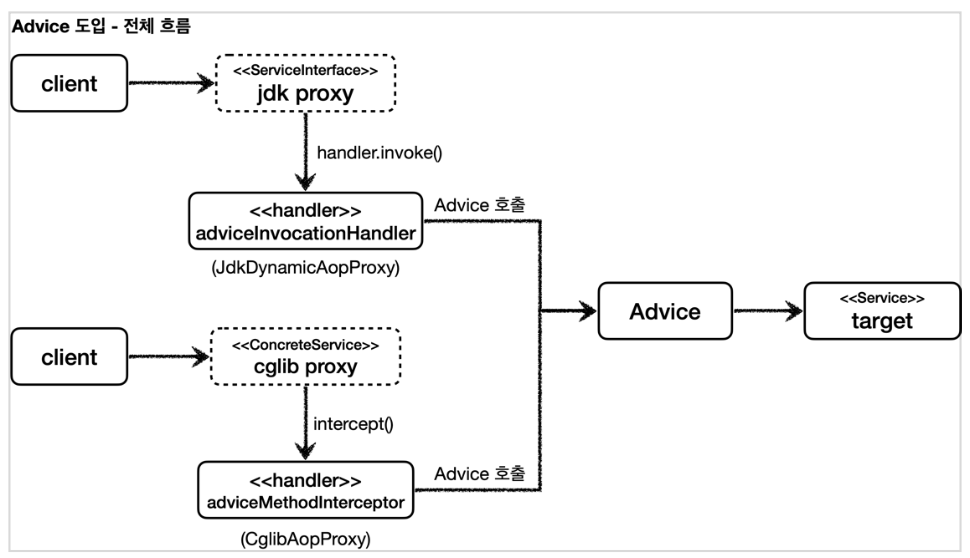

[이전 장(링크)](https://imprint.tistory.com/293) 에서는 CGLIB에 대해서 알아보았다.
이번 장에서는 **프록시 팩토리**에 대해서 알아보도록 한다.
모든 코드는 [깃허브(링크)](https://github.com/roy-zz/spring) 에 올려두었다.
---

### Proxy Factory Basics

동적 프록시를 사용하는 경우 아래와 같은 의문이 생길 수 있다.

#### Q. 인터페이스가 있는 경우에는 JDK 동적 프록시를 적용하고, 그렇지 않은 경우에는 CGLIB를 적용하려면 어떻게 해야하는가.

스프링은 유사한 구체적인 기술들이 있을 때, 그것들을 통합해서 일관성 있게 접근할 수 있고, 더욱 편리하게 사용할 수 있도록 추상화된 기술을 제공한다.
스프링은 동적 프록시를 통합해서 편리하게 만들어주는 프록시 팩토리(`ProxyFactory`)라는 기능을 제공한다.
이전에는 상황에 따라서 JDK 동적 프록시를 사용하거나 CGLIB를 사용해야 했지만, 프록시 팩토리를 사용하면 하나의 팩토리로 원하는 동적 프록시를 생성할 수 있다.
프록시 팩토리는 인터페이스가 있으면 JDK 동적 프록시를 사용하고, 구체 클래스만 있으면 CGLIB를 사용하며, 설정을 통해서 변경할 수도 있다.





#### Q. 두 기술을 함께 사용할 때 부가 기능을 제공하기 위해 JDK 동적 프록시가 제공하는 `InvocationHandler`와 CGLIB가 제공하는 `MethodInterceptor`를 각각 중복으로 만들어서 관리해야 하는가.

스프링은 이 문제를 해결하기 위해 부가 기능을 적용할 때 `Advice`라는 새로운 개념을 도입했다.
개발자는 `InvocationHandler`나 `MethodInterceptor`를 신경쓰지 않고, `Advice`만 만들면 된다.
결과적으로, `InovcationHandler`나 `MethodInterceptor`는 `Advice`를 호출하게 된다.
프록시 팩토리를 사용하면 `Advice`를 호출하는 전용 `InvocationHandler`, `MethodInterceptor`를 내부에서 사용한다.





#### Q. 특정 조건에 맞을 때 프록시 로직을 적용하는 기능도 공통으로 제공되기를 원한다면 어떻게 해야하는가.

앞서 특정 메서드 이름의 조건에 맞을 때만 프록시 부가 기능이 적용되는 코드를 직접 만들었다.
스프링은 `Pointcut`이라는 개념을 도입해서 이 문제를 일관성 있게 해결한다.

---

### Proxy Factory 예제 - 1

프록시 팩토리를 통해 JDK 동적 프록시를 생성해본다.

#### Advice 만들기

`Advice`는 프록시에 적용하는 부가 기능 로직이며, JDK 동적 프록시가 제공하는 `InvocationHandler`와 CGLIB가 제공하는 `MethodInterceptor`의 개념과 유사하다.
둘을 개념적으로 추상화 한 것이다. 프록시 팩토리를 사용하면 둘 대신에 `Advice`를 사용하면 된다.
`Advice`를 만드는 방법은 여러가지가 있지만, 기본적인 방법은 다음 인터페이스를 구현하면 된다.

**MethodInterceptor - 스프링이 제공하는 코드**
```java
package org.aopalliance.intercept;
  
public interface MethodInterceptor extends Interceptor {
      Object invoke(MethodInvocation invocation) throws Throwable;
}
```

- `MethodInvocation invocation`: 내부에는 다음 메서드를 호출하는 방법, 현재 프록시 객체 인스턴스, `args`, 메서드 정보등이 포함되어 있다. 
  기존에 파라미터로 제공되는 부분들이 여기 안에 모두 포함되어 있다고 생각하면 된다.
- CGLIB의 `MethodInterceptor`와 이름이 같으므로 패키지 이름에 주의한다. 여기서 사용하는 `org.aopalliance.intercept` 패키지는 스프링 AOP 모듈(`spring-top`)안에 들어있다.
- `MethodInterceptor`는 `Interceptor`를 상속하고 `Interceptor`는 `Advice` 인터페이스를 상속한다.

**TimeAdvice**
```java
@Slf4j
public class TimeAdvice implements MethodInterceptor {

    @Override
    public Object invoke(MethodInvocation invocation) throws Throwable {
        log.info("TimeProxy 실행");
        long startTime = System.currentTimeMillis();
        Object result = invocation.proceed();

        long endTime = System.currentTimeMillis();
        long resultTime = endTime - startTime;
        log.info("TimeProxy 종료 resultTime = {}ms", resultTime);
        return result;
    }
}
```

- `TimeAdvice`는 앞서 설명한 `MethodInterceptor` 인터페이스를 구현한다. 패키지 이름에 주의해야 한다.
- `Object reuslt = invocation.proceed()`
  - `invocation.proceed()`를 호출하면 `target` 클래스를 호출하고 그 결과를 받는다.
  - 기존에 보았던 코드들과 다르게 `target` 클래스의 정보가 보이지 않는다. `target` 클래스의 정보는 `MethodInvocation invocation` 안에 모두 포함되어 있다..
  - 이유는 프록시 팩토리로 프록시를 생성하는 단계에서 이미 `target` 정보를 파라미터로 전달받기 때문이다.

**ProxyFactoryTest**

```java
@Slf4j
public class ProxyFactoryTest {
    @Test
    @DisplayName("인터페이스가 있는 경우 JDK 동적 프록시")
    void interfaceWithJdkDynamicProxyTest() {

        ServiceInterface target = new ServiceImpl();
        ProxyFactory proxyFactory = new ProxyFactory(target);
        proxyFactory.addAdvice(new TimeAdvice());
        ServiceInterface proxy = (ServiceInterface) proxyFactory.getProxy();
        log.info("targetClass = {}", target.getClass());
        log.info("proxyClass = {}", proxy.getClass());

        proxy.save();

        assertThat(AopUtils.isAopProxy(proxy)).isTrue();
        assertThat(AopUtils.isJdkDynamicProxy(proxy)).isTrue();
        assertThat(AopUtils.isCglibProxy(proxy)).isFalse();
    }
}
```

- `new ProxyFactory(target)`: 프록시 팰토리를 생성할 때, 생성자에 프록시의 호출 대상을 함께 넘겨준다. 프록시 팩토리는 이 인스턴스 정보를 기반으로 프록시를 만들어낸다. 
만약, 인스턴스에 인터페이스가 있다면 JDK 동적 프록시를 기본으로 사용하고 인터페이스가 없고 구체클래스가 있다면 CGLIB를 통해 동적 프록시를 생성한다. 여기서는 `target`이 `new ServiceImpl()`의 인스턴스이기 때문에 `ServiceInterface` 인터페이스가 있다.
이 인터페이스를 기반으로 JDK 동적 프록시를 생성한다.
- `proxyFactory.addAdvice(new TimeAdvice())`: 프록시 팩토리를 통해서 만든 프록시가 사용할 부가 기능 로직을 설정한다. JDK 동적 프록시가 제공하는 `InvocationHandler`와 CGLIB가 제공하는 `MethodInterceptor`의 개념과 유사하다.
이렇게 프록시가 제공하는 부가 기능 로직을 어드바이스(`Advice`)라 하며 단어의 의미대로 조언을 해준다고 생각하면 된다.
- `proxyFactory.getProxy()`: 프록시 객체를 생성하고 그 결과를 받는다.
- 테스트 코드는 성공하며 결과는 아래와 같다.

**테스트 코드 실행 결과**
```shell
targetClass = class com.roy.spring.myproxy.common.service.ServiceImpl
proxyClass = class com.sun.proxy.$Proxy10
TimeProxy 실행
Call save()
TimeProxy 종료 resultTime = 0ms
```

출력된 결과를 보면 프록시가 정상 적용되었으며 `proxyClass = class com.sun.proxy.$Proxy10` 출력을 통해 JDK 동적 프록시가 적용된 것도 확인할 수 있다.  

**프록시 팩토리를 통한 프록시 적용 확인**  
프록시 팩토리로 프록시가 잘 적용되었는지 확인하려면 아래의 기능을 사용하면 된다.  
- `AopUtils.isAopProxy(proxy)`: 프록시 팩토리를 통해서 프록시가 생성되면 JDK 동적 프록시나, CGLIB 모두 `true`를 반환한다.
- `AopUtils.isJdkDynamicProxy(proxy)`: 프록시 팩토리를 통해서 프록시가 생성되고, JDK 동적 프록시인 경우 `true`를 반환한다.
- `AopUtils.isCglibProxy(proxy)`: 프록시 팩토리를 통해서 프록시가 생성되고, CGLIB 동적 프록시인 경우 `true`를 반환한다.
- `proxy.getClass()`: 프록시의 클래스를 출력하여 눈으로 확인할 수 있다.

---

### Proxy Factory 예제 - 2

프록시 팩토리를 통해 CGLIB 프록시를 생성해본다.

**ProxyFactoryTest**

```java
@Slf4j
public class ProxyFactoryTest {
    // ...
    @Test
    @DisplayName("구체 클래스만 있는 경우 CGLIB 프록시")
    void concreteProxyTest() {

        ConcreteService target = new ConcreteService();
        ProxyFactory proxyFactory = new ProxyFactory(target);
        proxyFactory.addAdvice(new TimeAdvice());
        ConcreteService proxy = (ConcreteService) proxyFactory.getProxy();
        log.info("targetClass = {}", target.getClass());
        log.info("proxyClass = {}", proxy.getClass());

        proxy.call();

        assertThat(AopUtils.isAopProxy(proxy)).isTrue();
        assertThat(AopUtils.isJdkDynamicProxy(proxy)).isFalse();
        assertThat(AopUtils.isCglibProxy(proxy)).isTrue();
    }
}
```

인터페이스 없이 구체 클래스만 있는 `ConcreteService`에 프록시를 적용해본다.  
프록시 팩토리는 인터페이스 없이 구체 클래스만 있으면 CGLIB를 사용하여 프록시를 적용한다.  
테스트 코드를 실행한 결과는 아래와 같다.

```shell
targetClass = class com.roy.spring.myproxy.common.service.ConcreteService
proxyClass = class com.roy.spring.myproxy.common.service.ConcreteService$$EnhancerBySpringCGLIB$$e8e3f71b
TimeProxy 실행
Call ConcreteService
TimeProxy 종료 resultTime = 27ms
```

출력된 결과를 확인해보면 정상적으로 프록시가 적용된 것을 확인할 수 있다.  
`ConcreteService$$EnhancerBySpringCGLIB$$e8e3f71b`를 통해 CGLIB 프록시가 적용된 것을 확인할 수 있다.

---

### Proxy Factory 예제 - 3

`ProxyTargetClass` 옵션을 사용하여 인터페이스가 있는 경우에도 CGLIB를 사용할 수 있다.

```java
@Slf4j
public class ProxyFactoryTest {
    // ...
    @Test
    @DisplayName("ProxyTargetClass를 사용하여 인터페이스가 있는 경우에도 CGLIB 사용")
    void proxyTargetClassTest() {

        ServiceInterface target = new ServiceImpl();
        ProxyFactory proxyFactory = new ProxyFactory(target);
        proxyFactory.setProxyTargetClass(true);
        proxyFactory.addAdvice(new TimeAdvice());

        ServiceInterface proxy = (ServiceInterface) proxyFactory.getProxy();
        log.info("targetClass = {}", target.getClass());
        log.info("proxyClass = {}", proxy.getClass());

        proxy.save();

        assertThat(AopUtils.isAopProxy(proxy)).isTrue();
        assertThat(AopUtils.isJdkDynamicProxy(proxy)).isFalse();
        assertThat(AopUtils.isCglibProxy(proxy)).isTrue();
    }
}
```

인터페이스가 있지만, CGLIB를 사용해서 인터페이스가 아닌 클래스 기반으로 동적 프록시를 만들 수 있다.  
프록시 팩토리는 `proxyTargetClass`라는 옵션을 제공하는데, 이 옵션에 `true`를 지정하는 경우 인터페이스가 있어도 강제로 CGLIB를 사용하며 인터페이스가 아닌 클래스 기반의 프록시를 들어준다.  
테스트 코드를 실행한 결과는 아래와 같다.

```shell
targetClass = class com.roy.spring.myproxy.common.service.ServiceImpl
proxyClass = class com.roy.spring.myproxy.common.service.ServiceImpl$$EnhancerBySpringCGLIB$$ad5d964f
TimeProxy 실행
Call save()
resultTime = 24ms
```

`ServiceImpl$$EnhancerBySpringCGLIB$$ad5d964f`를 통해 CGLIB 기반의 프록시가 생성된 것을 확인할 수 있다.  

---

### 프록시 팩토리 기술 선택 방법

- 대상에 인터페이스가 있으면 **JDK 동적 프록시, 인터페이스 기반의 프록시**가 생성된다.
- 대상에 인터페이스가 없으면 **CGLIB, 구체 클래스 기반의 프록시**가 생성된다.
- `proxyTargetClass=true`와 같이 옵션을 설정하여 **CGLIB, 구체 클래스 기반의 프록시**를 생성할 수 있으며 인터페이스 유무와는 관련이 없다.

---

### 정리

- 프록시 팩토리의 서비스 추상화 덕분에 구체적인 CGLIB, JDK 동적 프록시 기술에 의존하지 않고, 매우 편리하게 동적 프록시를 생성할 수 있다.
- 프록시의 부가 기능 로직도 특정 기술에 종속적이지 않게 `Advice` 하나로 편리하게 사용할 수 있다. 
프록시 팩토리가 내부에서 JDK 동적 프록시인 경우 `InvocationHandler`가 `Advice`를 호출하도록 기능을 개발해두었기 때문이다.
- 스프링 부트는 AOP를 적용할 때, 기본적으로 `proxyTargetClass=true`로 설정한다. 인터페이스가 있어도 항상 CGLIB를 사용해서 구체 클래스를 기반으로 프록시를 생성한다.

---

**참고한 자료**:

- https://www.inflearn.com/course/%EC%8A%A4%ED%94%84%EB%A7%81-%ED%95%B5%EC%8B%AC-%EC%9B%90%EB%A6%AC-%EA%B3%A0%EA%B8%89%ED%8E%B8
- https://www.inflearn.com/course/%EC%8A%A4%ED%94%84%EB%A7%81-%ED%95%B5%EC%8B%AC-%EC%9B%90%EB%A6%AC-%EA%B8%B0%EB%B3%B8%ED%8E%B8
- https://www.inflearn.com/course/%EC%8A%A4%ED%94%84%EB%A7%81-mvc-1
- https://www.inflearn.com/course/%EC%8A%A4%ED%94%84%EB%A7%81-mvc-2
