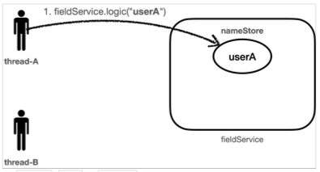
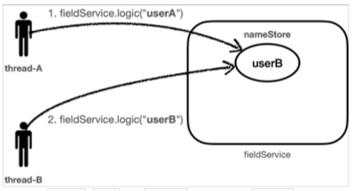
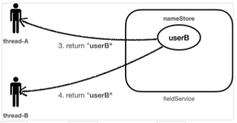

[이전 장(링크)](https://imprint.tistory.com/278) 에서는 서비스의 로그를 출력하는 방법에 대해서 알아보았다.
이번 장에서는 이전 장에서 발생한 문제를 해결하기 위해 필드 동기화를 도입하고 동시성 문제에 대해서 알아본다.
모든 코드는 [깃허브(링크)](https://github.com/roy-zz/spring) 에 올려두었다.

---

### 개요

이전 장에서는 요청에 대한 트랜잭션 아이디를 로그에 출력하기 위해 파라미터로 `TraceId`를 넘겼다.  
하지만 로그를 위한 트랜잭션 아이디는 서비스 로직과는 무관하기 때문에 서비스 로직을 위한 메서드의 파라미터로 전달하는 것은 AOP 관점에서 잘못된 방식이다.  
이번 장에서는 주로직(서비스 로직)과 부로직(로그를 출력하는 로직)을 분리하기 위해 필드 동기화를 도입해본다.

### 구현

#### LogTrace

로그를 출력하기 위한 기능 명세를 가지고 있는 `LogTrace` 추상 클래스를 생성한다.  
이전 장의 메서드들과는 다르게 `TraceId` 객체를 파라미터로 전달하지 않는다.

```java
public abstract class LogTrace {
    protected static final String START_PREFIX = "-->";
    protected static final String COMPLETE_PREFIX = "<--";
    protected static final String EXCEPTION_PREFIX = "<X-";
    public abstract TraceStatus begin(String message);
    public abstract void end(TraceStatus status);
    public abstract void exception(TraceStatus status, Exception exception);
    protected String addSpace(String prefix, int level) {
        StringBuilder sb = new StringBuilder();
        for (int i = 0; i < level; i++) {
            sb.append((i == level - 1) ? "|" + prefix : "|   ");
        }
        return sb.toString();
    }
}
```

#### FieldLogTrace

`LogTrace` 추상 클래스를 상속받는 `FieldLogTrace` 클래스를 생성한다.  
`TraceId`를 파라미터로 넘기지 않도록 필드 변수로 `traceIdHolder`를 가지게 하고 `syncTraceId()`를 호출할 때 필드에 값이 없다면 새로 생성하게 한다.  
트랜잭션이 끝날 때 호출되는 `releaseTraceId()`는 필드 변수인 `traceIdHolder`를 비운다.

```java
@Slf4j
public class FieldLogTrace extends LogTrace {
    private TraceId traceIdHolder;
    @Override
    public TraceStatus begin(String message) {
        syncTraceId();
        TraceId traceId = traceIdHolder;
        long startTimeMillis = System.currentTimeMillis();
        log.info("[{}] {}{}",
            traceId.getId(),
            addSpace(START_PREFIX, traceId.getLevel()),
            message);
        return new TraceStatus(traceId, startTimeMillis, message);
    }
    private void syncTraceId() {
        if (Objects.isNull(traceIdHolder)) {
            traceIdHolder = new TraceId();
        } else {
            traceIdHolder = traceIdHolder.createNextId();
        }
    }
    @Override
    public void end(TraceStatus status) {
        complete(status, null);
    }
    @Override
    public void exception(TraceStatus status, Exception exception) {
        complete(status, exception);
    }
    private void complete(TraceStatus status, Exception exception) {
        Long stopTimeMillis = System.currentTimeMillis();
        long resultTimeMillis = stopTimeMillis - status.getStartTimeMillis();
        TraceId traceId = status.getTraceId();
        if (Objects.isNull(exception)) {
            log.info("[{}] {}{} time = {}ms",
                traceId.getId(),
                addSpace(COMPLETE_PREFIX, traceId.getLevel()),
                status.getMessage(),
                resultTimeMillis);
        } else {
            log.info("[{}] {}{} time = {}ms exception = {}",
                traceId.getId(),
                addSpace(EXCEPTION_PREFIX, traceId.getLevel()),
                status.getMessage(),
                resultTimeMillis,
                exception.toString());
        }
        releaseTraceId();
    }
    private void releaseTraceId() {
        if (traceIdHolder.isFirstLevel()) {
            traceIdHolder = null;
        } else {
            traceIdHolder = traceIdHolder.createPreviousId();
        }
    }
}
```

#### LogTraceConfig

위에서 만든 `FieldLogTrace`클래스의 객체를 `@Configuration`, `@Bean` 애노테이션을 사용해서 스프링 빈으로 등록한다.

```java
@Configuration
public class LogTraceConfig {
    @Bean
    public LogTrace logTrace() {
        return new FieldLogTrace();
    }
}
```

지금부터 변경된 주로직(서비스로직)들을 살펴본다.

#### OrderController

```java
@RestController
@RequiredArgsConstructor
public class OrderController {
    private final OrderService orderService;
    private final LogTrace trace;
    @GetMapping("/v3/request")
    public String request(String itemId) {
        TraceStatus status = null;
        try {
            status = trace.begin("OrderController.request()");
            orderService.orderItem(itemId);
            trace.end(status);
            return "OK";
        } catch (Exception exception) {
            trace.exception(status, exception);
            throw exception;
        }
    }
}
```

#### OrderService

```java
@Service
@RequiredArgsConstructor
public class OrderService {
    private final OrderRepository orderRepository;
    private final LogTrace trace;
    public void orderItem(String itemId) {
        TraceStatus status = null;
        try {
            status = trace.begin("OrderService.orderItem()");
            orderRepository.save(itemId);
            trace.end(status);
        } catch (Exception exception) {
            trace.exception(status, exception);
            throw exception;
        }
    }
}
```

#### OrderRepository

```java
@Repository
@RequiredArgsConstructor
public class OrderRepository {
    private final LogTrace trace;
    public void save(String itemId) {
        TraceStatus status = null;
        try {
            status = trace.begin("OrderRepository.save()");
            if (itemId.equals("exception")) {
                throw new IllegalStateException("예외 발생");
            }
            sleep(1000);
            trace.end(status);
        } catch (Exception exception) {
            trace.exception(status, exception);
            throw exception;
        }
    }
    private void sleep(int millis) {
        try {
            Thread.sleep(millis);
        } catch (InterruptedException e) {
            e.printStackTrace();
        }
    }
}
```

---

### 동시성 문제

지금까지 우리는 부로직(로그출력)에 필요한 값을 파라미터로 전달하지 않기 위해서 필드로 동기화하는 방법에 대해서 알아보았다.  
하지만 필드 동기화를 하는 경우 다중 스레드가 접근하는 경우에 스레드간의 경합이 발생하면서 우리가 예상하는 것과 다른 결과를 가지고 온다.  
동일한 페이지에 동시에 여러번 접속하는 경우 아래와 같이 우리가 예상한 것과 다른 로그가 출력되는 것을 확인할 수 있다.

```
[9c933de0] OrderController.request()
[9c933de0] |-->OrderService.orderItem()
[9c933de0] |   |-->OrderRepository.save()
[9c933de0] |   |   |-->OrderController.request()
[9c933de0] |   |   |   |-->OrderService.orderItem()
[9c933de0] |   |   |   |   |-->OrderRepository.save()
[9c933de0] |   |<--OrderRepository.save() time = 1000ms
[9c933de0] |<--OrderService.orderItem() time = 1000ms
[9c933de0] OrderController.request() time = 1001ms
[9c933de0] |   |   |   |   |<--OrderRepository.save() time = 1004ms
[9c933de0] |   |   |   |<--OrderService.orderItem() time = 1004ms
[9c933de0] |   |   |<--OrderController.request() time = 1004ms
```

모든 요청이 하나의 트랜잭션 아이디로 묶여 있으며 호출되는 레벨도 우리가 예상한 것과는 다르다.  
우리는 `FieldLogTrace`를 싱글톤 빈으로 스프링에 등록시켰다. 해당 빈의 `traceIdHolder`는 필드 변수이기 때문에 해당 빈을 사용하는 모든 스레드가 공유하게 된다.  
지금부터 왜 이러한 문제가 발생하였는지 원인을 파악해보도록 한다. (사실 규모가 작은 회사에서는 이러한 문제를 마주치기 힘들기 때문에 예제를 통해서 확실하게 이해해야 한다.)

#### 동시성 문제 재현

동시성 문제를 파악하기 위해 테스트 코드를 작성해본다.

#### FieldService

파라미터로 전달받은 `name` 값을 필드의 `nameStore`에 저장한다.

```java
@Slf4j
public class FieldService {
    private String nameStore;
    public void setNameStore(String name) {
        try {
            log.info("save name = {} -> nameStore = {}", name, nameStore);
            nameStore = name;
            Thread.sleep(1000);
            log.info("find nameStore = {}", nameStore);
        } catch (InterruptedException e) {
            e.printStackTrace();
        }
    }
}
```

#### FieldServiceTest

```java
@Slf4j
public class FieldServiceTest {
    private final FieldService fieldService = new FieldService();
    @Test
    void fieldServiceTest() throws InterruptedException {
        log.info("main thread start");
        Thread threadRoy = new Thread(() -> fieldService.setNameStore("Roy"), "Thread-Roy");
        Thread threadPerry = new Thread(() -> fieldService.setNameStore("Perry"), "Thread-Perry");

        threadRoy.start();
        Thread.sleep(100);
        threadPerry.start();

        Thread.sleep(3000);
        log.info("main thread destroy");
    }
}
```

두 개의 스레드를 생성하고 `threadRoy`가 실행되고 0.1s 이후에 `threadPerry`를 실행한다.  
출력된 결과를 확인해보면 `threadRoy`의 작업이 종료되기 전에 `threadPerry`의 작업이 진행되면서 둘이 공유하는 변수인 `nameStore`이 중간에 변경되어 우리가 원하는 결과가 아닌 다른 결과가 출력되는 것을 확인할 수 있다.

```
main thread start
save name = Roy -> nameStore = null
save name = Perry -> nameStore = Roy
find nameStore = Perry
find nameStore = Perry
main thread destroy
```







1. `Thread-Roy`는 `Roy`라는 값을 `nameStore`에 저장한다.
2. `Thread-Roy`의 작업이 완료되기 전에 `Thread-Perry`가 `nameStore`에 `Perry`라는 값을 저장한다.
3. 이 사실을 모르는 `Thread-Roy`는 `nameStore`에서 `Perry`를 조회한다.
4. `Thread-Perry`는 `nameStore`에서 `Perry`를 조회한다.

---

이러한 동시성 문제는 규모가 작은 서비스에서는 발생하는 확률이 적고 규모가 커지면서 발생할 확률이 높아진다.  
또한 스프링 빈과 같이 기본적으로 싱글톤으로 사용되는 인스턴스가 상태를 가지는 경우 발생한다. 이외에도 `static`과 같은 공용 필드에 접근할 때 발생한다.  
동시성 문제는 값을 읽기만 하는 경우 발생하지 않지만 수정이 동시에 일어나야 한다면 발생할 수 있다.

---

**참고한 자료**:

- https://www.inflearn.com/course/%EC%8A%A4%ED%94%84%EB%A7%81-%ED%95%B5%EC%8B%AC-%EC%9B%90%EB%A6%AC-%EA%B3%A0%EA%B8%89%ED%8E%B8
- https://www.inflearn.com/course/%EC%8A%A4%ED%94%84%EB%A7%81-%ED%95%B5%EC%8B%AC-%EC%9B%90%EB%A6%AC-%EA%B8%B0%EB%B3%B8%ED%8E%B8
- https://www.inflearn.com/course/%EC%8A%A4%ED%94%84%EB%A7%81-mvc-1
- https://www.inflearn.com/course/%EC%8A%A4%ED%94%84%EB%A7%81-mvc-2