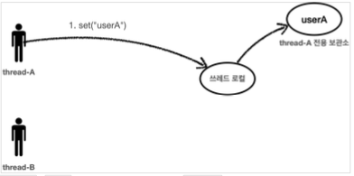

[이전 장(링크)](https://imprint.tistory.com/279) 에서는 필드 동기화를 도입하면서 다중 스레드가 경합하는 경우에 동시성 문제가 발생하는 것을 확인하였다.  
이번 장에서는 동시성 문제를 해결하기 위한 방법 중 하나인 `ThreadLocal`에 대해서 알아보도록 한다.  
모든 코드는 [깃허브(링크)](https://github.com/roy-zz/spring) 에 올려두었다.

---

### ThreadLocal

`ThreadLocal`은 해당 스레드만 접근할 수 있는 저장소를 의미하며 스레드 관점에서는 프라이빗 저장소가 된다.  
  
**일반 변수 필드**에 값을 저장하면 아래의 이미지처럼 모든 스레드가 공유하게 된다.


  


**ThreadLocal**을 사용하면 각 스레드마다 별도의 저장소를 사용하기 때문에 다중 스레드가 같은 인스턴스의 `ThreadLocal` 필드에 접근하여도 동시성 문제가 발생하지 않는다.


  

  


---

### ThreadLocal 예제 

이전 장에서 사용한 `FieldService` 클래스는 필드에 `nameStore`값을 가지고 있었고 다중 스레드가 접근하는 경우 동시성 문제가 발생하였다.  
`ThreadLocal`을 적용하기 위해서는 다른 로직은 동일하게 유지하고 `nameStore`값만 `ThreadLocal`객체에 담기도록 수정하면 된다.  
수정된 `ThreadLocalService` 클래스는 아래와 같다.

```java
@Slf4j
public class ThreadLocalService {
    private ThreadLocal<String>  nameStore = new ThreadLocal<>();
    public void setNameStore(String name) {
        try {
            log.info("save name = {} -> nameStore = {}", name, nameStore.get());
            nameStore.set(name);
            Thread.sleep(1000);
            log.info("find nameStore = {}", nameStore.get());
        } catch (InterruptedException e) {
            e.printStackTrace();
        }
    }
}
```

단, 데이터를 저장(set), 조회(get), 제거(remove)하기 위해 `ThreadLocal`의 메서드를 사용해야 한다.
  
이전 장에서 동시성 문제를 유도했던 테스트 코드를 사용하여 `ThreadLocal`을 사용하여 동시성 문제가 해결되었는지 확인해본다.

```java
@Slf4j
public class ThreadLocalServiceTest {
    private final ThreadLocalService threadLocalService = new ThreadLocalService();
    @Test
    void fieldServiceTest() throws InterruptedException {
        log.info("main thread start");
        Thread threadRoy = new Thread(() -> threadLocalService.setNameStore("Roy"), "Thread-Roy");
        Thread threadPerry = new Thread(() -> threadLocalService.setNameStore("Perry"), "Thread-Perry");

        threadRoy.start();
        Thread.sleep(100);
        threadPerry.start();

        Thread.sleep(3000);
        log.info("main thread destroy");
    }
}
```

출력된 결과를 확인해보면 우리가 예상하는 결과가 출력되며 동시성 문제가 해결된 것을 확인할 수 있다.

```
[main] - main thread start
[Thread-Roy] - save name = Roy -> nameStore = null
[Thread-Perry] - save name = Perry -> nameStore = null
[Thread-Roy] - find nameStore = Roy
[Thread-Perry] - find nameStore = Perry
[main] - main thread destroy
```

---

### ThreadLocal 주의사항

우리가 사용하는 스프링은 기본적으로 스레드 풀을 사용하여 요청이 들어올 때마다 스레드 풀의 스레드를 할당하여 요청을 처리한다.  
스레드 풀을 사용한다는 것은 스레드가 재사용된다는 것을 의미하며 스레드가 재사용되는 경우 스레드의 고유한 저장소인 스레드 로컬도 재사용된다는 것을 의미한다.  
이렇게 스레드 로컬이 재사용되는 상황에서 요청이 끝나는 시점에 스레드 로컬을 지워주지 않으면 치명적인 문제가 발생할 수 있다.


`사용자 A`의 요청이 들어오면 `WAS`는 스레드 풀에서 `thread-A`를 할당하여 요청을 처리한다.  
이때 `thread-A`를 위한 저장소인 `스레드 로컬`이 할당된다.
  


`사용자 A`의 요청이 처리되면 `WAS`는 `thread-A`를 스레드 풀로 반환한다.  
이때 `thread-A`를 위한 저장소인 `스레드 로컬`의 내용을 지워주지 않으면 저장되어 있는 데이터가 계속 남아있게 된다.


`사용자 B`의 요청이 들어오고 `WAS`는 `thread-A`를 할당하여 요청을 처리한다.  
이때 `thread-A`를 위한 저장소인 `스레드 로컬`을 할당하는데 여기에는 이전에 지우지 않은 데이터인 `사용자 A`의 데이터가 남아있게 된다.  
데이터가 남아있기 때문에 `사용자 B`는 `사용자 A`의 정보를 확인하게 된다.
  
`스레드 로컬`을 사용하면서 데이터를 제거하지 않으면 심각한 문제가 발생할 수 있으므로 요청이 끝나는 시점에 `ThreadLocal.remove()`를 사용하여 데이터를 지워주어야 한다.

---

**참고한 자료**:

- https://www.inflearn.com/course/%EC%8A%A4%ED%94%84%EB%A7%81-%ED%95%B5%EC%8B%AC-%EC%9B%90%EB%A6%AC-%EA%B3%A0%EA%B8%89%ED%8E%B8
- https://www.inflearn.com/course/%EC%8A%A4%ED%94%84%EB%A7%81-%ED%95%B5%EC%8B%AC-%EC%9B%90%EB%A6%AC-%EA%B8%B0%EB%B3%B8%ED%8E%B8
- https://www.inflearn.com/course/%EC%8A%A4%ED%94%84%EB%A7%81-mvc-1
- https://www.inflearn.com/course/%EC%8A%A4%ED%94%84%EB%A7%81-mvc-2