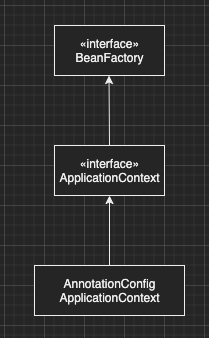
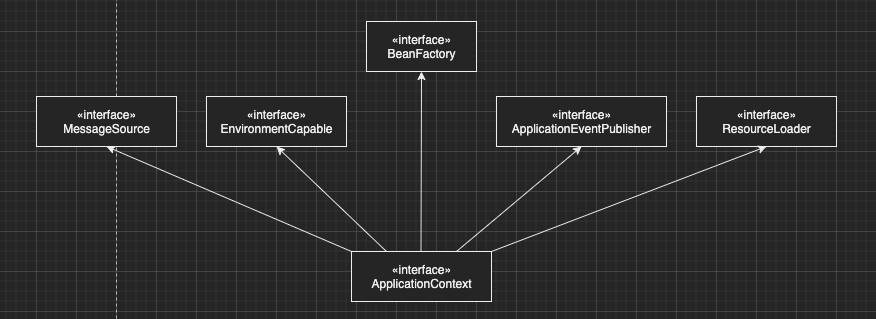
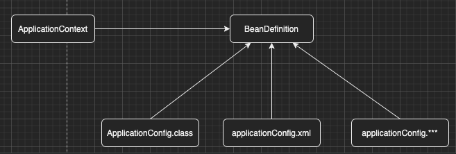
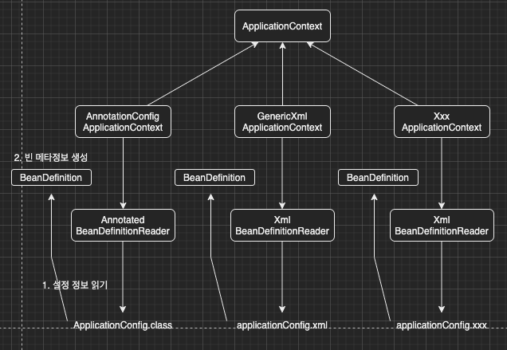

이번 장에서는 [스프링 컨테이너와 빈 (링크)](https://imprint.tistory.com/166)에 이어서 BeanFactory와 ApplicationContext에 대해서 알아본다.
글의 하단부에 참고한 강의와 공식문서의 경로를 첨부하였으므로 자세한 사항은 강의나 공식문서에서 확인한다.
모든 코드는 [깃허브 (링크)](https://github.com/roy-zz/spring)에 올려두었다.

---

### BeanFactory

스프링 컨테이너인 ApplicationContext의 최상위 인터페이스이며 빈을 관리하고 조회하는 역할을 한다.
스프링 컨테이너와 빈을 살펴본 장에서 사용한 대부분의 기능이 BeanFactory가 제공하는 기능이다.



---

### ApplicationContext

BeanFactory의 모든 기능을 상속받고 있으며 추가로 필요한 기능들을 상속받아서 우리가 필요한 대부분의 기능을 가지고 있다.



각 인터페이스의 역할은 아래와 같다.

- MessageSource: 메시지 소스를 활용한 국제화 기능(각 국가에 맞는 언어로 출력)

- EnvironmentCapable: 여러 환경(상용, 개발, 로컬 등)에 맞게 구분하여 처리

- ApplicationEventPublisher: 이벤트를 발행하고 구독하는 모델을 편리하게 지원

- ResourceLoader: 파일, Class Path, 외부 등에서 리소스를 편리하게 조회

---

### 설정 형식 지원

우리는 [이전 장(링크)](https://imprint.tistory.com/166)에서 빈을 조회하는 테스트를 진행하면서 어노테이션을 기반으로 빈을 등록하였다.
이렇게 어노테이션을 사용하여 빈을 등록하는 상황에서는 AnnotationConfigApplicationContext를 사용하였다.
스프링은 어노테이션이 아니라 XML을 사용하여 빈을 등록하는 방법도 지원한다.

#### XML을 통한 빈 등록

필자의 경우 처음 스프링을 접하였을 때부터 어노테이션을 사용하여 빈을 등록하는 방식으로 개발을 진행하였다.
하지만 최근에 맡게된 프로젝트는 XML을 기반으로 빈을 등록하는 방식이었다.
언제 어떠한 환경에서 개발하게 될지 모르는 일이니 legacy한 옛스러운 방식이더라도 배워두는 편이 좋다.

아래와 같이 src/main/resource 경로에 applicationConfig.xml 파일을 추가한다.

```xml
<?xml version="1.0" encoding="UTF-8"?>
<beans xmlns="http://www.springframework.org/schema/beans"
       xmlns:xsi="http://www.w3.org/2001/XMLSchema-instance"
       xsi:schemaLocation="http://www.springframework.org/schema/beans http://www.springframework.org/schema/beans/spring-beans.xsd">

    <bean id="memberService" class="com.roy.spring.service.impl.MemberServiceImpl">
        <constructor-arg name="memberRepository" ref="memberRepository" />
    </bean>
    <bean id="memberRepository"
          class="com.roy.spring.repository.impl.MemoryMemberRepository" />
    <bean id="orderService" class="com.roy.spring.service.impl.OrderServiceImpl">
        <constructor-arg name="memberRepository" ref="memberRepository" />
        <constructor-arg name="discountPolicy" ref="discountPolicy" />
    </bean>
    <bean id="discountPolicy" class="com.roy.spring.service.impl.RatioDiscountPolicy" />
</beans>
```

사용할 때는 아래와 같이 GenericXmlApplicationContext를 사용하면 된다.

```java
public class ApplicationContextInfoTest {
    ApplicationContext xmlAc = new GenericXmlApplicationContext("applicationConfig.xml");

    @Test
    @DisplayName("XML 빈 등록 테스트")
    void findViaXmlApplicationContext() {
        MemberService memberService = xmlAc.getBean("memberService", MemberService.class);
        assertTrue(memberService instanceof MemberServiceImpl);
    }
}
```

추후 XML을 사용하는 방법에 대한 자세한 사항이 필요하다면 [여기 (링크)](https://spring.io/projects/spring-framework)를 통해서 확인하면 된다.

---

### BeanDefinition(빈 설정 메타 정보)

우리는 어노테이션을 통한 빈등록, XML을 통한 빈등록에 대해서 알아보았다.
스프링은 BeanDefinition이라는 추상화를 통해서 여러가지 설정 형식을 지원하고 있다.
XML을 읽어서 BeanDefinition을 만들거나 자바 코드를 읽어서 BeanDefinition을 만든다. 
스프링 컨테이너는 BeanDefinition이 무엇을 통해 생성되었는지 알 필요없이 빈을 생성할 수 있게 되는 것이다.



그림을 조금 더 자세하게 그려보면 아래와 같은 그림이 그려진다.



AnnotationConfigApplicationContext는 AnnotatedBeanDefinitionReader를 사용하여 ApplicationConfig.class을 읽어서 BeanDefinition을 생성한다.
GenericXmlApplicationContext는 XmlBeanDefinitionReader를 사용하여 applicationConfig.xml 설정 정보를 읽고 BeanDefinition을 생성한다.
새로운 형식의 설정 정보가 추가되면 XxxBeanDefinitionReader를 생성하여 BeanDefinition을 생성하면 된다.

---

### BeanDefinition 정보

BeanDefinition은 아래와 같은 여러가지 정보를 가지고 있다.

- BeanClassName: 생성할 빈의 클래스 이름이며 자바 설정으로 팩토리 역할의 빈을 사용하면 값이 없다.
- FactoryBeanName: 팩토리 역할의 빈을 사용하는 경우의 이름이며 예시에서 ApplicationConfig.class가 된다.
- FactoryMethodName: 빈을 생성할 팩토리 메서드의 이름.
- Scope: 싱글톤(기본값)
- LazyInit: 최초에는 초기화되지 않고 사용 시점에 초기화를 하는지 여부 
  JPA의 지연 로딩과 비슷한 개념이며 필자는 순환 참조시에 발생하는 문제를 해결하기위해 사용하였다.
- InitMethodName: 빈을 생성하고 의존관계를 적용한 뒤에 호출되는 초기화 메서드 이름
- DestroyMethodName: 빈의 생명주기가 끝나고 제거하기 직전에 호출되는 메서드 이름
- ConstructorArgumentValues: 의존관계 주입에서 사용된다. (팩토리 역할의 빈을 사용하면 값이 없다) 
- PropertyValues: 의존관계 주입에서 사용된다. (팩토리 역할의 빈을 사용하면 값이 없다)

이러한 정보를 출력하는 코드는 아래와 같다.

```java
public class ApplicationContextInfoTest {
    AnnotationConfigApplicationContext ac = new AnnotationConfigApplicationContext(ApplicationConfig.class);
    @Test
    @DisplayName("BeanDefinition 메타정보 조회 테스트")
    void getBeanDefinitionMetaInfo() {
        String[] beanDefinitionNames = ac.getBeanDefinitionNames();
        for (String beanDefinitionName : beanDefinitionNames) {
            BeanDefinition beanDefinition = ac.getBeanDefinition(beanDefinitionName);
            if (beanDefinition.getRole() == ROLE_APPLICATION) {
                System.out.println("beanDefinition.getBeanClassName() = " + beanDefinition.getBeanClassName());
                System.out.println("beanDefinition.getFactoryBeanName() = " + beanDefinition.getFactoryBeanName());
                System.out.println("beanDefinition.getFactoryMethodName() = " + beanDefinition.getFactoryMethodName());
                System.out.println("beanDefinition.getScope() = " + beanDefinition.getScope());
                System.out.println("beanDefinition.isLazyInit() = " + beanDefinition.isLazyInit());
                System.out.println("beanDefinition.getInitMethodName() = " + beanDefinition.getInitMethodName());
                System.out.println("beanDefinition.getDestroyMethodName() = " + beanDefinition.getDestroyMethodName());
                System.out.println("beanDefinition.getConstructorArgumentValues() = " + beanDefinition.getConstructorArgumentValues());
                System.out.println("beanDefinition.getPropertyValues() = " + beanDefinition.getPropertyValues());
            }
        }
    }
}
```

출력된 결과는 아래와 같다. (하나의 BeanDefinition만 예로 살펴본다.)

```bash
beanDefinition.getBeanClassName() = null
beanDefinition.getFactoryBeanName() = applicationConfig
beanDefinition.getFactoryMethodName() = discountPolicy
beanDefinition.getScope() = 
beanDefinition.isLazyInit() = false
beanDefinition.getInitMethodName() = null
beanDefinition.getDestroyMethodName() = (inferred)
beanDefinition.getConstructorArgumentValues() = org.springframework.beans.factory.config.ConstructorArgumentValues@cb
beanDefinition.getPropertyValues() = PropertyValues: length=0
```

---

**참고한 강의:** https://www.inflearn.com/course/%EC%8A%A4%ED%94%84%EB%A7%81-%ED%95%B5%EC%8B%AC-%EC%9B%90%EB%A6%AC-%EA%B8%B0%EB%B3%B8%ED%8E%B8

**Spring 공식 문서:** https://docs.spring.io/spring-framework/docs/current/reference/html/