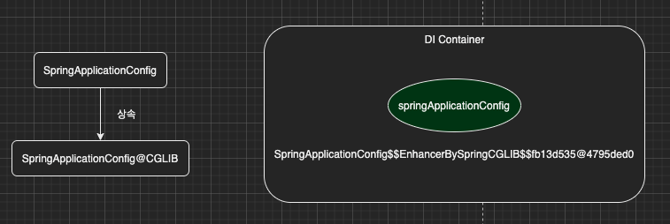

이번 장에서는 [DI Container와 싱글톤(링크)](https://imprint.tistory.com/168)에 이어 @Configuration과 싱글톤에 대해서 알아본다.
글의 하단부에 참고한 강의와 공식문서의 경로를 첨부하였으므로 자세한 사항은 강의나 공식문서에서 확인한다.
모든 코드는 [깃허브 (링크)](https://github.com/roy-zz/spring)에 올려두었다.

---

### @Configuration

@Configuration은 구성(설정) 파일을 위한 클래스에 사용되는 어노테이션이다.
정확히 어떠한 역할을 하는지 테스트를 통해서 알아보도록 한다.

DI 컨테이너의 관리를 받는 **SpringApplicationConfig** 클래스를 확인해본다.

```java
@Configuration
public class SpringApplicationConfig {
    @Bean
    public MemberService memberService() {
        return new MemberServiceImpl(memberRepository());
    }
    @Bean
    public OrderService orderService() {
        return new OrderServiceImpl(discountPolicy(), memberRepository());
    }
    @Bean
    public MemberRepository memberRepository() {
        return new MemoryMemberRepository();
    }
    @Bean
    public DiscountPolicy discountPolicy() {
        return new FixedDiscountPolicy();
    }
    @Bean
    public StatefulService statefulService() {
        return new StatefulService();
    }
}
```

MemoryMemberRepository의 경우 
1. MemberService 빈을 생성할 때
2. OrderService 빈을 생성할 때
3. MemberRepository 빈을 생성할 때
총 세 번 new를 사용하여 새로운 MemoryMemberRepository를 생성한다.
코드만 봤을 때는 싱글톤으로 유지될 수가 없다.

MemoryRepository가 과연 동일한 객체인지 확인해보도록 한다.

```java
public class SingletonTest {
    @Test
    @DisplayName("@Configuration 싱글톤 검증 테스트")
    void configurationSingletonValidateTest() {
        ApplicationContext ac = new AnnotationConfigApplicationContext(SpringApplicationConfig.class);

        MemberServiceImpl memberService = ac.getBean("memberService", MemberServiceImpl.class);
        OrderServiceImpl orderService = ac.getBean("orderService", OrderServiceImpl.class);
        MemberRepository memberRepository = ac.getBean("memberRepository", MemberRepository.class);

        System.out.println("memberService.getMemberRepository = " + memberService.getMemberRepository());
        System.out.println("orderService.getMemberRepository = " + orderService.getMemberRepository());
        System.out.println("memberRepository = " + memberRepository);

        assertEquals(memberService.getMemberRepository(), memberRepository);
        assertEquals(orderService.getMemberRepository(), memberRepository);
    }
}
```

SpringApplicationConfig만 봤을 때는 분명 싱글톤이 아니라 총 세개의 MemoryMemberRepository가 생성되었어야 한다.
하지만 세 개의 MemberRepository의 동일함을 검증하는 테스트를 통과하였다.
출력은 아래와 같다.

```bash
memberService.getMemberRepository = com.roy.spring.repository.impl.MemoryMemberRepository@4c4748bf
orderService.getMemberRepository = com.roy.spring.repository.impl.MemoryMemberRepository@4c4748bf
memberRepository = com.roy.spring.repository.impl.MemoryMemberRepository@4c4748bf
```

우리의 자바 코드와는 상관없이 DI 컨테이너는 빈을 싱글톤으로 유지시켜준다.

---

#### @Bean 메서드 호출 확인

아래와 같이 SpringApplicationConfig 클래스에 메서드가 호출되었을 때 로그가 출력되도록 수정하였다.

```java
@Configuration
public class SpringApplicationConfig {
    @Bean
    public MemberService memberService() {
        System.out.println("call memberService");
        return new MemberServiceImpl(memberRepository());
    }
    @Bean
    public OrderService orderService() {
        System.out.println("call orderService");
        return new OrderServiceImpl(discountPolicy(), memberRepository());
    }
    @Bean
    public MemberRepository memberRepository() {
        System.out.println("call memberRepository");
        return new MemoryMemberRepository();
    }
    // 이하 생략
}
```

이전에 실행시킨 테스트 코드를 다시 실행시켜서 로그가 몇 번 호출되는지 확인해본다.

```bash
DEBUG org.springframework.beans.factory.support.DefaultListableBeanFactory - Creating shared instance of singleton bean 'memberService'
call memberService
DEBUG org.springframework.beans.factory.support.DefaultListableBeanFactory - Creating shared instance of singleton bean 'memberRepository'
call memberRepository
DEBUG org.springframework.beans.factory.support.DefaultListableBeanFactory - Creating shared instance of singleton bean 'orderService'
call orderService
```

우리의 예상과는 다르게 MemberRepository를 생성하는 메서드는 한 번 호출되었다.
또한 memberRepository 빈을 생성하는 작업이 메서드를 호출하기 전에 시작되었다.

---

### @Configuration & CGLIB

우리는 이전에 자바 코드로는 총 세 개의 MemberRepository가 생성되어야 하지만 실제로 하나만 생성되었으며
빈을 생성하는 메서드 또한 한 번만 호출되는 것을 눈으로 확인하였다.
이렇게 작동하는 이유는 DI 컨테이너가 싱글톤을 유지하기 위해서 이미 빈이 존재하는 경우에 새로운 빈을 생성하지 않고 이전에 생성된 빈을 사용하기 때문이다.

SpringApplicationConfig 또한 빈으로 등록되어야하는데 어떠한 형태인지 로그를 찍어서 확인해보도록 한다.

```java
public class SingletonTest {
    @Test
    @DisplayName("SpringApplicationConfig 객체 확인 테스트")
    void configurationClassInstanceCheckTest() {
        ApplicationContext ac = new AnnotationConfigApplicationContext(SpringApplicationConfig.class);
        SpringApplicationConfig configBean = ac.getBean(SpringApplicationConfig.class);
        System.out.println("configBean = " + configBean);
    }
}
```

출력된 결과는 아래와 같이 우리가 만든 클래스의 객체가 아니라 CGLIB라는 문구가 포함된 객체정보가 출력된다.

```bash
configBean = com.roy.spring.configuration.SpringApplicationConfig$$EnhancerBySpringCGLIB$$fb13d535@4795ded0
```

우리가 만든 Config 객체가 사용되는 것이 아니라 아니라 CGLIB라는 라이브러리를 통해서 생성된 객체를 사용하는 것을 알 수 있다.
CGLIB는 바이트코드를 조작하는 라이브러리이며 자세한 사항은 [공식 깃허브 페이지(링크)](https://github.com/cglib/cglib)에서 확인하도록 한다.

---

#### CGLIB Process

스프링은 CGLIB를 통해서 우리가 만든 클래스를 상속받는 클래스로 빈을 생성하여 DI 컨테이너에 등록시켰다.



이러한 기술을 통해서 우리는 우리가 작성한 코드와 무관(정확히 무관하지는 않지만)하게 싱글톤 빈을 보장받을 수 있는 것이다.

SpringApplicationConfig@CGLIB의 코드는 아마 아래와 같이 구현되어 싱글톤을 유지하고 있을 것이다.
어디까지나 추측일 뿐 실제로 생성되는 클래스는 상단에서 첨부한 공식 깃허브 페이지를 방문하여 참고하길 바란다.

```java
public class SpringApplicationCGLIBConfig extends SpringApplicationConfig {
    Map<String, Object> beans = new HashMap<>();
    @Bean
    @Override
    public MemberRepository memberRepository() {
        if (beans.containsKey("memberRepository")) {
            return (MemberRepository) beans.get("memberRepository");
        } else {
            MemberRepository memberRepository = super.memberRepository();
            beans.put("memberRepository", memberRepository);
            return memberRepository;
        }
    }
}
```

동일한 이름의 key가 있으면 기존에 저장되어 있던 객체를 반환한다.
그렇지 않다면 부모 클래스(SpringApplicationConfig)의 메서드를 호출하여 새로운 객체를 만들고 Map에 저장한 뒤 리턴한다.

---

### @Configuration vs @Bean

SpringApplicationConfig 클래스에서 @Configuration 어노테이션을 제거한 뒤 테스트 코드를 실행하여 다시 로그를 확인해본다.

CGLIB를 통해 생성된 클래스로 생성된 객체가 아니라 우리가 작성한 클래스로 생성된 객체를 확인할 수 있다.

```bash
configBean = com.roy.spring.configuration.SpringApplicationConfig@403f0a22
```

또한 MemberRepository를 생성하는 메서드가 세 번 호출되며 싱글톤을 검증하는 테스트가 실패하는 것을 확인할 수 있다.

```bash
call memberService
call memberRepository
DEBUG org.springframework.beans.factory.support.DefaultListableBeanFactory - Creating shared instance of singleton bean 'orderService'
call orderService
call memberRepository
DEBUG org.springframework.beans.factory.support.DefaultListableBeanFactory - Creating shared instance of singleton bean 'memberRepository'
call memberRepository
```

구성 정보를 가지는 클래스 파일에 @Configuration 어노테이션을 사용하지 않으면 싱글톤으로 작동하지 않는다.
고민없이 구성 정보를 가지는 클래스 파일에는 @Configuration 어노테이션을 사용해야한다.

---

**참고한 강의:** https://www.inflearn.com/course/%EC%8A%A4%ED%94%84%EB%A7%81-%ED%95%B5%EC%8B%AC-%EC%9B%90%EB%A6%AC-%EA%B8%B0%EB%B3%B8%ED%8E%B8

**Spring 공식 문서:** https://docs.spring.io/spring-framework/docs/current/reference/html/