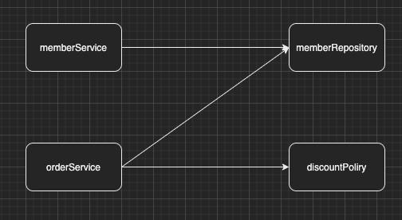

이번 장에서는 스프링 컨테이너와 스프링 빈에 대해서 알아본다.
글의 하단부에 참고한 강의와 공식문서의 경로를 첨부하였으므로 자세한 사항은 강의나 공식문서에서 확인한다.
모든 코드는 [깃허브 (링크)](https://github.com/roy-zz/spring)에 올려두었다.

---

### 스프링 컨테이너

일반적으로 ApplicationContext를 스프링 컨테이너라고 한다.
정확히는 ApplicationContext는 인터페이스이며 이를 구현한 구현체들이 스프링 컨테이너가 된다.

설정(구성) 정보를 가지고 있는 ApplicationConfig클래스는 아래와 같다.

```java
@Configuration
public class ApplicationConfig {

    @Bean
    protected MemberService memberService() {
        return new MemberServiceImpl(memberRepository());
    }

    @Bean
    protected OrderService orderService() {
        return new OrderServiceImpl(discountPolicy(), memberRepository());
    }

    @Bean
    protected MemberRepository memberRepository() {
        return new MemoryMemberRepository();
    }

    @Bean
    protected DiscountPolicy discountPolicy() {
        return new FixedDiscountPolicy();
    }
}
```

스프링 컨테이너(ApplicationContext)를 생성할 때 설정 정보를 가지고 있는 클래스를 파라미터로 전달한다.

```java
ApplicationContext ac = new AnnotationConfigApplicationContext(ApplicationConfig.class);
```

스프링 컨테이너는 파라미터로 받은 클래스 정보를 사용하여 스프링 빈을 등록한다.
ApplicationConfig 클래스를 토대로 생성된 스프링 컨테이너 테이블은 아래와 같다.

|    |    |
| -- | -- |
| memberService | MemberServiceImpl@0x01 |
| orderService | OrderServiceImpl@0x02 |
| memberRepository | MemoryMemberRepository@0x03 |
| discountPolicy | FixedDiscountPolicy@0x04 |

빈 이름의 기본값은 메서드 명을 따라가지만 @Bean(name = "memberService2")와 같이 직접 이름을 부여할 수도 있다.
만약 같은 이름의 빈이 있다면 무시되거나 기존 빈을 덮어쓰기 때문에 오류가 발생할 수 있으므로 빈 이름은 항상 다른 이름을 사용해야한다.

---

스프링 컨테이너는 파라미터 설정(ApplicationConfig.class) 정보를 참고해서 의존관계를 주입(DI)한다.



스프링은 빈을 생성하고 의존관계를 주입하는 단계가 나누어져 있다. 
자바 코드로 스프링 빈을 등록하면 생성자를 호출하면서 의존관계 주입도 한 번에 처리된다.
조금 복잡해보일 수 있지만 추후에 의존관계 자동 주입을 사용하면 간단하게 의존관계 주입이 가능하다.

---

### 빈 조회

#### 컨테이너에 등록된 모든 빈 출력

```java
public class ApplicationContextInfoTest {
    AnnotationConfigApplicationContext ac = new AnnotationConfigApplicationContext(ApplicationConfig.class);
    @Test
    @DisplayName("모든 빈 출력하기")
    void findAllBean() {
        String[] beanDefinitionNames = ac.getBeanDefinitionNames();
        for (String beanDefinitionName : beanDefinitionNames) {
            Object bean = ac.getBean(beanDefinitionName);
            System.out.println("name: " + beanDefinitionName + ", object: " + bean);
        }
    }
}
```

출력 결과는 아래와 같다.

```bash
name: org.springframework.context.annotation.internalConfigurationAnnotationProcessor, object: org.springframework.context.annotation.ConfigurationClassPostProcessor@5c10f1c3
name: org.springframework.context.annotation.internalAutowiredAnnotationProcessor, object: org.springframework.beans.factory.annotation.AutowiredAnnotationBeanPostProcessor@7ac2e39b
name: org.springframework.context.annotation.internalCommonAnnotationProcessor, object: org.springframework.context.annotation.CommonAnnotationBeanPostProcessor@78365cfa
name: org.springframework.context.event.internalEventListenerProcessor, object: org.springframework.context.event.EventListenerMethodProcessor@64a8c844
name: org.springframework.context.event.internalEventListenerFactory, object: org.springframework.context.event.DefaultEventListenerFactory@3f6db3fb
name: applicationConfig, object: com.roy.spring.configuration.PureApplicationConfig$$EnhancerBySpringCGLIB$$5849a5a3@52de51b6
name: memberService, object: com.roy.spring.service.impl.MemberServiceImpl@18c5069b
name: orderService, object: com.roy.spring.service.impl.OrderServiceImpl@3a0d172f
name: memberRepository, object: com.roy.spring.repository.impl.MemoryMemberRepository@68ad99fe
name: discountPolicy, object: com.roy.spring.service.impl.FixedDiscountPolicy@485e36bc
```

org.springframework로 시작하는 빈들은 스프링에서 사용하는 빈이며 아래쪽의 빈들은 애플리케이션을 위한 빈들이다.

---

### 애플리케이션 빈 출력

내가 개발하고 있는 애플리케이션에 관련된 빈만 출력하고 싶다면 아래와 같이 하면 된다.
ApplicationContext를 생성할 때 꼭 구현체인 AnnotationConfigApplicationContext를 사용해야한다.
그렇지 않으면 BeanDefinition을 사용할 수 없다.

BeanDefinition Role은 크게 두 가지가 있다.
- ROLE_APPLICATION: 직접 등록한 애플리케이션 빈
- ROLE_INFRASTRUCTURE: 스프링이 내부에서 사용하는 빈

```java
public class ApplicationContextInfoTest {
    AnnotationConfigApplicationContext ac = new AnnotationConfigApplicationContext(ApplicationConfig.class);
    @Test
    @DisplayName("애플리케이션 빈 출력하기")
    void findApplicationBean() {
        String[] beanDefinitionNames = ac.getBeanDefinitionNames();
        for (String beanDefinitionName : beanDefinitionNames) {
            BeanDefinition beanDefinition = ac.getBeanDefinition(beanDefinitionName);
            if (beanDefinition.getRole() == ROLE_APPLICATION) {
                Object bean = ac.getBean(beanDefinitionName);
                System.out.println("name: " + beanDefinitionName + ", object: " + bean);
            }
        }
    }
}
```

출력 결과는 아래와 같이 애플리케이션 관련 빈들만 출력되었다.

```bash
name: applicationConfig, object: com.roy.spring.configuration.PureApplicationConfig$$EnhancerBySpringCGLIB$$5849a5a3@5c10f1c3
name: memberService, object: com.roy.spring.service.impl.MemberServiceImpl@7ac2e39b
name: orderService, object: com.roy.spring.service.impl.OrderServiceImpl@78365cfa
name: memberRepository, object: com.roy.spring.repository.impl.MemoryMemberRepository@64a8c844
name: discountPolicy, object: com.roy.spring.service.impl.FixedDiscountPolicy@3f6db3fb
```

---

#### 빈 이름으로 타입으로 조회

같은 타입의 다른 이름을 가진 여러 빈이 있을 때 사용한다.
빈의 이름과 타입으로 조회하는 방법이며 만약 존재하지 않는 빈을 찾으려고 한다면 NoSuchBeanDefinitionException이 발생한다.

```java
public class ApplicationContextInfoTest {
    AnnotationConfigApplicationContext ac = new AnnotationConfigApplicationContext(ApplicationConfig.class);
    @Test
    @DisplayName("빈 이름으로 조회")
    void findBeanByName() {
        MemberService memberService = ac.getBean("memberService", MemberService.class);
        assertTrue(memberService instanceof MemberServiceImpl);

        assertThrows(NoSuchBeanDefinitionException.class, () -> {
           ac.getBean("AnonymousBean");
        });
    }
}
```

---

#### 타입으로 조회

```java
public class ApplicationContextInfoTest {
    AnnotationConfigApplicationContext ac = new AnnotationConfigApplicationContext(ApplicationConfig.class);
    @Test
    @DisplayName("타입으로 조회")
    void findByType() {
        MemberService memberService = ac.getBean(MemberService.class);
        assertTrue(memberService instanceof MemberServiceImpl);
    }
}
```

---

#### 구체타입으로 조회

```java
public class ApplicationContextInfoTest {
    AnnotationConfigApplicationContext ac = new AnnotationConfigApplicationContext(ApplicationConfig.class);
    @Test
    @DisplayName("구체 타입으로 조회")
    void findBySpecificType() {
        MemberService memberService = ac.getBean("memberService", MemberServiceImpl.class);
        assertTrue(memberService instanceof MemberServiceImpl);
    }
}
```

---

### 동일한 타입의 빈이 여러 개인 상황에서의 조회

동일한 타입의 빈이 등록되도록 만들기위해 아래와 같은 Configuration 클래스를 생성하였다.

```java
@Configuration
public class TestConfig {
    @Bean
    public MemberRepository redisMemberRepository() {
        return new MemoryMemberRepository();
    }
    @Bean
    public MemberRepository memcachedMemberRepository() {
        return new MemoryMemberRepository();
    }
}
```

---

#### NoUniqueBeanDefinitionException

동일한 타입의 빈이 여러개 있으면 중복 예외가 발생한다.

```java
public class ApplicationContextInfoTest {
    private final AnnotationConfigApplicationContext hasDuplicatedTypeBeansAc
            = new AnnotationConfigApplicationContext(TestConfig.class);

    @Test
    @DisplayName("동일 타입 조회 NoUniqueBeanDefinitionException 발생 테스트")
    void findDuplicatedTypeBeanTest() {
        assertThrows(NoUniqueBeanDefinitionException.class, () -> {
            hasDuplicatedTypeBeansAc.getBean(MemberRepository.class);
        });
    }
    
}
```

---

#### 이름 지정하여 조회

동일한 타입의 빈이 여러개 있어서 중복 오류가 발생한다면 빈의 이름까지 지정하여 조회하면 예외가 발생하지 않는다.

```java
public class ApplicationContextInfoTest {
    private final AnnotationConfigApplicationContext hasDuplicatedTypeBeansAc
            = new AnnotationConfigApplicationContext(TestConfig.class);
    @Test
    @DisplayName("동일 타입 조회 빈 이름 지정 테스트")
    void findDuplicatedTypeBeanByNameTest() {
        MemberRepository memberRepository
                = hasDuplicatedTypeBeansAc.getBean("redisMemberRepository", MemberRepository.class);
        assertTrue(memberRepository instanceof MemoryMemberRepository);
    }
}
```

---

#### 특정 타입을 모두 조회

getBeansOfType을 사용하여 특정 타입의 모든 빈을 맵으로 리턴받을 수 있다.

```java
public class ApplicationContextInfoTest {
    private final AnnotationConfigApplicationContext hasDuplicatedTypeBeansAc
            = new AnnotationConfigApplicationContext(TestConfig.class);
    @Test
    @DisplayName("특정 타입 모두 조회 테스트")
    void findAllDuplicatedTypeTest() {
        Map<String, MemberRepository> mapOfBeans = hasDuplicatedTypeBeansAc.getBeansOfType(MemberRepository.class);
        for (String key : mapOfBeans.keySet()) {
            System.out.println("key: " + key + ", value: " + mapOfBeans.get(key));
        }
    }
}
```

출력 결과는 아래와 같다.

```bash
key: redisMemberRepository, value: com.roy.spring.repository.impl.MemoryMemberRepository@5553d0f5
key: memcachedMemberRepository, value: com.roy.spring.repository.impl.MemoryMemberRepository@1af687fe
```

---

### 상속 관계 조회

부모 타입으로 조회하면 모든 자식 타입도 함께 조회된다.
모든 객체의 최상단 부모인 Object 타입으로 조회하면 모든 빈을 조회할 수 있다.

상속 관계 조회를 테스트하기 위해 아래와 같이 TestConfig.class 파일을 수정한다.

```java
@Configuration
public class TestConfig {
    @Bean
    public MemberRepository redisMemberRepository() {
        return new MemoryMemberRepository();
    }

    @Bean
    public MemberRepository memcachedMemberRepository() {
        return new MemoryMemberRepository();
    }

    @Bean
    public DiscountPolicy ratioDiscountPolicy() {
        return new RatioDiscountPolicy();
    }

    @Bean
    public DiscountPolicy fixedDiscountPolicy() {
        return new FixedDiscountPolicy();
    }
}
```

#### NoUniqueBeanDefinitionException

부모 타입으로 조회하는 경우 자식 타입의 빈이 둘 이상이라면 NoUniqueBeanDefinitionException이 발생한다.

```java
public class ApplicationContextInfoTest {
    private final AnnotationConfigApplicationContext hasDuplicatedTypeBeansAc
            = new AnnotationConfigApplicationContext(TestConfig.class);
    @Test
    @DisplayName("동일 부모 조회 NoUniqueBeanDefinitionException 발생 테스트")
    void findDuplicatedParentTypeBeanTest() {
        assertThrows(NoUniqueBeanDefinitionException.class, () -> {
            hasDuplicatedTypeBeansAc.getBean(DiscountPolicy.class);
        });
    }
}
```

---

#### 이름을 지정하여 조회

부모 타입이 동일한 여러개의 빈이 있는 경우 이름을 지정하면 원하는 빈을 조회할 수 있다.

```java
public class ApplicationContextInfoTest {
    private final AnnotationConfigApplicationContext hasDuplicatedTypeBeansAc
            = new AnnotationConfigApplicationContext(TestConfig.class);
    @Test
    @DisplayName("동일 부모 조회 이름 지정 테스트")
    void findDuplicatedParentTypeBeanByNameTest() {
        DiscountPolicy ratioDiscountPolicy
                = hasDuplicatedTypeBeansAc.getBean("ratioDiscountPolicy", DiscountPolicy.class);
        assertTrue(ratioDiscountPolicy instanceof RatioDiscountPolicy);
    }
}
```

---

#### 특정 자식 타입으로 조회

부모 타입이 동일한 여러개의 빈이 있는 경우 자식 타입을 명확히 지정하면 원하는 빈을 조회할 수 있다.
만약 자식 타입의 빈도 여러개라면 NoUniqueBeanDefinitionException이 발생한다.

```java
public class ApplicationContextInfoTest {
    private final AnnotationConfigApplicationContext hasDuplicatedTypeBeansAc
            = new AnnotationConfigApplicationContext(TestConfig.class);
    @Test
    @DisplayName("동일 부모 조회 타입 지정 테스트")
    void findDuplicatedParentTypeBeanBySpecificTypeTest() {
        DiscountPolicy ratioDiscountPolicy
                = hasDuplicatedTypeBeansAc.getBean(RatioDiscountPolicy.class);
        assertTrue(ratioDiscountPolicy instanceof RatioDiscountPolicy);
    }
}
```

---

#### 부모 타입으로 모두 조회

getBeansOfType으로 부모 타입을 지정하는 경우 Map형태로 자식 타입의 빈이 모두 조회된다.

```java
public class ApplicationContextInfoTest {
    private final AnnotationConfigApplicationContext hasDuplicatedTypeBeansAc
            = new AnnotationConfigApplicationContext(TestConfig.class);
    @Test
    @DisplayName("부모 타입으로 모두 조회 테스트")
    void findByParentTypeTest() {
        Map<String, DiscountPolicy> beansOfType = hasDuplicatedTypeBeansAc.getBeansOfType(DiscountPolicy.class);
        assertEquals(2, beansOfType.size());
        for (String key : beansOfType.keySet()) {
            System.out.println("key: " + key + ", value: " + beansOfType.get(key));
        }
    }
}
```

출력 결과는 아래와 같다.

```bash
key: ratioDiscountPolicy, value: com.roy.spring.service.impl.RatioDiscountPolicy@5c530d1e
key: fixedDiscountPolicy, value: com.roy.spring.service.impl.FixedDiscountPolicy@6c25e6c4
```

---

#### Object 타입으로 모두 조회

Object 타입으로 조회하는 경우 모든 빈이 조회된다.

```java
public class ApplicationContextInfoTest {
    private final AnnotationConfigApplicationContext hasDuplicatedTypeBeansAc
            = new AnnotationConfigApplicationContext(TestConfig.class);
    @Test
    @DisplayName("Object 타입으로 모두 조회 테스트")
    void findByObjectTypeTest() {
        Map<String, Object> beansOfType = hasDuplicatedTypeBeansAc.getBeansOfType(Object.class);
        for (String key : beansOfType.keySet()) {
            System.out.println("key: " + key + ", value: " + beansOfType.get(key));
        }
    }
}
```

출력 결과는 아래와 같다.

```bash
key: org.springframework.context.annotation.internalConfigurationAnnotationProcessor, value: org.springframework.context.annotation.ConfigurationClassPostProcessor@47a5b70d
key: org.springframework.context.annotation.internalAutowiredAnnotationProcessor, value: org.springframework.beans.factory.annotation.AutowiredAnnotationBeanPostProcessor@424fd310
key: org.springframework.context.annotation.internalCommonAnnotationProcessor, value: org.springframework.context.annotation.CommonAnnotationBeanPostProcessor@1a45193b
key: org.springframework.context.event.internalEventListenerProcessor, value: org.springframework.context.event.EventListenerMethodProcessor@38f116f6
key: org.springframework.context.event.internalEventListenerFactory, value: org.springframework.context.event.DefaultEventListenerFactory@5286c33a
key: testConfig, value: com.roy.spring.service.impl.config.TestConfig$$EnhancerBySpringCGLIB$$2521e3b8@6e6d5d29
key: redisMemberRepository, value: com.roy.spring.repository.impl.MemoryMemberRepository@5c530d1e
key: memcachedMemberRepository, value: com.roy.spring.repository.impl.MemoryMemberRepository@6c25e6c4
key: ratioDiscountPolicy, value: com.roy.spring.service.impl.RatioDiscountPolicy@85e6769
key: fixedDiscountPolicy, value: com.roy.spring.service.impl.FixedDiscountPolicy@c5ee75e
// 중략
key: applicationStartup, value: org.springframework.core.metrics.DefaultApplicationStartup@4e858e0a
key: org.springframework.context.annotation.ConfigurationClassPostProcessor.importRegistry, value: []
key: messageSource, value: Empty MessageSource
key: applicationEventMulticaster, value: org.springframework.context.event.SimpleApplicationEventMulticaster@435fb7b5
key: lifecycleProcessor, value: org.springframework.context.support.DefaultLifecycleProcessor@4e70a728
```

---

**참고한 강의:** https://www.inflearn.com/course/%EC%8A%A4%ED%94%84%EB%A7%81-%ED%95%B5%EC%8B%AC-%EC%9B%90%EB%A6%AC-%EA%B8%B0%EB%B3%B8%ED%8E%B8

**Spring 공식 문서:** https://docs.spring.io/spring-framework/docs/current/reference/html/