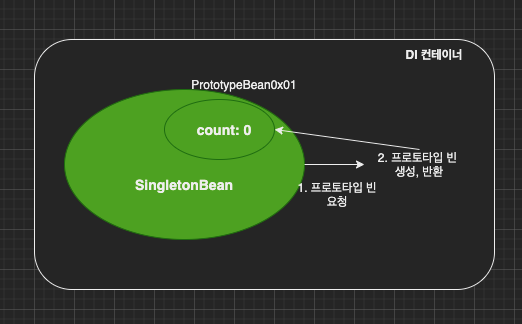
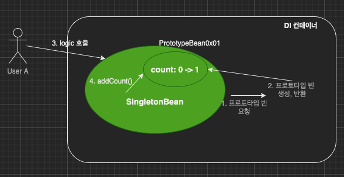
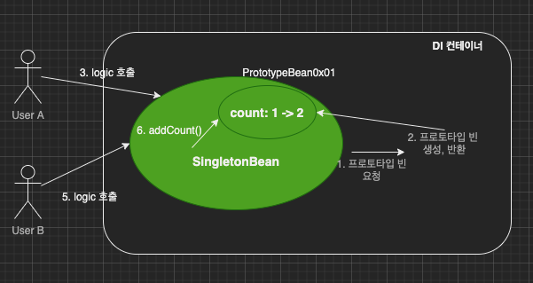

이번 장에서는 빈의 프로토타입 스코프에 대해서 알아본다.
글의 하단부에 참고한 강의와 공식문서의 경로를 첨부하였으므로 자세한 사항은 강의나 공식문서에서 확인한다.
모든 코드는 [깃허브 (링크)](https://github.com/roy-zz/spring)에 올려두었다.

---

### 빈 스코프

우리는 지금까지 스프링이 실행되면서 DI 컨테이너가 실행되어 빈을 관리하고 DI 컨테이너가 종료되면서 빈이 사라지는 것을 확인하였다.
이것은 빈의 기본 스코프가 싱글톤 스코프로 생성되기 때문이다. 스코프는 빈이 존재할 수 있는 범위를 뜻한다.

- 싱글톤: 기본 스코프로 DI 컨테이너의 시작과 종료까지 유지되는 가장 넓은 범위의 스코프.
- 프로토타입: 빈의 생성과 의존관계 주입까지 유지되는 스코프.
이외의 웹 관련 스코프는 다음 장에서 알아보도록 한다.

---

### 프로토타입 스코프

프로토타입 스코프의 경우 빈을 DI 컨테이너에서 조회하면 DI 컨테이너는 항상 새로운 객체를 생성해서 반환한다.
이렇게 생성된 새로운 객체들은 DI 컨테이너에 의해 관리받지 않는다.

싱글톤 빈과 프로토타입 빈의 차이를 비교하기 위해 아래의 테스트 코드를 실행시켜본다.

```java
public class BeanScopeTest {
    @Test
    public void beanScopeTest() {
        AnnotationConfigApplicationContext ac = new AnnotationConfigApplicationContext(SingletonBean.class, PrototypeBean.class);
        SingletonBean sb1 = ac.getBean(SingletonBean.class);
        SingletonBean sb2 = ac.getBean(SingletonBean.class);
        PrototypeBean pb1 = ac.getBean(PrototypeBean.class);
        PrototypeBean pb2 = ac.getBean(PrototypeBean.class);
        System.out.println("sb1 = " + sb1);
        System.out.println("sb2 = " + sb2);
        System.out.println("pb1 = " + pb1);
        System.out.println("pb2 = " + pb2);
        assertEquals(sb1, sb2);
        assertNotEquals(pb1, pb2);
        ac.close();
    }

    @Scope("singleton")
    static class SingletonBean {
        @PostConstruct
        public void init() {
            System.out.println("Initialized Singleton");
        }
        @PreDestroy
        public void destroy() {
            System.out.println("Destroy Singleton");
        }
    }

    @Scope("prototype")
    static class PrototypeBean {
        @PostConstruct
        public void init() {
            System.out.println("Initialized Prototype");
        }
        @PreDestroy
        public void destroy() {
            System.out.println("Destroy Prototype");
        }
    }
}
```

출력된 결과는 아래와 같다.

```bash
Initialized Singleton
Initialized Prototype
Initialized Prototype
sb1 = com.roy.spring.service.impl.BeanScopeTest$SingletonBean@76f4b65
sb2 = com.roy.spring.service.impl.BeanScopeTest$SingletonBean@76f4b65
pb1 = com.roy.spring.service.impl.BeanScopeTest$PrototypeBean@c94fd30
pb2 = com.roy.spring.service.impl.BeanScopeTest$PrototypeBean@36328d33
Closing org.springframework.context.annotation.AnnotationConfigApplicationContext@942a29c
Destroy Singleton
```

출력 결과를 보고 프로토타입의 특징을 다시 정리해보면 아래와 같다.

1. 호출할 때마다 새로운 빈이 생성된다. (빈을 두 번 조회하였는데 빈 초기화가 두 번 발생하였으며 생성된 빈이 서로 다르다.)
2. 초기화 이후 DI 컨테이너의 관리를 받지 않는다. (@PreDestroy 어노테이션을 사용하였지만 호출되지 않았다.)

---

### 프로토타입 & 싱글톤타입 동시 사용의 문제점

프로토타입 빈은 DI 컨테이너에서 요청할 때 마다 새로운 객체가 생성된다는 것을 확인하였다.
이러한 성질 때문에 싱글톤 타입과는 다르게 필드 변수가 있더라도 객체들 간에 공유가 되지 않는다.

확인하기 위해 아래와 같은 테스트 코드를 작성해본다.

```java
public class BeanScopeTest {
    @Test
    @DisplayName("프로토타입 필드 변수 확인 테스트")
    void prototypeFieldVariableCheckTest() {
        AnnotationConfigApplicationContext ac = new AnnotationConfigApplicationContext(PrototypeBean.class);
        PrototypeBean pb1 = ac.getBean(PrototypeBean.class);
        PrototypeBean pb2 = ac.getBean(PrototypeBean.class);
        pb1.addCount();
        assertEquals(1, pb1.getCount());
        pb2.addCount();
        assertEquals(1, pb2.getCount());
    }

    @Scope("prototype")
    static class PrototypeBean {
        private int count = 0;
        public void addCount() {
            count++;
        }
        public int getCount() {
            return count;
        }
        @PostConstruct
        public void init() {
            System.out.println("Initialized Prototype");
        }
        @PreDestroy
        public void destroy() {
            System.out.println("Destroy Prototype");
        }
    }
}
```

우리가 예상한 것처럼 요청할 때마다 새로운 객체를 반환했고 테스트는 성공한다.
싱글톤타입과 프로토타입을 같이 사용할 때 이러한 성질을 잘못 이용하면 예상치 못한 상황이 발생할 수 있다.

---

### 싱글톤 빈에서 프로토타입 빈 사용

싱글톤타입 빈에서 프로토타입 빈을 사용하는 상황을 만들기 위해 SingletonBean이 PrototypeBean을 의존하도록 코드를 수정한다.
당연한 부분이지만 SingletonBean이 빈으로 등록될 때 주입된 PrototypeBean은 final 키워드가 붙어있기 때문에 변경할 수 없다.

```java
@Scope("singleton")
static class SingletonBean {
    private final PrototypeBean prototypeBean;
    public SingletonBean(PrototypeBean prototypeBean) {
        this.prototypeBean = prototypeBean;
    }
    public int calculatePrototypeCount() {
        prototypeBean.addCount();;
        return prototypeBean.getCount();
    }
}

@Scope("prototype")
static class PrototypeBean {
    private int count = 0;
    public void addCount() {
        count++;
    }
    public int getCount() {
        return count;
    }
    @PostConstruct
    public void init() {
        System.out.println("Initialized Prototype");
    }
    @PreDestroy
    public void destroy() {
        System.out.println("Destroy Prototype");
    }
}
```



1단계: SingletonBean이 DI 컨테이너에 생성되는 시점
SingletonBean은 싱글톤이므로 DI 컨테이너 생성시점에 함께 생성되고, PrototypeBean을 주입받는다.
이때 PrototypeBean의 count = 0인 상태이다.



2단계: UserA가 PrototypeBean의 count값을 증가.
UserA가 SingletonBean을 요청하고 싱글톤 빈을 반환받는다.
이후 calculatePrototypeBean() 메서드를 호출하여 PrototypeBean의 count를 0에서 1로 증가시킨다.



3단계: UserB가 PrototypeBean의 count값을 증가.
UserB가 SingletonBean을 요청하고 싱글톤 빈을 반환받는다.
이후 calculatePrototypeBean() 메서드를 호출하여 PrototypeBean count를 증가시킨다.
UserB는 PrototypeBean은 호출할 때마다 새로 생성되기 때문에 count가 1일 것이라 예상한다.

UserB의 예상이 맞는지 테스트 코드를 작성하여 확인해본다.


---

**참고한 강의:** https://www.inflearn.com/course/%EC%8A%A4%ED%94%84%EB%A7%81-%ED%95%B5%EC%8B%AC-%EC%9B%90%EB%A6%AC-%EA%B8%B0%EB%B3%B8%ED%8E%B8

**Spring 공식 문서:** https://docs.spring.io/spring-framework/docs/current/reference/html/