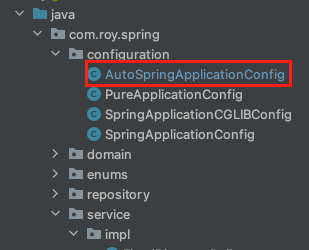

이번 장에서는 [@Configuration과 싱글톤(링크)](https://imprint.tistory.com/169)에 이어 컴포넌트 스캔에 대해서 알아본다.
글의 하단부에 참고한 강의와 공식문서의 경로를 첨부하였으므로 자세한 사항은 강의나 공식문서에서 확인한다.
모든 코드는 [깃허브 (링크)](https://github.com/roy-zz/spring)에 올려두었다.

---

### Component Scan

우리는 지금까지 DI 컨테이너에 빈을 등록할 때 자바 코드와 XML을 사용하여 빈을 등록하였다.
하지만 이러한 방식으로 빈을 등록하게 되는 경우 실무에서 쏟아져 나오는 수많은 클래스들을 관리하기란 쉽지 않고 손이 많이 간다.
스프링에서 이러한 문제를 인지하고 편리하게 빈을 등록할 수 있도록 컴포넌트 스캔(Component Scan)이라는 기능을 제공하였다.

새로운 구성 정보를 가지는 AutoSpringApplicationConfig파일을 생성하였다.

```java
@Configuration
@ComponentScan(
        excludeFilters = @ComponentScan.Filter(type = FilterType.ANNOTATION, classes = Configuration.class)
)
public class AutoSpringApplicationConfig {
    
}
```

클래스 내부에는 아무런 정보도 존재하지 않는다. 
@ComponentScan이라는 어노테이션을 사용하였고 excludeFilters를 사용하여 @Configuration 어노테이션이 사용된 클래스는 빈으로 등록하지 않겠다고 설정하였다.
이렇게 설정한 이유는 이전 장에서 사용하던 SpringApplicationConfig와 중복 빈 등록 오류를 방지하기 위해서다.

@Configuration을 확인해보면 @Component 어노테이션을 가지고 있는 것을 확인할 수 있다.

```java
@Target(ElementType.TYPE)
@Retention(RetentionPolicy.RUNTIME)
@Documented
@Component
public @interface Configuration {
    // 생략
}
```

일반적인 상황에서는 excludeFilters를 사용할 일이 거의 없다.
우리가 빈으로 등록되기를 원하는 클래스 파일에 @Component 어노테이션을 붙여준다.

```java
@Component
public class MemoryMemberRepository implements MemberRepository {
    // 생략
}
```

```java
@Component
public class RatioDiscountPolicy implements DiscountPolicy { 
    // 생략
}
```

```java
@Component
public class MemberServiceImpl implements MemberService {
    private final MemberRepository memberRepository;
    @Autowired
    public MemberServiceImpl(MemberRepository memberRepository) {
        this.memberRepository = memberRepository;
    }
    // 생략
}
```

이전에 SpringApplicationContext를 통해서 빈의 설정 정보를 입력하는 것과 다르게 설정 정보 자체가 없기 때문에 의존 관계 주입도 클래스 안에서 해결해야한다.
이번에는 @Autowired를 사용하여 자동으로 의존관계를 주입하도록 하였다.

OrderServiceImpl 또한 MemberServiceImpl과 동일하게 @Autowired 어노테이션을 사용하여 의존 관계를 주입받도록 수정한다.

```java
@Component
public class OrderServiceImpl implements OrderService {
    private final DiscountPolicy discountPolicy;
    private final MemberRepository memberRepository;
    @Autowired
    public OrderServiceImpl(DiscountPolicy discountPolicy, MemberRepository memberRepository) {
        this.discountPolicy = discountPolicy;
        this.memberRepository = memberRepository;
    }
}
```

테스트 코드를 실행시켜보면 정상적으로 빈이 조회되는 것을 확인할 수 있다.

```java
class AutoSpringApplicationConfigTest {
    @Test
    @DisplayName("컴포넌트 스캔을 통한 자동 의존성 주입 테스트")
    void diViaComponentScanTest() {
        ApplicationContext ac = new AnnotationConfigApplicationContext(AutoSpringApplicationConfig.class);
         MemberService memberService = ac.getBean(MemberService.class);
         assertTrue(memberService instanceof MemberServiceImpl);
    }
}
```

---

#### Component Scan 동작 원리

컴포넌트 스캔의 경우 basePackage에 속한 @Component 어노테이션이 붙은 모든 클래스를 스프링 빈으로 등록한다.
지금까지 살펴본 것과 같이 아래와 같은 클래스들이 존재한다면

```java
@Component
public class MemberServiceImpl implements MemberService {
    // 중간 생략
}
@Component
public class OrderServiceImpl implements OrderService {
    // 중간 생략
}
@Component
public class MemoryMemberRepository implements MemberRepository {
    // 중간 생략
}
@Component
public class RatioDiscountPolicy implements DiscountPolicy {
    // 중간 생략
}
```

DI 컨테이너는 아래와 같이 구성된다.

| 빈 이름 | 빈 객체 |
| -- | -- |
| memberServiceImpl | MemberServiceImpl@0x01 |
| orderServiceImpl | OrderServiceImpl@0x02 |
| memoryMemberRepository | MemoryMemberRepository@x03 |
| ratioDiscountPolicy | RatioDiscountPolicy@x04 |

이렇게 DI 컨테이너가 빈으로 컨테이너를 구성할 때 빈의 기본 이름은 클래스명을 사용하고 가장 앞글자만 소문자로 변경한다.
@Component의 속성을 이용하여 아래와 같이 직접 이름을 부여할 수도 있다.

```java
@Component("customizedName")
```

---

#### @Autowired

아래의 MemberServiceImpl과 같이 생성자에 @Autowired를 사용한 경우 DI 컨테이너가 자동으로 해당 빈을 찾아서 주입해준다.

```java
@Component
public class MemberServiceImpl implements MemberService {
    private final MemberRepository memberRepository;
    @Autowired
    public MemberServiceImpl(MemberRepository memberRepository) {
        this.memberRepository = memberRepository;
    }
}
```

이때 기본 조회 전략은 타입이 같은 빈을 찾아서 주입하며 ApplicationContext.getBean(***.class)와 동일한 역할을 한다.

OrderServiceImpl과 같이 생성자에 파라미터가 많아도 DI 컨테이너에서 모두 조회하여 자동으로 주입한다.

```java
@Component
public class OrderServiceImpl implements OrderService {
    private final DiscountPolicy discountPolicy;
    private final MemberRepository memberRepository;
    @Autowired
    public OrderServiceImpl(DiscountPolicy discountPolicy, MemberRepository memberRepository) {
        this.discountPolicy = discountPolicy;
        this.memberRepository = memberRepository;
    }
}
```

---

#### 탐색 위치와 기본 스캔 대상

@ComponentScan의 속성에는 basePackages가 있다.
모든 클래스 파일을 검색하는 것은 시간이 오래걸리기 때문에 검색범위를 지정하는 것이다.

만약 basePackages를 지정하지 않는다면 자신이 위치한 패키지가 시작 위치가 된다.



필자는 AutoSpringApplicationConfig 클래스에 @ComponentScan 어노테이션을 사용하였고 해당 파일은 com.roy.spring.configuration 아래에 있다.
이러한 구조에서 basePackages 지정이 따로 없다면 컴포넌트 스캔의 대상이 되는 파일은 같은 패키지에 있는 네 개의 클래스 파일밖에 없다.
그렇기 때문에 일반적으로 com.roy에 @ComponentScan이 붙은 파일을 위치시키고 com.roy 밑의 모든 클래스들이 컴포넌트 스캔의 대상이 되도록 유도한다.
만약 스프링 부트를 사용한다면 @SpringBootApplication 어노테이션 내부에 @ComponentScan이 있기 때문에 따로 걱정하지 않아도 된다.

---

#### 컴포넌트 스캔의 대상

컴포넌트 스캔은 @Component 어노테이션을 가지고 있는 어노테이션들도 모두 빈으로 등록한다.
아래와 같이 Controller, Service등이 그 대상이다.

```java
@Component
public @interface Controller {
}

@Component
public @interface Service {
}

@Component
public @interface Configuration {
}

@Component
public @interface Repository {
}
```

해당 어노테이션들은 내부적으로 @Component를 가지고 있어서 빈으로 등록된다.
자바의 어노테이션에는 상속의 개념이 없다. 하지만 스프링에 의해 마치 상속이 되는 것처럼 작동하게 된다.
각 어노테이션의 역할은 아래와 같다.

- @Component: 컴포넌트 스캔에서 사용
- @Controller: 스프링 MVC 컨트롤러에서 사용. 스프링 MVC 컨트롤러로 인식
- @Service: 스프링 비즈니스 로직에서 사용, 특별한 처리를 하지는 않고 서비스 로직을 담고 있다는 표시용으로만 사용된다.
- @Repository: 스프링 데이터 접근 계층에서 사용, 데이터 계층의 예외를 스프링 예외로 추상화해준다.
- @Configuration: 스프링 설정 정보로 인식하고 스프링 빈이 싱글톤을 유지하도록 추가처리한다.

---

#### Filter

@ComponentScan 어노테이션의 includeFilters, excludeFilters 속성을 사용하여 스캔 대상을 추가하거나 제외할 수 있다.

FilterType에는 총 5가지 옵션이 있다.

1. ANNOTATION: 기본값이며 어노테이션을 대상으로 필터링한다.
   ex) com.roy.AnyAnnotation
2. ASSIGNABLE_TYPE: 지정한 타입과 자식 타입을 대상으로 필터링한다.
   ex) com.roy.AnyClass
3. ASPECTJ: AspectJ 패턴을 사용하여 대상을 필터링한다.
   ex) com.roy.*Service*
4. REGEX: 정규 표현식을 사용하여 대상을 필터링한다.
   ex) com\.roy\.service.*
5. CUSTOM: TypeFilter라는 인터페이스를 구현하여 대상을 필터링한다.
   ex) com.roy.MyCustomFilter

빈의 검색대상에 포함하고 싶은 클래스를 위해 @MyIncludeBean 어노테이션을 생성하였다.
그리고 검색대상에서 제외하고 싶은 클래스를 위해 @MyExcludeBean 어노테이션을 생성하였다.

어노테이션을 생성하였다면 사용법은 아래와 같다.

```java
@ComponentScan(
        includeFilters = {
                @ComponentScan.Filter(type = FilterType.ANNOTATION, classes = MyIncludeBean.class)
        },
        excludeFilters = {
                @ComponentScan.Filter(type = FilterType.ANNOTATION, classes = MyExcludeBean.class)
        }
)
```

여기서 MemoryMemberRepository 클래스를 빈의 검색 대상에서 추가로 제외하고 싶다면 아래와 같이 수정하면 된다.

```java
@ComponentScan(
        includeFilters = {
                @Filter(type = FilterType.ANNOTATION, classes = MyIncludeBean.class)
        },
        excludeFilters = {
                @Filter(type = FilterType.ANNOTATION, classes = MyExcludeBean.class),
                @Filter(type = FilterType.ASSIGNABLE_TYPE, classes = MemoryMemberRepository.class)
        }
)
```

---

#### 중복 등록과 충돌

컴포넌트 스캔을 할 때 충돌이 나는 경우는 총 두가지 경우가 있다.

1. 자동 빈 등록 vs 자동 빈 등록
2. 수동 빈 등록 vs 자동 빈 등록

**자동 빈 등록 vs 자동 빈 등록**
컴포넌트 스캔에 의해 자동으로 빈이 등록되는 과정에서 중복되는 빈이 등록된다면 스프링은 ConflictingBeanDefinitionException을 발생시킨다.

**수동 빈 등록 vs 자동 빈 등록**
만약 수동 빈 등록과 자동 빈 등록에서 빈의 이름이 충돌된다면 수동으로 등록한 빈이 우선권을 가지며 자동 빈을 오버라이딩 한다.
이렇게 오버라이딩 하는 경우 아래와 같은 로그가 찍힌다.
```bash
Overriding bean definition for bean 'memoryMemberRepository' with a different definition: replacing
```

스프링이 능숙한 개발자라도 이렇게 애매한 상황은 피하는 것이 좋다.
개발은 혼자하는 것이 아니며 같은 코드를 보는 모든 사람이 자신과 동일하게 생각하고 있지는 않기 때문이다.
애매한 문제들이 추후에 커다란 버그를 생성시킨다.

스프링 부트에서는 이러한 문제를 인지하고 **수동 빈 등록 vs 자동 빈 등록** 상황에서도 충돌이 발생하면 수동 빈이 오버라이딩 하는 것이 아니라 아래와 같이 오류를 발생시키도록 되어있다.

```bash
Consider renaming one of the beans or enabling overriding by setting spring.main.allow-bean-definition-overriding=true
```

---

**참고한 강의:** https://www.inflearn.com/course/%EC%8A%A4%ED%94%84%EB%A7%81-%ED%95%B5%EC%8B%AC-%EC%9B%90%EB%A6%AC-%EA%B8%B0%EB%B3%B8%ED%8E%B8

**Spring 공식 문서:** https://docs.spring.io/spring-framework/docs/current/reference/html/