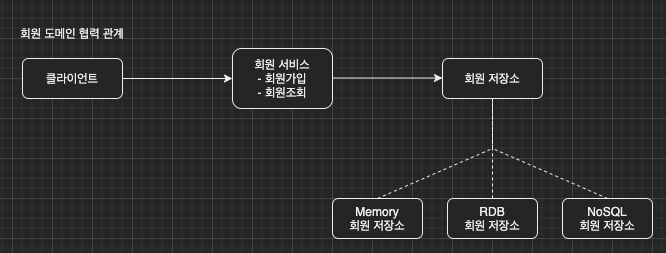
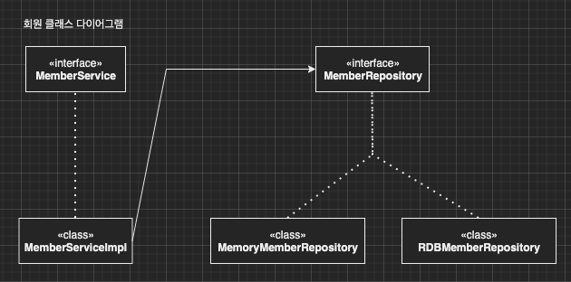
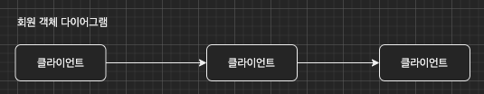
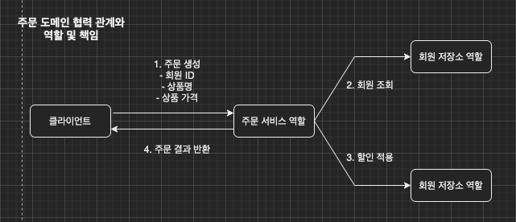
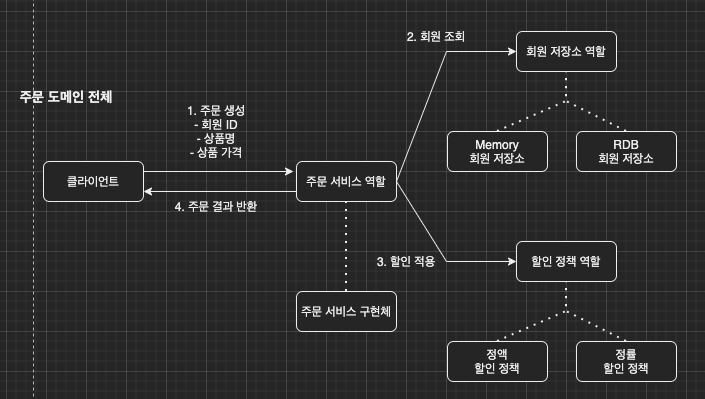
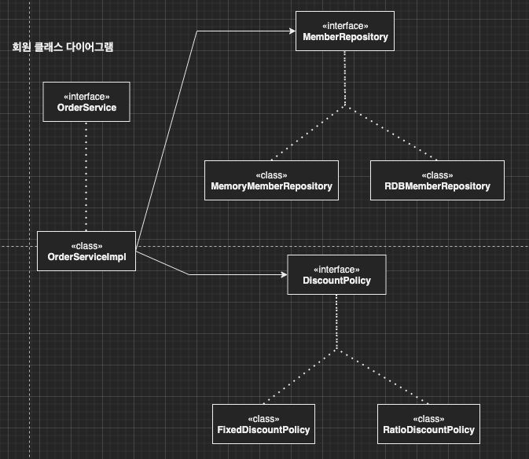

이번 장에서는 면접 질문에 자주 등장하는 스프링이란 무엇인가에 대해서 알아본다.
글의 하단부에 참고한 강의와 공식문서의 경로를 첨부하였으므로 자세한 사항은 강의나 공식문서에서 확인한다.
모든 코드는 [깃허브 (링크)](https://github.com/roy-zz/spring)에 올려두었다.

---

### 스프링이란 무엇인가?

이번 장부터 몇 개의 장을 걸쳐서 스프링이란 무엇이며 무엇을 위해 탄생하였는지에 대해서 알아본다.
필자는 아직까지 "스프링이 뭐에요?" 라는 질문을 받은 적은 없다. 존경하는 W사의 모 개발자님은 기술 인터뷰에서 "스프링이 뭐에요"라는 질문을 받았고 "어노테이션의 향연입니다."이라는 답변했다고 한다.
정말 짧고 간결한 정답이라는 생각이 든다. 스프링이 어노테이션의 향연이 된 이유를 찾는다면 스프링의 탄생 배경도 알게 될 것이다.

거대해진 스프링 생태계 때문에 스프링이 왜 탄생하였는지 생각해내기란 쉽지않다. 
아마 필자도 참고한 강의가 아니었다면 무엇을 해결하기 위하여 스프링이 탄생했는지에 대해서는 생각해보지 않았을 것이다.

스프링의 탄생을 이해하기 위해서는 SOLID와 OOP의 개념에 대해서 다시 한 번 복습해야 한다.

#### SOLID

- [SRP, Single Responsibility Principle (링크)](https://imprint.tistory.com/10)
- [OCP, Open Closed Principle (링크)](https://imprint.tistory.com/11)
- [LSP, Liskov Substitution Principle (링크)](https://imprint.tistory.com/32)
- [ISP, Interface Segregation Principle (링크)](https://imprint.tistory.com/53)
- [DIP, Dependency Inversion Principle (링크)](https://imprint.tistory.com/54)

#### OOP

- [다형성, Polymorphism (링크)](https://imprint.tistory.com/9)
- [추상화, Abstraction (링크)](https://imprint.tistory.com/8)
- [상속, Inheritance (링크)](https://imprint.tistory.com/7)
- [캡슐화, Encapsulation (링크)](https://imprint.tistory.com/6)

이러한 객체 지향 원칙들을 지키면서 개발을 하다보면 원칙을 지키기 위해 해야하는 부수적인 작업들이 너무 많게 된다.
특히 SRP, OCP, DIP를 지키기 위해서는 결국 스프링의 컨테이너와 같은 DI 컨테이너를 만들게 된다.

결론적으로 **객체 지향 설계를 위해 필요한 부수적인 작업들을 대신 해주는 프레임워크**이다.

아래서는 스프링을 사용하지 않은 순수 자바로 프로젝트를 만들어보고 스프링으로 변화시키는 과정을 진행하면서 스프링이 어떠한 부수적인 작업을 대신 해주는지 확인해본다.

---

### 회원 관련 코드

스프링없이 순수하게 자바로만 프로젝트를 만들면서 궁극적으로 어떠한 문제를 만나게 되는지 알아본다.
프로젝트 기획 및 예제는 필자가 참고한 강의와 동일하게 구성한다. (단, 필자는 Lombok 라이브러리만 추가해서 진행하도록 하겠다.)

**회원 도메인 협력 관계**



**회원 클래스 다이어그램**



**회원 객체 다이어그램**



---

본 문서에서는 스프링을 이해하기 위해 필요한 파일만 나열한다.
모든 파일의 내용이 궁금하면 필자의 [깃허브 페이지(링크)](https://github.com/roy-zz/spring)나 강의를 참고한다.

**회원 서비스 구현 Class**

회원 리포지토리의 구현체인 MemoryMemberRepository에 의존하여 클라이언트의 요청이 들어오면
리포지토리에서 조회하여 리턴한다.

```java
public class MemberServiceImpl implements MemberService {

    private final MemberRepository memberRepository = new MemoryMemberRepository();

    @Override
    public void signup(Member member) {
        memberRepository.save(member);
    }

    @Override
    public Member findMember(Long memberId) {
        return memberRepository.findById(memberId);
    }
}
```

**회원 클라이언트 테스트 Class**

클라이언트의 역할을 하는 테스트 클래스이다.
인터페이스의 구현체인 MemberServiceImpl에 의존하여 직접 구현체에게 요청을 하고 있다.

```java
class MemberServiceImplTest {

    MemberService memberService = new MemberServiceImpl();

    @Test
    @DisplayName("회원가입 테스트")
    void signupTest() {
        // GIVEN
        Member member = new Member(0L, "Roy", VIP);

        // WHEN
        memberService.signup(member);
        Member storedMember = memberService.findMember(0L);

        // THEN
        assertEquals(member, storedMember);
    }
}
```

만약 클라이언트가 다른 서비스를 사용해야 한다면?
만약 서비스가 다른 리포지토리를 사용해야 한다면?

클라이언트 <---> 서비스, 서비스 <---> 리포지토리가 구현체를 의존하며 강하게 결합되어 있다.

---

### 주문과 할인 도메인

주문과 멤버의 관계를 알아보도록 한다.

**주문 도메인의 협력 관계 및 역할 및 책임**



**주문 도메인**



**회원 클래스 다이어그램**



이렇게 역할과 책임을 구분하는 경우 리포지토리가 Memory 리포지토리에서 RDB 리포지토리로 변경하여도 협력 관계 변경없이 사용가능하다.
또한 정액 할인 정책에서 정률 할인 정책으로 바뀌더라도 협력 관계를 그대로 사용할 수 있다.

**주문 서비스 구현 Class**

```java
public class OrderServiceImpl implements OrderService {

    private final DiscountPolicy discountPolicy = new FixedDiscountPolicy();
    private final MemberRepository memberRepository = new MemoryMemberRepository();

    @Override
    public Order createOrder(Long memberId, String itemName, int itemPrice) {
        Member storedMember = memberRepository.findById(memberId);
        int discountPrice = discountPolicy.discount(storedMember, itemPrice);
        return new Order(memberId, itemName, itemPrice, discountPrice);
    }
}
```

**주문 클라이언트 테스트 Class**

```java
class OrderServiceImplTest {

    private final MemberService memberService = new MemberServiceImpl();
    private final OrderService orderService = new OrderServiceImpl();

    @Test
    @DisplayName("주문 생성 테스트")
    void createOrderTest() {
        // GIVEN
        long memberId = 0L;
        Member newMember = new Member(memberId, "Roy", VIP);
        memberService.signup(newMember);

        // WHEN
        Order order = orderService.createOrder(memberId, "MacbookPro", 10000);

        // THEN
        assertEquals(1000, order.getDiscountPrice());
    }
}
```

만약 클라이언트가 다른 서비스를 사용해야 한다면?
만약 서비스가 다른 리포지토리를 사용해야 한다면?

클라이언트 <---> 서비스, 서비스 <---> 리포지토리가 구현체를 의존하며 강하게 결합되어 있다.

---

지금까지 스프링은 무엇인지 알아보고 어떠한 이유로 스프링이 탄생하였는지 알아보기 위하여 순수 자바만으로 어플리케이션을 개발해보았다.
이러한 과정에서 SOLID와 OOP를 위반하는 객체들 간의 강하게 결합이 발생하게 되었다.

다음 장에서는 객체들 간의 강한 결합도를 순수 자바 객체로 DI를 하면서 결합도를 낮춰보면서 "왜 스프링을 사용해야하는가"에 대해서 알아본다.

---

**참고한 강의:** https://www.inflearn.com/course/%EC%8A%A4%ED%94%84%EB%A7%81-%ED%95%B5%EC%8B%AC-%EC%9B%90%EB%A6%AC-%EA%B8%B0%EB%B3%B8%ED%8E%B8

**Spring 공식 문서:** https://docs.spring.io/spring-framework/docs/current/reference/html/