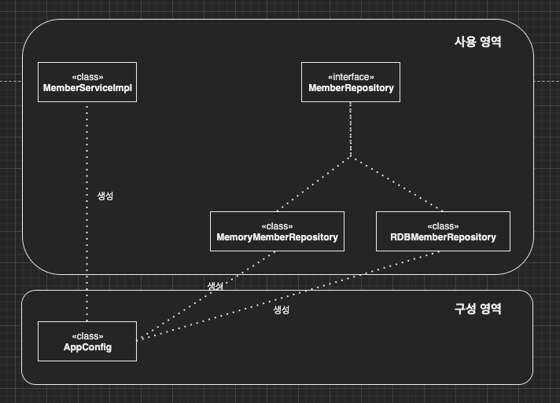

이번 장에서는 면접 질문에 자주 등장하는 "왜 스프링을 사용하는가"에 대해서 알아본다.
글의 하단부에 참고한 강의와 공식문서의 경로를 첨부하였으므로 자세한 사항은 강의나 공식문서에서 확인한다.
모든 코드는 [깃허브 (링크)](https://github.com/roy-zz/spring)에 올려두었다.

---

### 왜 스프링을 사용하는가

[이전 장 (링크)](https://imprint.tistory.com/159?category=1003393)에서 스프링이 무엇인가에 대해서 알아보았다.
추가로 순수 자바로 어플리케이션을 개발하면서 객체들 간의 끈끈한 결합도가 생기는 것을 경험하였다.
이번 장에서는 다시 한 번 순수 자바로 객체들 간의 끈끈한 결합도를 낮춰본다. 
순수 자바에서 복잡하게 DI하던 기능을 스프링을 통해서 손쉽게 해결해보면서 "왜 스프링을 사용하는가"에 대해서 알아보도록 한다.

---

### 할인 정책의 변경

이전 장에서 주문을 진행할 때 회원의 할인 정책은 고정 금액 할인 정책이었다.
하지만 회사의 요청에 의해 금액에 따라 할인 금액이 변경되는 정률 할인 정책으로 변경되는 상황이다.

수정 전의 주문 서비스는 고정 금액 할인 정책(FixedDiscountPolicy)를 의존하고 있다. 

```java
public class OrderServiceImpl implements OrderService {

    private final DiscountPolicy discountPolicy = new FixedDiscountPolicy();
    // 이하 생략
}
```

새로운 할인 정책인 정률 할인 정책(RatioDiscountPolicy)을 개발하고 주문 서비스가 의존하는 정책을 변경해본다.
아래는 정률 할인 정책 클래스다.

```java
public class RatioDiscountPolicy implements DiscountPolicy {

    private static final int DISCOUNT_RATIO = 10;

    @Override
    public int discount(Member member, int price) {
        return member.getGrade() == VIP ? price * DISCOUNT_RATIO / 100 : 0;
    }
}
```

이제 주문 서비스가 새로운 할인 정책을 사용하도록 수정해본다.

```java
public class OrderServiceImpl implements OrderService {

    // private final DiscountPolicy discountPolicy = new FixedDiscountPolicy();
    private final DiscountPolicy discountPolicy = new RatioDiscountPolicy();
    // 이하 생략
}
```

분명히 우리는 역할과 구현을 분리하고 인터페이스를 통한 다형성을 활용하여 개발을 진행했다.
코드를 자세히 보면 주문 서비스는 인터페이스가 아니라 구현체인 FixedDiscountPolicy를 의존하며 DIP를 위반했다.
그렇기 때문에 변경없이는 확장할 수 없는 구조가 되며 OCP도 위반하였다.
또한 자기가 사용해야하는 구현체를 직접 선택하면서 SRP도 위반하게 되었다.

우리는 많은 것들을 고려하여 개발하였지만 간단한 코드를 개발하면서도 많은 원칙들을 위반하였다.

할인 정책을 선택하는 것은 주문 서비스의 역할과 책임이 아니다.
지금부터 할인 정책 구현체를 선택하여 주문 서비스에게 할당하는 역할을 하는 클래스를 만들어보면서 우리가 위반한 원칙들을 지켜도록 수정해본다.

---

### AppConfig

새로운 클래스인 AppConfig를 생성하였다.

```java
@NoArgsConstructor(access = AccessLevel.PRIVATE)
public class AppConfig {

    public static final AppConfig APP_CONFIG = new AppConfig();

    public MemberService memberService() {
        return new MemberServiceImpl(memberRepository());
    }

    public OrderService orderService() {
        return new OrderServiceImpl(discountPolicy(), memberRepository());
    }

    private MemberRepository memberRepository() {
        return new MemoryMemberRepository();
    }

    private DiscountPolicy discountPolicy() {
        return new FixedDiscountPolicy();
    }
}
```

memoryRepository()의 반환 타입은 인터페이스인 MemberRepository이다.
실제로 반환되는 객체는 인터페이스의 구현체인 MemoryMemberRepository()이다.

discountPolicy()의 반환 타입 또한 인터페이스인 DiscountPolicy이다.
실제로 반환되는 객체는 인터페이스의 구현체인 FixedDiscountPolicy()이다.

이제 SRP, OCP, DIP를 지키지 않았던 클라이언트의 코드를 살펴본다.

```java
class MemberServiceImplTest {

    private final MemberService memberService = AppConfig.APP_CONFIG.memberService();
    // 이하 생략
}
```

회원가입을 요청하는 클라이언트 역할의 테스트 코드다.
코드 어디에도 실제 구현체인 MemoryServiceImpl을 찾아볼 수 없다.

---

```java
class OrderServiceImplTest {

    private final MemberService memberService = AppConfig.APP_CONFIG.memberService();
    private final OrderService orderService = AppConfig.APP_CONFIG.orderService();
    // 이하 생략
}
```

주문을 요청하는 클라이언트 역시 실제 구현체인 MemberServiceImpl과 OrderServiceImpl을 찾아볼 수 없다.

---

클라이언트 코드와 같이 문제가 되었던 서비스의 코드를 살펴본다.

```java
public class MemberServiceImpl implements MemberService {

    private final MemberRepository memberRepository;

    public MemberServiceImpl(MemberRepository memberRepository) {
        this.memberRepository = memberRepository;
    }
    // 이하 생략
}
```

서비스 또한 인터페이스인 MemberRepository에만 의존을 하고 있다.
어디에도 구현체인 MemoryMemberRepository를 찾아볼 수 없다.

---

```java
public class OrderServiceImpl implements OrderService {

    private final DiscountPolicy discountPolicy;
    private final MemberRepository memberRepository;

    public OrderServiceImpl(DiscountPolicy discountPolicy, MemberRepository memberRepository) {
        this.discountPolicy = discountPolicy;
        this.memberRepository = memberRepository;
    }
    // 이하 생략
}
```

주문 서비스 또한 인터페이스인 DiscountPolicy와 MemberRepository에만 의존을 하고 있다.
AppConfig의 등장만으로 AppConfig를 제외한 모든 클래스들이 인터페이스에만 의존하도록 변경된 것이다.

갑자기 할인 정책을 정액 할인정책(FixedDiscountPolicy)에서 정률 할인정책(RatioDiscountPolicy)로 변경하고
데이터베이스를 메모리DB(MemoryMemberRepository)에서 RDB(RDBMemberRepository)로 변경하라는 요청이 들어왔다.
우리는 이제 AppConfig만 아래와 같이 수정하면 빠르게 회사의 요청 사항대로 수정을 할 수 있다.

```java
@NoArgsConstructor(access = AccessLevel.PRIVATE)
public class AppConfig {

    public static final AppConfig APP_CONFIG = new AppConfig();

    public MemberService memberService() {
        return new MemberServiceImpl(memberRepository());
    }

    public OrderService orderService() {
        return new OrderServiceImpl(discountPolicy(), memberRepository());
    }

    private MemberRepository memberRepository() {
        // return new MemoryMemberRepository();
        return new RDBMemberRepository();
    }

    private DiscountPolicy discountPolicy() {
        // return new FixedDiscountPolicy();
        return new RatioDiscountPolicy();
    }
}
```

데이터베이스의 종류가 변경되고 할인 정책이 변경되었지만 구현체들의 코드는 전혀 변경이 없고 AppConfig의 코드 중 단 두줄만 변경되었다.

기존에는 자신이 사용하는 구현체를 직접 선택하는 아래의 이미지와 같은 구조였다.


하지만 AppConfig의 등장으로 주입받은 구현체를 사용하기만 하면 되는 구조로 변경되었다.



---

### AppConfig에 Spring 적용

이번에는 순수 자바로 구성된 프로젝트에 Spring의 DI 컨테이너를 적용시켜본다.

수정된 AppConfig에는 @Configuration 어노테이션을 사용하였다.
각 메서드에 @Bean 어노테이션을 달아서 DI 컨테이너에 의해 관리되도록 구성하였다.

```java
@Configuration
public class AppConfig {

    @Bean
    protected MemberService memberService() {
        return new MemberServiceImpl(memberRepository());
    }

    @Bean
    protected OrderService orderService() {
        return new OrderServiceImpl(discountPolicy(), memberRepository());
    }

    @Bean
    protected MemberRepository memberRepository() {
        return new MemoryMemberRepository();
    }

    @Bean
    protected DiscountPolicy discountPolicy() {
        return new FixedDiscountPolicy();
    }
}
```

클라이언트의 코드는 아래와 같이 수정되었다.

```java
class OrderServiceImplTest {

    private final ApplicationContext applicationContext
            = new AnnotationConfigApplicationContext(AppConfig.class);

    private final MemberService memberService
            = applicationContext.getBean("memberService", MemberService.class);

    private final OrderService orderService
            = applicationContext.getBean("orderService", OrderService.class);
    // 이하 생략
}
```

```java
class MemberServiceImplTest {

    private final ApplicationContext applicationContext
            = new AnnotationConfigApplicationContext(AppConfig.class);

    private final MemberService memberService
            = applicationContext.getBean("memberService", MemberService.class);
    // 이하 생략
}
```

ApplicationContext를 통해 Bean을 가져와서 사용하도록 수정되었다.

---

지금까지 "스프링이란 무엇인가"와 "왜 스프링을 사용하는가"에 대해서 알아보았다.
다음 장부터는 스프링의 기능들을 하나씩 살펴보도록 한다.

---

**참고한 강의:** https://www.inflearn.com/course/%EC%8A%A4%ED%94%84%EB%A7%81-%ED%95%B5%EC%8B%AC-%EC%9B%90%EB%A6%AC-%EA%B8%B0%EB%B3%B8%ED%8E%B8

**Spring 공식 문서:** https://docs.spring.io/spring-framework/docs/current/reference/html/